# VisionQA Workbench

VisionQA 是给画面做**有证据的视觉评审**的工具：结论只有「通过 / 需人工确认 / 不通过」三种，每条判断都必须指向画面里的具体区域（像素锚点），定位不到证据的一律写进「无法判断」，不给模糊结论。

这个仓库是 VisionQA 的**创作与检索工作台**：把「找一条爆款 → 拆它的结构 → 换个产品复刻 → 评审产出画面 → 沉淀成可复用模板」串成一条能跑通的链路，评审语言与 VisionQA 插件共用同一套 visual-baseline 契约。

> 诚实边界（2026-11-09 17:20 线上实测）：模型链路换成**官方 DeepSeek**（`https://api.deepseek.com/v1`）后真正通了。`deepseek-flash` 自报的 `input_modalities` 是 `["text","image"]`，所以智能体对话和抽帧评审共用同一个模型，不再需要假想一个「视觉专用模型」。实测：后台「连通性自检」`可用 · 上游 2 个模型`；智能体对话 6.0 秒出成品文案；`/api/review` 本地模型路径 16.6 秒给出 verdict + 像素锚点；`analyzeFrames` 在服务器上用生产代码跑 3 帧得到合法分镜 JSON。**仍然缺**：模板库 0 条（「一键复刻」还没跑过一条真实视频）、没有队列/配额/找回密码/用户列表接口。


登录是**真实的服务端账号**：密码用 scrypt 存哈希，账号落在 `data/auth.db`（SQLite），会话是服务端随机 token + HttpOnly cookie，浏览器里读不到 token 也读不到密码。支持注册、登录、记住我；登录失败统一提示「邮箱或密码不正确」，不泄露邮箱是否注册过。登录状态收在**侧栏左下角**，点开可切换账号或退出。


左下角是账号与版本：点账号行可设置 / 切换账号 / 退出；点版本行打开「版本与在线更新」——只读服务端 /api/version 的真实版本号，接口没接入时如实显示「未接入」，不伪造下载进度。


## 一、这一版做了什么

| 模块 | 真实能力 | 事实边界 |
| --- | --- | --- |
| 登录 | 注册 / 登录 / 登出 / 记住我 / 会话持久化，密码 scrypt 存哈希，会话服务端校验 | **没有找回密码、邮箱验证与角色权限**；注册默认关闭，加账号用 `npm run adduser`，见 [docs/accounts.md](docs/accounts.md) |
| 作品 | **一条内容一条记录**：`#/projects` 与 `#/projects/<id>`；只存「绑哪条模板 + 哪块画布 + 到哪一步」，脚本与分镜实时取自模板；作品页按「下一步」给一张主卡（开画布 / 送评审 / 继续改 / 交付）；改名、多版本对照、运行按作品归集、脚本 copy-on-write、**只读分享链接**都已上线；智能体草稿可**存为模板 / 送到画布** | 默认只存引用，脚本只在改过时复制一份；**没有作品级权限 / 协作 / 分享访问统计** |
| 导航 | 一级只留四个去处：**工作台 / 作品 / 发现 / 模板库**；智能体 / 画布 / 视觉评审 / 运行记录退到「工具」区；可用 Ctrl / ⌘ + K 快速跳转任意页面与动作 | 智能体编辑器仍归在「智能体」项下；路由保持原样（`#/radar` 等旧地址照旧可用） |
| 本地工作区（桌面端） | **loop、工具、会话记忆都在本机**：列目录 / 读文件 / 写文件 / 执行命令四个工具，写文件与执行命令必须逐次批准；会话落盘可续，上下文超预算先压成摘要；模型补全走账号会话（`/api/local-agent/complete`），密钥不下发 | 只在 Electron 外壳里出现，网页版打开 `#/local` 会如实说明不可用；**还没有安装包**（`npm run desktop` 起开发外壳，见第六十七节） |
| 发现（原爆款雷达） | 进页面**不自动检索**，点「检索」才发请求；卡片给播放 / 点赞 / 收藏 / 评论 / 转发与互动率；可「加入模板库」或「一键复刻」 | 抖音有播放量，小红书没有；取不到就隐藏，不做估算 |
| 一键复刻 | 视频解析 → ffprobe → FFmpeg 拆帧 → 逐帧视觉分析 → 入库，五步进度与实时日志 | 平台链接解析依赖红狐 Key；直链兜底可用 |
| 模板库 | **只存原链接 + 互动数据 + 解析出的脚本与分镜，不保存视频文件**；待解析 / 已解析两种状态，详情抽屉里可「去解析」；类型/关键词检索；送去评审 | 待解析条目没有帧图，封面走 /api/cover 代理 |
| 智能体 | 对话框式入口、参数行（智能体/输出/模型）、已自建智能体分类卡片、新建/编辑/删除；对话带**最近 8 条 / 6000 字**的会话记忆；脚本/分镜回复带**结构化草稿**，可存为模板、送到画布 | 记忆由服务端截断，超出部分不带；不落库；草稿只认回复里那段 ```draft JSON，模型没给就没有出口，不从正文表格反推 |
| 画布 | React Flow 节点编排（input/llm/kb/tool/condition/output）、检查器、连线校验、保存、逐节点运行；节点面板默认收起，双击画布或点「节点」唤出 | 运行是真执行，耗时真实；VisionQA Canvas 部署后画布交给它接管（见第六节） |
| 视觉评审 | 选画面 → visual-baseline 七维评审 → verdict + 像素锚点 + 有界修正建议 | 未启动 VisionQA 插件服务时由本地模型出一份同契约结果，provider 会写清 |
| 运行记录 | 读 data/runs.json，逐节点状态、耗时、输出；同画布两次运行可逐节点对照，输出差异可按需展开 | 只有画布执行会产生记录；差异只到行 / 160 字段落，不做字内高亮 |

导航分两层：一级 4 项「工作台 / 作品 / 发现 / 模板库」，下面是「工具」区「智能体 / 画布 / 视觉评审 / 运行记录」，底部只留设置；桌面端在这之间多一组「本机 › 本地工作区」。左上角只写 VisionQA，不放图形标记；导航只有 `src/nav.ts` 一份真源（第六十六节）。

> 2026-11-09 上线体检后，整块删掉了「资产库」（6 条假资产 + 假统计，没有后端）、内测测试版、登录页演示账号与访客入口、工作台的示例待办/最近复刻/待评审。逐项清单与「哪些是真的」判定见 [docs/launch-readiness.md](docs/launch-readiness.md)。

### 2026-11-10 这一轮（已上线）

| 改动 | 之前 | 现在 |
| --- | --- | --- |
| 雷达检索时机 | 切到爆款雷达就自动检索一次（按次计费） | 进页面只读健康状态；输入关键词点「检索」才请求，未检索时给明确的空状态 |
| 卡片数据 | 点赞 / 收藏 / 评论 / 转发 | 再加播放量与互动率（(赞+藏+评+转)/播放），排序支持按播放、按转发 |
| 雷达 → 模板库 | 只有「一键复刻」入库 | 新增「加入模板库」：只存原链接、作者、互动数据，不下载视频、不抽帧 |
| 模板库 | 每条都带本地帧图 | 待解析 / 已解析两态；详情里可「去解析这条」，复刻完成后同一条目升级，不重复占格 |
| 智能体对话框 | 输入框 + 参数行 + 提示行 + 独立发送键，改一次要滚 | 一块卡片：输入区在上，参数与「Ctrl + Enter + 发送」收在底部同一行；去掉「数量 1」与「真实调用本地模型」这类给我们自己看的文案 |
| 会话记忆 | 每轮只发当前一句 | 带最近 8 条 / 6000 字上下文（服务端截断），实测追问能接住上文 |
| 字体 | 从 fonts.googleapis.com 拉 Geist + Noto Sans SC 四套字重；中文用无 hinting 的网页字体，12px 发虚 | 去掉外部字体请求，Geist 拉丁子集自托管、中文用系统黑体；10px 微标签统一抬到 11px |
| 充值 | 无 | 新增 /api/billing/*（overview / orders）与设置页「充值」按钮；通道未开通时明确显示未开通、按钮不可用，不编价格 |


### 2026-11-10 追加：页头、运行记录溢出、入口 HTML 缓存

| 问题 | 原因 | 改法 |
| --- | --- | --- |
| 智能体页顶部「创作能力 / 智能体」 | 顶栏已经有「个人工作区 › 智能体」，页内又写了一遍虚构的上一层 | 删掉页内这行眉标（编辑页同改），全站只留顶栏一处面包屑 |
| 「已自建智能体」上方 | 「自建库 · N 次运行」和下面的标题说的是同一件事，右上角还有第二个「新建」 | 收成一行：标题 + 「N 个 · 累计 M 次运行」；新建只留页头那一个 |
| 参数胶囊的下拉 | 原生 `<select>` 弹出层会盖住输入框底部，样式也和发丝线不搭 | 换成自绘下拉：点击外部或 Esc 关闭、选中项加粗、展开时箭头翻转 |
| 运行记录页明显溢出 | `.runs-page` 漏写页面内边距，内容顶到侧栏和窗口边缘，左侧字看起来像被切掉 | 与工作台同一套 32px 内边距 + 1280 居中 |
| 工作台页头字体发虚 | 「工作台 · 用户 · 2026 年 11 月 10 日 · 星期二」整行等宽字体 + 中文混排，被 0.04em 字距拉散 | 拆成「工作台 · 用户 · 日期」，中文走界面字体、只有日期用等宽等宽数字；标题数字改 tabular-nums、分隔点降为 1px 灰 |
| 发版后仍看到旧界面 | nginx 直接托管 dist，`index.html` 没有 `Cache-Control`，浏览器按 ETag 启发式缓存旧 HTML，发版后继续加载旧 bundle | nginx 里 `location = /index.html` 写 `no-store, no-cache, must-revalidate`，`/assets/` 写 `immutable` 长缓存 |


同一轮还按上线前审计修了六处**会真出事故**的地方（登录暴破绕过、模板库并发写丢条目、失败任务残留临时目录、
模板帧图送评审路径错、安全响应头、数据零备份）：
`deploy/production/backup.sh` + `visionqa-backup.timer` 每天 04:10 把 `/var/lib/visionqa` 整目录打包到
`/var/backups/visionqa` 留 7 份（含 WAL，恢复时 SQLite 自己重放），已装并跑过第一次。
审计清单、未修的 P0/P1（配额闸门、多用户 ownerId、SSRF 超时、健康检查探上游……）逐条记在
[docs/launch-readiness.md](docs/launch-readiness.md) 的「三点八」。

### 视觉基线（去 AI 味）

界面按六条硬规则约束，细则与 token 表见 [docs/design-baseline.md](docs/design-baseline.md)：

1. **间距只走 4/8pt 栅格**——`--space-1..16`（4/8/12/16/24/32/48/64），组件里不出现 13/26/29 这类随手值；
2. **禁大面积渐变**——底板是纯色（`#f4f4f4` / `#fbfbfb` / `#ffffff`），彩色只留在「通过 / 待确认 / 问题」三个语义位；
3. **图标不用 emoji**——全部 lucide 线性图标，统一 1.5px 描边；
4. **字体显式指定**——Geist 拉丁子集自托管（52KB）+ 中文走系统黑体（苹方 / 微软雅黑），不再 @import fonts.googleapis.com；标题 500、正文 14、等宽元数据 11–12；
5. **文案给信息不给寒暄**——工作台页头是「3 项待办 · 3 条待评审 · 4 条今日入库」，不是「下午好」；
6. **颜色先 token 后动手**——六件套 `--canvas / --surface / --surface-raised / --ink / --muted / --line`，组件里不现调色。

这一轮把 8 张样式表里 449 处 off-grid 间距、495 处 `font-size` 收敛到栅格与字阶，标题字重统一降到 500，并把模板库「搜索框 + 9 个类型 chip 挤一行换行」重排成搜索一行、类型一行（下划线式 tab，横向不换行）：


### 两个形态

对外只有一个形态：**用户生产版**。后台管理版不给普通用户看到，地址栏加 `?edition=admin` 才进得去，进去后侧栏有一条「返回生产版」。

| 形态 | 给谁 | 导航 |
| --- | --- | --- |
| 用户生产版 PRODUCTION | 内容团队日常用 | 工作台 / 爆款雷达 / 模板库 / 智能体 / 画布 / 视觉评审 +（横线下）运行记录 / 设置 |
| 后台管理版 ADMIN | 运维自己（`?edition=admin`） | 总览 / 账号 / 模型 Key / 模板治理 / 运行审计 / 系统 |

原来的「内测测试版 LAB」整块删除：接口体检、样例对照、功能开关、诊断导出四页里，开关全是「仅记录，尚未接线」，对照页的作用是把 `src/data/mock.ts` 的假数据摆在真实接口旁边——上线版不该带这种页面。
后台版每个数字都标「真实接口 / 本地会话」，没有接口的地方就写没有，见 [docs/editions.md](docs/editions.md)。


## 二、检索 → 复刻 → 模板库

爆款雷达按平台（抖音 / 小红书）、关键词、时间范围检索，卡片直接给点赞 / 收藏 / 评论 / 分享与时长；鼠标移到封面出「一键复刻」。


红狐账号不可用时（Key 禁用 / 积分不足 / 限流），界面明确说清并给后台链接：


一键复刻跑五个可观测步骤：解析视频地址 → 读视频信息（ffprobe + 场景切镜）→ FFmpeg 抽帧 → 逐帧分析脚本与分镜 → 写入模板库。进度、每步状态、实时日志都在弹窗里。


模板详情里有脚本结构（钩子 + beats + 口播 + 屏幕字）、分镜表（画面 / 机位 / 字幕 / 声音 / 叙事作用 + 对应帧图）、爆款分析、可复用规则、原视频链接，以及「送去评审」——把这条模板的首帧直接交给视觉评审。


### 抽帧可以交给远端算力

「解析 → 下载 → 探测 → 抽帧」这四步默认在本机跑 FFmpeg。填一个 `REPLICATE_REMOTE_URL` 就整体挪到外部服务上，工作台只收帧、调视觉模型、入库，**服务器上不再需要跑 FFmpeg**。契约与参考实现见 [docs/remote-compute.md](docs/remote-compute.md)，仓库自带 `worker/video-worker.mjs`。

弹窗里会写明这次走的是哪条路——下图是远端算力实际跑通的一帧：`来源：远端算力 … · 5 帧 · 640×360`，前三个步骤（获取 / 探测 / 抽帧）由对方完成：


顺带把本机那两条 FFmpeg 命令也压了一轮：场景切点只解关键帧、18 次 spawn 合成一条命令，整条链路 **6.1s → 0.99s**（10 秒 640×360 实测）。

## 三、智能体：对话框入口 + 已自建智能体

进入「智能体」先看到的是一个 composer：描述你要它做的事，同一行选智能体、输出类型、模型、数量，Ctrl+Enter 发送。发送后进入对话，用户消息靠右、智能体消息靠左，运行中有计时，失败显示模型名 + 状态码 + 原因并可重试。


底部不是「精选作品」，而是**已自建智能体**：分类标签（全部 / 内容复刻 / 视觉评审 / 脚本分镜 / 投放素材）+ 卡片（名称、职责、模型、最近运行、使用次数），可编辑、可删除、可新建。


真实链路：POST /api/agents/:id/chat 把智能体的 systemPrompt、知识条目、本次输出类型和用户消息拼成 messages，调用本机模型（gpt-6.1-sol，失败按降级链换模型），返回真实回复并把 runCount 加一。实测一次口播分镜回复 44–52 秒，主模型过载时会降级到 grok-4.6 并在界面上标出实际用的模型。

## 四、画布：节点编排与真实执行

画布用 @xyflow/react 12 实现：中间画布 + 右侧检查器，**节点面板默认不显示**——双击画布空白处或点工具栏「节点」才唤出（Esc 收起），避免一进来就被一列按钮占掉焦点。连线校验（不允许自环、输入只接一根），节点可删，Ctrl+Z 撤销，画布状态存 data/flows.json。节点类型只有六类：输入 / 大模型 / 知识库 / 工具 / 条件 / 输出——**评审不进画布**，评审是独立页面（第五节）。


点「运行流程」由服务端按拓扑序执行：llm 节点调本地模型、kb 节点读模板库做上下文、condition 按表达式分支、output 汇总；每个节点返回 status / ms / output，节点在画布上逐个点亮，右侧抽屉同步显示每节点输出。


实测一条 6 节点流程（input → kb → llm → condition → tool → output）跑完 72.8 秒，llm 节点 72.8 秒（含模型调用），GET /api/runs 能查到逐节点结果。


画布的参考来源与许可证（Langflow / Flowise / n8n / Dify / React Flow，未复制任何源码）写在 [docs/canvas-source-attribution.md](docs/canvas-source-attribution.md)。

## 五、视觉评审：VisionQA 的视觉能力怎么放进工作台

VisionQA 的定位不是「帮你想文案」，而是「给已经产出的画面下判断」。放进工作台后它有三个落点：

1. **独立页面**：选一张画面（模板首帧或图片地址）→ 出 verdict、逐条 observation（维度 / 严重度 / 像素锚点 / 置信度）、有界修正建议、无法判断清单。
2. **模板库出口**：模板详情里「送去评审」，把首帧直接带进评审页。
3. **画布不掺和**：评审不是流程节点，画布只做编排与执行——判断留在评审页，画布保持干净。


评审按 visual-baseline 七维（层级 / 对比 / 间距 / 字体 / 色彩 / 构图 / 可识别性）出结论，**每条判断必须给 bbox 锚点**，给不出锚点的降级为 info 或进「无法判断」。服务端实现见 server/review.mjs：优先调 VisionQA 插件服务（127.0.0.1:6300 的 /api/visual-review，同一套 v0.1 契约），服务没起来就退到本地模型的同口径评审，并把实际 provider 写进结果（截图里是 local-model:gpt-6.1-sol · 72.9s）。

契约映射、证据锚点格式与降级行为见 [docs/review-integration.md](docs/review-integration.md)。

## 六、VisionQA Canvas 接入（上游 BD Canvas 源码，Source-Available，不入仓）

画布这一块跑的是 **VisionQA Canvas**：源码来自 **BD Canvas**（Source-Available License v1.0，不是开源协议）的授权副本，本产品对外统一叫 VisionQA Canvas。上游条款禁止把源码或修改版以任何形式分发，也禁止把软件本身当产品卖，所以本仓库：

- **不 vendor、不提交** BD Canvas 的任何源码或构建产物（公开仓库提交就等于分发）；
- VisionQA Canvas 单独部署在本机，跑它自己的 5312（后端）/ 5313（后台管理）/ 6677（网页入口）；
- 工作台只做探活与内嵌：GET /api/bdc/status 探测这三个地址，画布页拿到 `deployed=true` 就**默认直接进 VisionQA Canvas 本体**；没有部署时仍是本仓库那套节点编排。
- 画布页是**沉浸模式**：第三方画布自带完整的顶栏与工具条，所以这一层不再叠标题和说明，只留一条 42px 状态条（署名 BD CANVAS / 连接状态 / 当前地址 / 新窗口 / 回到内置编排），画布铺满内容区、不套卡片不套圆角。画布页的主角是画布，壳让位。

部署记录、三个必踩的坑（Python 不在 PATH、requirements 少两个包、根 .env 没有代码读）与验收清单见 [docs/visionqa-canvas-integration.md](docs/visionqa-canvas-integration.md)，自检用 node scripts/check-bdc.mjs，重启用 `scripts/start-bdc.ps1`。

**当前状态（2026-11-05 实测）**：已解压到 `D:\Projects\bd-canvas`，5312 / 5313 / 6677 三端口都返回 200，`/api/bdc/status` 的 `deployed` 为 true，画布页由 VisionQA Canvas 接管，浅色纸面主题已覆盖；后台 `bdadmin` 初始密码已改。**还差模型 Key**——后台「Key 管理」为空，出图链路没通。

### 改名与顶栏对齐（2026-11-06）

产品名统一成 **VisionQA Canvas**，只改**用户看得见**的地方：网页 `<title>`、顶栏品牌、管理员登录页、新手教程页、桌面端画布标题、设置面板里的应用名、AI 人设前缀、`document.title` 动态标题。上游的版权声明（`copyrightBanner.ts` 归属串）、各文件头部的 `Source-Available License v1.0` 与 `LICENSE` 原文**一个字符都没动**——那是 §4.3 / §5.1 要求保留的署名。

顶栏几何也并进 `deploy/bd-canvas/vq-theme.css` 第 9 节，口径直接抄宿主 42px 状态条（`.cv-bdc-strip`）：**42px 高、底色 `#f4f4f4` 与宿主状态条连成一条、底边 `1px rgba(17,17,17,.10)`、页签 26px / 6px 圆角 / 12px 字、「后端未检测」做成 20px 等宽微标签**。于是「宿主状态条 + 画布顶栏」读起来是一条，而不是两层壳。

### 把它收进我们这套白纸墨线的语言

上游默认是 `#101113` + 蓝 `#6f9cff` + 青 `#22d3ee` 的深色霓虹调性，直接嵌进浅色工作台会读成「里面装了个别家的 App」。所以做了一层**只改配色与顶栏几何、不改组件结构**的主题覆盖：

- `deploy/bd-canvas/vq-theme.css`：它真正的色板在 `src/ui/styles/` 里分三层——`palette.css` → `themes.css`（`--ui-*` 语义层）→ `legacyAliases.css`（把旧 `--bg-*` / `--text-*` / `--border-*` 全部桥接上去）。所以只重定义**上游两层**（`--palette-*` 与 `--ui-*`）就能一次收口，并且是**往我们自己的浅色画布上靠**，不是另起一套深色皮肤：画布 `#f4f4f4`、卡片 `#ffffff`、次级 `#f0f0f0`、三级发丝线 `rgba(17,17,17,.06/.10/.20)`、文字 `#111 / #3f3f3f / #5d5d5d / #9a9a9a`、强调近黑、发光全 `transparent` 只留墨投影、点阵 `rgba(17,17,17,.10)`、语义色直接用我们 tokens.css 的 `#176b43 / #8a5b08 / #a33838`。
- `scripts/apply-bdc-theme.mjs`：幂等地把 css 复制进 `bd-canvas/public/`，并在 `index.html` 的 `</head>` 前插入/校正一行 `<link id="vq-bdc-theme" rel="stylesheet" href="/vq-theme.css">`（371121 → 371187 字节，去掉这一行可完整还原）。上游升级后重跑一次即可；`--check` 只校验不改。

**许可证边界**：LICENSE §3.2 允许为自用修改源码，§4.3 / §5.1 禁止删除、隐藏、篡改版权声明、水印与归属标识。所以：`src/features/license/copyrightBanner.ts` 的归属串、各文件头部的 `Source-Available License v1.0` 声明、`LICENSE` 原文**全部原样保留**；改动只限于**可见产品名**（标题、顶栏品牌、登录页、教程页、桌面端标题、AI 人设、`document.title`）与配色/顶栏几何（`deploy/bd-canvas/vq-theme.css`）。`vq-theme.css` 与脚本是我们自己写的、进本仓库，**上游源码一个字节都没进仓库**。

改色前（蓝青霓虹）：


改色后（白纸 + 墨线 + 发丝节点卡，节点选中是 1.5px 近黑环）：


同一个画布按沉浸模式内嵌进工作台——两边现在是一套语言，不再像「里面装了个别家的 App」：


## 七、账号与会话（真实服务端）

登录不再是前端 mock。后端 `server/auth.mjs` + `server/routes/auth.mjs` 提供五个端点：`GET /api/auth/config`、`POST /api/auth/{register,login,logout}`、`GET /api/auth/me`。要点：

- **口令**：scrypt(N=16384, r=8, p=1) + 每用户随机盐，格式 `scrypt$N$r$p$salt$key`；库里没有明文密码。
- **会话**：32 字节随机 token，库里只存 `sha256(token)`；cookie 是 `HttpOnly; SameSite=Lax`，生产加 `Secure`。
- **不泄露账号存在性**：邮箱不存在时也跑一次 scrypt，登录失败统一 `field:'form'` + 「邮箱或密码不正确」。
- **限流**：同 IP + 邮箱 10 分钟失败 8 次锁；写请求校验 `Origin` 与 `Host` 一致，挡最省事的 CSRF。
- **受保护接口**：`VQ_REQUIRE_AUTH=1` 时除 `/api/auth/*`、`/api/health`、`/api/version` 外全部要登录，未登录返回 `{error:'未登录', loginRequired:true}`，前端收到就在 `src/api/client.ts` 派发 `vq:auth-required` 统一切回登录页。

**四个开关的默认值都在「不安全」一侧**（这是为了让本机演示不受影响），生产必须显式写：`VQ_REQUIRE_AUTH=1`、`VQ_SECURE_COOKIES=1`、`VQ_DEMO_ACCOUNT=0`、`VQ_REGISTRATION=0`（按需）。演示账号由后端 seed，密码通过 `/api/auth/config` 下发给登录页，**前端源码里没有任何密码**；关掉演示账号后登录页那块入口整体消失。

验收：`node scripts/test-auth.mjs` 起临时实例跑 16 项端到端断言（含「库里查不到明文 token / 明文密码」），全过；界面侧另做过一次真实点击：注册新账号 → 直接进工作台 → 退出 → 回登录页 → 错误密码给出统一提示 → 演示账号登录 → 进工作台。

没做的部分（别当成已经有了）：找回密码、邮箱验证、角色权限、多工作区、第三方登录。细节与接口契约见 [docs/accounts.md](docs/accounts.md)。


## 八、服务器配置

内测起步一台 **4C 8G / 100G ESSD / 5M 带宽**、视觉模型继续走 API、VisionQA Canvas 同机部署即可；**不需要 GPU**——评审 60–85s、智能体 20–50s 都是接口延迟。逐档配置、存储/带宽估算、以及上线前必须做的三件事（Windows 脚本换 systemd、JSON 换 SQLite、视频转对象存储）见 [docs/server-sizing.md](docs/server-sizing.md)。

**要真正对外上线**时看 [docs/deploy-production.md](docs/deploy-production.md)：域名与 DNS、Caddy 自动 HTTPS（`deploy/Caddyfile`）或 Nginx（`deploy/nginx.conf`）、systemd 守护（`deploy/vq.service`）、环境变量清单（`deploy/env.production.example`）、健康检查、备份恢复与日志轮转，都有可直接复制的命令和验收步骤。三条硬结论：node 只监听 127.0.0.1、公网只走反代；四个 `VQ_` 开关不写就等于裸奔；单机同时复刻不超过 2 路。

### 线上环境（已上线，2026-11-06）

| 项 | 值 |
| --- | --- |
| 站点 | https://visionqa.wavisionai.cn （80 端口 301 跳 https） |
| 机器 | 阿里云轻量应用服务器 2 vCPU / 2 GiB / 40 GB，华东2（上海） |
| 应用目录 | /opt/visionqa，git 部署，systemd `visionqa.service` |
| 数据目录 | /var/lib/visionqa（SQLite，含 auth.db） |
| 后端端口 | 127.0.0.1:8799（8787 被既有站点占用，所以换端口） |
| 反向代理 | nginx `/etc/nginx/conf.d/visionqa.wavisionai.cn.conf`：80 只做 ACME 挑战 + 跳转，443 终止 TLS 并反代 /api 与 /media |
| 证书 | Let's Encrypt（certbot webroot `/www/wwwroot/wavisionai.cn/acme`），到期 2027-02-04，续期不影响 443 |
| 登录账号 | 由服务器 `/opt/visionqa/.env` 的 `VQ_DEMO_EMAIL` / `VQ_DEMO_PASSWORD` 决定，改完 `systemctl restart visionqa` 生效 |

当前是**无模型 Key** 的形态：`/api/health` 里 `vision=false`，界面照常可用，模型下拉照实写「凭证未配置：选中模型也不会真正发起调用」，不假装有推理。

部署脚本（root）：

```bash
DOMAIN=visionqa.wavisionai.cn API_PORT=8799 SECURE_COOKIES=0 bash deploy/production/install.sh   # 装依赖 → 拉代码 → 构建 → systemd → nginx(80)
DOMAIN=visionqa.wavisionai.cn bash deploy/production/enable-https.sh                            # 签证书 → 换成 80 跳转 + 443 → 打开 Secure Cookie
```


**模型切换的口子怎么用**：右上角模型下拉读 `GET /api/models`，目录来自服务器 `.env` 的 `VISION_MODELS`（逗号分隔，每项可写 `id|显示名`），没配就退回 `VISION_MODEL` + `VISION_FALLBACKS`；改完重启服务、刷新页面即可，**前端不用改一行**。公开匿名**拿不到**这份清单（`VQ_REQUIRE_AUTH=1` 时 401），只有登录后的界面能读；顶栏下拉只显示 VisionQA 产品名，真实模型 id 只用于请求。真正要发起调用时，把 `VISION_BASE_URL` / `VISION_API_KEY` 填进同一个 `.env`，`configured` 会变 true，下拉里的「凭证未配置」提示自动消失。

### VisionQA Canvas 同机部署（2026-11-06）

线上「画布」页里嵌的就是 BD Canvas 本体（真源码那套），不再是内置编排的替身。

| 项 | 值 |
| --- | --- |
| 站点 | https://canvas.wavisionai.cn （独立子域，80 跳 https） |
| 目录 | /opt/bdcanvas（git clone 私有仓库快照，venv 在 .venv，node_modules 走 npmmirror） |
| 服务 | systemd `bdc-web.service`（Vite 6677，只监听 127.0.0.1）、`bdc-api.service`（Flask 5312）、`bdc-enterprise.service`（Flask 5313） |
| 反向代理 | nginx `/etc/nginx/conf.d/canvas.wavisionai.cn.conf` → 127.0.0.1:6677；`/admin`、`/api/admin`、`/enterprise/admin` 只放行 127.0.0.1 |
| 证书 | Let's Encrypt（同一 ACME webroot），与主站互不影响 |
| 接线 | `/opt/visionqa/.env` 的 `BDC_WEB_URL=https://canvas.wavisionai.cn`，重启 visionqa 后 `/api/bdc/status` 变 `deployed: true`，画布页直接从「未发布」切成 iframe |

两个坑（都踩过）：

1. BD Canvas 的正式构建（`npm run build`）在当前源码里是坏的——`vite:esbuild-transpile` 在 `VideoFaceBlurEditor` 分块上拿到 `[object Object]` 就中断，去掉三个自定义 bridge 插件也一样。所以服务端跑的是它自己启动时用的那套 Vite dev server（6677），不是静态 dist。
2. `vite.config.ts` 默认把非 loopback Host 当「公网访客」，会 403 掉所有写接口。子域部署要把它加进 `TRUSTED_PUBLIC_HOSTS`（已改），同时加进 `server.allowedHosts`，否则整页 403。

**画布已加 Basic Auth**（2026-11-06 追加）：`canvas.wavisionai.cn` 默认 401，用户 `canvas`；iframe 走一次性入口 `/__auth?k=<token>` —— nginx 种 30 天 cookie 后所有资源请求免登录，所以嵌在 VisionQA 里不会弹登录框。`/admin`、`/api/admin`、`/enterprise/admin` 仍然只放行 127.0.0.1。VisionQA 侧新增两个环境变量：`BDC_EMBED_URL`（iframe 用，带 token）与 `BDC_WEB_PROBE_URL`（探活用本机 6677，避免 401 把 `deployed` 误判成 false）。

**外壳对齐（2026-11-06）**：主题只在 `deploy/bd-canvas/vq-theme.css`（部署方自用，不改它的组件结构），发布时拷成 `<canvas>/public/vq-theme.css`、在 `index.html` 里以 `#vq-bdc-theme` 引入。十节内容：

1. 第 1–8 节把它的 `--ui-*` 变量用 `:root:root` + `!important` 映射到 VisionQA 的 `tokens.css`——字体栈、6/10px 圆角、4/8pt 间距、`#f4f4f4` 画布 + 发丝线、单层轻阴影、等宽微标签。
2. 第 9 节管顶栏几何：`height: 42px !important`（只写 `min-height` 会被它自己的 48px 规则压住）、页签 26px/6px/12px、状态胶囊等宽 10px。
3. 第 10 节管左侧组件面板与右键菜单：面板 288px 白底 10px 圆角、44px 表头、分组标题等宽 10px/0.12em、行高 36px、图标方块 24px；右键菜单与节点创建菜单 208px 宽、行高 34px、快捷键右对齐（补了 `display:flex` + `margin-left:auto`，它原本是 `display:block`，标签和快捷键会挤在一起）。


**第三轮：外壳细节（2026-11-09）** 主题层第 11 节把剩下的界面统一成一套 4pt 栅格：

- 左侧功能轨：8px 内边距、32px 方形 8px 圆角按钮（原来是灰底圆形），悬浮 5% 墨色；
- 底部控制条：46 → **40px** 高（它的 `min-height: 44px` 要一起压，只写 `height` 不生效）、按钮 32px、缩放数字等宽 10px；
- 节点卡：标题 12/500、正文 13px/1.6、页脚等宽 10px、选中转单层墨色描边；
- 悬浮工具条 28px、参数面板 12px 圆角 + 等宽分组标签、输入框 6px 圆角聚焦转墨色、滚动条细化到 8px。

**顶栏状态改报真实结果（2026-11-09）**：品牌旁那颗探的是 `/api/health`（5312），5s 超时、30s 一轮，title 带状态码与耗时；右侧连接胶囊原本归管理服务状态管，未登录时恒为 `unknown` 所以永远显示「后端未检测」——现在宿主把真实探测结果写进 `setConnectionProbe()`，未登录也报真话（后端正常 / 后端断连）。


**细节第一轮：节点卡尺寸与空状态（2026-11-09）**

- **文本节点按「一页纸」定尺寸**：它自己会写 `_width/_height`（默认 360×220），但旧逻辑最后落到 `aspectRatio` 的 **1:1 方卡**上——评审结论三行就出滚动条。现在 `getNodeBaseSize()` 为 `text` 单独开一条分支按存储尺寸取值，写笔记用 420×300 + `_cardScale: 1`，五条结论一屏读完、不用滚动。
- **空白画布有了引导**：`#v2-canvas:not(:has(.v2-node))::after` 画一块虚线提示卡（13px / 白 70% / 10px 圆角 / 虚线发丝线）：「空白画布 · 左侧 + 新建节点，或把素材拖进来（Ctrl+V 粘贴）」。有节点后自动消失，纯 CSS，不动上游 DOM。


**细节第二轮：文本卡的内联样式控件（2026-11-09）** 文本节点没有模型参数面板（上游把它当「原地编辑」节点），所以样式控件直接做在卡片页脚，右对齐四颗 18px 小按钮：

- `A-` / `A+`：字号 10–22px，每次 1px；
- `LH`：行高在 1.4 / 1.6 / 1.8 之间循环；
- `M`：等宽字族开关（Geist Mono）。

样式写进 `node.params._vqText`，渲染时翻译成三支 CSS 变量（`--vq-text-size/-leading/-font`）由主题层消费；点按钮不整卡重渲染（文本框要保光标），直接把变量写到现有 textarea 上。线上实测：`13px → 16px` 时行高跟着到 `25.6px`，`M` 切到 `Geist Mono`。


**画布与工作台数据打通（2026-11-06）**：工作台不再只是「嵌一个 iframe」，它和后端共用同一批画布。

| 工作台接口 | 干什么 | 打到的画布接口 |
| --- | --- | --- |
| `GET /api/bdc/canvases` | 列画布（名称、节点数、版本、更新时间） | `GET /api/canvas/list` |
| `POST /api/bdc/canvases` | 建一块空画布（id 形如 `vq-*`） | `POST /api/canvas/save` |
| `POST /api/bdc/canvases/note` | 把评审结论落成画布里的一个文本节点 | `GET /api/canvas/load/:id` + `POST /api/canvas/save`（带 `expected_revision` 乐观锁，别人同时改了返回冲突而不是覆盖） |

界面就在 42px 状态条里：`画布项目` 下拉（选中即用 `&loadCanvas=<id>` 深链换画布，选中项记在 `localStorage`，刷新后仍然绑着同一块）、`新建`（建完自动绑定）、`写笔记`（写完 iframe 自动重挂载，立刻能看到那条文本节点）。


打通时踩到的三个硬点（都是上游行为，记住能省一天）：

1. **公网访客模式只读浏览器**：`isPublicWebClient()` 把任何非内网 Host 当公网访客，画布数据存 localStorage，服务端的画布永远加载不出来（深链报 `Load failed`）。改成把 `canvas.wavisionai.cn` 当「本机安装」（`runtimeMode.ts` 里加 `VITE_TRUSTED_HOSTS` 白名单），数据才落到服务端 workspace。
2. **一次性入口会吃掉查询串**：`/__auth?k=…&loadCanvas=<id>` 原本一律 `return 302 /`，深链参数直接丢。nginx 里补 `if ($arg_loadCanvas) { return 302 /?loadCanvas=$arg_loadCanvas; }`。
3. **文本节点的正文在 `prompt` 不在 `params.text`**：照它自己的 `createTextNode` 写——`{ type:'text', prompt: 正文, model:'text', params:{ _width:360, _height:220, _agentTextNode:true } }`，写进 `params.text` 的会显示成「0 字」。


## 九、怎么跑

依赖安装后起两个服务：后端 8787（同时托管 dist），前端开发 5191。守护脚本 keep-services.ps1 是单实例，掉了自动拉起，日志在 data/keeper.log。

| 命令 | 作用 |
| --- | --- |
| npm install | 装依赖 |
| node server/index.mjs | 后端 8787 |
| npm run dev -- --port 5191 --strictPort | 前端开发服务器 |
| powershell -ExecutionPolicy Bypass -File scripts/keep-services.ps1 | 常驻守护 |

环境变量放 .env（已 gitignore，模板见 .env.example）：

| 变量 | 用途 |
| --- | --- |
| REDFOX_API_KEY | 红狐检索 / 视频解析 Key（当前账号积分不足且 Key 被禁用） |
| API_PORT | 后端端口，默认 8787（监听地址写死 127.0.0.1，公网只走反向代理） |
| VISION_BASE_URL / VISION_API_KEY / VISION_MODEL | 模型通道，线上是 https://api.deepseek.com/v1 + deepseek-flash（文本与看图同一个模型） |
| VISIONQA_SERVICE_URL | VisionQA 插件服务地址，默认 http://127.0.0.1:6300 |
| VQ_REGISTRATION | 注册开关，**默认关闭**，只有显式写 1 才开放（以前是「不等于 0 就开」，漏配即公开注册） |
| VQ_ADMIN_EMAILS | 管理员邮箱（逗号分隔），可看全部数据、发放积分；库里 kind='admin' 等价 |
| VQ_CREDIT_WELCOME / VQ_CREDIT_SEARCH / VQ_CREDIT_REPLICATE / VQ_CREDIT_REVIEW / VQ_CREDIT_CHAT / VQ_CREDIT_FLOW_RUN | 初始积分与各动作单价，默认 100 / 2 / 10 / 5 / 1 / 2（画布整条流程跑一次） |
| VQ_CONCURRENCY_SEARCH / _REPLICATE / _REVIEW / _CHAT / _FLOW_RUN | 单账号并发上限，默认 1 / 2 / 1 / 2 / 1 |

## 十、接口

| 接口 | 说明 |
| --- | --- |
| GET /api/health | 服务与三个外部依赖的可用性（红狐 / 模型 / 模板数） |
| GET /api/auth/config, POST /api/auth/{register,login,logout}, GET /api/auth/me | 账号与会话（scrypt + HttpOnly cookie），契约见 [docs/accounts.md](docs/accounts.md) |
| GET /api/search | 红狐检索；不可用时返回 mode:'mock' + quota.code + 充值链接 |
| POST /api/replicate, GET /api/jobs/:id | 一键复刻流水线（五步进度） |
| GET /api/templates（含 ?kind=saved|replica）, GET /api/templates/:id, POST /api/templates/:id/reuse, DELETE /api/templates/:id | 模板库 |
| POST /api/templates/from-radar | 雷达卡片「加入模板库」：只落链接 + 互动数据，不下载视频（同一 sourceId 不会重复入库） |
| GET /api/billing/overview, GET/POST /api/billing/orders | 充值通道占位：未接入时返回 enabled:false、下单 501 BILLING_NOT_CONFIGURED，不伪造价格与订单 |
| GET/POST /api/agents, GET/PATCH/DELETE /api/agents/:id, POST /api/agents/:id/chat | 智能体与真实对话 |
| GET/POST /api/flows, PATCH/DELETE /api/flows/:id, POST /api/flows/:id/run, GET /api/runs | 画布与运行记录 |
| POST /api/review, GET /api/review/health | 视觉评审（service / local-model 两种 provider） |
| GET /media/frames/:id/:file | 抽帧静态文件 |
| GET /api/credits | 当前账号积分余额、单价、近期流水（检索 2 / 复刻 10 / 评审 5 / 对话 1，可用 VQ_CREDIT_* 改） |
| GET /api/system/health | 深度健康检查：真连数据库、数据目录、模板库、模型接口、红狐接口（结果缓存 10 秒） |
| GET /api/admin/users, POST /api/admin/users/:id/credits | 管理员：真实账号列表（含余额）、发放/扣减积分 |

## 十一、目录

前端在 src/：App.tsx 是外壳（侧栏、顶栏、登录门、vq:navigate 事件）；auth/ 是会话状态（服务端真实校验，含 RequireSession 与 useSession）；brand/ 是 VisionQA 标记；styles/tokens.css 是设计 token；api/ 是各模块轻客户端；pages/ 下是 10 个页面（登录、工作台、雷达、模板库、智能体、编辑器、画布、视觉评审、资产库、运行记录、设置）。

后端在 server/：index.mjs 做路由分发与静态托管；routes/ 下 agents、flows、review 三个路由模块；llm.mjs 统一模型调用（重试 + 降级链）；review.mjs 是评审适配；redfox.mjs 是红狐客户端（限流、缓存、单飞、错误映射）；media.mjs 与 frames.mjs 负责视频解析与抽帧；templates.mjs、agents.mjs、flows.mjs 是 JSON 原子写存储。

文档在 docs/：design-direction-v2.md（视觉方向与去 AI 味清单）、review-integration.md（评审契约）、replication-pipeline.md（复刻链路与红狐实测）、canvas-source-attribution.md（画布开源调研）。

## 十二、已知限制

- 红狐账号积分不足且 Key 被禁用：雷达只能给示例数据；重新充值并换 Key 后无需改代码。
- 视觉评审在插件服务未启动时走本地模型，结论可信度取决于模型；界面始终标出 provider，不冒充插件结果。
- 视觉评审与智能体对话需要 `VISION_API_KEY`，爆款雷达需要 `REDFOX_API_KEY`：没配就是「接口在、结果出不来」，界面按实际状态标注，不假装成功。
- 智能体「数量」固定 1；工具只声明不自动执行；会话记忆只在一次对话里生效，刷新后靠本地「最近对话」找回，不落服务端。
- 充值只有接口和按钮：价格、档位、支付通道都没接，设置页显示「未开通」，下单接口回 501，没有任何扣费。
- 模板库现在以「链接 + 解析内容」为主；解析过的模板仍保留抽帧图作为分镜缩略图，视频文件本身不进库（复刻结束即删临时目录）。
- 完整的上线差距清单（真实 / 演示逐项判定、P0–P2 补课顺序）见 [docs/launch-readiness.md](docs/launch-readiness.md)。
- 账号是真的（SQLite + scrypt + 服务端会话），但没有找回密码、邮箱验证、角色权限与多租户；后台管理版的用户列表页因此只展示当前会话。
- 单机部署：复刻任务没有队列（`startReplicate` 直接起 ffmpeg），多人同时复刻会叠加 CPU；4C8G 单机建议同时复刻 ≤2。

## 十三、验证记录

- npx tsc -p tsconfig.app.json --noEmit 通过；npx oxlint src 0 error / 0 warning（59 个文件）。
- 账号体系端到端 16 项全过（`node scripts/test-auth.mjs`）：未登录受保护接口 401、注册即登录、重复注册 409、弱密码 400、登出后旧 cookie 失效、库中无明文 token 与明文密码。
- 智能体对话实测 44.2s（gpt-6.1-sol）、52.7s（降级链生效）、123.6s（grok-4.6）。
- 画布 7 节点流程实测 99.0s / 115.5s，/api/runs 可回放逐节点输出。
- 视觉评审实测 72.9s（gpt-6.1-sol）、84.2s（gpt-6-luna），5–7 条 observation，锚点渲染与图片对齐。
- 复刻压测：5 并发 5/5 完成（163s 墙钟）、25 并发复用无丢失更新、40 并发检索 40/40 HTTP 200（p50 3.7s）。
- 2026-11-10 实测：进爆款雷达 0 次 /api/search 请求（改前是一次）；点检索后线上返回 74 条真实小红书数据；「加入模板库」后 /api/templates 返回 saved:1，详情看到「待解析」与互动数据；智能体带 history 追问 1.4s 返回且 memory.turns=1；/api/billing/overview 200 enabled:false、POST /api/billing/orders 501；/fonts/geist.woff2 200 font/woff2，document.fonts 只剩 Geist / Geist Mono 两套。
- 同轮修掉一个线上漏洞：VQ_REQUIRE_AUTH=1 时 /api/agents、/api/flows、/api/billing 曾匿名返回 200（登录门排在功能路由之后），现已前置，匿名请求一律 401。
## 十四、2026-11-10 追加二：积分制、多用户隔离、健壮性与页头统一

这一轮按你的九条落地，线上已经是新版本（bundle index-CdQxwXyC.js）。

### 十四.1 九条与结果

| # | 你要的 | 现在是什么 |
| --- | --- | --- |
| 1 | 积分制，每次检索扣积分 | 检索 2 / 一键复刻 10 / 视觉评审 5 / 智能体对话 1；余额在 users.credits、流水在 credit_ledger，同一事务里改；**先扣后调、失败原路退回**；示例数据不扣费。单账号并发上限（检索 1 / 复刻 2 / 评审 1 / 对话 2），余额不足返回 402 且不扣钱 |
| 2 | 多用户归属 | 模板、智能体、画布流程、运行记录、复刻任务都带 ownerId；列表与读取按账号过滤，改删前先校验，跨账号一律 404（不泄露存在性），管理员可见全部 |
| 3 | 修 P1 | 见下面十四.3：SSRF、超时、流式下载、全局兜底、请求日志、深度健康检查 |
| 4 | 兜底日志 | 每请求一行 JSON（方法、路径、状态、耗时、账号、IP、X-Request-Id）；5xx 另打堆栈并把同一个 id 回给前端；unhandledRejection 记录，uncaughtException 记完退出交给 systemd 重启 |
| 5 | 健康检查放到底部设置 | 设置页最下方「系统状态 / Health」，6 项逐条真探（进程、账号库、数据目录、模板库、模型接口、红狐接口），带「重新检测」与 10 秒缓存 |
| 6 | ErrorBoundary + 路由 | hash 路由 #/radar、#/agents/<id>、#/admin/users 等，刷新停留、前进后退可用、首屏不多压历史；内容区包 ErrorBoundary（切页自动复位）；5 个重页面懒加载 |
| 7 | 收尾内容（备案号不做） | 注册默认关闭（fail-closed）、口令必须字母+数字、分包、小屏表格；备案号按你说的不设置 |
| 8 | 充值先别动 | 设置页充值卡仍是「未开通」占位，/api/billing/* 一字未改，不产生任何扣费 |
| 9 | 页头字体降重并统一 | 「爆款雷达」原来 33px/800/-0.045em，现在全站页头一套 token：26px / 500 / -0.01em / line-height 1.25，kicker 11.5px，desc 12.5px；工作台、爆款雷达、模板库、智能体、画布、视觉评审、运行记录、设置、智能体编辑全部换成同一个 PageHead |

### 十四.2 真实截图（线上渲染）


### 十四.3 实测数字

- 积分端到端 23 项全过（node scripts/test-credits.mjs，配 scripts/mock-redfox.mjs）：注册得 100 → 检索扣 2（100→98）→ 上游 3105 退款（98→98）→ 余额压到 1 分再检索得 402 且不扣费 → 管理员发放 → 3 并发检索 200/429/429 → 封面代理拒内网 404 → 评审拒内网图片 500 并退款 → 深度健康 6 项。
- 多用户隔离：A 存 1 条模板、B 看到 0 条；B 读 A 的单条 404；B 访问 /api/admin/users 403。
- 启动迁移：线上 agents:4 flows:4 templates:0 认领给管理员；老账号一次性补 100 初始积分（日志 welcome-credits accounts:1）。
- 分包：主包 604.09 kB → 315.54 kB（gzip 183.91 → 97.28 kB，−47%），画布 222 kB 等按页懒加载。
- 路由：17 组 parseRoute/toHash 用例通过；无 hash 首屏只 replace 一次（history 1 条）。
- 生产探针：/api/health ok；/api/credits、/api/admin/users、/api/system/health、/api/templates 匿名均 401；/api/auth/config → registrationEnabled:false、passwordPolicy「至少 8 位，且同时包含字母和数字」；HSTS / X-Frame-Options / 入口 HTML no-store 保持。
- 页头计算样式实测：26px / 500 / -0.26px / 32.5px，页头下边线 1px，与内容 24px。

### 十四.4 还没做的

- 充值仍是占位：金额、档位、支付方式等你定价，接口契约没动。
- 模板库真实条目还是 0：「一键复刻」没有对真实视频跑过，第一条闭环等你点头（会消耗真实红狐额度与积分）。
- 账号仍没有找回密码、邮箱验证、停用开关；多租户仍是单工作区。
- 画布流程执行没有接积分（只受并发与超时保护），要不要按次计费等你定。

完整差距清单见 [docs/launch-readiness.md](docs/launch-readiness.md) 的「三点九」。

## 十五、2026-11-10 追加三：画布图标、后端状态下线、全站口径统一

### 十五.1 三项改动

| 项 | 之前 | 现在 |
| --- | --- | --- |
| 画布图标 | 上游 BD Canvas 的紫色渐变「B」标（569×569），同时当 favicon | 换成 VisionQA 标记（V + 检视框：深墨底、奶油字、紫环），512×512、四角透明，favicon 同步；源文件 [deploy/bd-canvas/bd-canvas-app-icon.svg](deploy/bd-canvas/bd-canvas-app-icon.svg) |
## 一百二十二、告警能主动叫你了：后台配通道、失败重试、不等网络（v0.9.53）

- **起因**：上线缺口清单 A6「外部告警缺失，只写 alerts.json」。翻代码发现不止「没配地址」，是三层叠着：① 通道只能靠服务器 `.env` 的 `VQ_ALERT_WEBHOOK`，换地址要登机器改配置再重启；② `recordAlert()` 里 `await dispatch()` 带 5 秒超时——告警是 5xx 处理器调的，接收端一慢就把**每个请求**拖慢 5 秒；③ 推失败只写一句 `notify`，接收端跟着一起挂时那条就没了。
- **改法**：新增 `server/alert-channel.mjs`（地址存数据目录 `alert-channel.json`、0600、接口只回掩码 `…/hook/vqal••••`、签名密钥只在保存那次回明文、后台配置优先于环境变量）；`server/alerts.mjs` 改成「落盘 + 排进投递链」——**不 await 网络**，失败进 `alert-outbox.json` 按 1 / 5 / 15 分钟退避重试，四次才标 `dead`，进程启动时补排一次；后台多了外推通道卡片（接收地址 / 签名 / 成功次数 / 待重试 / 已失败 / 手动补发），`POST /api/admin/alerts/test` 现在**等这次外推的结果**再回话。
- **生产实测**：在生产起一个本机临时接收端，`PUT` 通道 → 签名密钥一次回明文；发测试告警 → `notify: { ok:true, status:200, ms:39 }`；接收端收到 **460 字节**真实 JSON（`text` + `alert` + `source`）带 `x-vq-signature`；用数据目录里的密钥**独立重算 HMAC 一致**（`signatureOk:true`）。验完立刻清掉通道、停掉接收端——生产现在没有配外部地址，等真实的机器人地址。
- **验收**：生产 v0.9.53（入口 `index-V2QrUwuY.js`、`/api/version` 0.9.53、health ok 模板 26）；`npm test` **479/479**（新增 9 条：掩码、地址校验、0600、密钥沿用/轮换、环境变量回退、不阻塞、签名、退避重试到 dead、无通道不抛错）；oxlint 0 error / 6 warning、`tsc -b` 干净、构建通过。

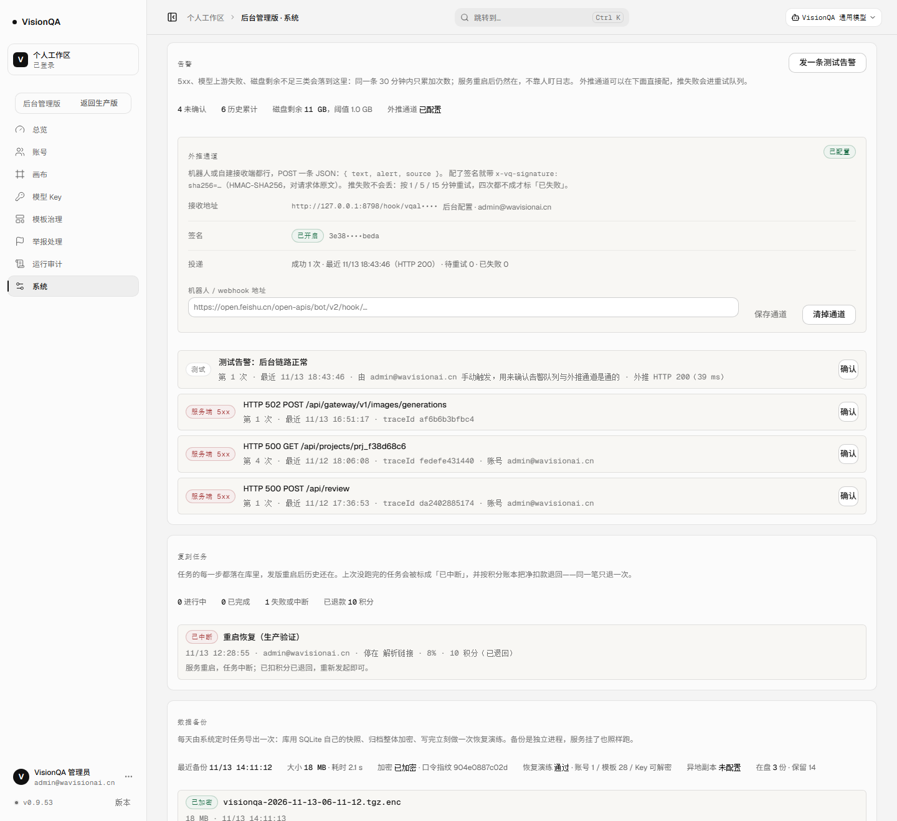

- **边界**：没有外部通道时仍然只能「进后台看」，代码把能配 / 可靠 / 可验做完，还差一个真实机器人地址（给了地址后台一贴就通，不用再发版）；只发 `POST` 一条 JSON，不实现各家专有签名格式；重试上限 4 次，之后只留记录 + 手动补发。细节与回滚见 [告警外推](docs/alert-webhook-2026-11-13.md)。
- **顺手记录的现场**：告警队列里那条 `HTTP 502 POST /api/gateway/v1/images/generations`（11/13 16:51，耗时 669 ms）正是上一轮画布出图失败的真身——**是我们自己的生成通道转发上游后拿了 502**，不是画布 bug；视频通道同时刻是 200。下一轮若继续查，方向是 SeeAPI 侧对这个出图模型的拒绝原因（余额 / 模型名 / 参数），仍不发起生成调用。

提交 `ea8797b`（代码 + 9 条测试 + 文档 + 1 张生产截图 + 部署说明），CI 43411897724 success。

## 一百二十三、忘记口令不用再等管理员：邮件通道 + 一次性重置链接（v0.9.54）

- **起因**：上线缺口清单 A5「无 SMTP，忘记口令只能找管理员」。`server/auth.mjs` 的开头注释一直写着「不做邮件验证与找回密码」——找回入口只有管理员手动改一条路。单账号自建还能忍，有真实外部用户后就是「管理员不在线就进不来」。
- **改法**：这轮把「发信」和「找回」一起做完，**不用再发版**：`server/mailer.mjs` 自己实现 SMTP 客户端（不引依赖，直连 TLS 465 / STARTTLS 587、AUTH PLAIN / LOGIN、UTF-8 报文、超时与「哪一步被拒」的报错）；`server/mail-config.mjs` 把通道存进数据目录（0600，接口只回账号掩码与「有没有口令」，后台配置优先于 `VQ_SMTP_*`）；`server/password-reset.mjs` 发一次性 token（库里只存 sha256、30 分钟有效、申请新的作废旧链接、并发点两次只成功一次）；登录页「忘记密码」变成真的表单，邮件链接落到 `#/reset?token=…` 独立页，后台「系统」多了邮件通道卡片（服务器 / 端口 / 加密 / 账号 / 口令 / 发件人 / 发测试邮件）。
- **几个不显眼但重要的选择**：① 无账号、没配通道、发信失败都回同一句话——「有没有这个账号」看不出来；② 找回接口只回话、SMTP 在后台发，发信挂掉不会让用户转圈 20 秒；③ 没配通道时登录页不摆死入口，直接说「这个部署还没配邮件通道，请找管理员」；④ 改完口令注销这个账号的全部会话（邮箱能收信只是单一因素）；⑤ 口令只写不读，后台保存留空 = 沿用旧口令，换账号没填新口令会直接报错；⑥ 限流同一邮箱 3 次/小时、同一来源 10 次/小时。
- **生产实测**：在生产起一个本机 SMTP 接收端，走完整链路——配通道前 `passwordReset:false`，保存后 true；测试邮件 `ok:true, ms:24`；申请找回 **200 / 35 ms**（不 await 发信）；接收端收到 **3309 字节**真实 MIME，主题按 RFC 2047 编码、正文带重置链接；链接探活 `valid:true`（+30 分钟）；改口令 200；**旧口令登录 401、新口令 200**；同一链接再用 400「这枚链接已经改过口令了」。验完清场：通道 `DELETE`、临时账号删掉、接收端 `pkill`——生产现在没有配邮件通道。
- **验收**：生产 v0.9.54（入口 `index-DdsRFKQL.js`、`/api/version` 0.9.54、health ok 模板 26）；`npm test` **497/497**（新增 18 条：SMTP 协议 10 条 + 找回链路 8 条）；oxlint 0 error / 6 warning、`tsc -b` 干净、构建通过。

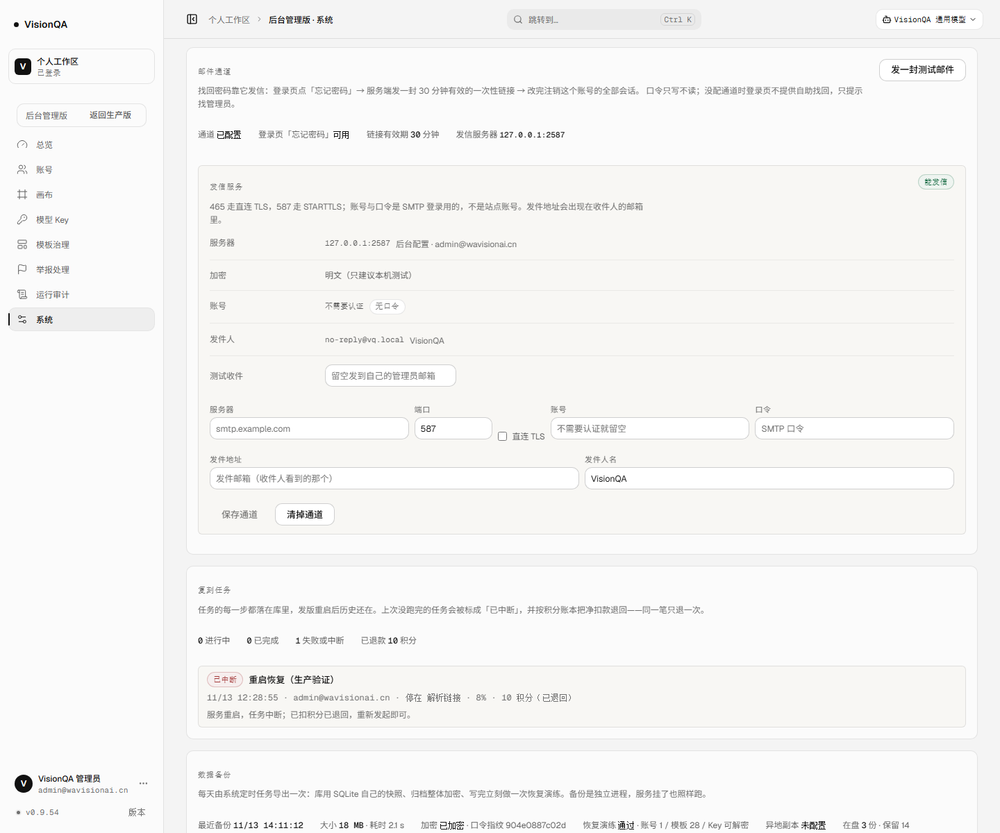

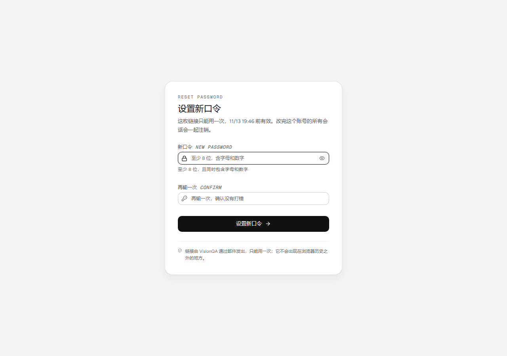

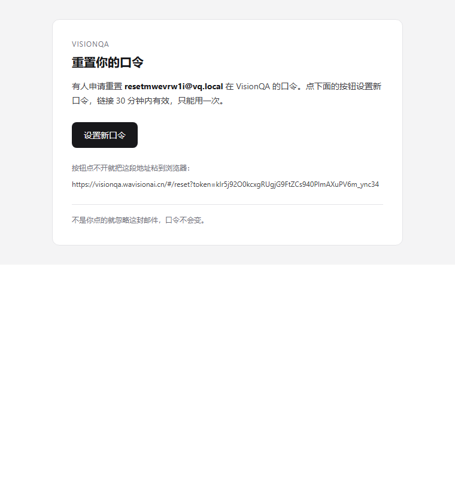

- **边界**：生产现在没配邮件通道，要真用就在后台填一次 SMTP（主机 / 端口 / 账号 / 口令 / 发件地址），不用发版；只发「纯文本 + 可选 HTML」，没有附件、退信解析、DKIM 与连接池；限流是进程内窗口，多实例要换共享存储；发信失败只进日志与审计，不会主动叫你。细节与回滚见 [找回密码](docs/password-reset-2026-11-13.md)。
- **下一轮**：仍回到画布出图 502——上一轮已确认是我们自己的生成通道转发上游后拿了 502（视频通道同时刻 200），方向是 SeeAPI 对这个出图模型的拒绝原因（余额 / 模型名 / 参数），只做只读排查，不发起生成调用。

提交 `8d5460e`（代码 + 18 条测试 + 文档 + 3 张生产截图 + 部署说明），CI 43416928542 success。

## 一百二十四、画布出图 502 的根因：平台把幂等键丢了（v0.9.56）

- **起因**：上一轮留的尾巴——画布 16:51 出图 502、同一分钟视频 200。这轮只做只读排查，不发起生成调用。
- **根因**：网关路由日志 r112 记的是上游 `HTTP 400 invalid_idempotency_key`——SeeAPI 的同步出图是**计费请求**，必须带 `Idempotency-Key`。画布在请求头里带了（它直连 SeeAPI 的源码 `generation_image2.py:151-162` 就是这么发的，请求体里没有这个字段），换成平台通道后，平台只转了正文、把这个头丢了。更糟的是后台把这次 400 报成「上游凭证无效」，把排查方向带偏了一轮。
- **改法**：调用方的 `Idempotency-Key` 请求头透传到上游（没有就按「正文 `idempotency_key` → 平台补 `vq-<uuid>`」取键，方舟不发）、换把重试沿用同一个键（同一次生成不重复扣费）、上游「接单了但没确认结果」时同键重放一次且**绝不换 Key**、报错固定带上游 code、后台对账表补 SeeAPI 的 4 个出图模型名（`image-2-pro` / `image-2.5` / `nano-banana-flash` / `nano-banana-pro`）。
- **生产实测**（本机假上游，未调真实 SeeAPI）：画布同款请求（键**只在请求头**、正文没有）**200 / 55 ms**，假上游收到 `idempotency-key: bd-canvas-r67-header`；头也不给时平台补 `vq-b84728d3-…`；假上游回 `400 invalid_idempotency_key` 时网关 502，话术是「上游要求带幂等键，平台这次没带上（HTTP 400 invalid_idempotency_key）」，不再冒充凭证问题。
- **两次上线说清楚**：v0.9.55 只做到「平台自己生成一个键」，上线后回读画布源码才确认它本来就会发这个头；少了透传，画布重试时会换成平台的新键，上游认不出是同一次提交，仍可能重复扣费。v0.9.56 补齐透传并用同一套假上游复验。
- **验收**：生产 v0.9.56（`/api/version` 0.9.56、health ok 模板 26）；`npm test` **506/506**（新增 9 条）；oxlint 0 error / 6 warning、`tsc -b` 干净、构建通过。
- **边界**：真 SeeAPI 的一次出图没跑（你的规则：不自行消耗上游额度），所以「改完真能出图」还差这一次；`provider_submit_outcome_unknown` 的重放路径按 SeeAPI 语义实现并单测，真实触发要等线上遇到。
- **下一轮**：你点头后用一次真实出图给 502 收尾（只出一张）；不点头就继续下一个上线缺口（A4 定价 / A7 备案与 AI 标识）。细节见 [画布出图 502](docs/canvas-image-502-2026-11-13.md)。

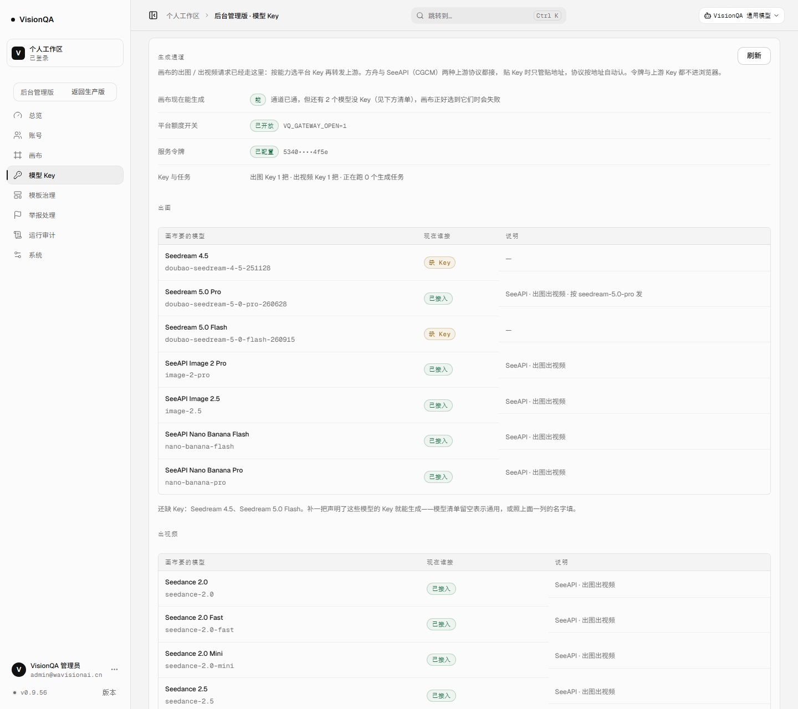

提交 `77e7830`（代码 + 9 条测试 + 文档 + 1 张生产截图 + 部署说明），CI 43421415646 success。

## 一百二十五、AI 生成内容标识：交付稿、三张纸、分享页全带上（v0.9.57）

- **问题**：脚本、分镜、评审结论都是模型给的，但产物一旦交出去（Markdown 交付稿、A4 打印稿、现场页、评审对照纸、只读分享页）就没有任何标识。grep 全仓「AI 生成」只有一行待办，界面与产物里一处都没有。《人工智能生成合成内容标识办法》2025-09-01 已施行，这是上线硬缺口。
- **做法**：新增 `server/ai-label.mjs` 一处收口（标识文案、版本、说明句、meta、胶囊），五个出口共用：Markdown 文首一行引用 + 落款；三张纸品牌行右侧「AI 生成」胶囊 + 抬头说明 + 纸脚落款，纸的 `<head>` 另带 `ai-generated / ai-generator / ai-label / ai-label-version` 四条 meta；分享页标题行胶囊 + 底部标识说明，数据来自接口白名单新增的 `aiLabel`。出错提示页（「打不开这张稿」）明确不挂标识。
- **顺带补上的合规文案**：隐私说明「三、第三方处理者」按真实通道写实（DeepSeek 文本与视觉、SeeAPI 出图出视频、红狐检索），新增「七、AI 生成内容」；服务条款新增「六、AI 生成内容标识」；条款版本升到 2026-11-13，注册记录的同意版本能对上。
- **生产实测**（v0.9.57，真实渲染）：交付稿 A4 的胶囊与 `DELIVERABLE / A4` 同行对齐、文首引用块完整；现场页有胶囊、说明与纸脚；分享页状态行出现「AI 生成」，截完立即停用分享（`share.live=false`）；隐私说明能读到三条第三方清单与 AI 章节，版本显示 `v2026-11-13`。
- **验收**：`npm test` **512/512**（新增 `test/ai-label.test.mjs` 6 条：措辞、meta、Markdown、三张纸、错误页不挂、分享字段不含 token）；oxlint 0 error / 6 warning、`tsc -b` 干净、构建通过；生产 `/api/version` 0.9.57、health ok 模板 26。
- **边界**：生成图片 / 视频本身的元数据与烧水印没做（要改画布出图渲染，属 C1，且本轮按要求没发任何生成调用）；主体全称 / 地址 / 信用代码与 ICP、客服邮箱仍等你给（A7 剩余项）；生成式 AI 备案 / 算法备案是流程动作。
- **下一轮**：你点头后用一次真实出图给 502 收尾；不点头就继续下一个上线缺口（A4 定价 / A8 单位经济）。细节见 [AI 生成内容标识](docs/ai-label-2026-11-13.md)。

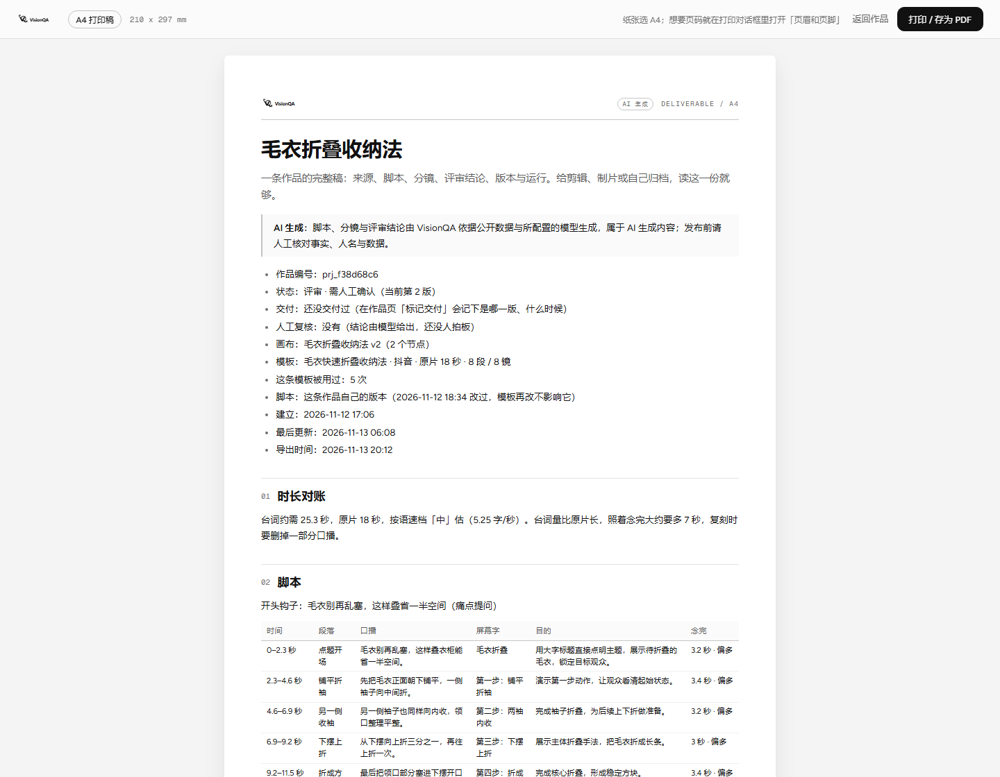

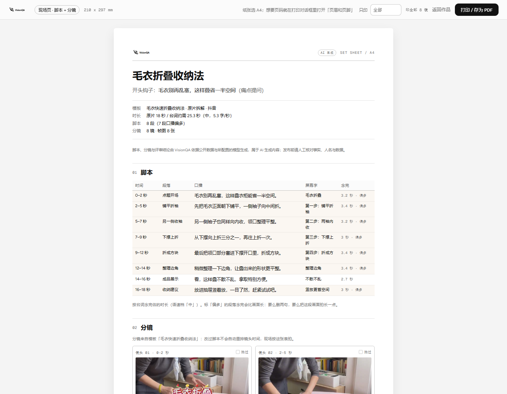

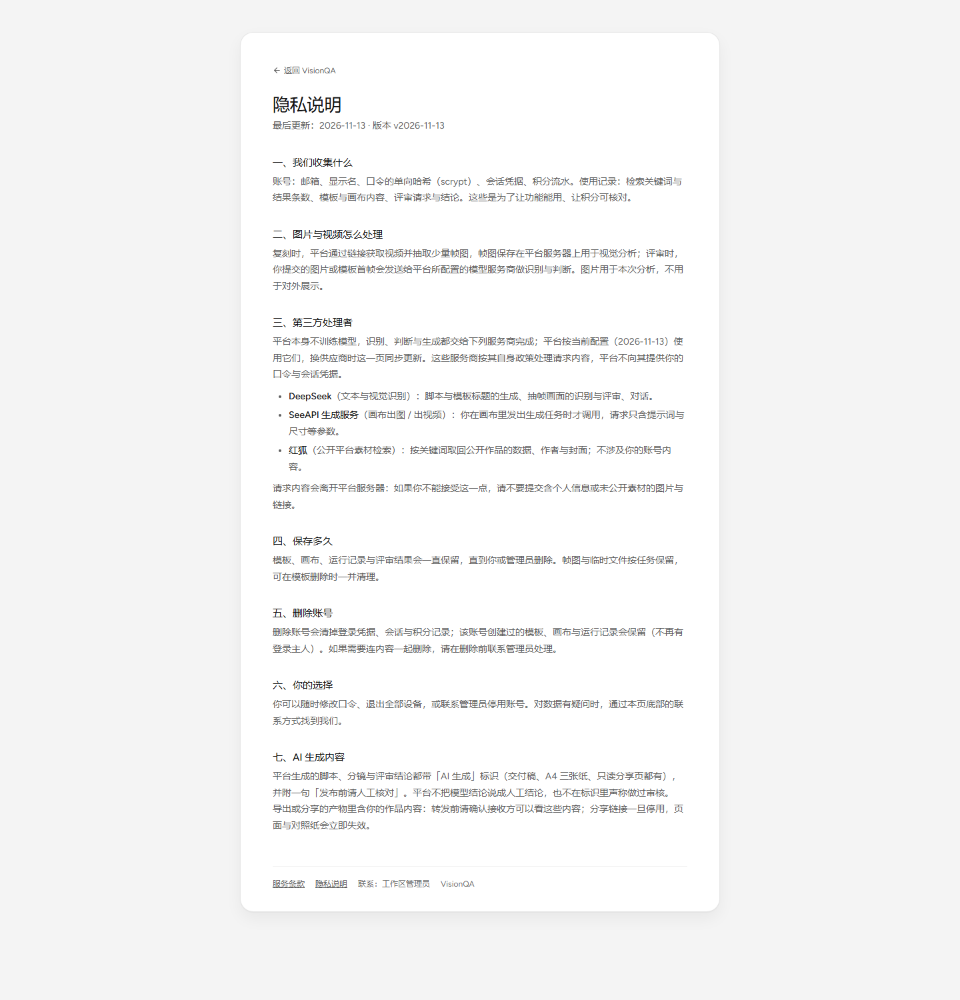

提交 `19fab5b`（代码 + 6 条测试 + 文档 + 4 张生产截图），CI 43423776012 success。

## 一百二十六、用量与成本台账：先有真实数字，再谈定价（v0.9.58）
- **问题**：A8 一直写着「复刻成本与配额未定」，但连「一次复刻花多少钱」都没有数字。积分是对用户的虚拟倍率（检索 2、复刻 10 积分），和上游成本没有换算关系；模型路由日志只记「成没成、用了哪把 Key」，不记 token；出图 / 出视频只记「转发成功」，不记张数与秒数。定价没有依据，配额也只能拍脑袋。
- **做法**：新增 `server/usage-meter.mjs` 一处收口：每次真实调用写一条 `usage_events`（能力、模型、token 入/出、张数、秒数、作品或单据号、成败），复用现有账号库 SQLite；接线在五个真实花钱点——`chatcall.mjs`（文本与视觉，拿上游 usage）、`judge.mjs`（判断层）、`gateway.mjs`（同步/异步出图按张、出视频按提交时长）。后台新增「成本」页：调用次数、估算成本、按能力 / 按天 / 按模型分布、最近事件，以及一组管理员可填的估算单价（存 `DATA_DIR/usage-prices.json`、0600、改动进审计）。
- **三条刻意的取舍**：① 积分不参与成本（虚拟倍率 ≠ 上游账单）；② 失败只记次数、不记张数、不折钱（上游计不计费没有依据）；③ 历史回填按积分流水只补次数，标 `source=backfill`、`tokensKnown=false`，不折金额，且只跑一次。
- **生产实测**（v0.9.58）：`/api/version` 0.9.58、health 全绿模板 26；成本页读到真实历史 89 条（文本 25、视觉 5、检索 23、复刻 29、画布运行 7，全部来自积分流水回填，页面显示「历史回填」与「未回」而不是编一个 0 token）；负单价 `PUT /api/admin/usage/prices` 返回 **400** 且原值不变；保存 0 单价返回 200、`priced=false`，页面仍显示「未定价」，不编金额。
- **不花额度也验了接线**：`test/usage-wiring.test.mjs` 用本地假上游走完整链路 4 条——聊天记到真实的 `1234 / 567` token 与作品 / 单据号，出图 `n=2` 记 2 张、单据号就是幂等键，出视频 `duration=6` 记 6 秒，失败出图记 ok=false、0 张、汇总只把成功的 2 张算进张数。本轮**没有发起任何真实生成或评审调用**。
- **边界**：画布服务端自己的 LLM 节点不经平台通道，不在表里；出视频退款不会自动冲回；出图请求没有作品字段，作品维度目前只有评审有归属；没有拉上游对账单，金额全是估算。
- **验收**：`npm test` **522/522**（新增 `test/usage-meter.test.mjs` 6 条 + `test/usage-wiring.test.mjs` 4 条）；oxlint 0 error / 6 warning、`tsc -b` 干净、构建通过。细节见 [用量与成本台账](docs/usage-meter-2026-11-13.md)。

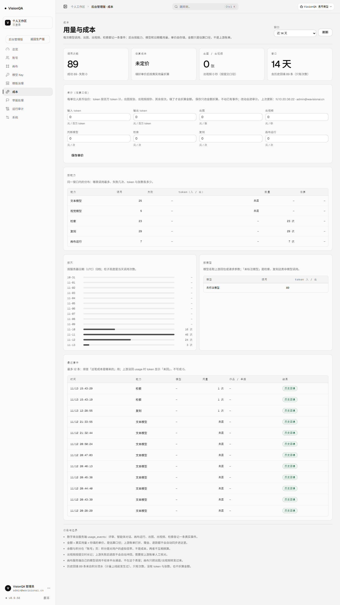


提交 `9be3e69`（代码 + 10 条测试 + 文档 + 2 张生产截图），CI 43427876217 success。

## 一百二十七、画布运行的钱与记录：发一次版不再吞一次运行（v0.9.59）

- **问题**：A1 在 v0.9.48 只修了「一键复刻」，画布运行（`/api/flows/:id/run`）还留着三个口子：运行记录**跑完才写**（进程被杀这次运行就查不到，用户只看到积分少了 2）、退款靠**进程内闭包**（进程退出闭包没了，钱留在平台账上）、扣费 `ref` 是**画布名**（同名画布的多次运行共用一个单据号，退谁的钱说不清）。
- **改法**：运行 id 先定、记录先落盘、再扣费（扣费失败撤掉占位记录）；扣费与退款同一个 `ref` = 运行 id，画布名只进账本说明列；新增 `refundRunCredits()` 按账本净额退，节点失败 / 启动恢复 / 停机收尾三条路径共用；新增终态 `interrupted`，运行记录页、画布运行抽屉、后台都显示「已中断」，且不再把中断混进「失败」数字（第三格写「本页未完成」）。
- **生产实测**（v0.9.59）：真实跑一次会失败的画布（评审节点没配图，不进上游、不花钱）→ `run_aee67613` 标失败、余额 9950 → 9950，账本两条 `flow_run -2` / `flow_run-refund +2` 的 ref 都是运行 id；再造一条运行中记录后 `systemctl restart visionqa`，启动日志 `runs.recovered {"recovered":1,"refunded":1}`，该运行 `interrupted`、余额 9948 → 9950，再重启一次不多退。
- **验收**：`npm test` **528/528**（新增 `test/flow-run-recovery.test.mjs` 6 条：落盘时机、重启恢复与幂等、正常完成不退款、节点失败自动退、路由 ref 是运行 id、停机收尾）；oxlint 0 error / 6 warning、`tsc -b` 干净、构建通过；`/api/version` 0.9.59、health 全绿模板 26。
- **边界**：中断退款只退用户积分，上游在那一刻可能已经计费，这部分成本平台吸收（要精确得拉上游对账单）；没有节点级续跑；v0.9.59 之前的旧流水 ref 仍是画布名，不改写历史。

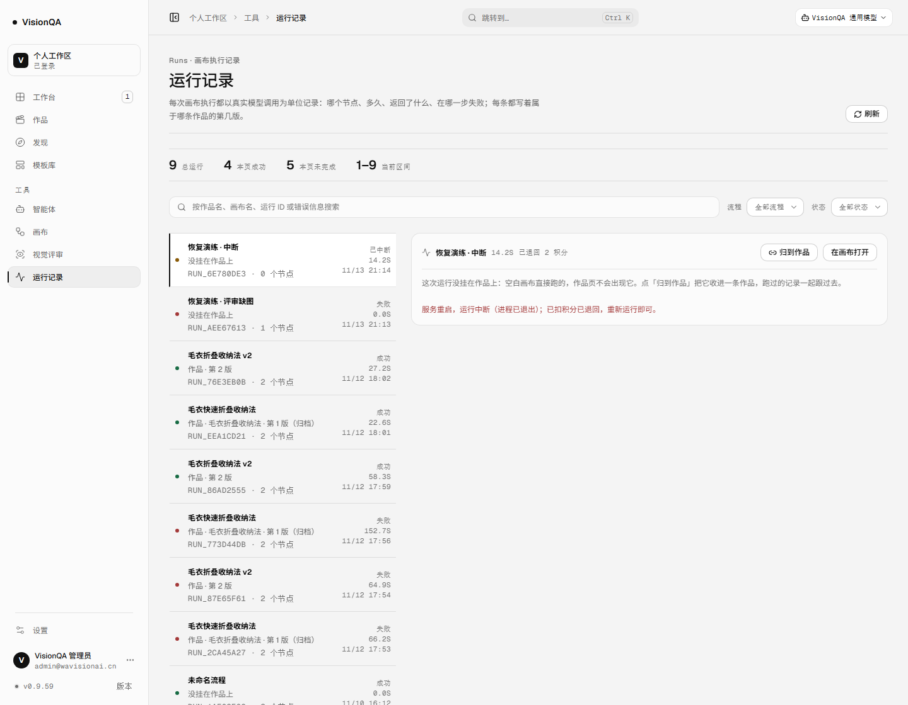

提交 `a572ef6`（代码 + 6 条测试 + 文档 + 1 张生产截图），CI 43433338020 success。

细节见 [画布运行的钱与记录](docs/flow-run-recovery-2026-11-13.md)。

## 一百二十八、应用内反馈：没有客服邮箱，用户也能找到人（v0.9.60）

- **问题**：A5 的 SMTP 凭据与 A7 的客服邮箱都还没到位，`supportEmail` 为空时登录页与页脚只能写「联系工作区管理员」；登录进不来的人连账号都没有，等于没有任何对外求助路径。这是上线清单里的 B5。
- **做法**：登录页页脚与设置页各一个入口，共用 `src/components/FeedbackModal.tsx`（类型 / 具体情况 / 联系方式；登录态默认带账号邮箱，提交后回受理编号）。服务端 `server/feedback.mjs` 落 `DATA_DIR/feedback.json`：原子写、封顶 1000 条、匿名必须留联系方式、5–2000 字、类型白名单、十分钟内同账号 / 同 IP 相同文字合并。`POST /api/feedback` 在 PUBLIC_API 里（登录页可用）按 IP 每分钟 3 条限流；`GET /api/feedback/mine` 要登录、只回本账号、只下发展示字段。后台新增「反馈」：待处理 / 处理中 / 已处理 / 全部四档、计数、回复、侧栏待处理角标；回复随条目回到提交者的设置页，处理动作进审计。
- **生产实测**（v0.9.60）：无 cookie 匿名提交 `201`（`fb_7485a7f0`），匿名但不留联系方式 `400` 且不入库；登录态提交 `201`（`fb_13f8160c`）；后台 `counts {new:2, reading:0, done:0, total:2}`；`systemctl restart visionqa` 后 `feedback.json` 996 字节、两条 id 都在；管理员写回复并标已处理后，用户 `/api/feedback/mine` 读到同一条回复；在后台处理一条后侧栏角标同一页面内 `1 → 空`（不导航）。
- **验收**：`npm test` **535/535**（新增 `test/feedback.test.mjs` 7 条：匿名必填、体长边界、落盘计数、重复合并、账号隔离与回复回流、路由匿名 / 401 / 403、限流规则）；oxlint 0 error / 7 warning、`tsc -b` 干净、构建通过；`/api/version` 0.9.60、health 全绿模板 26。
- **边界**：没有邮件通知（A5 凭据未配），回复只在站内可见；匿名用户看不到回复，只能按留的联系方式人工联系；自己的反馈列表只显示最近 6 条（已作为一条反馈登记在后台）；没有附件 / 截图上传；反馈不进外部告警通道。

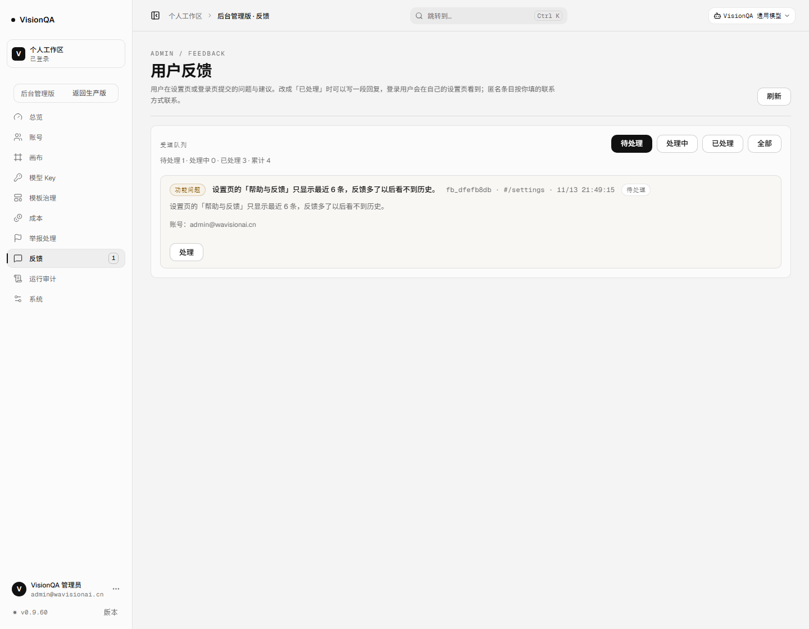

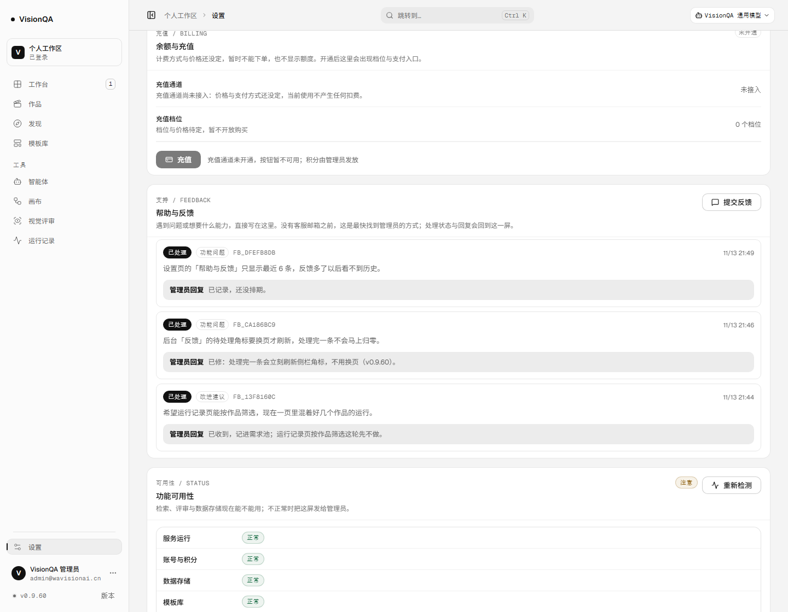

提交 `1066697`（代码 + 7 条测试 + 文档 + 2 张生产截图），CI 43437908906 success。

细节见 [应用内反馈](docs/feedback-2026-11-13.md)。

## 一百二十九、帮助中心：三篇说明，先让人自己找到答案（v0.9.61）

- **问题**：B5 解决了「找不到人」，但解决不了「不想问人」。三件被问得最多的事——积分怎么扣、复刻为什么失败、素材能不能用——此前只散落在条款页、弹窗文案和报错里：用户得先失败一次才看得到解释，而 402 / 502 的文案只会说「失败了」，不说下一步。客服邮箱还没到位，帮助中心是不依赖任何外部输入的自助路径。
- **做法**：新增 `src/domain/help.ts` 三篇说明（积分与退回 / 复刻、画布与出图失败排查 / 素材与帧图边界），以及公开页 `src/pages/HelpPage.tsx`：`#/help` 是目录、`#/help/<slug>` 是单篇，和条款页同一条「不登录也能打开」的路径（`isBareRoute`），认不出的 slug 落回目录并规范化地址。内容只写产品真的怎么做：单价不写死（指向「设置 → 积分」的实时值），复刻失败对得上服务端五步（获取视频与抽帧 → 读取视频信息 → 抽帧 → 逐帧分析 → 写入模板库）。
- **入口接到真实卡点**：登录页与条款页页脚有「帮助」；设置页「帮助与反馈」顶上一排三篇入口；**复刻失败弹窗**与**运行记录失败详情**直接链到排查那篇；命令面板 Ctrl K 能搜到「帮助中心」。帮助页自己也是反馈入口——不登录也能提交，复用 v0.9.60 的弹窗。
- **生产实测**（v0.9.61）：`/api/version` 0.9.61；无 cookie 打开 `#/help/credits` 读到标题、4 节、目录 3 条；`#/help/nonsense` 规范化成 `#/help` 并落在目录页；登录页页脚（无 cookie）是 `帮助=#/help`；登录态设置页三篇入口 href 正确；不登录点帮助页「提交反馈」，弹窗打开、3 个类型按钮；控制台报错 0。health `{ok:true, redfox:true, vision:true, llm:true, templates:26}`，模型服务一项仍是 `warn`（「待首次生成验证」，属上一轮留下的待办，与本轮无关）。
- **验收**：`npm test` **543/543**（新增 `test/help-center.test.mjs` 8 条：字段与节数、标题不重复、slug 白名单与坏链接回落、相关文章、内容与产品行为对得上、路由与页面接线、五处入口、帮助页自带反馈与条款链接）；oxlint 0 error / 7 warning、`tsc -b` 干净、构建通过。
- **边界**：三篇是说明不是教程（没有图与视频，也不覆盖账号与登录问题）；单价与失败文案都在各自界面里，帮助页不抄第二份以免漂移；匿名用户仍看不到反馈回复（等 SMTP 凭据）；没有站内搜索与「这篇有用吗」统计。

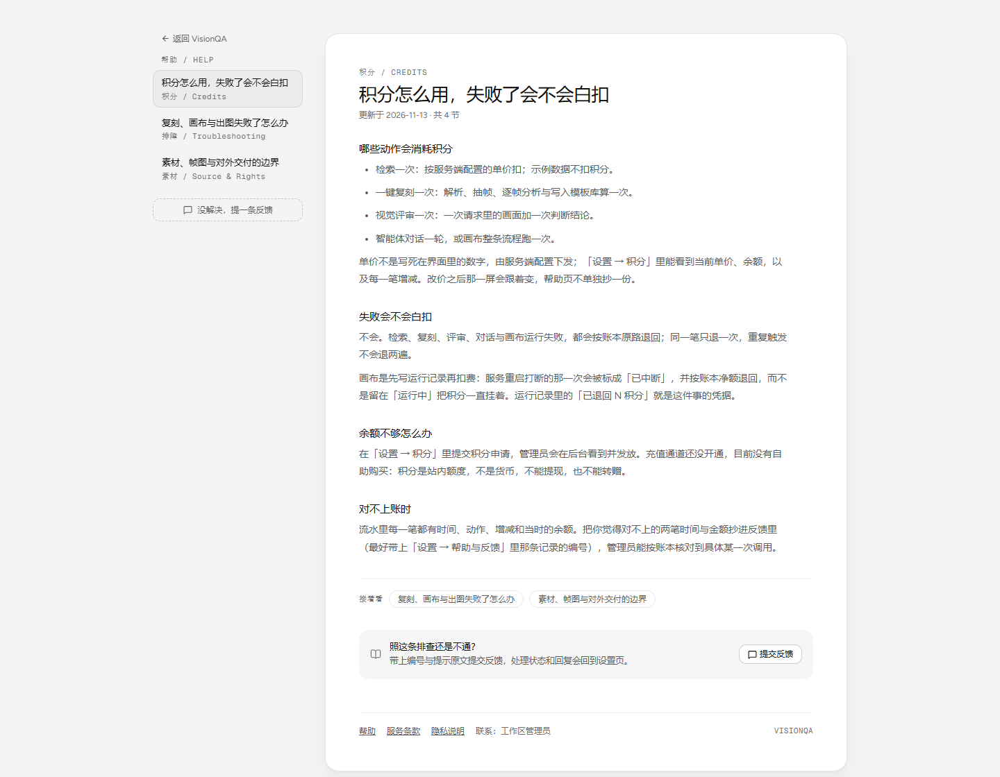

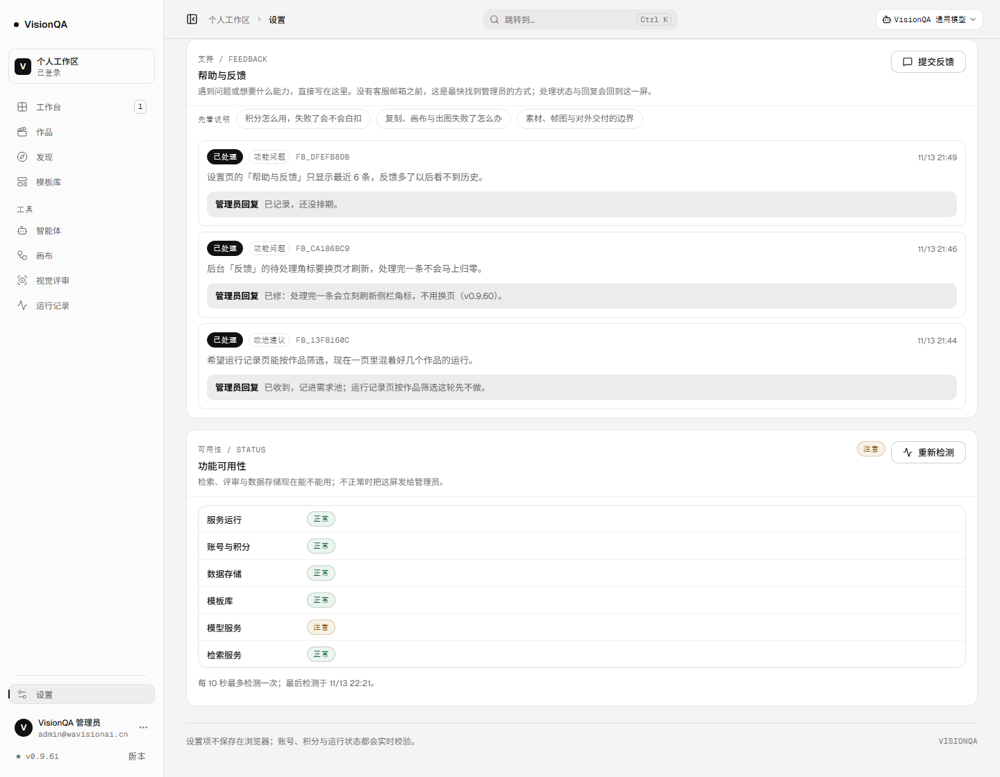

提交 `9e8f6dc`（代码 + 8 条测试 + 文档 + 2 张生产截图），CI 43443478421 success。

细节见 [帮助中心](docs/help-center-2026-11-13.md)。

## 一百三十、登录设备：自己能看到、能踢掉的那几台（v0.9.62）

- **问题**：B7 一直只有两步验证，没有设备列表。口令如果在别处泄露，账号主人无从知道有谁在用这个账号；改口令虽然能清掉其它会话，但那是一刀切，代价是所有设备都要重新登录。
- **做法**：`server/auth.mjs` 新增 `listLoginSessions()` / `revokeLoginSession()`，对外 id 是 `token_hash` 的派生值（16 位十六进制，反推不出 token）；三条接口 `GET /api/auth/sessions`、`DELETE /api/auth/sessions/:id`、`POST /api/auth/sessions/revoke-others`，当前设备不允许从列表里踢（走「退出登录」），别人的会话一律 404。设置页新增「登录设备」卡：当前设备排第一并高亮，其余每行一个「退出」，卡片头还有「退出其它设备」。
- **两个口径上的细节**：① 列表最多 10 条，但**当前这条永远排第一**（它可能是最早建的那条，按时间截断会把自己截掉），总数照实报；② 设备名认 Windows / Mac / iPhone / Android 与 Chrome / Edge / Safari / Firefox，`node`、`curl`、`python-requests` 这类脚本登录标成「命令行 · Node / curl / Python」，不再一律「未知设备」；IP 只露到网段（`123.158.43.*`、`2408:8207:…`），本机写「本机」。
- **生产实测**（v0.9.62）：`/api/version` 0.9.62；`GET /api/auth/sessions` 返回 `total 170 / sessions 10`、第一条 `current: true`；设置页 10 行设备渲染正常、计数胶囊「170 台」；`DELETE` 当前会话返回 **400**「当前设备请用「退出登录」」，之后 `/api/auth/me` 仍是 200（没有被误踢）；控制台 0 报错。
- **一个真实发现**：生产这个账号积了 **170 条未过期会话**（11/09 起，绝大多数是自动化脚本 node / curl / Python 登录留下的），以前没有任何界面能看到。我**没有**在生产点「退出其它设备」——那会把用户浏览器里可能正在用的会话一起注销；这条留给你确认后自己点，一次点击、可重新登录。
- **验收**：`npm test` **549/549**（新增 `test/sessions.test.mjs` 6 条：只列本账号、id 不泄露 token、踢掉即失效、当前设备与别人的会话踢不到、路由 401/200/400/404 与一键退出、老会话积压时只列 10 条但总数说真话，以及设备名 / IP / 到期天数的纯函数口径）；oxlint 0 error / 7 warning、`tsc -b` 干净、构建通过。
- **边界**：没有「最后活动时间」（每请求写库不划算）；没有异地登录邮件提醒（A5 SMTP 凭据未给）；更早的会话只能整批退出，不能逐条核对；IP 只露网段。

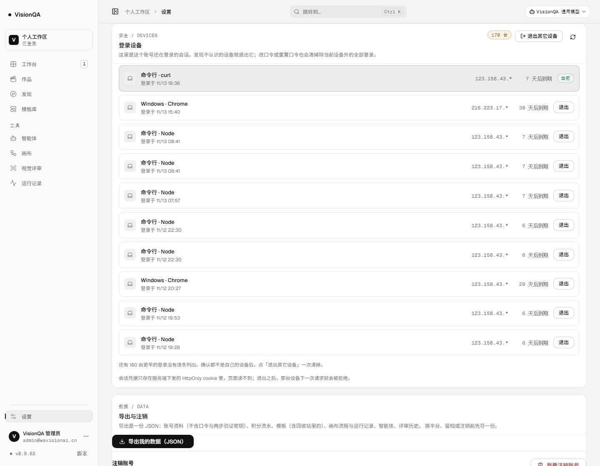

提交 `6ec4c2d`（代码 + 6 条测试 + 文档 + 1 张生产截图），CI 43452458743 success。

细节见 [登录设备](docs/sessions-2026-11-13.md)。

## 一百三十一、定价：价格由你定，代码只负责如实渲染（v0.9.63）

- **问题**：A4「收钱」的代码部分一直停在 `const PLANS = []`——想定价只能改代码、重新发版；设置页只有一句「计费方式与价格还没定」，用户看不到档位，也不知道该找谁。额度申请只有「要多少积分」，没有价格、没有单据，管理员发放时不知道这一笔谈的是多少钱。
- **做法**：新增 `server/plans.mjs`（`DATA_DIR/plans.json`，0600），档位字段是 `name / credits / priceCents / note / enabled / sort`，价格存「分」；后台侧栏新增「计费」页，可增删改档位，改完下一次刷新就生效，每次动作都进 `admin_audit`（`plan.save` / `plan.delete`）；设置页「余额与充值」变成「档位与开通」，按后台数据渲染每张档位卡，动作是「申请开通」而不是「立即购买」。
- **申请带档位、单据是快照**：`POST /api/credits/request { planId }` 的积分与价格都由服务端从档位取（客户端传的 `amount` 不作数），档位不存在或停用直接 404；申请时把 `planId / planName / priceCents` 抄进单据，之后档位改名、改价、删掉，用户看到的历史单据仍是当时那一笔。状态三档：待确认 / 已开通 / 已取消。
- **支付仍然没接**：`enabled` 永远是 `false`，`POST /api/billing/orders` 依旧返回 **501**、订单列表依旧为空。界面上「立即购买」保持不可用，旁边写清「通道未接入，下单会明确失败；现在只能走「申请开通」」——不装开通、不伪造订单。
- **生产实测**（v0.9.63，入口 `index-BPfWKYLU.js`）：`/api/version` 0.9.63；后台建档位 **201**（`priceCents 9900 / credits 1000`）、overview `enabled:false` + 档位 1 个；设置页卡片渲染「¥99.00 / 1,000 积分 · 每积分约 ¥0.099」；点「申请开通」生成单据「待确认 · ¥99.00 · 1,000 积分」；后台待处理申请带 `planName / priceCents / amount`；管理员「忽略」后余额 **9950 → 9950**（不动钱）；删除档位后档位 0 个，而那张单据仍显示「验证用档位 / ¥99.00」（快照生效）；控制台 0 报错。
- **截图里的「验证用档位」是临时条目**：备注写着「上线验证用，验证完删除」，验证完已删除——**真实价格仍待你定**，这一轮没有编任何价格。
- **验收**：`npm test` **559/559**（新增 `test/plans.test.mjs` 10 条：整数分入库与排序、五种非法输入拒绝、改价与停用、overview 恒 `enabled:false`、下单 501、按档位申请时客户端 `amount` 无效、档位不存在/停用 404 且不落库、单据快照、发放后状态、后台路由 401/403/400/404）；oxlint 0 error / 7 warning、`tsc -b` 干净、构建通过；手机 390 宽自查无横向溢出。
- **边界**：没有订单表与回调验签、没有发票流程、没有按账号的额度上限与 429（A8 的另一半）；「忽略」不会通知用户；单据界面只列最近 5 张。

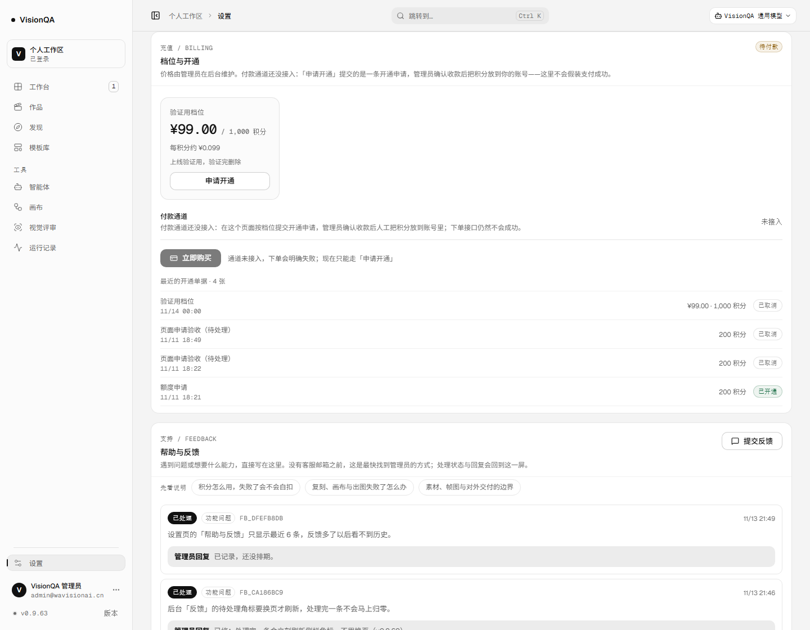

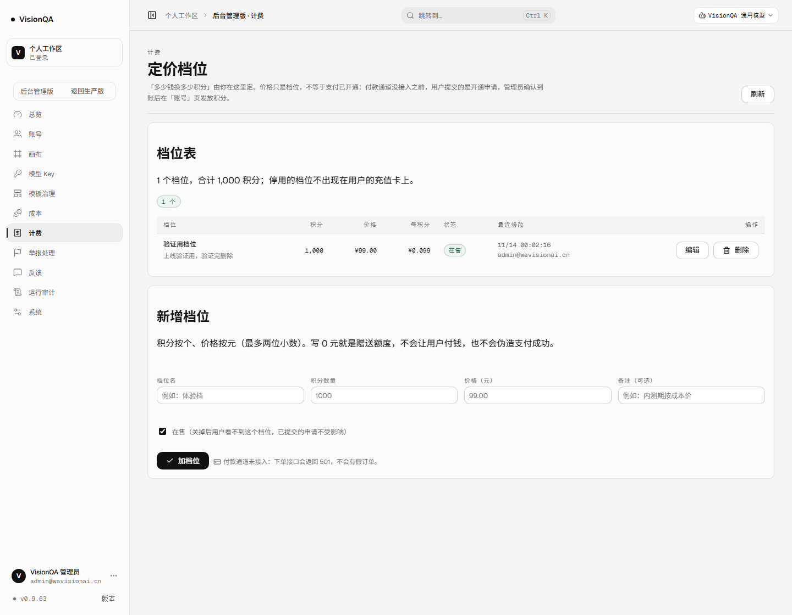

提交 `60b9502`（代码 + 10 条测试 + 文档 + 2 张生产截图），CI 43459154232 success。

细节见 [定价档位](docs/pricing-plans-2026-11-13.md)。

## 一百三十二、每月额度：一个账号一个月能花多少，由你定（v0.9.64）

- **问题**：余额只回答「还有没有钱」，回答不了「这一个月最多花多少」。一个账号被脚本连着刷，余额几小时见底，上游的钱已经花出去了；共用账号时一个人能把别人第二天的额度也花光；上线收费后「每月含多少积分」本来就是报价单里的一行，没有它连档位都定不了。
- **做法**：新增 `server/quota.mjs`（`DATA_DIR/quota.json`，0600）——默认每月上限（**0 = 不限**，也是现在的值）+ 按账号单独覆盖；`charge()` 在余额检查之后、改余额之前过一道配额闸门，超了返回 `MONTHLY_QUOTA`：**不扣积分、不落流水、不调用上游**。检索/复刻、评审、智能体对话、本地工作区对话、画布运行五处调用点统一改写成 **429**，附上限/已用/还差多少/重置时间，以及一句能照着做的提示。
- **后台与设置页**：后台「计费」页多了「每月额度」卡——默认上限、给某个账号单独设上限、「账号用量与额度」表（按本月消耗降序，行内可改、可恢复默认），改动进 `admin_audit`（`quota.save`）。设置页「积分余额与消耗」多了「本月用量」一行：设了上限就显示「已用 / 上限」与一条细进度条（80% 变黄、满格变红），不限就如实写「管理员没有设每月上限」。
- **口径**：一个自然月按 **UTC** 算（与后台「成本」页一致），每月 1 日 00:00 UTC 重置；「本月已用」= 本月扣费 − 本月退款，管理员扣减与赠送不算消耗。
- **生产实测**（v0.9.64，入口 `index-Ct9_Io7v.js`）：`/api/version` 0.9.64；初始 `monthlyLimit 0`，设置页显示「349 本月已用 · 不限」；临时把默认额度改成 **1** 积分后，设置页立刻变成「每月上限 1 积分…349 / 1 上限」、进度条满格；真打一次检索 → **429** `{code:'MONTHLY_QUOTA', limit:1, used:349, remaining:0, cost:2}`，而余额 **9950 → 9950**、账本 **115 → 115**（没扣钱、没落流水、没进上游）；单独额度设 30 → 只影响那一个账号，`DELETE` 回到默认；恢复成 0 后设置页回到「不限」；审计 4 条 `quota.save`；手机 390 宽页面不横向溢出；控制台 0 报错。
- **临时改动已复原**：那个「1 积分」只是为了让 429 可复现（也保证不会真的花上游的钱），验证完立刻改回 0。**生产现在没有设置任何额度上限，等你定数字。**
- **验收**：`npm test` **569/569**（新增 `test/quota.test.mjs` 10 条：默认不限、超额整单拒绝且余额流水不动、免费调用不受限、改完立刻生效、五类坏输入拒绝、按账号覆盖与恢复、退款/扣减/赠送的口径、UTC 月份边界、后台视图排序、429 字段齐全、后台 403/400/404）；oxlint 0 error / 7 warning、`tsc -b` 干净、构建通过。
- **顺带修的**：计费页两张卡用了 `.admin-card-head` 却没写样式，状态胶囊会掉到说明下面一行——补齐成「左标题、右状态」一行，标题压到 17px 与其他卡片一致；档位表与额度表补上 `.admin-table-wrap`，手机 390 宽在卡片内横向滚动，页面不再被表格撑宽。
- **边界**：买档位不会自动改这个账号的每月上限（两件事，等支付接上再联动）；额度只按账号，没有按 IP / 设备的限流；超了就是 429，没有宽限期；额度单位是积分不是钱，真实成本仍要看后台「成本」页的单价折算。

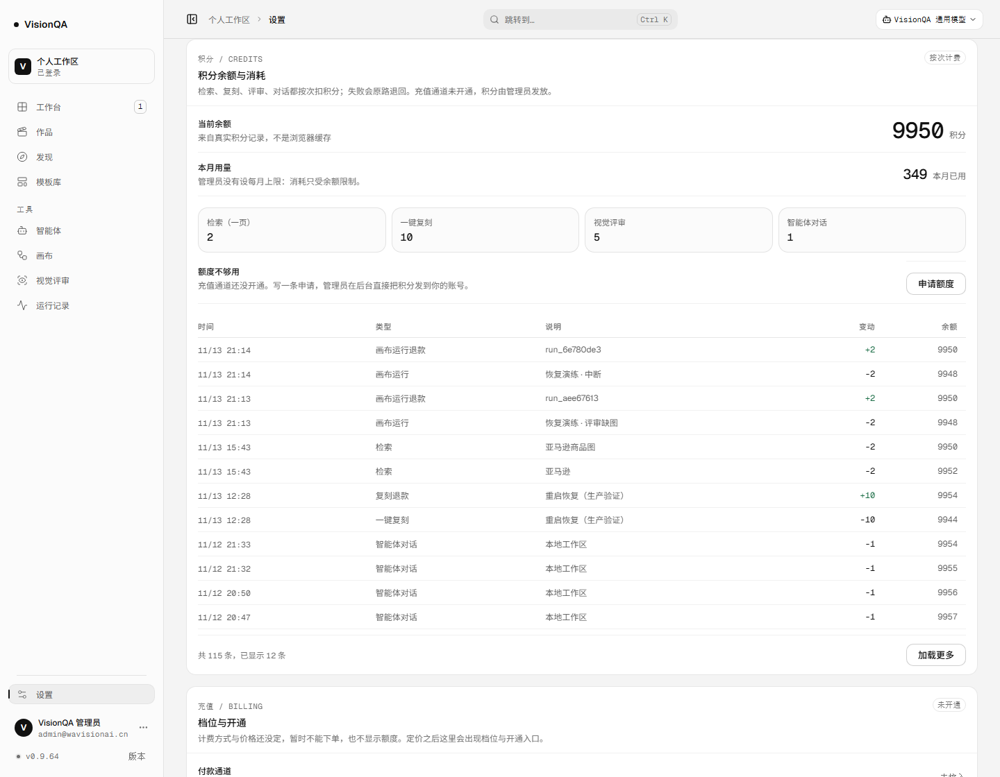

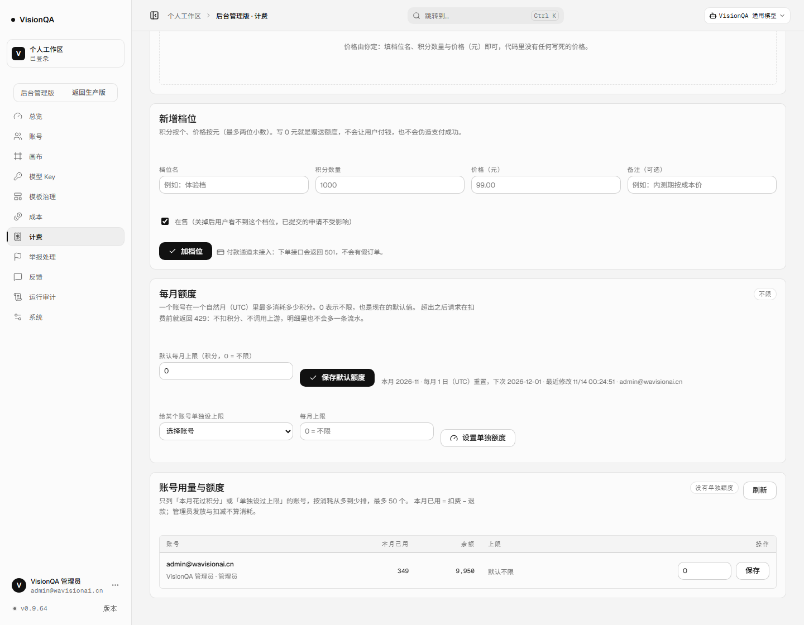

提交 `6126b6a`（代码 + 10 条测试 + 文档 + 2 张生产截图），CI 43464533412 success。

细节见 [每月额度](docs/monthly-quota-2026-11-13.md)。

## 一百三十三、钱花在哪：账号按动作、作品按自己（v0.9.65）

- **问题**：上一版回答了「这个账号这个月还能花多少」，但没人回答「花在哪」。账本只有一页 20 条的流水，要算「这个月是不是都花在复刻上」得自己加法；作品是主线，可是一条作品的成本散在「评审几次」「画布跑几次」里，作品页只显示单次金额，没有合计。
- **做法**：两个视角，各用最靠得住的记录，不新增一份统计副本——
  - **账号 → 本月花在哪**：读积分账本，按动作拆开（检索 / 一键复刻 / 视觉评审 / 智能体对话 / 画布运行），扣费减退款，管理员扣减与赠送不算消耗，UTC 自然月，合计与每月额度的「本月已用」是同一个数。
  - **作品 → 这条花了多少**：评审记录自己记着成本、运行记录自己记着成本，评审按 `projectId`、运行按作品的当前画布与归档画布（跨版本）归集，**退过款的运行不算**。检索、复刻、对话记在账号上——账本里没有作品，就不硬摊过来（页面写明）。
- **界面**：设置页「积分余额与消耗」里多一块「本月花在哪」（5 枚胶囊 + 合计，与本月已用对账），单价表补上第 5 个动作「画布运行」；作品页右栏多一块「花费」（合计 / 评审 / 画布运行 / 最近一次 + 一句口径说明）；作品列表卡片多一格「花费」，与作品页同一份数。
- **生产实测**（v0.9.65c，入口 `index-BtbTAZry.js`）：`/api/credits` 余额 9950、本月已用 **349**，本月花在哪合计 **349** = 一键复刻 260（29 次）+ 检索 46（23 次）+ 视觉评审 20（5 次）+ 智能体对话 15（25 次）+ 画布运行 8（9 次）；作品「毛衣折叠收纳法」花费 **16 积分**（评审 2 次 10 积分 + 画布运行 6 次 6 积分），详情与列表、作品页与卡片四处同一份数；手机 390 宽 `docScroll 390`、无横向溢出，顺带修掉 390 宽把「积分」「本月已用」拆成竖排的老问题；控制台 0 报错。
- **验收**：`npm test` **576/576**（新增 `test/project-spend.test.mjs` 7 条：按动作拆分与退款抵回、扣减/赠送不算、上月不计入、匿名空视图、评审只算记在作品下的且别人看不见、运行按画布归集且退款不算、详情与列表同一份数、空作品是 0）；oxlint 0 error / 7 warning、`tsc -b` 干净、构建通过。
- **边界**：单位是积分不是钱（真实成本在后台「成本」页，按手填单价折算）；只有评审与画布运行归得到作品；删作品会解绑评审，那几笔花费留在账号账本里、不再挂在作品上；作品页给的是累计，没有按月拆分。

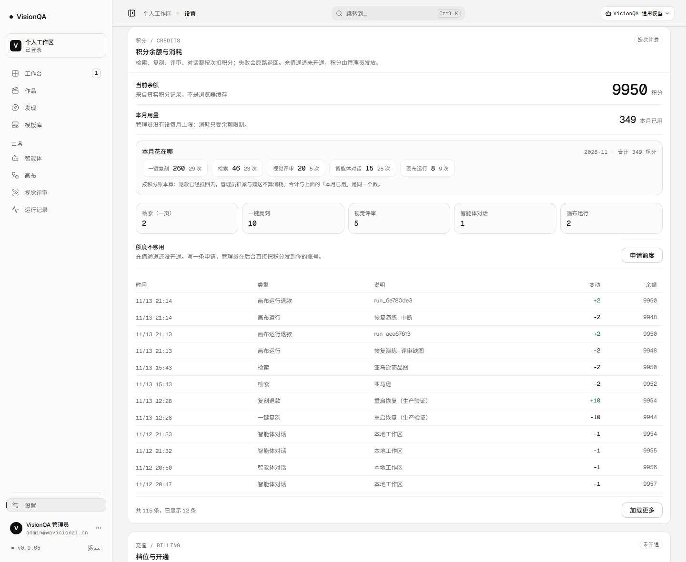

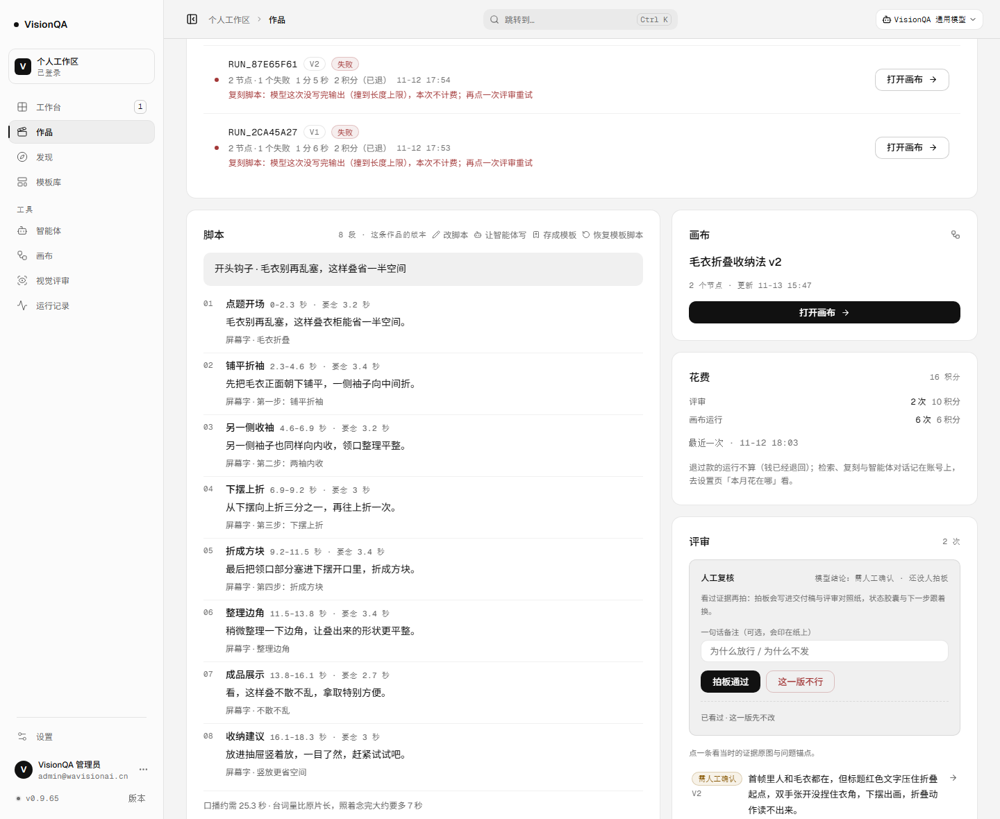

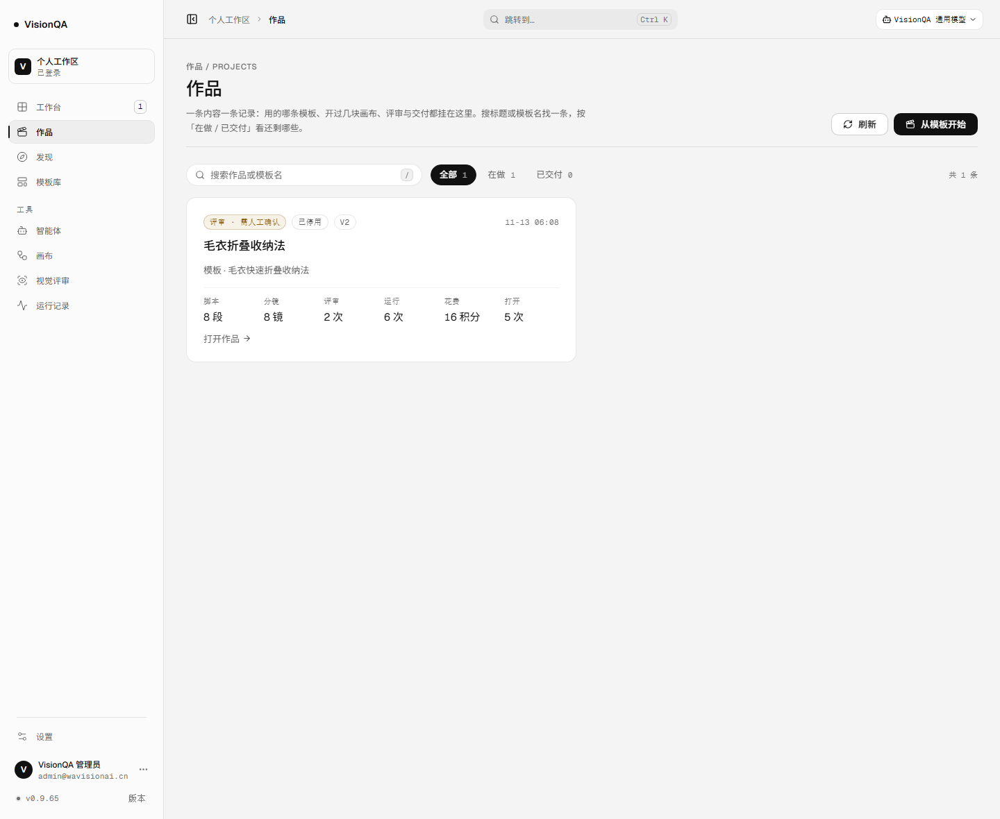

提交 `3ca7935`（代码 + 7 条测试 + 文档 + 3 张生产截图），CI 43468833243 success。

细节见 [钱花在哪](docs/spend-visibility-2026-11-13.md)。

## 一百三十四、花费能点开：哪一版、哪一次、哪几笔（v0.9.66）

- **问题**：上一版给了两个合计（账号本月 349、作品 16），但合计回答不了「这 16 是怎么来的」：哪几次评审、哪几次运行、哪一版最贵、这个月和上个月各多少。退过款的运行不算进合计又没地方看，人会先怀疑数字错了，再想起那次失败退了钱。
- **做法**：作品页「花费」多一个「明细」，**点开才读** `/api/projects/:id/spend`（合计仍随详情首屏返回，不多打一次请求）——
  - **按版本**：第几版、评审几次多少积分、运行几次多少积分、合计；「改一版花多少」直接看得见。
  - **逐笔**：时间、动作、第几版、评审结论或画布名、积分；退过款的那笔灰掉、金额划掉、标「已退回」，所以**逐笔（去掉退款）加总正好等于上面的合计**。
  - **累计 / 本月**两枚胶囊：本月按 **UTC 自然月**，与每月额度、后台成本页同一个口径；胶囊数字按全部记录算，切范围不缩水。
- **口径**：与 v0.9.65 的合计完全同源——评审读评审记录自己的成本，画布运行按这条作品当前画布 + 所有归档版本归集；运行次数与作品页「画布运行 N 次」同一个数（没扣积分的运行列出来、写「未扣积分」）；检索 / 复刻 / 对话仍记在账号上，不摊到作品。
- **生产实测**（v0.9.66c，入口 `index-D8kex-ij.js`）：作品「毛衣折叠收纳法」明细 **8 笔**，逐笔（去掉 3 笔退款）加总 **16 = 合计 16**；第 2 版 评审 2 次 10 + 运行 3 次 4 = **14**，第 1 版 运行 3 次 2 = **2**；「已退回 3 次共 6」；切「本月」= 11 月 **16 积分**（评审 10 + 运行 6）；手机 390 宽 `docScroll 390`、超宽节点 0、逐笔 8 行无溢出；控制台 0 报错。
- **验收**：`npm test` **581/581**（新增 `test/project-spend-detail.test.mjs` 5 条：逐笔顺序与退款标记、按版本、按 UTC 月份且退款不进月份、逐笔加总等于详情合计且运行次数一致、别人的作品 404 与乱写月份当累计）；oxlint 0 error / 7 warning、`tsc -b` 干净、构建通过。
- **边界**：明细只到「这条作品」；「本月」是 UTC 自然月不是本地日历月；逐笔最多列最近 120 笔；单位是积分不是钱；删作品会解绑评审，那几笔花费留在账号账本里。

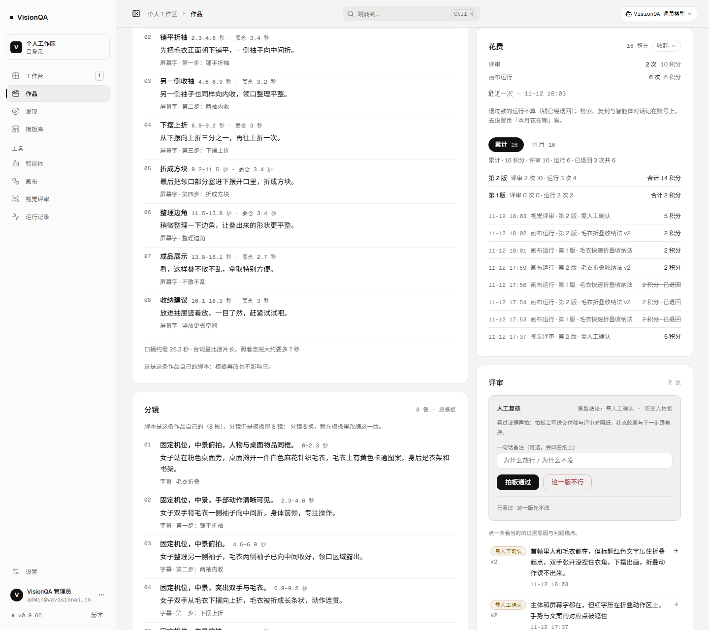

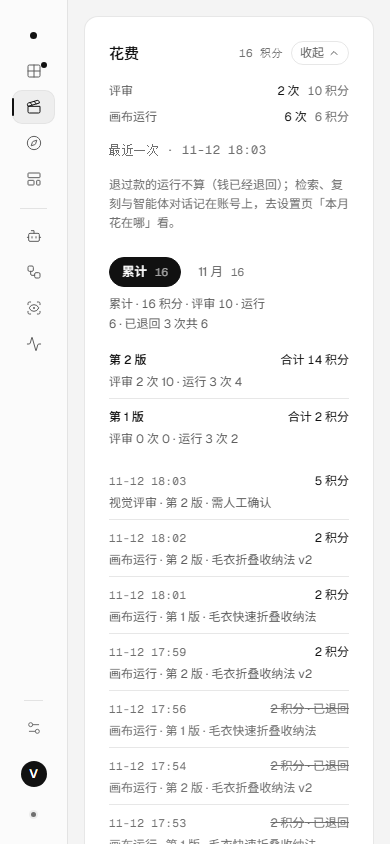

提交 `28c7a26`（代码 + 5 条测试 + 文档 + 2 张生产截图），CI 43472158773 success。

细节见 [作品的花费明细](docs/spend-detail-2026-11-13.md)。

## 一百三十五、上线就绪一屏看清，公示信息自己填（v0.9.67）

- **问题**：上线清单里的 P0 代码部分都做完了，剩下六项全卡在外部输入（定价与商户号、备案与主体、SMTP、告警 webhook、异地备份目的地、配额数字）。这些「还差什么」只活在一份 Markdown 里，要人去翻；其中备案号、主体、客服邮箱三项其实不需要凭据，却也要改环境变量再发一版。
- **做法**：
  - 后台总览新增「上线就绪」：**六道门**（定价与支付 / 备案与主体 / 找回密码邮件 / 告警外推 / 异地备份 / 每月额度）逐条现算，给出状态、缺什么、一句话说明，右侧按钮直接跳到要填的那一页。判定是纯函数，取数失败一律按「未配置」算——**读不到不会变成就绪**。
  - 后台「系统」新增「站点公示」：ICP 备案号、运营主体全称、联系地址、统一社会信用代码、客服邮箱、投诉与举报渠道，六项填完立刻生效，不用改环境变量、不用重启；环境变量 `VQ_ICP` / `VQ_SUPPORT_EMAIL` 仍作兜底，清空后台填写就回到环境变量。
  - 公开页跟着显示：工作台页脚、登录页（含找回口令的求助提示）、服务条款、隐私说明（运营主体小表 + 页脚）、帮助中心；**没填的项不显示**，页脚不摆空链接、隐私说明不摆空壳。
- **口径**：六项全部 `ready` 才会说「六项都就绪」；「定价与支付」因为支付通道确实没接，最多到「一半」（下单仍 501）；「每月额度」默认 0 = 不限，也只算「一半」。这是事实，不是进度条 bug。
- **生产实测**（v0.9.67b，入口 `index-S_o72fkM.js`）：`/api/version` 0.9.67、`/api/health` ok（模板 26）；未配时 `verdict=not-ready`、`还有 5 项没配`、`{ready:0, partial:1, todo:5}`，六道门顺序与去向都对；填入演示公示后 `source=admin / complete=true`，「备案与主体」转 `ready`、结论变「还有 4 项没配」，后台表单回填六值、胶囊「未填 → 已齐」，`/api/app` 的 `site` 六项齐全且隐私页出现运营主体 6 行；清空后 `source=none`、公开 `icp` 为空、`missing` 回到三项（**演示数据没有留在线上**）；390 宽就绪卡 `docScrollWidth 390`、行数 6、横向溢出 0；后台与公开页控制台 0 异常。
- **验收**：`npm test` **592/592**（新增 `test/site-info.test.mjs` 7 条、`test/readiness.test.mjs` 4 条：空目录与环境变量兜底、保存归一化与 0600、坏输入拒绝、清空回落、路由 403/读写/审计、纯判定六道门与「不报假绿」、逐项配齐后的结论）；oxlint 0 error / 7 warning（既有）、`tsc -b` 干净、构建通过。
- **边界**：公示信息是展示位，不等于备案通过；审计只记「填了哪几项」不记值；这一屏不替用户做决定，数字仍要用户给；支付通道未接前不会出现「可以收费了」。

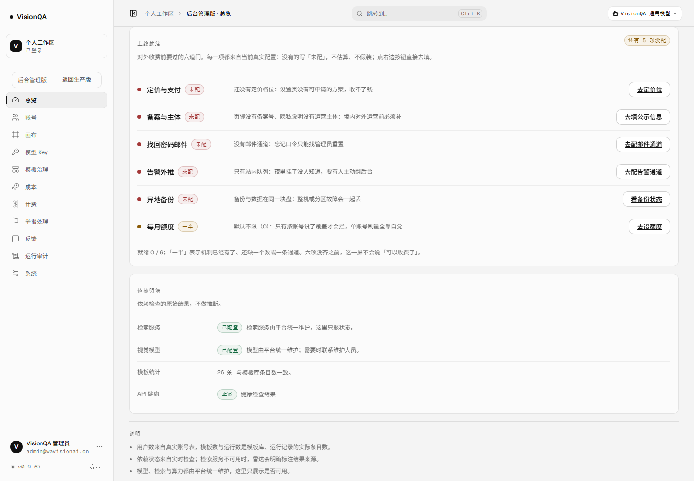

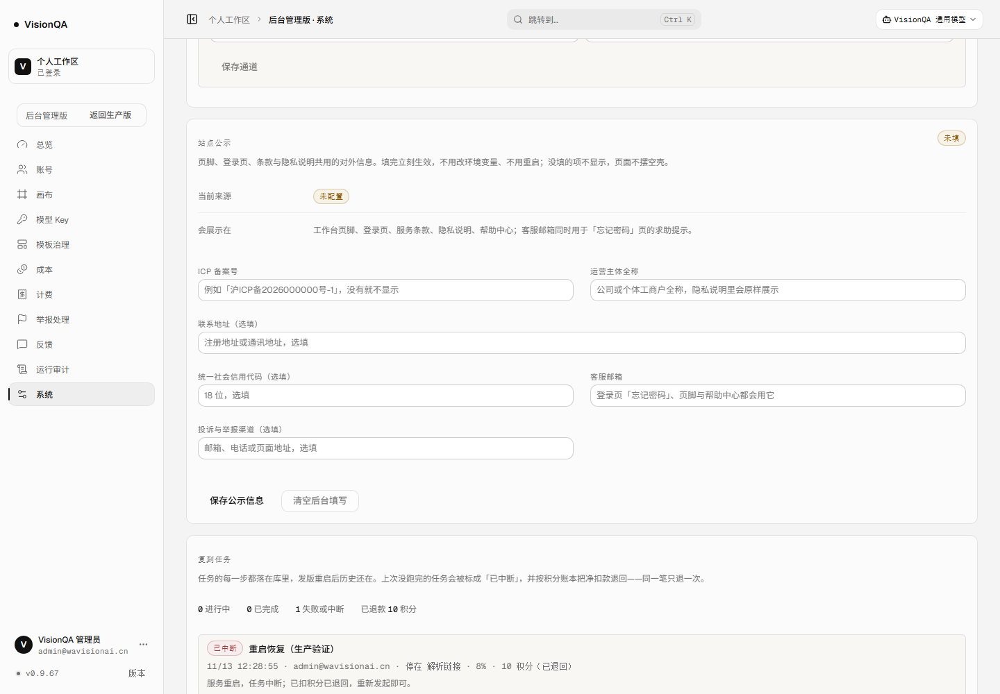

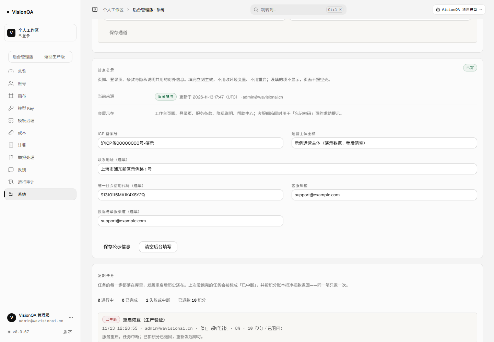

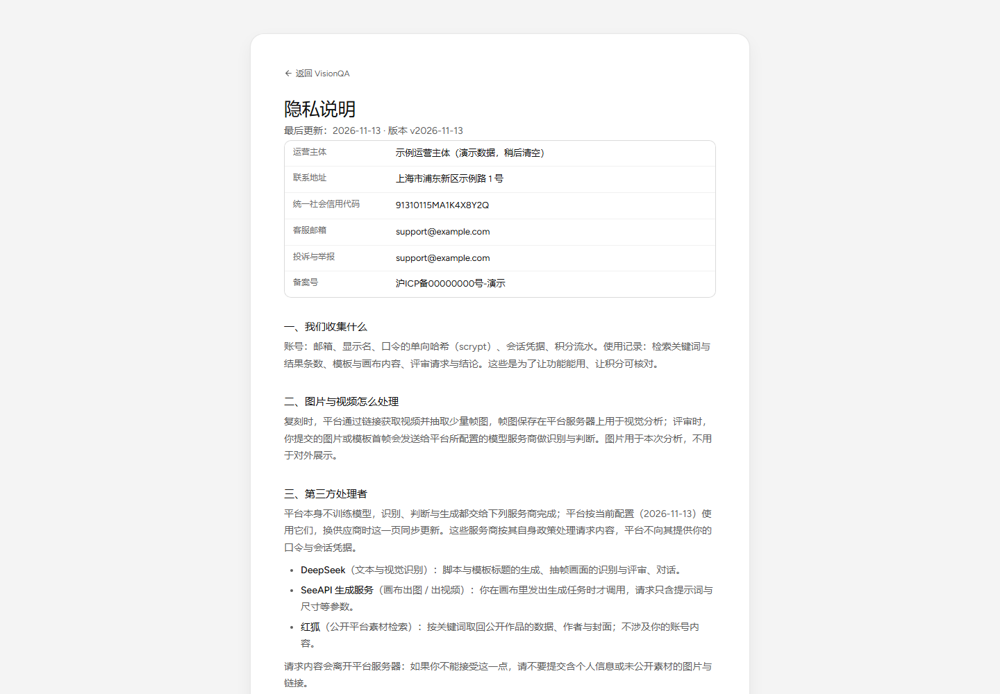

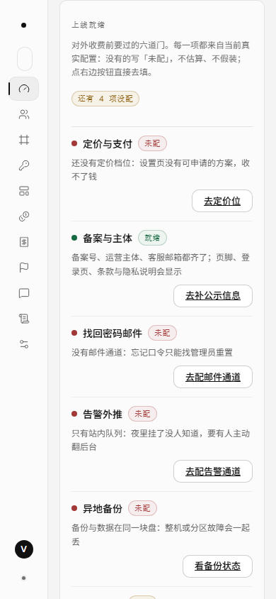

提交 `70a2ef5`（代码 + 11 条测试 + 文档 + 5 张生产截图），CI 43476962763 success。

细节见 [上线就绪与站点公示](docs/readiness-and-site-info-2026-11-14.md)。

## 一百三十六、素材占用上限：谁的帧图占了多少盘，到顶就不接新任务（v0.9.68）

- **问题**：帧图一直没有总量上限。一次复刻往服务器写十几帧图片，一个账号复刻几十条就是几百兆；而帧图、SQLite 与备份归档**在同一条磁盘上**（40 G 用掉 71%）。磁盘写满时坏的不只是一个账号——库写不进去、备份也写不出来。上线清单里的 B1 就是这条。
- **做法**：
  - 帧图按模板归属**算在创建人名下**（公共示例不记在任何账号头上），后台「系统 → 素材占用上限」一屏看到「谁、几个模板、占多少、上限多少」，还有「孤立帧图」——模板记录已经删掉、图还占着盘的目录，可一键清理（只删没有任何模板指向的目录）。
  - 上限是数据：默认 `0 = 不限`，可按账号单独覆盖，改完下一次复刻就按新数字拦，不用发版。
  - **闸门在扣费之前**：素材到顶时 `POST /api/replicate` 直接 429 `STORAGE_LIMIT`，不扣积分、不落任务、不碰来源链接；提示里写清「删掉不用的模板」与「找管理员放宽」两条出路。
  - 用户自己看得见：设置页「素材占用」显示已用与上限，80% 变黄、到顶变红；隐私说明的保留口径改成写实（帧图跟着模板走，彻底删除才释放）。
- **口径**：这是**软上限**——只在「已经到顶」时拒绝，不预测一次复刻要写多少兆，所以最多超出「一次任务」的量；日志、备份、SQLite 不计入；回收站里的模板仍算占用；画布出图暂不计入（真实生成还没验）。它不是「上线就绪」的第七道门，是运维护栏。
- **生产实测**（v0.9.68b，入口 `index-DgjMcNs0.js`）：`/api/version` 0.9.68、health ok（模板 26）；数据目录 21,088,735 B / 352 文件，帧图 18,830,661 B / 315 文件 / 25 个模板目录，磁盘余 11.85 GB；25 个目录全部是公共示例（管理员名下 0 B），`defaultMb 0`、孤立目录 0；设默认 200 MB 后胶囊 `不限 → 默认 200 MB`、行内上限与设置页文案同步，随后改回 0 并删掉 `storage-limits.json`（复查 `defaultMb 0 / unlimited true`、服务器 `no-limits-file`）；390 宽 `docScrollWidth 390`、页面无横向滚动；后台与设置页控制台 0 异常；**本轮零扣费调用**。
- **闸门怎么验的**：生产 25 个目录都是公共示例，管理员名下 0 B，设多少都不会「到顶」。所以用同一份代码在本地起一次性实例（临时 `DATA_DIR`）造一个 2 MB 帧图目录，实测：设 1 MB → `over:true / percent 100` → `POST /api/replicate` 返回 **429 STORAGE_LIMIT**、余额 100 → 100、没有任务落库 → 改回 0 恢复不限。
- **验收**：`npm test` **601/601**（新增 `test/storage.test.mjs` 9 条：默认不限、口径只算自己的模板、到顶拒绝与提示、按账号覆盖与恢复、坏输入拒绝、上限文件 0600、孤立目录清理不动活模板、后台接口与审计、用户接口只回自己）；oxlint 0 error / 7 warning（既有）、`tsc -b` 干净、构建通过。
- **边界**：软上限只拦「下次复刻」，不追溯已有内容；只算帧图；公共示例不计；回收站仍占盘；画布出图未接入；上限数字仍要运营决定，代码只负责如实拦。

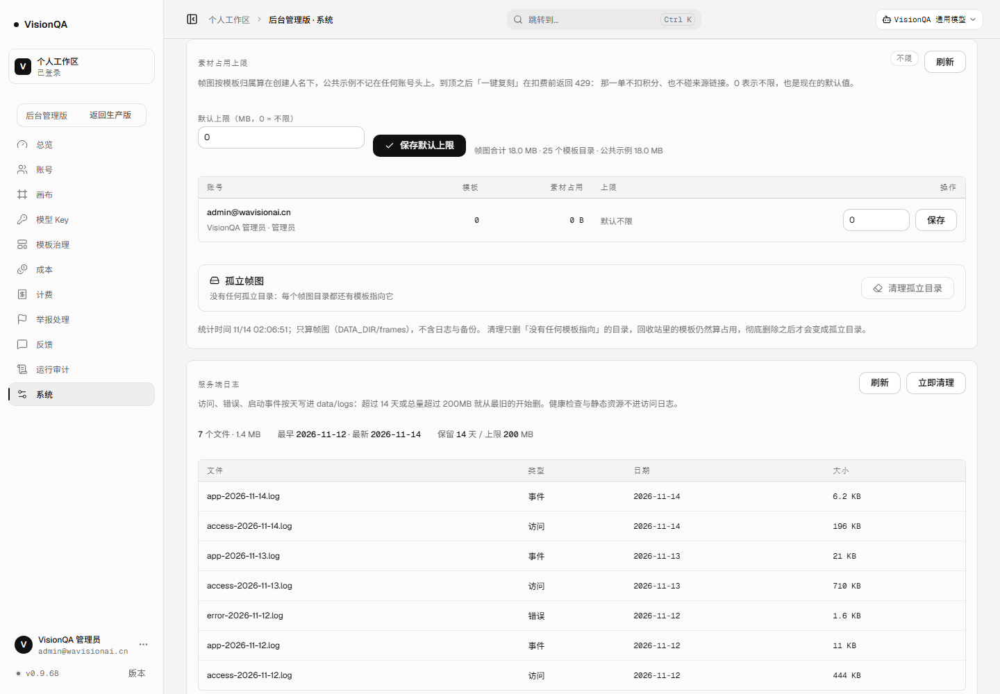

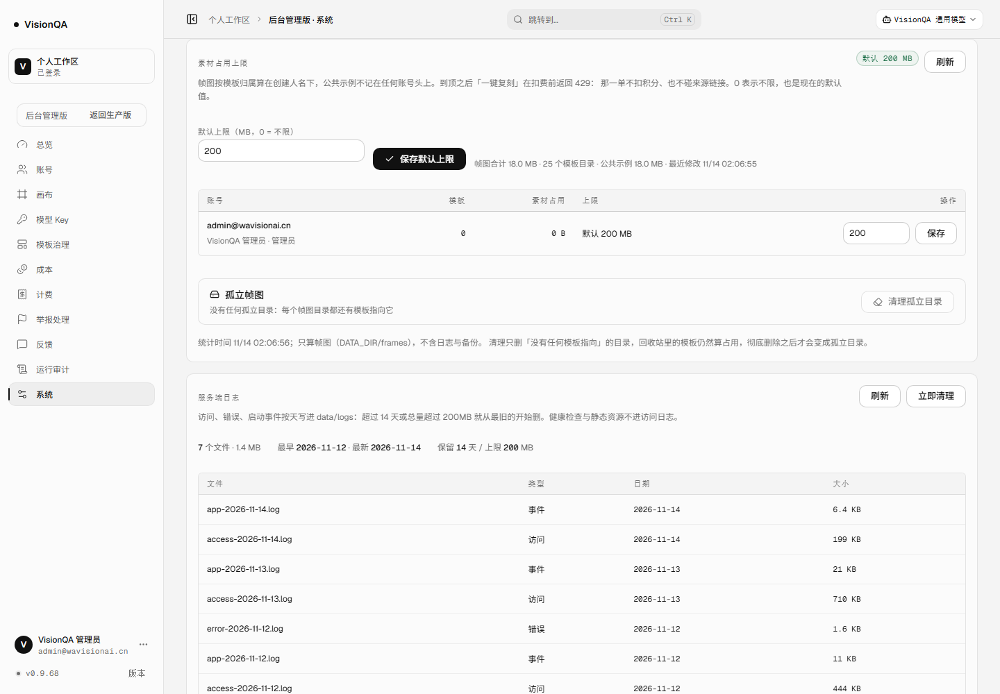

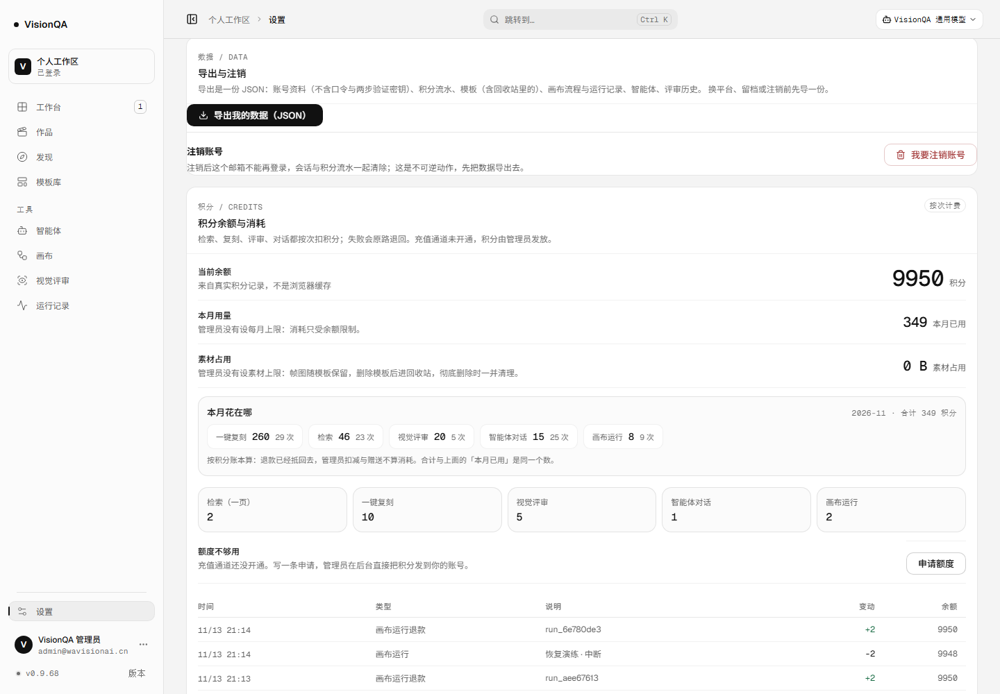

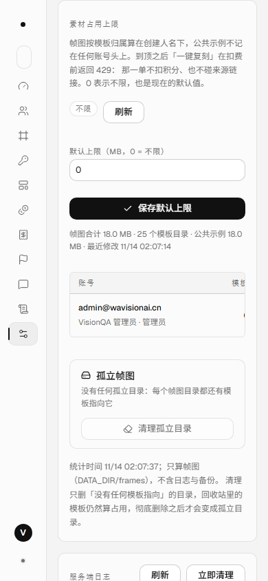

提交 `11a155b`（代码 + 9 条测试 + 文档 + 4 张生产截图），CI 43479834904 success。

细节见 [素材占用上限](docs/storage-limits-2026-11-14.md)。

## 一百三十七、运行水位：内存到红线就不接单，偏紧时重活降到 1 并发（v0.9.69）

- **问题**：上线清单的 **B2** 一直写着「复刻并发 2 会顶到内存」，但后台既没有内存读数，也没有任何闸门。这台机器是 **2 核 / 1.86 GB、swap 6 GB 已用 1.6 GB、Node 堆上限 384 MB**；一次复刻同时跑 ffmpeg 子进程与逐帧视觉，一次画布运行要下载并分析多张图——两条重活并行就够把内存顶穿。被顶穿时进程被内核或 V8 直接杀掉：**所有人的会话一起断**，正在跑的任务只能靠 v0.9.48 的中断恢复退款。钱退回来了，用户看到的却是「任务被系统中断」。
- **做法**：
  - **量**：系统可用内存取 `/proc/meminfo` 的 **MemAvailable**（含可回收缓存；MemFree 会把页缓存算成不可用，误判成快满了），进程堆取 **V8 的真实上限**，不拿 RSS 倒推。
  - **判 / 降 / 拒**：可用内存 < 128 MB 或堆 ≥ 92% → **红线**，复刻 / 评审 / 画布运行在**扣费前**返回 503 `MEMORY_PRESSURE`（提示写清「没有扣积分」，`retryAfterSec 60`）；< 320 MB 或 ≥ 80% → **偏紧**，重活并发压到 1。判定是纯函数，读数是注入的，测试不依赖跑测试那台机器的内存。
  - **可见**：后台「系统 → 运行水位」——可用内存、进程 RSS 与堆（带标签的细进度条）、CPU 负载、三档判定胶囊、三条重活的当前并发上限、判定口径与检查时间，全部来自服务端真实读数。
  - 真到红线拒绝时进站内告警（kind `memory`），5 分钟内只记一条，不按每次拒绝刷屏。
- **口径**：**只拦「已经到红线」，不预估单次任务要占多少内存**——同样是 18 帧，清晰度与模型批次能差几倍，估错就会拦错。阈值只读（后台没有「调高红线」的按钮），写 0 等于关掉那一条，`VQ_WATER_GUARD=0` 只量不拦。只拦三个付费重活，检索与对话不跟着拦。
- **生产实测**（v0.9.69b，入口 `index-BZI9mBvu.js`）：`/api/version` **0.9.69**、`/api/health` ok（模板 26）、部署后 0 个 5xx（**口径有误，第一百三十八节已改正**：当时是在服务器上用 `grep` 数状态码，模式 `,s.:5` 一条都匹配不到，0 是「没数到」而不是「没有」；改用 `scripts/log-status.mjs` 解析 JSON 重数，那一窗口 186 条访问记录确实全是 200、0 个 5xx）；`/api/admin/waterline` → `level ok`、可用 **859 MB / 1866 MB**、交换已用 **1624 / 6144 MB**、RSS **86–89 MB**、堆 **12 / 408 MB（3%）**、2 核 load1 **0.74**、并发上限 **复刻 2 / 评审 1 / 画布运行 1**（与配置一致，说明没触发降级）；390 宽 `docScrollWidth 390`、横向溢出元素 0、后台控制台 0 异常。
- **到红线怎么验的**：生产水位正常（闸门从未在线上拦过任务），所以用同一份代码起一次性实例、**把阈值抬到天上**走同一段逻辑：`critical` 时三条重活显示 **0 条**，`POST /api/replicate` → **503 `MEMORY_PRESSURE`**（提示含「没有扣积分」），余额 **100 → 100**、job 表 **0 → 0**、同一时刻检索照常 200；把阈值改成只触发「偏紧」时，复刻 **200 接单**、并发显示 1 条。
- **验收**：`npm test` **609/609**（新增 `test/waterline.test.mjs` 8 条：判定三档 / 阈值写 0 / 并发折算 / 真实读数 / 到红线拒且不扣费 / 告警节流 / 整条关掉 / 后台 403-200-无写入）；oxlint 0 error / 7 warning（既有）、`tsc -b` 干净、构建通过；**本轮零扣费调用**。
- **边界**：不是 worker 隔离（重活仍在同一进程里，靠降级而不是分机器）；「偏紧降到 1」是**每账号**的并发上限，**跨账号的全局并发还没管**；阈值是经验值，没做压测（B2 的「10 个并发不出 OOM」仍未做）；只拦三个付费重活，检索 / 对话 / 上传不在闸门里；拒绝时复刻草稿按「未扣费」直接撤掉，不留空任务。

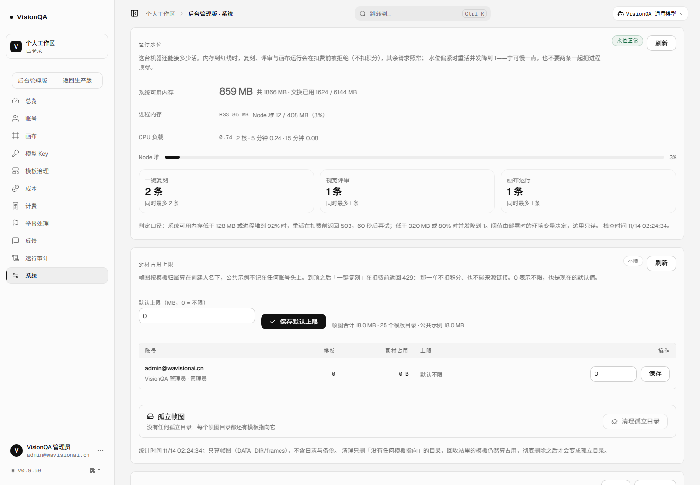

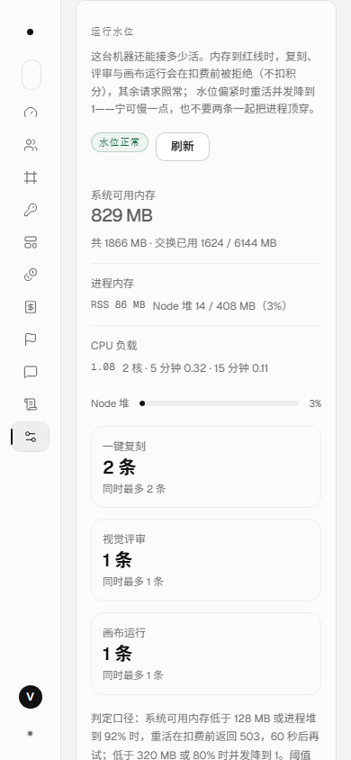

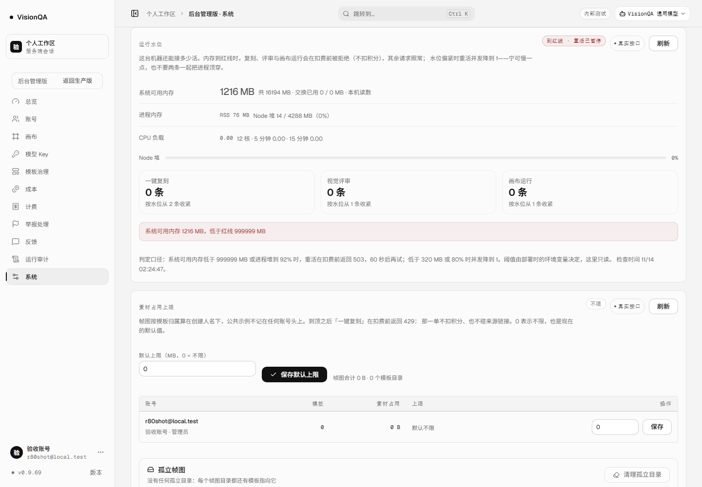

提交 `e70f763`（代码 + 8 条测试 + 文档 + 3 张截图），CI 43482810634 success。

细节见 [运行水位](docs/runtime-waterline-2026-11-14.md)。

## 一百三十八、全站重活上限：跨账号的并发也管住，顺手改正了数 5xx 的口径（v0.9.70）

- **问题**：v0.9.69 只做了「这台机器还剩多少内存」和**按账号**的并发（复刻 2 / 评审 1 / 画布运行 1）。它管不住最常见的那种超载：**两个账号各开两条重活**——按账号看每个都合规，合起来 4 条同时跑，2 核 / 1.86 GB 直接顶穿，进程被 OOM 杀掉时所有人的会话一起断。
- **做法**：在同一个闸门里再加一层**全站（不分账号）重活条数上限**。计数复用已有的进程内并发计数（`activeFor`），判定仍然只写在 `waterline.mjs` 一处；名额满了就在**扣费之前**返回 503 `SERVER_BUSY`（带 `active` / `limit` / `retryAfterSec: 60`，提示写清「没有扣积分」），不落任务、不调上游；任务真正结束时名额走**原来就有**的 `release()` / `onSettled` / `finally` 路径归还——没新增「忘了释放就永久卡死」的面。
- **为什么不会挤爆最后一个空位**：「看计数 → 判断 → 放行」和紧接着「计数 +1」在同一段**同步**代码里，中间没有 `await`，Node 单线程下不会切走。这条写法是刻意的：把中间改成异步就引入超额窗口。
- **口径**：默认上限 **3 条**（`VQ_GLOBAL_HEAVY`，写 **0 = 不限**，只关这一层）；水位偏紧时再折到 **2 条**；到红线时重活整体拒绝（v0.9.69 的行为不变）。只拦三个付费重活，检索 / 对话 / 上传不跟着拦。计数是进程内的：多机部署要换共享计数才叫全局。
- **生产实测**（v0.9.70b，入口 `index-C_vNDRy5.js`）：`/api/version` **0.9.70**、`/api/health` ok（模板 26）、两个服务 active；`/api/admin/waterline` → `level ok`、`heavy { active: 0, limit: 3, full: false }`、按账号并发 **复刻 2 / 评审 1 / 画布运行 1**、可用 **896 MB / 1866 MB**、RSS **85 MB**、堆 **12 / 408 MB（3%）**、2 核 load1 **0.10**；390 宽 `docScrollWidth 390`、横向溢出元素 **0**、控制台 **0** 异常；部署后 **186 条访问记录全 200、0 个 5xx**。
- **跨账号怎么验的**（一次性实例 + 本地假上游故意慢 20 秒，零扣费）：A 的画布运行在跑时 `heavy { active: 1, limit: 1, full: true }`，B 的 `POST /api/replicate` → **503 `SERVER_BUSY`**（「服务器正在同时跑 1 条重活（上限 1 条），这条任务没有开始（没有扣积分）」），B 余额 **100 → 100**、job 表 **0 → 0**；A 跑完后名额度归还，B 立刻 **200** 接单、`job_aacf870b`、扣 **10** 积分。
- **口径纠正（重要）**：上一轮报「部署后 0 个 5xx」用的是服务器上的 `grep -c -e ,s.:5`——真实字段是 `,"s":500`，那个模式**一条都匹配不到**，0 是「没数到」；去掉逗号写成 `s.:5` 又会误命中耗时 `"ms":52`。本轮加了 `scripts/log-status.mjs` 解析 JSON 按状态码统计：36 小时窗口 7933 条访问记录里 5xx 共 **11 条**（5 条 500 全在 11-12、2 条出图 502、4 条网关 503），**全部早于 v0.9.69 的部署时间**；v0.9.69 / v0.9.70 部署之后为 **0**。
- **验收**：`npm test` **616/616**（+7：全站名额满即拒 / 上限随水位折算 / 路由层跨账号拒绝且不扣积分不落记录 / 上限 0 不生效 / 访问日志按状态码统计三条）；oxlint 0 error / 7 warning（既有）、`tsc -b` 干净、构建通过；**本轮零扣费调用**。
- **边界**：不是 worker 隔离（重活仍在同一进程，靠少放几条进来）；上限 3 条是经验值，**没做压测**；计数是进程内的，多机 / 多 worker 场景还不覆盖；名额满不进告警（那是「忙」不是故障），真到内存红线才记 `memory` 一条。

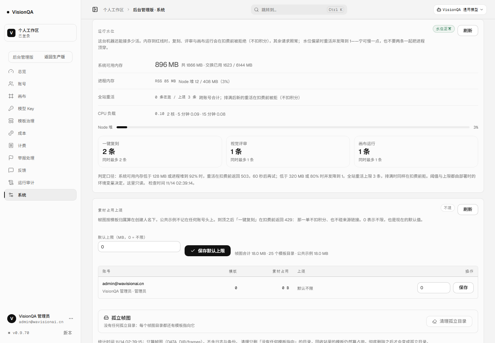

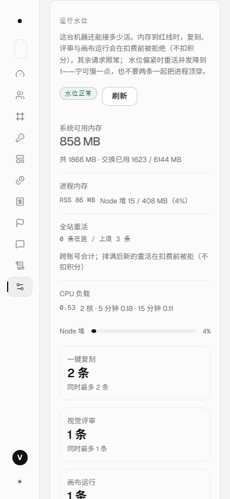

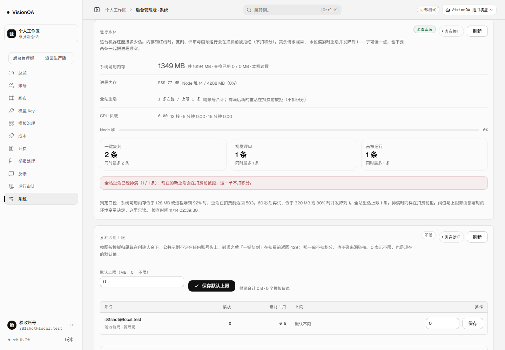

提交 `059549f`（代码 + 7 条测试 + 文档 + 3 张截图）+ 本条提交（提交号与 CI 号），CI 43485380843 success。

细节见 [全站重活上限](docs/global-heavy-2026-11-14.md)。

## 一百三十九、发版不再 502：把监听端口交给 systemd 握着（v0.9.71）

- **问题**：发版 = `systemctl restart` = 进程退出 → 端口关闭 → nginx 连不上后端 → 用户看到 **502**。上线清单 **B3「发布不中断」** 的验收标准就是「发版期间 0 个 5xx」，它以前是每轮发版都在发生的事。
- **做法**：用 **systemd socket 激活**。`visionqa.socket` 替进程一直握着 `127.0.0.1:8799`；重启只换进程、端口不断开，新连接进监听队列排队等新进程 accept。Node 侧只多一条判断：`LISTEN_FDS=1` 且 `LISTEN_PID` 是自己 → 用继承的 fd 3，否则照常 bind 端口（**两种方式都保留**，老部署不改也能跑）。
- **为什么不是双实例轮换**：两个 Node 进程共享同一个 `DATA_DIR`（JSON 存储 + SQLite），并发写互踩、定时任务跑两份。socket 激活是「一个进程 + 一个一直开着的端口」，不需要第二个写者。
- **实测（同一台生产机、同一个探针，100 ms 一次打 `/api/version`）**：

  | 方式 | 发版期间请求 | 失败 | 最长无响应 |
  | --- | --- | --- | --- |
  | 端口模式（旧行为，`systemctl disable --now visionqa.socket` 后重启） | 168 | **3 × 502**（18:55:10.745 / .885 / 11.045） | 570 ms |
  | socket 激活（`install-socket.sh` 之后**真发一版**） | 283 | **0** | 813 ms（请求排队，不是报错） |
  | socket 激活（再发一版 v0.9.71b 复核） | 255 | **0** | 864 ms |

- **切换与回退都不用登机器手改 unit**：`install-socket.sh` 幂等（写 unit → daemon-reload → 停应用让出端口 → 起 socket 单元 → 起应用 → 健康自检），**自检失败自动退回端口模式**；`deploy.sh` 每次发版前跑一次（失败只告警不阻断）；`install.sh` 让新装机器直接启用。回退：`systemctl disable --now visionqa.socket && systemctl restart visionqa`。
- **口径**：端口从此由 socket 单元决定（改 `API_PORT` 要连着改 unit，脚本会按 env 重写）；服务端日志的 `listen` 事件里带 `listen: "port" | "systemd-socket"`，一眼看出这次是怎么听的。
- **边界**：**在途请求仍会中断**（已经发出去、还在算的 40 秒复刻在旧进程退出时照样断，靠中断恢复退款收尾）——这一版解决的是「**新请求进不来**」，不是热更新；进程仍然只能有一个。
- **验收**：`npm test` **621/621**（+5：systemd 约定 / PID 不匹配 / 无 socket / 显式 fd / 日志口径）；oxlint 0 error / 7 warning（既有）、`tsc -b` 干净、构建通过；生产 `/api/version` 0.9.71、`/api/health` ok（模板 26）、`visionqa.socket` active、`ss` 里 8799 同时挂在 systemd 与 Node 上。**本轮零扣费调用**。

提交 `e36a6d7`（代码 + 5 条测试 + 文档 + 运维说明）+ 本条提交（提交号与 CI 号），CI 43487766874 success。

细节见 [发版不中断](docs/socket-activation-2026-11-14.md)。

## 一百四十、CI 安全扫描与 Node 版本锁：把「合并前」和「运行时」都钉住（v0.9.72）

- **问题**：上线清单 **B4** 一直只有 tsc / lint / test / build——Key 误提交、生产依赖出一个 high 漏洞，都要等出事才知道；**B9** 生产钉的是 Node **22.12.0**，CI 却只跑「22 的最新」，本机是 24.15，启动参数（`--experimental-sqlite`）漏了只会得到一句 `ERR_UNKNOWN_BUILTIN_MODULE`。
- **做法（B4）**：CI 多一个 `security` job：`npm audit --omit=dev --audit-level=high`（只看生产依赖，high/critical 即红）+ `scripts/scan-secrets.mjs`（11 类规则：私钥 / 云厂商 / GitHub / Slack / OpenAI / Google / JWT / 连接串口令 / 字面量赋值 / 全大写 env 赋值 / 被跟踪的 `.env`）。不引 gitleaks：要下二进制、组织账号要 license，本项目夹具里又全是假 Key——自己写反而能直接进单测（9 条）。
- **调参过程就是结论的一部分**：第一版跑全仓库 **79 处命中**（夹具 + `password: hash(…)` 表达式）→ 加「只认字面量 + 夹具目录豁免值类规则」后 **5 处**（`DATA_DIR=/var/lib/…` 这种路径）→ env 赋值的值不许带 `/` `.` 后 **0 处**。第一版如果直接交出去，第二次发版就会被人加 `|| true` 关掉。
- **做法（B9）**：`.nvmrc` = 22.12.0；`engines` `>=22.12.0 <25`；CI 矩阵 **22.12.0 + 24**（生产 + 开发，两个都绿才算过）；`install.sh` 装完 Node 先比版本（`sort -V`）；启动第一个 import 是 `server/node-guard.mjs`——太旧或 `node:sqlite` 加载失败就退出 **78**（EX_CONFIG）并指路 `ExecStart`，比 24 新只警告不拦。
- **矩阵第一次跑就抓到的东西**：`验证（Node 22.12.0）` 只跑了 **604 个测试、5 个文件挂掉**——`first-run` / `help-center` / `list-view` / `scroll` / `sessions` 都直接 `import '../src/domain/*.ts'`，而 **Node 内置的 TS 类型擦除是 22.18 才默认开的**。本机 24 和 CI 的「22 最新」都能跑，只有生产钉的 22.12.0 不行。修法是在测试脚本加 `--experimental-strip-types`（22.6 起可用、24 无害），**不是**为了测试把生产升到 22.18。
- **可见**：`/api/version` 登录后多 `runtime`（`node / min / level / supported`），后台「系统与版本 → 当前版本」显示「运行环境 Node 22.12.0 · 已验证」；匿名探针拿不到（Node 版本和启动时间一样属于部署细节）。
- **验收**：`npm test` **637/637**（+16：密钥扫描 9、Node 版本 7），CI 里 **22.12.0 与 24 都是 637/637**；`npm audit --omit=dev` **0 条**；`scripts/scan-secrets.mjs` **538 个文本文件 0 命中**（另用一把假 Key 在 `--staged` 下验过它会报、退出码 1）；oxlint 0 error / 7 warning（既有）、`tsc -b` 干净、构建通过；生产 0.9.72、登录后 `runtime.node` 22.12.0 `supported`、启动日志 `listen` 事件带 `"node":"22.12.0"`。**本轮零扣费调用**。
- **边界**：扫描只覆盖 git 跟踪文件；赋值规则只认字面量与全大写 env 赋值，短 / 纯字母口令会漏报；`npm audit` 只报已知漏洞；更新到 25+ 会继续跑（只警告），靠启动时 `node:sqlite` 探测兜底；CI 的 22.12.0 与生产同版本但不同机器。

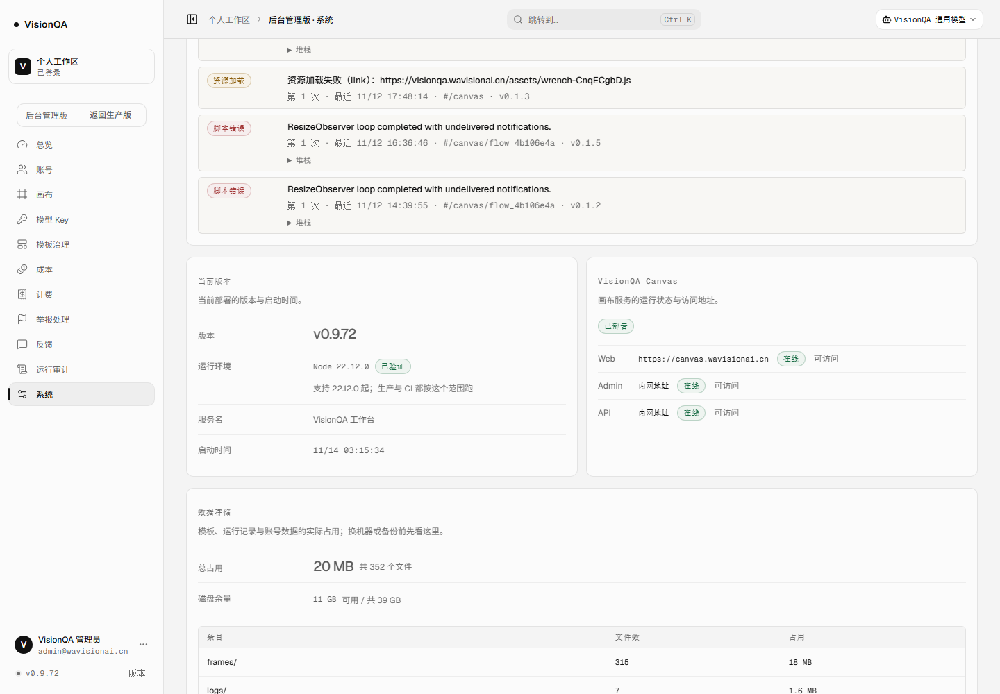

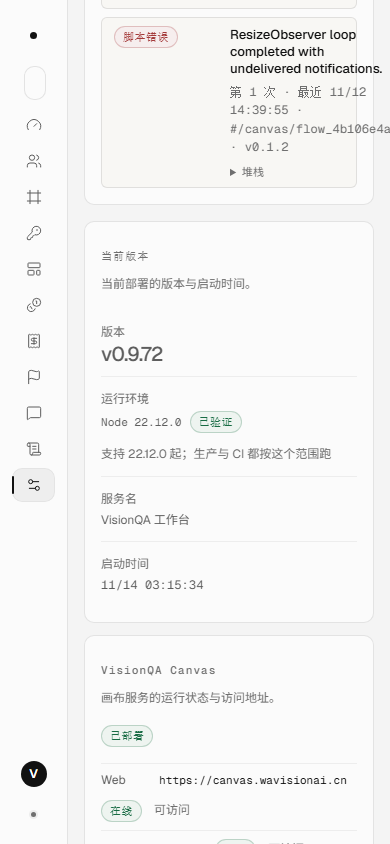

提交 `9f4cf5b`（代码 + 16 条测试 + 文档 + 2 张生产截图）+ `15061cb`（单测在 22.12.0 上跑）+ 本条提交（提交号与 CI 号），CI **43491423413** success（`验证（Node 22.12.0）` / `验证（Node 24）` / `安全扫描` 三个 job 全绿；第一次跑 `43490781275` 红在 22.12.0 的 5 个文件上，即上面那条）。

细节见 [CI 安全扫描与 Node 版本锁](docs/ci-security-and-node-lock-2026-11-14.md)。

## 一百四十一、10 个并发到底会不会 OOM：压测有了答案，入口也补上了（v0.9.73）

- **问题**：B2 从 v0.9.69 起就有「内存红线 + 全站重活上限 3 条」，但那个 3 是经验值，一直缺实测。这轮把「10 个并发会不会 OOM」真的跑了一遍。
- **答案一（会）**：关掉闸门、10 个账号同时提交评审、单图 17.9 MB（旧代码对素材没有任何上限）——第 17 秒 V8 堆顶到 384 MB 上限，`FATAL ERROR: Reached heap limit Allocation failed - JavaScript heap out of memory`，进程直接退出，10 个请求全断，健康探针 5.1 秒无响应。这就是「所有人的会话一起断」的真身。
- **答案二（现在不会）**：同样的机器、单图 8 MB、上限 3 条——10 个并发提交里 **3 进 7 拒**（503 `SERVER_BUSY`），堆峰值 **110 / 408 MB（27%）**，探针 p95 **114 ms**，实例存活、名额全部还回，被拒的不扣积分不落任务。
- **3 条的依据**：3 并发 × 8 MB = 27% 堆；关掉闸门做最坏情况，10 × 8 MB = **81%**（水位自动进 `tight`）；10 × 17.9 MB = **OOM**。复刻那条路的瓶颈不在堆（20-26 MB），在 ffmpeg 子进程：3 条 277 MB、10 条 **921 MB（≈92 MB/条）**，而机器只有 1866 MB、生产常驻 ~90 MB。
- **压测顺手挖出两个「一个请求就能打死进程」的入口，本轮修掉**：①`readBody` 无上限——整个 body 读进内存再 `JSON.parse`，67 处调用点共用，公开入口（前端异常上报、反馈）也在用，**不用登录**就能发一个 100 MB 的 JSON；②评审的 `readLocalMedia` 只校验路径不校验类型与大小——指到数据目录里的 160 MB 源视频就是一次 OOM。现在：请求体 **8 MB 硬上限**（content-length 先拒 / 流式再卡 / 4 倍断连接）、评审素材必须是 jpg/png/webp 且 ≤ 8 MB（扣费与占名额**之前**拒）。
- **拒绝的语义**：4xx 是我方拒绝，不再变成 500 —— 新增 `refusalResponse()`，日志记一条 `request.refused`，不触发 5xx 告警；67 处调用点一处没改。
- **实测（生产机 2 核 / 1866 MB / 堆 384 MB）**：评审 3 并发 2.5 → 8 → 17.9 MB 的堆峰值 11% → 27% → 56%；复刻 10 并发树峰值 1036 MB（ffmpeg 921 MB）。脚本 `scripts/loadtest.mjs` 自己起一次性实例 + 假上游（慢 4 秒），真请求、真抽帧、真读数，跑完自己判「放超过上限 / 拒绝原因不对 / 实例死 / 名额没还回 / 500 / 探针 > 5 s」。
- **生产验证**：素材是日志文件 → **415 `MEDIA_TYPE`**；素材 9 MB → **413 `MEDIA_TOO_LARGE`**；9 MB 请求体 → **413 `BODY_TOO_LARGE`**；余额 **9950 → 9950**（都在扣费之前被拒）；journal 里 3 条 `request.refused`、`"s":5xx` **0 条**；版本 0.9.73、入口 `index-x6MN43CQ.js`、runtime Node 22.12.0 supported、三个 unit active、8799 仍是 socket 激活。
- **验收**：`npm test` **656/656**（+19：压测 10、请求体 5、评审素材 4）；oxlint 0 error / 7 warning（既有）、`tsc -b` 干净、构建通过；**本轮零扣费调用**。
- **边界**：假上游只回固定 JSON（量的是入口与内存，不是模型准确率）；单机单进程，跨进程/多机计数仍未做；Windows 上量不到 RSS（脚本自动标 `unavailable`）；没测画布 `flow_run`（要真实上游额度）。

提交 `d3fc685`（脚本 + 两道入口闸 + 19 条测试 + 文档）+ 本条提交（CI 号），CI **43496257938** success（`验证（Node 22.12.0）` / `验证（Node 24）` / `安全扫描` 三个 job 全绿）。

细节见 [压测：10 个并发到底会不会 OOM](docs/load-test-2026-11-14.md)。

## 一百四十二、评审先缩图：8 MB 的图在发模型之前压到几百 KB（v0.9.74）

- **问题**：第 84 轮把「10 个并发会不会 OOM」量清楚了——会，而且真因是**送审字节数**：评审把图转成 base64 data URL 交给模型，一张 8 MB 的图在 V8 堆里占三份；3 并发 8 MB = 27% 堆、10 并发 8 MB = 81%、10 并发 17.9 MB = **FATAL OOM**。闸门只是把并发挡住，没有让单条评审变轻。
- **做法**：新增 `server/image-scale.mjs`，`reviewVisual()` 拿到图之后、送模型之前先缩：**长边 1600 px、JPEG q4、只缩不放大**；本地素材与外部图片地址两条路都过，插件服务那条也一样。超过 1.5 MB 才动，≤1.5 MB 连 ffprobe 都不起（复刻的 480px 帧图走这条快路径，不受影响）。
- **三个兜底**：ffprobe/ffmpeg 失败、超时、输出没变小 → **原样返回原图**（只记日志）；内容哈希缓存（`DATA_DIR/cache/review-images`，7 天 / 200 个文件）让同一张模板首帧只缩一次；像素超过 4000 万不碰（8 MB 的 JPEG 可以是一亿像素，让 ffmpeg 解它等于换一种方式打内存）。
- **顺带补一个同类的口**：插件服务那条路取外部图片以前是整段 `arrayBuffer` 下来之后才判 8 MB，现在与本地模型那条共用一个 `fetchImageCapped()`——先看 `content-length`、再流式累加、超限立刻 `cancel()` 并抛 413。
- **实测（生产机 2 核 / 1866 MB / 堆 384 MB，部署后的代码，假上游 4 s，零扣费）**：

  | 臂 | 缩图前（v0.9.73） | 缩图后（v0.9.74） |
  | --- | --- | --- |
  | 评审 3 并发 × 8 MB · 闸门开 | 堆 110 MB（27%）、p95 129 ms | **堆 19 MB（5%）**、p95 **9 ms** |
  | 评审 10 并发 × 8 MB · **闸门关** | 堆 332 MB（81%）、水位 `tight` ×8、p95 697 ms | **堆 58 MB（14%）**、水位全 `ok`、p95 **124 ms** |
  | 评审 10 提交 × 8 MB · 闸门开 | 3 进 / 7 拒，堆 110 MB、p95 114 ms | **3 进 / 7 拒**，堆 19 MB、p95 31 ms |
  | 复刻 3 并发 · 闸门开 | 堆 20 MB、树 385 MB、p95 76 ms | 堆 20 MB、树 380 MB、p95 66 ms（帧图走小图快路径，数字不变） |

- **上限 3 条没有动，而且仍然需要**：10 并发关闸那一行的进程树 553 MB 里有 **387 MB 是 ffmpeg 子进程**（缩图本身单条约 39 MB）——缩图把内存从堆挪到了子进程，全站上限同时兜住这两头。要抬上限得先做 worker 隔离或缓存预热，这轮没有动那个数。
- **生产验收**：版本 0.9.74、`/api/health` ok（模板 26）、单元 active；部署目录里有 `server/image-scale.mjs`；在**生产机自己的 Node 22.12.0** 上跑部署后的模块，3,145,728 字节 → **67,157 字节**（2400x1400 → 1600x933）；全部压测臂都在生产机上用 `systemd-run --scope -p MemoryMax=1300M` 单独跑，端口 8798、数据目录在 `/tmp`，不碰 8799 上的线上进程。**本轮零扣费调用**。
- **验收**：`npm test` **662/662**（+6：缩图判定/真缩/缓存/兜底/清扫 5 条 + 路由级「发给模型的 data URL 只剩几百 KB」1 条）；oxlint 0 error / 7 warning（既有）、`tsc -b` 干净、构建通过。
- **边界**：1600px 会让整屏截图里的小字变粗（坐标是相对的，不受影响；`VQ_REVIEW_MAX_EDGE` 可调到 2200）；PNG 透明通道会变黑（截图类没有透明区域）；**缩图前后的结论差异还没有证据**——没有真实模型授权，这条只能等一次授权后补；没测画布 `flow_run`。
- **回滚**：`VQ_REVIEW_MAX_EDGE=0` 关掉整条缩图（原图照旧送审），不需要回滚版本。

细节见 [评审先缩图](docs/review-image-downscale-2026-11-14.md)。

提交 `5f71fd7`（缩图模块 + 两条路的取图上限 + 6 条测试 + 文档）+ 本条提交（提交号与 CI 号），CI **43498823868** success（`验证（Node 22.12.0）` / `验证（Node 24）` / `安全扫描` 三个 job 全绿）。

## 一百四十三、评审证据从「有框」到「能对照」：编号 + 钉住（v0.9.75）

- **问题**：评审页把模型给的 bbox 画成了框，但框没有编号、只有鼠标悬停才亮、还是不可点的 `span`。5 条问题同时有框时（生产那条真实记录里 04 与 05 几乎重合），看的人说不清哪个框对应哪句话——「有证据」和「能复查」差的就是这一步。
- **做法**：新增纯函数 `src/domain/review-anchors.ts`，按**问题列表位置**给每个框编号（没有证据的问题不画框，但序号不跳，永远和问题行对得上）；框从 `span` 换成真正的 `button`，`aria-label` 带问题原文、`aria-pressed` 反映钉住状态；问题行加 `role="button"` + Enter/空格；**点一下钉住、再点一下或 Esc 取消**，钉住时其余框只压边框与底色，编号保留可读；窄屏钉住时把画面滚进视野（问题行在画面下方，不滚等于没点）。
- **顺手改掉一处会误读的文案**：`锚点 85%` 实际是模型置信度，改成 **`置信 85%`**（悬停有解释）。
- **生产实测（真实记录 `rev_af034805`，5 条问题 / 5 个锚点，只读不扣费）**：编号 `01–05` 与问题行完全一致；钉住第 2 条后只有它 `aria-pressed=true`、其余 4 个框压暗；Esc 后钉住 1 → 0、压暗 4 → 0；390 宽手机 5 个框、无横向滚动；0 条脚本异常、0 个失败请求；余额 9950 未变。
- **样式仍然走全站规范**：编号 16px 小方块（11px 等宽、`--radius-xs`）；第一版写的 `border-radius: 4px` 与 `font-size: 10px` 被 `test/design-grid.test.mjs` 直接拦下，改成 token 与 11px——这条老约束这轮抓到的就是我自己。
- **验收**：`npm test` **666/666**（+4：编号不跳号 / 0 尺寸框过滤 / 空输入 / 补零）；oxlint 0 error / 7 warning（既有）、`tsc -b` 干净、构建通过；生产 `/api/version` 0.9.75、入口 `index-Bkls6jhI.js`、health ok（模板 26）、三个 unit active。**本轮零扣费调用**。
- **边界**：重叠框没有做碰撞避让（截图里 04/05 的编号会挤在一起）；编号跟列表位置走；钉住只是查看状态、不写入评审记录；原图失效的记录仍显示「画面已经不在了」，锚点数据照旧保留。


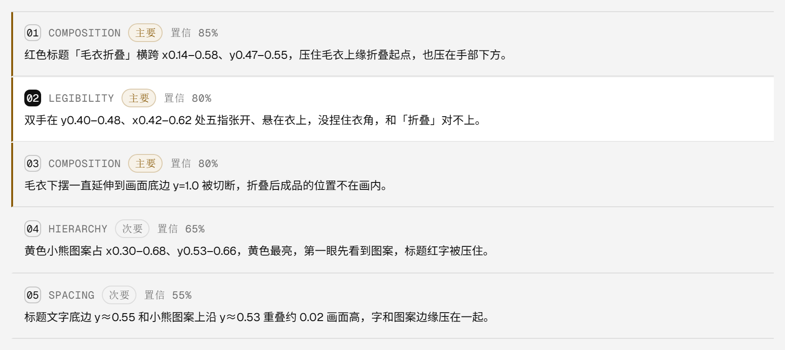


细节见 [评审证据能对照了](docs/review-evidence-anchors-2026-11-14.md)。

提交 `909294a`（编号与钉住 + 4 条测试 + 3 张生产截图 + 文档）+ 本条提交（提交号与 CI 号），CI **43502187522** success（`验证（Node 22.12.0）` / `验证（Node 24）` / `安全扫描` 三个 job 全绿）。

## 一百四十四、评审证据编号不再挤成一串：换角 + 错开（v0.9.76）

- **问题**：上一轮把框和问题行用同一套编号对上了，但编号**永远贴左上角**。生产那条真实记录（`rev_af034805`）里 04（小熊图案）与 05（标题底边）两个框几乎重合，两个编号都落在左上角，实测**相距 2px**——又是「说不清哪个是哪个」。
- **做法**：`src/domain/review-anchors.ts` 增加纯函数 `reviewAnchorBadges()`：按列表顺序**先试四个角**（左上→右上→左下→右下），撞了才换角；四个角都被占了，就朝**画面中心**方向每圈错开 20px（编号不会挪出画面）；真挤满时叠回左上角，宁可压住也不隐藏。样式只负责摆——角位四个 class、位移两个 CSS 变量（`--badge-dx / --badge-dy`，都有默认值）。
- **顺手补一条旁证**：问题行加 `面积 5.6%`（框住的宽×高占画面多少，悬停说明「框越小越能指到具体位置」），整屏时直接写「整屏」。它不是新结论，只回答一个问题：这条证据是指到具体一处，还是整屏都在框里。
- **生产实测（同一页面 A/B，真实记录 `rev_af034805`，只读零扣费）**：把编号类名全部钉回 `is-tl`（等于恢复 v0.9.75）量到 **04/05 相距 2px、压在一起**；新版 05 换到 `is-tr` 落在自己框的右边缘，**编号互压 0 对**。5 行面积 5.6% / 2.6% / 11% / 6.0% / 2.6%；钉住第 2 条仍只有它 `aria-pressed=true`，Esc 后钉住 1 → 0、压暗 4 → 0；390 宽手机 5 个编号、0 对互压、0 个出画面、`scrollWidth == innerWidth`；0 条 error 日志、0 个失败请求；余额 9950 未变。
- **验收**：`npm test` **673/673**（+7：换角 / 四角占满 / 第五个错开 / 朝画面中心 / 空输入 / 面积精度 / 面积文案）；oxlint 0 error / 7 warning（既有）、`tsc -b` 干净、构建通过；生产 `/api/version` 0.9.76、入口 `index-dd2WfieP.js`、health ok（模板 26）。顺手把 `review.css` 里三行写坏的历史注释换回正常中文。**本轮零扣费调用**。
- **边界**：只避让**编号**，框线本身重叠照旧叠着画（框是真坐标）；阈值按 546×896 这类常见画幅定，极宽/极窄画面可能提前换角；圈数上限 5，超过 20 个框挤一处仍会叠（但不消失）；面积按 bbox 外接矩形算，不扣遮挡；编号仍按列表位置走。


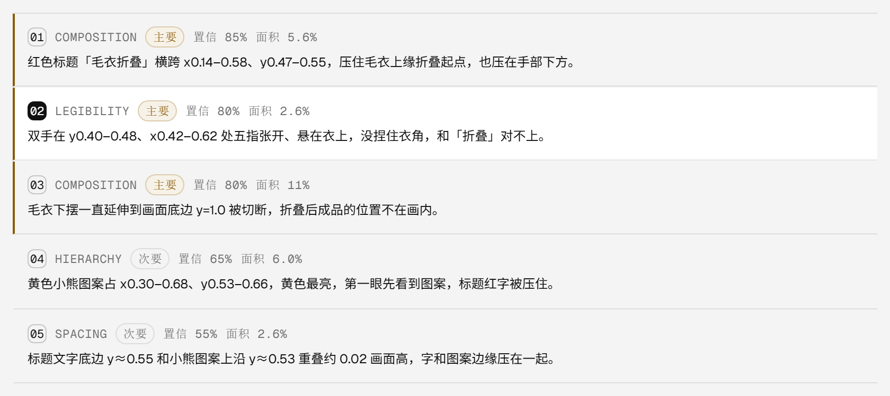

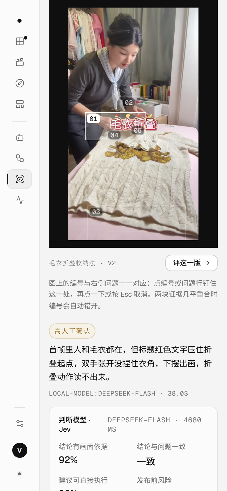

细节见 [评审证据编号不再挤成一串](docs/review-anchor-badges-2026-11-14.md)。

提交 `ffa6c18`（换角避让 + 面积旁证 + 7 条测试 + 3 张生产截图 + 文档）+ 本条提交（提交号与 CI 号），CI **43504302276** success（`验证（Node 22.12.0）` / `验证（Node 24）` / `安全扫描` 三个 job 全绿）。

## 一百四十五、评审重活搬进有上限的 worker 池：OOM 只死一单，不死整站（v0.9.77）

- **问题**：B2 最后一项——重活和 HTTP 服务共用一个进程、一个 384 MB 的堆。压测里 10 个并发大图评审曾把堆打爆、进程 FATAL OOM、所有人的会话一起断。v0.9.74 的缩图把「堆随字节涨」基本消掉了，但结构上仍然是「一个评审就能弄死整站」。
- **先试最直觉的方案，被数据否掉**：每单开一个 worker 线程、跑完就收。闸门关 + 10 并发 × 8 MB 实测：进程树 700 MB、健康探针 p95 **986 ms**（同进程只要 449 MB / 159 ms）——2 核机器上同时开 10 个 isolate，每个都要重新加载整套模块、都有自己的堆，代价全在这里。
- **改成池**：固定 `VQ_REVIEW_WORKERS`（默认 3，跟全站重活上限默认值一致）个 worker 复用，超出的排队。闸门关 10 并发：进程树 **361 MB**、主进程堆 **17 MB（4%）**、健康探针 p95 **19 ms**、10 单全部完成；闸门开（生产默认）3 进 7 拒、进程树 315 MB。worker 撞 `VQ_REVIEW_WORKER_MB`（默认 192 MB）只杀它自己、池补一个新的，请求拿到 503 `REVIEW_WORKER_OOM` 并退积分；超 `VQ_REVIEW_WORKER_TIMEOUT_MS`（默认 240 s）terminate，504 `REVIEW_TIMEOUT`。
- **代价写在明处**：生产默认条件下同进程是 193 MB / 15 ms，池是 315 MB / 52 ms——多出来的 120 MB 和 37 ms 换「单条评审 OOM 不再弄死整站」；52 ms 远低于 5 s 的可用性判定线，所以默认开，`VQ_REVIEW_ISOLATE=0` 可退回同进程（不用回滚版本）。
- **worker 里只有 INSERT**：评审每一步（缩图 / 模型 / 判断层）都在 worker；写库只有用量台账的 SQLite INSERT，`auth.db` 打开时加了 `busy_timeout = 3000`，两条线程同时写不会立刻 SQLITE_BUSY。
- **怎么确认它在跑**：`GET /api/review/health` 新增 `isolate`（enabled / heapMb / workers / timeoutMs / runs / ok / failed / pool{size,alive,idle,queued}）；路由级测试断言「这一单确实进了 worker」（`runs === 1`），同文件另有 `VQ_REVIEW_ISOLATE=0` 用例证明开关真能退回同进程且扣费不变。
- **验收**：`npm test` **682/682**（+9：隔离池 8 条 + 路由「退回同进程」1 条）；oxlint 0 error / 7 warning（既有）、`tsc -b` 干净、构建通过；生产 `/api/version` 0.9.77、入口 `index-DoNQ3EI0.js`、health ok（模板 26）、三个 unit active；所有压测臂都在生产机上用 `systemd-run --scope -p MemoryMax=1300M` 单独跑（端口 8798、数据目录 /tmp、假上游），**本轮零扣费调用**。
- **边界**：隔离挡「堆被单个请求吃掉」，挡不了「整机内存不足」——worker 与主线程同进程、同 cgroup，ffmpeg 子进程内存仍算整机总账（实测子进程峰值 78–126 MB）；池大小与全站上限是两处数，调大 `VQ_GLOBAL_HEAVY` 时要一起调 `VQ_REVIEW_WORKERS`；跨进程 / 多机全局计数仍未做。

细节见 [评审重活隔离](docs/worker-isolation-2026-11-14.md)。

提交 `091e783`（隔离池 + 路由接线 + 9 条测试 + 压测脚本 --isolate + 文档）+ 本条提交（提交号与 CI 号），CI **43507533828** success（`验证（Node 22.12.0）` / `验证（Node 24）` / `安全扫描` 三个 job 全绿）。

## 一百四十六、两个实例共用一个名额：重活计数从「每进程」变「整机」（v0.9.78）

- **问题**：生产机上是两个 Node 实例（对外 8799 + 内部版 8800，连 `DATA_DIR` 都不同）。「全站重活上限 3 条」和评审池「3 个 × 192 MB 堆」都是**每进程**的——叠起来最多 6 条重活、6 个 192 MB 堆压在同一台 2 核 / 1866 MB 上；而水位红线看的是整机，只有一条线。
- **做法**：共享目录里一条租约一个文件；`mkdir` 出来的目录锁里做「数一下 + 占一个」，跨进程就是原子的。进程被 SIGKILL 后名额按 pid 不在立刻归还（不用等超时）；活着的租约每 15 秒摸一次 mtime，30 分钟没动静按泄漏清；目录写不了 / 拿不到锁就退回进程内计数并标 `degraded`，`VQ_HEAVY_LEASE=0` 一键回到旧行为。
- **顺手修的口径**：匿名重活以前不经过 `enter()`，既不占全站名额、也不出现在「在跑几条」里；现在 admit 在用户判断之前，匿名重活同样占名额、同样计数。
- **怎么看见**：`/api/admin/waterline` 的 `heavy` 多了 `scope`（`lease` = 整机共用 / `process` = 退回进程内）和 `lease`（enabled / dir / total / byKind / otherPids / ttlMs / heartbeatMs / stats）；新增只读预检 `GET /api/admin/waterline/admission?kind=review|flow_run|replicate`，走和真实请求同一个 `admit()`，占到的名额立刻还回去——不扣积分、不调上游、不落记录。
- **验收**：`npm test` **693/693**（+11：租约 8 条 + 路由「另一个进程占满名额」1 条 + 预检接口 1 条 + 语法护栏 1 条）；oxlint 0 error / 7 warning（既有）、`tsc -b` 干净、构建通过（入口未变 `index-DoNQ3EI0.js`，这轮没有前端改动）。
- **踩到的坑（如实记）**：第一次部署带了**被截断的 `server/index.mjs`**——一次整文件写入把最后约 90 行吞掉了。692 条测试全绿（没有测试 import 它），**CI 的 oxlint 其实当场就报了错**（`server/index.mjs:1040:51 Expected } but found EOF`，run 43510322959 failure）——真正的问题是**我没等 CI 绿就部署**：`systemctl restart visionqa` 后 journal 立刻炸出 `SyntaxError: Unexpected end of input`，对外服务中断约 **86 秒**（05:25:22 → 05:26:48），`ops/rollback.sh` 回 0.9.77 才恢复。修好文件后补了一条**语法护栏**测试：用一次子进程（`--experimental-vm-modules` 的 `vm.SourceTextModule`）把 `server/` 与 `scripts/` 下每个模块解析一遍，0.8 秒——`npm test` 就能拦住，不用等 CI。这条失败记录留在 CI 历史里，没有删。
- **生产实测**（release `20261113-213240-r89-lease2`）：两个版本都 0.9.78、health ok（模板 26）、三 unit active、journal 无 error；`/api/admin/waterline` 的 `heavy.scope = lease`、目录 `/tmp/visionqa-heavy-leases-v1`、空闲 `total = 0`。在机器上用 root 另起一个 node 进程占 3 条 `review` 租约（pid 1460752）后，**跑在 visionqa 用户下的对外实例**读到 `active = 3`、`full = true`、`otherPids = [1460752]`，三种重活的预检全部 `503 SERVER_BUSY`、`active 3 / limit 3`（1–3 ms）；`kill -9` 后下一次扫描 `pruned = 3`、`active = 0`、预检回到 `ok`（1 ms），没等 30 分钟 TTL。余额 **9950 未变**（零扣费调用）。
- **边界**：只在同一台机器上互认（多机部署要真正的协调者，没做）；租约目录 0777 是为了让 `visionqa` 与 root 两个服务账号互相能写能删，租约内容不含用户数据（只有 pid / kind / 时间 / 主机名）；名额按请求算，不按 worker 槽位算——跨进程名额把「同时在跑的评审」压到 3 条，但 3 个 worker 仍可能全落在同一个进程里，槽位不跨进程复用。

细节见 [跨进程重活名额](docs/heavy-lease-2026-11-14.md)。

提交 `c732e02`（租约模块 + 闸门接线 + 11 条测试 + 预检接口 + 文档）+ `cc1eb3c`（修回被截断的 `server/index.mjs` + 语法护栏 + 文档），CI **43511541609** success（`验证（Node 22.12.0）` / `验证（Node 24）` / `安全扫描` 三个 job 全绿）；生产实测的文档提交 CI **43512077600** success。

## 一百四十七、最花钱的那条路补上了闸门：画布出图也占全站名额（v0.9.79）

- **问题**：画布的出图节点走平台服务令牌（`POST /api/gateway/v1/images/generations`），请求里没有账号，于是整套「按账号」的闸门全被绕过：不在 `ratelimit.mjs` 的规则表里、不过运行水位、不占 v0.9.70 的全站 3 条名额。画布点「批量出图」就是 8 个并发上游请求，而这是**唯一每条都要上游付费**的入口——令牌泄露或画布重试死循环时，没有任何东西限制一分钟花多少钱。
- **现成件**：限流表（按 IP + 桶）、`waterline.admit`（v0.9.78 起本身就是跨进程占名额）、`capacityFor`（按水位折并发）。零新依赖。**放弃**：画布侧自己限（另一个服务，漏一版就等于没有）、网关内进程内信号量（生产两个实例只能管一半）、引队列 / Redis（为「同时最多 2 张图」加一个常驻组件不划算，排队还是产品决定）。
- **做法**：新重活类型 `canvas_gen`——同步出图、异步建任务、出视频建任务三条 POST 入口先占名额，占不到就在**调上游之前**回 503（这单不花钱）；两层名额：整机 3 条（`VQ_GLOBAL_HEAVY`）+ 这一类整机上限 `VQ_CONCURRENCY_CANVAS_GEN`（默认 2），两种「满」分开报（`kindFull`）；入口限流 `POST /api/gateway/*` 每分钟 20 次（第 21 次 429 `RATE_LIMITED`、`bucket: gateway`），GET 探活与轮询不限；后台运行水位卡多一行「画布出图 · 2 条 · 整机同时最多（没有账号可限）」，预检 `?kind=canvas_gen` 回 `kindFull / kindActive / kindLimit`，租约统计多 `kindRefused`。
- **生产实测**（release `20261114-060800-r90-canvas`，一次性实例 + 假上游，**零扣费**，余额 9950 未变）：10 并发出图，闸门开 → 200×**2** / 503×**8**、上游被调用 **2** 次、上游并发峰值 **2**、进程树 86 MB、堆 14 / 408 MB、探针 p95 111 ms、0 失败；闸门关（旧行为）→ 200×10、上游被调用 **10** 次、并发峰值 10。真实例上：root 占 2 条 `canvas_gen` → 预检 503 `kindFull: true`、`kindActive 2 / kindLimit 2`，同时 `review` 仍 ok；再占 1 条 `flow_run` → 整机 3 条满，所有类型预检 503、报告 `byKind {canvas_gen: 2, flow_run: 1}`；`kill -9` 后 0.6 秒回到 ok、租约目录 0 个文件。限流 21 次 POST：前 20 次 401、**第 21 次 429 `bucket: gateway`**，上游一次都没被碰。
- **验收**：`npm test` **699/699**（+6：名额排满不碰上游、归还、两层拒绝分开、跨进程、限流第 21 次、401 先于名额）；oxlint 0 error / 7 warning（既有）、`tsc -b` 干净、构建通过、密钥扫描 571 文件 0 命中。入口 `index-DhK7LqTL.js`。
- **踩到的坑（如实记）**：① 假上游把 `stats.calls += 1` 放在 `req.on('end')` 里，图片分支在它之前就 `return` 了，第一次跑出来是「放行 2 张、上游被调用 **0** 次」——只看放行数会当成通过，是压测自判里「上游调用数必须等于放行数」把它抓出来的；② 加了第四类重活后原来的固定三列栅格让「画布出图」单独占一行（DOM 断言看不出来，真截了一张图才发现），改成 auto-fit + 980/720 断点；③ 顺手修了一条脆测试：告警投递「1 秒慢接收端、断言 < 500 ms」在并行跑全量时偶发超时，改成让接收端压着响应、由用例放行。
- **边界**：令牌泄露仍能每分钟刷 20 次（限的是花钱速度，不是身份；出事要轮换 `VQ_GATEWAY_TOKEN`）；异步出图与出视频只在建任务那一下占名额，任务在上游排队不占本机名额；画布批量 8 张会 2 过 6 败——排队要在画布侧做；名额仍只在同一台机器互认。
- **回退**：`VQ_CONCURRENCY_CANVAS_GEN=0`（只关同类上限）、`VQ_GLOBAL_HEAVY=0`、`VQ_WATER_GUARD=0`，整套走 `ops/rollback.sh 20261113-213240-r89-lease2`。

细节见 [画布出图名额](docs/canvas-gateway-admission-2026-11-14.md)。

提交 `4cd7dbd`（通道名额 + 限流 + 6 条测试 + loadtest `--kind=canvas` + 文档）+ `929eee3`（四类重活排成一行），CI **43516352416** success（`验证（Node 22.12.0）` / `验证（Node 24）` / `安全扫描` 三个 job 全绿）；栅格提交 CI **43517359519** success。两道都是绿了才部署：`20261114-060800-r90-canvas` → `20261114-063000-r90-canvas2`。

## 一百四十八、画布出图名额满了先排队：一批 8 张不再 2 过 6 败（v0.9.80）

- **问题**：v0.9.79 把画布出图纳入整机名额后，副作用随即出现——一次「批量出图」8 张，整机只放 2 张，第 3 张起**立刻** 503，画布上就是「2 张成功、6 张失败」。失败不是资源不够，是**没有人等**：上游只是忙，十几秒后名额就空出来了；而画布其实等得起（同步出图超时 1800 秒、异步建任务 120 秒）。
- **现成件**：`admit()` 本来就是「判一次 + 占一个名额」的同步函数（失败不留状态，直接拿来轮询）、`kindLimitFor` 已算出这一类能放几条、v0.9.78 的跨进程租约保证排队期间每次重试都是真占名额。零新依赖。**放弃**：画布侧排队/重试（另一个仓库、另一份部署，且平台保护不该依赖调用方的自觉）、引 Redis/队列服务（为等几十秒加一个常驻组件不划算）、把同类上限调回 8（等于恢复旧样子，还把评审饿死）。
- **做法**：名额满时先排队（`VQ_CANVAS_QUEUE_MS` 默认 90 秒，0 = 退回立刻拒），每 ~350 ms 带 0–120 ms 抖动重试一次；排队位本身有上限（`VQ_CANVAS_QUEUE_MAX` 默认 8，满了立刻 503 `queueFull`）；内存到红线不排队、排队期间掉红线立刻收手；客户端断开就退出排队（不写响应、不调上游、排队位收回）；排到的请求带 `X-VQ-Queue-Ms`；只有「没有账号可挂」的画布出图这一类排队（其它重活有账号，客户端重试更合适）。后台运行水位卡的「画布出图」多一行「排队 0 / 8 条 · 满了先等 90 秒」。
- **生产实测**（一次性实例 + 假上游，零扣费，管理员积分余额 9950 未变；release `20261113-222442-r91-queue` → `20261113-222744-r91-queue2`，版本 0.9.80、入口 `index-DsA0BU0f.js`）：同一批 8 张——排队开 **200×8**、6 条排过队、最长等 **4867 ms**、上游被调用 **8** 次、并发峰值 **2**、进程树 102 MB、堆 17 / 408 MB；排队关（v0.9.79 行为）**200×2 / 503×6**、上游被调用 **2** 次、进程树 87 MB。两条边界臂（等待上限 400 ms、排队位 2 条）按设计在调上游之前拒（上游一次没被碰），压测自判因此不通过——那是预期的。生产实例报告 `heavy.queue {waitMs 90000, maxWaiting 8, waiting 0}`、版本 0.9.80、health ok（模板 26）、三个 unit active、journal 无 error、名额目录 0 个文件。
- **验收**：`npm test` **706/706**（+7：排队后出图、排队位满、等超时、客户端断开、`waitMs=0`、只有画布出图排队、压测判定）；oxlint 0 error / 15 warning（仓库既有）、`tsc -b` 干净、构建通过、密钥扫描 573 文件 0 命中。
- **踩到的坑（如实记）**：① 等待超时的文案把 400 ms 写成「排队等了 **0 秒**」——真跑边界臂才显示出来，改成「小于 10 秒保留一位小数（0.4 / 1.2 秒），否则取整（90 秒）」并补了断言；② `systemd-run --scope` 不允许再配 `--wait`（`--wait may not be combined with --scope`）；③ ssh 里嵌 `node -e` 的引号会被 PowerShell 吃掉，改成把整段 bash base64 后 `ssh "echo <b64> | base64 -d | bash"`；④ 压测判定一开始会把排队臂判成失败——「放行 8 条 > 同时上限 2 条」是合法的（多出来的在服务端排着），判定里加了「排队臂」前提并补了单测。
- **边界**：排队位是**本进程**的（两个实例各 8 条在等，整机最多 16 条；占名额仍走共享租约，不会超放）；90 秒不是万能——8 张 × 上游 40 秒时最后两张会等超时（仍然不花钱），要调 `VQ_CANVAS_QUEUE_MS` 但别超过 120 秒（异步建任务的上游超时）；排队不省钱也不提速，上游并发仍是 2 条、入口限流仍是每分钟 20 次；画布看不到「前面还有几张」；多机仍未做。
- **回退**：`VQ_CANVAS_QUEUE_MS=0`（关掉排队 = 立刻拒，不用回滚版本）、`VQ_CANVAS_QUEUE_MAX=0`，整套 `bash /opt/visionqa/ops/rollback.sh --to 3`。

细节见 [画布出图排队位](docs/canvas-queue-2026-11-14.md)。

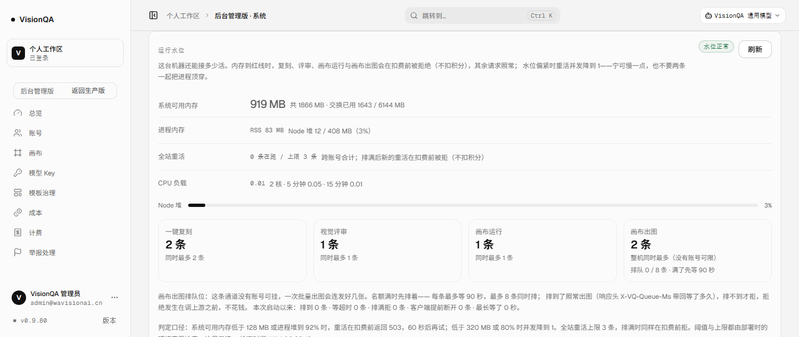

提交 `d78a352`（排队位 + 6 条测试 + 压测 `--queue` + 文档骨架）+ `1f156ef`（超时文案「0 秒」→ 0.4 / 1.2 秒），CI **43518917193** / **43519334454** success（`验证（Node 22.12.0）` / `验证（Node 24）` / `安全扫描` 三个 job 全绿）；两次部署都是等 CI 绿了才发：`r91-queue` → `r91-queue2`；文档提交 CI **43519832412** success。


## 一百四十九、按次算账：一次检索 / 复刻 / 评审赚多少，谁在倒贴（v0.9.81）

- **问题**：定价一直卡着，但卡住的不是「价格数字」——是**没有一张能把钱算出来的表**。档位表只会说「多少钱换多少积分」；成本页（v0.9.58）只会说「平台花在哪个能力」；积分页还特意写着「积分是虚拟倍率，不折钱」。三张表摆在一起，也回答不了「一次复刻赚多少」。
- **现成件**：v0.9.58 的 `usage_events`（每条带 token / 张数 / 秒数）与管理员填的上游估算单价、v0.9.63 的档位（多少钱换多少积分）、v0.9.64 的每月额度，都是现成的；这一轮只是把三者连起来做一次换算。零新依赖。**放弃**：把积分直接当钱（等于凭空造汇率，和档位定价冲突）、让成本页顺带算收入（「未定价」会指代不清）、等真实上游单价齐了再做（那又是一轮「等外部输入」）。
- **做法**：新增只读接口 `GET /api/admin/pricing/estimate`（管理员）+ 后台「计费」页的「按次算账」卡片。汇率只有一个来源：手填 > 指定档位 > 最划算的一档（默认取最便宜是故意的，收入宁可低估）；成本仍走 `usage_events × 估算单价`，分母只数「带用量」的调用（`measuredCalls`，回填条目只有次数，算进分母会把一次成本摊薄成假的）。算不出来就写「未定价 + 为什么」：只有历史回填 / 没有可折算的用量 / 窗口没这类调用，**不写 0.00**（0 成本会让每行毛利率变成 100%）；窗口内一次带用量的调用都没有时，总量收入与毛利是 null 而不是 0。画布出图 / 出视频不扣积分却有成本，单独成行标「倒贴」并按张 / 秒摊。
- **本地验收**（本地演示数据，17 次带用量的调用 + 两档定价）：检索 80% / 复刻 **30%** / 评审 94.8% / 对话 84% / 画布运行 **−20%（收钱还倒贴）** / 画布出图 ¥0.28 一张、出视频 ¥0.06 一秒全倒贴；合计收入 ¥2.95、成本 ¥2.72、毛利 +¥0.23，其中 ¥1.76 来自不扣积分的两行。这张表当场答了两件一直在猜的事：复刻是收费动作里毛利率最低的（10 积分折 ¥0.50，示例成本 ¥0.35），画布运行收 ¥0.10 却花 ¥0.12。
- **生产实测**（v0.9.81，release `20261113-224456-r93-pricing` → `20261113-224557-r93-pricing2`，入口 `index-Bi2s3PIl.js`）：无档位时 `rate.source = none`、整表不出钱；临时加一档「验收用档位」¥50 / 1000 积分后，`rate = ¥0.05 / 积分`、折算收入逐行算出来了（检索 ¥0.10、复刻 ¥0.50、评审 ¥0.25、对话 ¥0.05、画布运行 ¥0.10），但**每一行的成本都是「未定价」**——生产 89 条用量全是被回填的「只有次数」，`measuredCalls = 0`。再填一组临时估算单价（8 个字段全给）**结果完全不变**：填了单价也不会把 0 token 的调用摊成 ¥0.00 成本，这是本轮最重要的一条验证。验完删档位、单价清回 0（`plans 0`、`priced false`、审计四条写入记录在案），**余额 9950 未变**——这一轮没有任何真实调用。两实例同版本、health ok（模板 26）、三个 unit active、journal 无 error。
- **验收**：`npm test` **712/712**（+6：`test/pricing.test.mjs` 汇率来源 / 每次毛利手算 / 无汇率 / 只有回填 / 端到端 / 路由权限）；oxlint 0 error / 15 warning（仓库既有）、`tsc -b` 干净、构建通过、密钥扫描 575 文件 0 命中。
- **踩到的坑（如实记）**：① 有汇率但窗口里一次带用量的调用都没有时，「窗口收入 ¥0.00」会被读成「真的收了 0 元」——改成 null + 一句人话，为此多发了一版（`r93-pricing2`）；② 画布出图最初按「请求」摊成本，一次请求 2—3 张会把「一张多少钱」抹平，改成按张 / 秒；③ PowerShell 5.1 里 `??` 与 `&&` 混写直接 SyntaxError（清场脚本编译期就挂，没有半截写入）；④ 部署后本地实例还跑着旧模块，第一次截图看到的是旧服务端算出的旧数字——截图前先重启再截。
- **边界**：收入是「积分 × 档位汇率」的理论值、成本是「用量 × 你填的估算单价」，两者都不是账单，支付也没接；生产现在没有可用数据（89 条全是回填），真实毛利率要等一次真实出图 / 评审（要你点头）；画布出图 / 出视频仍不扣积分，这轮只把它显性化；没有按账号 / 渠道的差异化定价、阶梯价；窗口最多 90 天；画布服务端自己的 LLM 节点不在表里。
- **回退**：`bash /opt/visionqa/ops/rollback.sh --to 2`（列表第 2 个 = 部署前给 0.9.80 打的快照）。

细节与口径见 [按次算账](docs/unit-economics-2026-11-14.md)。

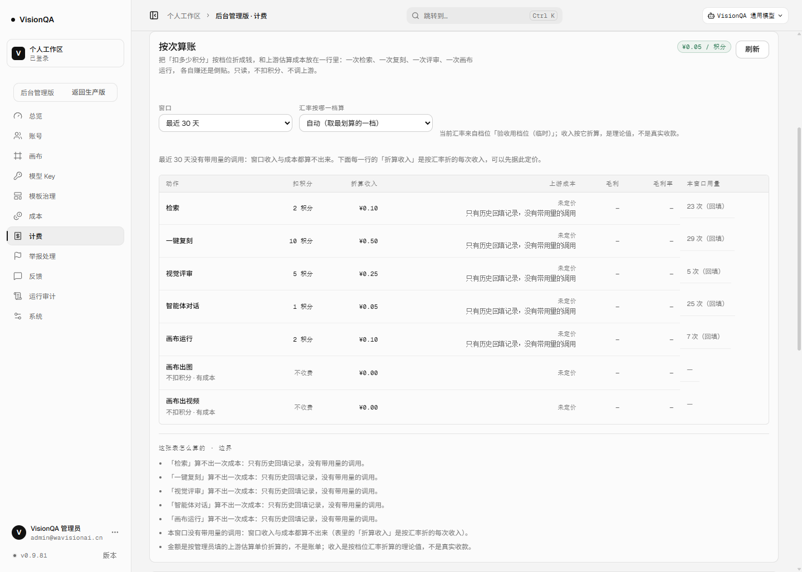

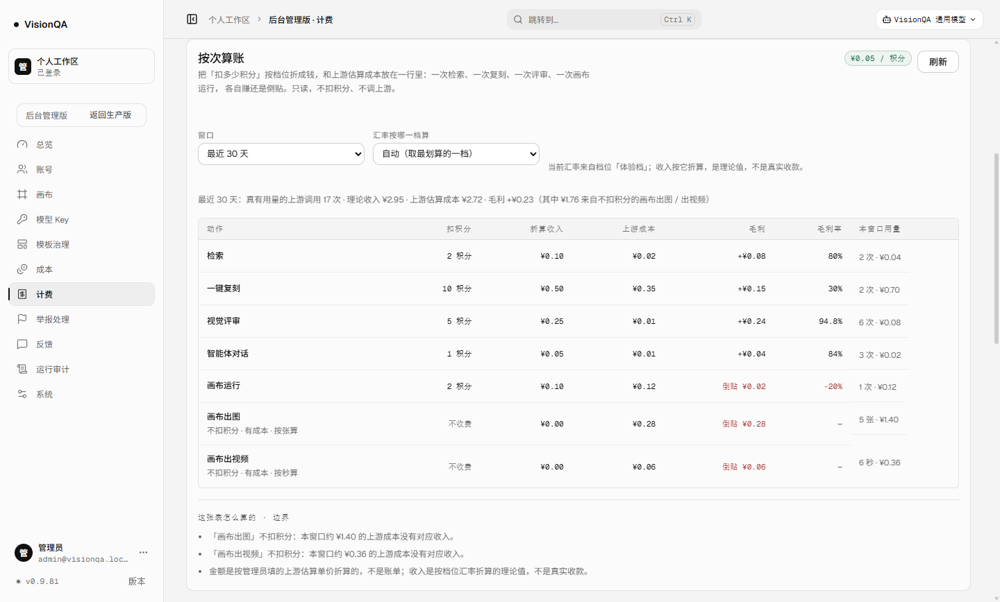

提交 `cac7116`（`server/pricing.mjs` + 接口 + 卡片 + 6 条测试 + usage 汇总补 `measuredCalls`）+ `9c60d2f`（窗口没有带用量的调用时总量写 null、画布两行改按张/秒），CI **43521586909** / **43522377678** success（三个 job 全绿）；部署等 CI 绿了才发：`r93-pricing` → `r93-pricing2`；文档提交 CI **43522377678** success。


## 一百五十、素材来源与下架通道：公共模板点得回原片，被收录的人不用注册也能提交下架（v0.9.82）

- **问题**：上线就绪清单 C4 那一行一直没关：「25 条含第三方平台封面与作者名，对外收费前出一页『素材来源与下架通道』说明；举报下架已有」。举报与下架的执行链路早就有（举报队列 + 下架收回公共模板 + 停分享链接 + 记审计），缺的是**被收录的人能找到的那一面**——他得先知道我们存了什么、存在哪、怎么让我们撤掉，而不是先注册一个账号去猜「是哪条模板」。另外发布公共模板从来不看出处：一条没有原片链接的记录放进去，被侵权的人连「是哪条」都指不出来。
- **现成件**：举报队列与后台「下架」动作（server/reports.mjs + routes/admin.mjs）、模板上的 platform / author / sourceUrl、分享 token 的停用逻辑、tokens.css 那把尺子。零新依赖。**放弃**：写一篇静态说明（数字会过期，且没有可提交的入口）、只在帮助中心加第 4 篇（讲「怎么撤」不如给个表单）、**公开列出 25 条模板的标题与链接**（那是把别人平台的封面与作者名在匿名页面上再放一遍，方向恰好相反）、搭一套申诉工单系统（现有队列 + 审计够用）。
- **做法**：① 新增公开页 #/sources（不进工作台外壳、不登录可读）：素材从哪来（三类来源各存什么）、存了什么 / 不存什么、现在库里有多少、怎么要求下架、处理之后会怎样；页脚、条款页、帮助中心、登录页、工作台首页、模板抽屉都给入口。② 数字现算：新只读接口 GET /api/sources/summary **只回计数与平台分布**（条数、留着原片地址 / 记着作者各几条、解析过 / 只存链接、加入时间区间、已处理下架），不回标题、作者与链接——那是登录后模板库的事。③ 出处闸 publicPublishBlocked：平台素材（saved / replica / adapted）没有原作品地址不许发布进公共模板，画布与智能体自己的模板不受限；判断按**这次保存之后的样子**，所以「补链接 + 打开发布」一次提交能过。④ 举报新增 target.kind = material：指名不了具体条目也能提交，后台显示「素材页 · 未指名模板」，管理员点下架时提醒去模板库把那条收回。⑤ 顺手修：举报成功那一屏原来用 flex 排「已收到受理编号 rep_x（…）」，图标、编号、括号说明各自成了 flex item，在 480px 弹窗里被压成窄条竖着断行。
- **本地验收**（真渲染 + 真请求，演示库 6 条公共模板 / 抖音 4 / 小红书 2，另有 1 条私有、1 条已删的公共模板都不进数字）：接口给 total 6 · 有原片链接 6/6 · 有作者 6/6 · 解析过 2 · 只存链接 4 · 已处理下架 1；出处闸用管理员会话跑完四步——清空原链接 → 400 NO_SOURCE、**同一次提交**补链接 + 发布 → 200 shared:true、收回 → 200；页面真点一遍下架申请：弹窗 → 提交 → 受理编号 rep_95a4cb95，落在 reports.json 的 target.kind = material、状态 open，弹窗停在「已收到受理编号」那一屏（不再自动关闭，编号能抄）。
- **生产实测**（v0.9.82，release 20261113-230509-20261114-r94-sources → 20261113-230729-20261114-r94-sources2，入口 index-BqXIAE66.js）：**匿名**（不带 cookie）GET /api/sources/summary 200 → total **25**（26 条模板里 25 条公共，与 C4 那句对上）、抖音 25、有原片地址 / 作者 / 封面各 25/25、解析过 25、只存链接 0、加入 2026-11-11、**已处理下架 0（照实回 0，不写「已保护 25 条」这种话）**；https://visionqa.wavisionai.cn/#/sources 不登录打开，页面数字与接口一致。出处闸在生产只验「不误拦」：管理员对一条已公开模板 tpl_b1246a9f 再次提交 {shared:true} → 200 shared:true（没有 NO_SOURCE）；**「无链接 → 400」没在生产造数据**（那要临时造一条无链接的平台素材），同一个闸在本地跑完了完整四步。下架申请的端到端也是**本地**跑的，没往生产举报队列塞测试单。两实例同版本、三个 unit active、journal 近 4 分钟无 warning 以上条目。
- **验收**：npm test **717/717**（+5：test/sources.test.mjs 体检口径 / 出处闸（含「一次提交补链接」）/ material 进队列 / 白名单断言 / 下架计数）；oxlint 0 error / 15 warning（仓库既有）、tsc -b 干净、构建通过、密钥扫描 **580 文件 0 命中**。
- **踩到的坑（如实记）**：① **部署当场踩到的**：第一版接口写好了却忘了把 /api/sources 放进 PUBLIC_API 白名单——页面是公开路由、数据接口却要登录，生产匿名访问 **401**，页面只会显示「数字没读到」；本地没开 VQ_REQUIRE_AUTH 所以测不出来。补上白名单并加一条断言（白名单里必须有 /api/sources，且原有 /api/reports 别被带掉），本地用 VQ_REQUIRE_AUTH=1 复验匿名 200 / /api/templates 仍 401，重新发布 …-r94-sources2。② 出处闸最初只看库里旧值，「补链接 + 打开发布」一次提交被判违规（本地真跑才发现），改成按保存后的样子判断并写进测试。③ 举报成功那屏是坏的：接口 201、DOM 断言都正常，真截图才看到一句话被压成窄条。④ 仓库的设计栅格测试抓到两个随手数字（margin-top: 3px、padding-left: 20px），改成 4 / 24 才过。
- **边界**：这一页只讲**公共模板**；用户自己上传、抽帧、生成的素材按「隐私说明」走。下架 = 从公共模板收回 + 停分享链接 + 留处理记录，**不物理删除**（证据与申诉核对靠它）。没写「48 小时内处理」——运营人手没定，写上去就是编 SLA；页面写的是「按队列处理 + 留联系方式会收到结果」。匿名提交仍受 IP 限流（每分钟 5 条）与同对象 10 分钟去重。出处闸只管「发布进公共库」这一步，不追溯存量：存量公共模板的链接覆盖率由页面数字自己暴露（生产现在是 25/25）。
- **回退**：bash /opt/visionqa/ops/rollback.sh --to 2（回滚到 v0.9.81 的快照）。没有开关：新增的是路由与只读接口，旧的举报 / 下架链路没被改动。

细节见 [素材来源与下架通道](docs/material-sources-2026-11-14.md)。

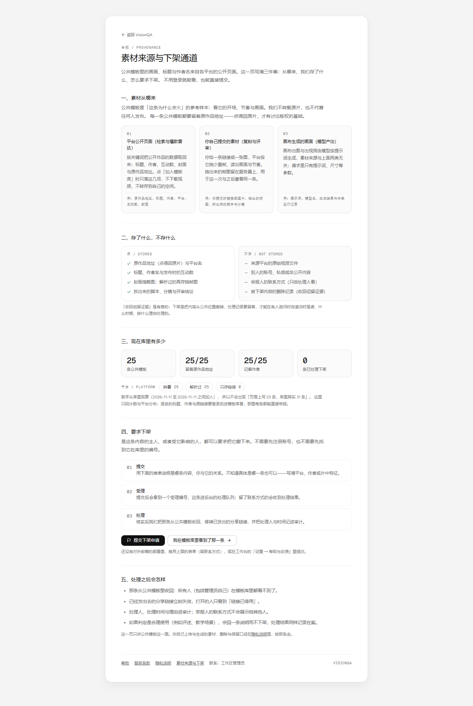

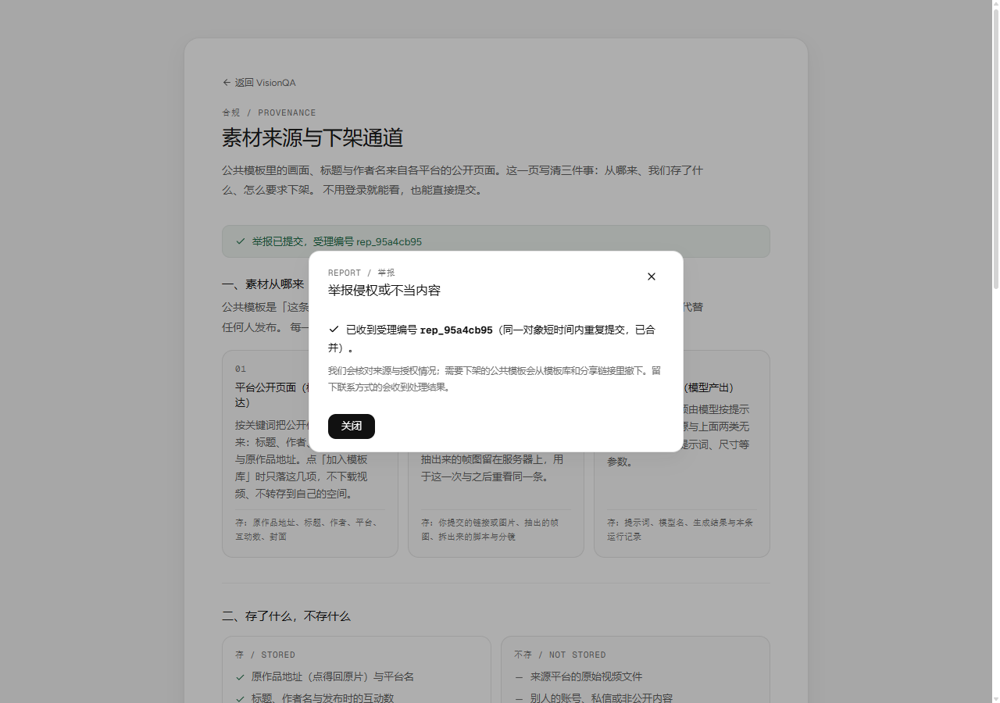

提交 9841184（公开页 + 数字接口 + 出处闸 + material 举报 + 5 条测试）+ c08bdd4（生产 401 的真实失败：白名单补 /api/sources + 断言），CI **43524262483** / **43524520672** success（验证（Node 22.12.0）/ 验证（Node 24）/ 安全扫描 三个 job 全绿）；两次部署都是等 CI 绿了才发：r94-sources → r94-sources2。

## 一百五十一、画布排队位可见：等的时候知道自己第几，画布页与后台都看得到（v0.9.83）

- **问题**：v0.9.80 起画布出图名额满时先排队（默认 90 秒、最多 8 条），但排队对用户**是隐形的**——画布上那几张就是转圈，既不知道在等什么，也不知道还要等多久；后台只有一行「排队 3 / 8 条」，看不出谁先来、最久等了多久；画布服务自己也没地方问「我这张排第几」——它在等一个 HTTP 响应，而响应头只在**结束时**才到。看不见的排队会让人反复点、刷新、整批关掉重来，只会让队列更长。
- **现成件**：v0.9.80 的排队循环与名额租约、共享目录里的整机计数（`heavyLeaseStatus`）、画布页状态条（`.cv-bdc-strip`，v0.9.82 那套胶囊样式）、后台「运行水位」卡。零新依赖。**放弃**：让画布（BDC）自己实现轮询（另一个仓库、另一份部署，平台这层不该依赖调用方自觉）、在阻塞的 POST 上提前发响应头或 SSE 推位置（响应体必须还是那张图的 JSON，提前 flush 就不能再改状态码，为一个只读进度改协议不划算）、真 WebSocket 推送（90 秒的等待里差 3 秒无所谓，长连接要额外处理断线/鉴权/心跳）。
- **做法**：① `server/waterline.mjs` 排队位从「计数」改成「登记」：每条一个票号 + 入场时间、FIFO 名次，`admissionQueueReport()` 多回 `oldestWaitMs` 与逐位等待时长，新增 `queuePositionFor(kind, ticket)` 与 `canvasQueueView()`（聚合视图：在跑 / 排队 / 最久 / 上限 / 排满，可点名票号回自己名次）；`admitWaiting` 接受 `options.ticket`，排到、超时、断开三条路径都划掉票。② 票号由调用方带（`X-VQ-Queue-Ticket`，画布可以用自己的节点 id 或幂等键），响应头 `X-VQ-Queue-Ticket` / `X-VQ-Queue-Position` 还回去（`X-VQ-Queue-Ms` 不变）。③ 两条只读接口：`GET /api/gateway/v1/queue`（平台令牌，画布服务问「我排第几」，`?ticket=` 可选）与 `GET /api/canvas/queue`（登录会话，画布页读聚合数，**不含票号**），都不占名额、不扣积分、不调上游。④ 画布页状态条上有排队胶囊「在跑 2 · 排队 4（最久 6.3s）」，排满了变失败色「· 排队位已满」；页面可见时 3 秒一问、切后台就停；忙完 8 秒内显示一次「刚刚那批出完了」再自己消失，空闲时整个不渲染。⑤ 后台「运行水位」卡多「（最久 11 秒）」并单列「现在在等：第 1 位 11 秒 · 第 2 位 10 秒」。
- **本地验收**（一次性实例 8907 + 假上游 9 秒回图 + 假画布服务 6677，整机名额 2 / 排队位 8 / 最多等 120 秒，连发 6 张）：状态条「在跑 2 · 排队 4（最久 6.8s）」；390 宽 `docSW 390` 不横向滚、胶囊 200px 完整可读；后台「排队 2 / 8 条（最久 11 秒）」+「第 1 位 11 秒 · 第 2 位 10 秒」；6/6 都是 200，4 条排过队的响应头带回票号与入场名次（node-3 第 1 位 18.4 秒、node-4 第 2 位 9.2 秒、node-5 第 3 位 18.2 秒、node-6 第 4 位 9.2 秒）；上游正好被调用 **6** 次。
- **生产实测**（v0.9.83，release `20261113-232719-20261114-r95-queue-visib`，入口 `index-DnRvcUoe.js`）：**真数据只读**——`GET /api/canvas/queue`（管理员会话）与 `GET /api/gateway/v1/queue`（平台令牌）都 200，回 `active 0 · limit 2 · slots 2 · waiting 0 · waitMs 90000 · maxWaiting 8 · scope lease · queueScope process`（队列空就照实回 0）；两条匿名读都 **401**。**一次性实例**（生产机 8788 + 假上游 8098，零扣费）连发 6 张：`active 2 · slots 0 · waiting 4`、名次 1/2/3/4、最久已等 1924 ms；`?ticket=prod-node-3` 回 `mine { position: 2, ahead: 1, waiting: 4 }`；后台水位卡同一份数；6/6 都 200，2 张直接跑（9.1 秒、无排队头）、4 张排过队（名次 1/2/3/4、等 9.1–18.5 秒、响应头齐全）；假上游被调用 **6** 次（真上游一次没碰）；收尾队列回到 0（`served 4 · maxWaitMs 18466`），临时实例、假上游与 /tmp 都清干净。
- **验收**：`npm test` **725/725**（+8 `test/canvas-queue-visible.test.mjs`：名次顺序、票号不进聚合、响应头、排满、超时划票、断开划票、只有画布出图有名次、两条读接口的鉴权）；oxlint 0 error / 15 warning（仓库既有）、`tsc -b` 干净、构建通过、密钥扫描 587 文件 0 命中。
- **踩到的坑（如实记）**：① bash 的 `wait` 会连假上游一起等（常驻进程永不退出），生产验收脚本卡在第 40 秒——改成只 `wait` 6 个 curl 的 pid；② `pkill -f r95up.mjs` 把执行它的那条远端 shell 一起杀了（命令行里就有这个字符串），表现为「ssh 退出码 1、一句输出都没有」——改成 `pkill -f '[r]95up.mjs'`；③ PowerShell 会把双引号里的 `$(...)` 当自己的子表达式展开，远端 `pid=$(ss ...)` 在本地就报错——改成把 bash 写进文件、scp 过去再执行；④ 390 宽下行被裁的正是排队胶囊（状态条是桌面工具条，`white-space: nowrap`），720 以下先收起署名与地址、把位置留给排队位；⑤ 改完 `canvas.css` 忘了 `npm run build`，一次性实例读的是 `dist`，第一版 390 截图还是旧样式；⑥ 渲染里读 `Date.now()` 被 React 编译器记一条警告——把「忙完 8 秒内显示」改成轮询里起 `setTimeout` 清标记，渲染保持纯函数。
- **边界**：排队位仍是**本进程**的（两个实例各 8 条在等，整机最多 16；「在跑几条」走共享租约、是整机口径），跨进程/跨机的排队位要一个真正的协调者，不在这一版；画布（BDC）自己还没有显示它——数字与接口都备齐了（`/api/gateway/v1/queue` + 两个响应头），但它要显示仍需那边改一行轮询；排队不等于更快（上游并发仍是 2），等超时仍然不花钱；90 秒是默认等待上限、不是承诺的完成时间；票号可被调用方指定，但**聚合视图永远不回票号**，点名只回名次与等待时长、不回别人的。
- **回退**：`bash /opt/visionqa/ops/rollback.sh --to 2`（回到 v0.9.82 的快照）。没有开关：新增的是两条只读接口、几个响应头与界面上的胶囊，旧链路（排队、判名额、拒绝时机）一行没改；真想立刻退回 v0.9.80 的行为（名额满就拒），把 `VQ_CANVAS_QUEUE_MS=0` 即可。

细节见 [画布排队位可见](docs/canvas-queue-visible-2026-11-14.md)。


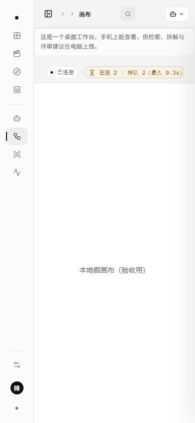

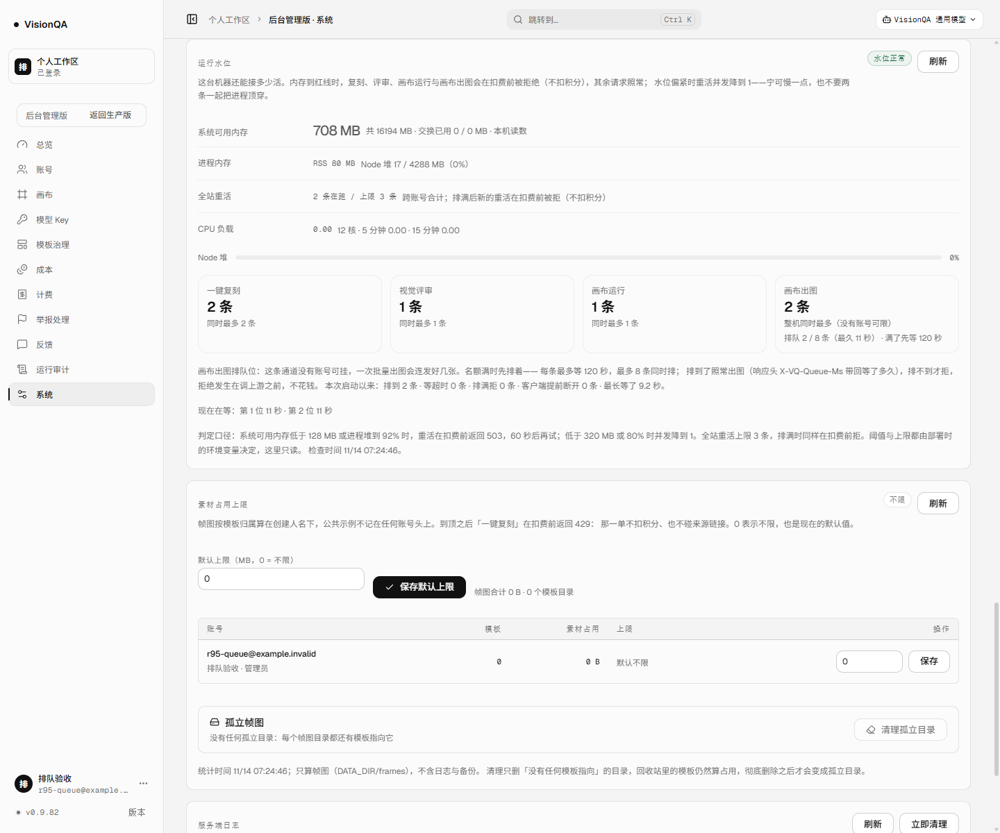

提交 `68a1037`（排队票 + 两条只读接口 + 画布页胶囊 + 后台明细 + 8 条测试 + 版本号），CI **43527074806** success（三个 job 全绿）；部署等 CI 绿了才发：`20261113-232719-20261114-r95-queue-visib`。

## 一百五十二、改一版到底有没有变好：每版问题数按严重度对着看（v0.9.84）

评审只回答「这一版能不能发」，不回答「比上一版好在哪」。用户开一版、按意见改、再评一次，页面上只多一条结论胶囊——改的两条到底修好没有，得自己翻两次评审一条条数。这一版把「问题数按严重度」算出来，放在主卡、版本对照与评审记录三处，相邻两版都评过时写一句「比 v2 少 2 个阻塞」。

- **口径只有一处**：一次评审的问题数 = 它的 observations 按 severity（阻塞 / 主要 / 次要 / 信息）分组。服务端 `severityCounts` 在生成摘要时顺手数一遍，`counted` 是认得严重度的条数、`observations` 是一共几条；老记录没有 severity 时 `counted < observations`，界面写「另有 N 条没记严重度」，**不写「0 个阻塞」**。
- **同一版重评取最近一次**，不相加（同一批问题不能被数两遍）；版本划分之前的老评审（version 0）照旧折进 v1，issues 与 lastVerdict 用同一个「最近一次」。
- **比较只比阻塞 / 主要 / 次要**，从重到轻取第一个有变化的，一次只说一件事；信息级不参与，两边持平不写。客户端纯函数在 `src/domain/review.ts`（`issueCountsOf` / `issueLine` / `issueGap` / `issueCompare`）。
- **界面**：作品页主卡「下一步」下面一行「这一版 1 阻塞 · 2 主要 · 1 次要」+ 胶囊「比第 2 版少 2 个阻塞」；「版本对照」每行「最近一评 …」+「比 v2 少 2 个阻塞」；评审记录页结论下面「4 条问题 · 1 阻塞 · 2 主要 · 1 次要」。「出结论」那一步补上严重度与置信度的解释——置信是模型对这条判断有多确定，不是问题有多严重。
- **放弃的三条路**：编一个 0–100 的综合评分（权重是拍的，看起来客观、实际没法对账）；让模型自己写「比上一版如何」（结论跟着措辞漂移）；前端从 observations 现数（历史列表只回摘要，要多拉几十 KB）。改成服务端在同一遍循环里数。
- **本地验收**（一次性实例 8905 + 种一条三版作品、四条评审，零上游调用）：接口 `versionCounts` v3 两次评审取最近一次 `1 阻塞 / 2 主要 / 1 次要`、v2 `3 阻塞 / 2 主要 / 1 次要`、version 0 保留 `1 阻塞 / 1 主要`；主卡「比第 2 版少 2 个阻塞」、版本对照 v3「比 v2 少 2 个阻塞」/ v2「比 v1 多 2 个阻塞」/ v1 不写；评审记录页「4 条问题 · 1 阻塞 · 2 主要 · 1 次要」；390 宽 `docSW 390`、胶囊 133/117/117 px、版本行 `scrollWidth` 256 不溢出。
- **生产实测**（v0.9.84，入口 `index-CeWXFvsF.js`）：四个 unit 全 active、journal 近 5 分钟无 warning、盘 72%；真实例 `/api/projects` 与 `/api/reviews` 匿名都是 **401**；用**部署后的代码**在生产机起一次性实例（8784、`/tmp/r96data`）跑四条断言全 ✓，`versionCounts` 与本地逐项一致，跑完实例与临时目录清干净；线上 bundle 里确认带新逻辑。**没有真实上游调用，没扣积分。**
- **边界**：数字来自模型给的严重度，模型分错级数字就会错——这一版是把已有事实数清楚，不是让评审更准；只比相邻两版且两版都评过、都记了严重度；生产还没有真实评审，所以线上暂时看不到非零数字。
- **回退**：`bash /opt/visionqa/ops/rollback.sh --to 2`（回到 v0.9.83 快照）。接口只加字段，老前端不受影响，不需要开关。

测试 734/734（+9 `test/project-version-issues.test.mjs`），oxlint 0 error / 15 warning，tsc 干净，密钥扫描 588 个文件 0 命中。

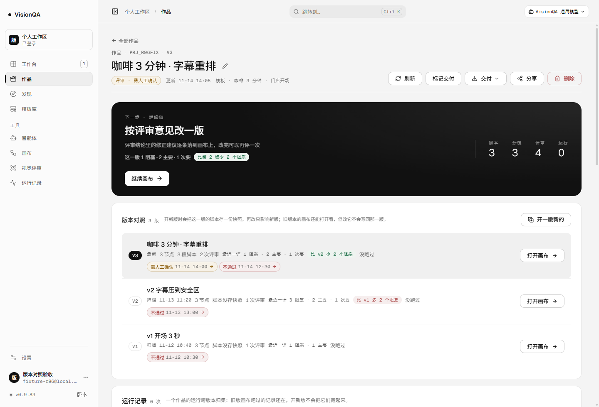

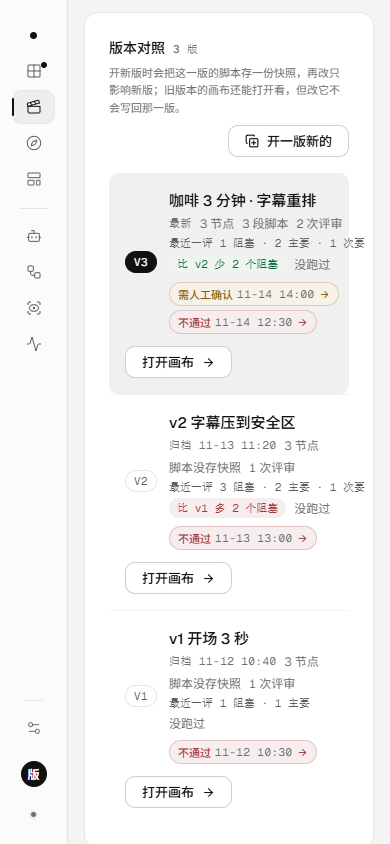

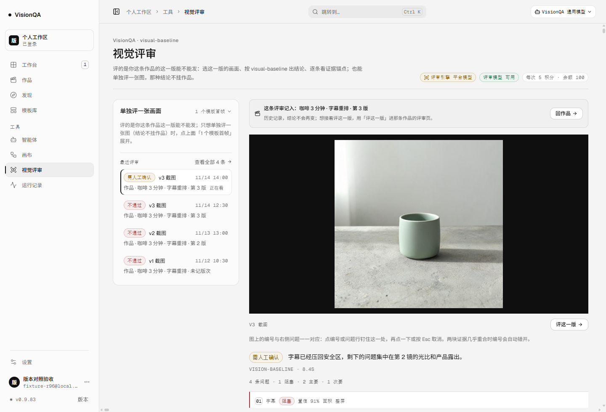


## 一百五十三、交付留痕记下交时评审：交出去那一刻评成什么，之后重评不改（v0.9.85）

「交付」这件事以前只记了一半：哪一版、什么时候。工作台「交出去的」每行还写着「评审「通过」」——但那不是交付时存下的，是拿这一版**最近一次**评审现算的。交付之后再评一次，那一行就改口：谁在什么时候、抱着什么结论把这一版交出去的，查不回来了。作品页更少，只有「交付过 · 11-14 14:30」。

- **改法**：标记交付时把这一刻的评审（结论 + 按严重度的问题数 + 那次评审的时间）存进这条交付记录；开新版给上一版收尾时同样补一份。之后重评只改这一版现在的状态，不动交付记录。口径与作品页「版本对照」同源（同版取最近一次、version 0 折进 v1、只数认得严重度的）。
- **三种状态分开写**，不混成一句假话：交的时候评过（有快照）/ 交的时候查过、确实没评过（`review: null`）/ 升级前的老记录（没有 `review` 键，界面写「没记」）。「没记」不是「没评过」，更不是「0 个阻塞」。
- **界面（五处，一份数据）**：作品页版本行「交付过 · 时间」后跟「交时评审：需人工确认 · 1 阻塞 · 2 主要 · 1 次要」；交付菜单先说明会记下什么；交付后的提示带上它；工作台「交出去的」每行写「交时评审「…」· N 阻塞」或「交时评审没记 · 这一版评过 N 次」；交付稿的交付小节与逐版记录也带上。
- **放弃的三条路**：读的时候现算（就是 bug）；存评审记录 id 之后回读（评审库只留 200 条，挤掉之后指向不存在的记录）；存 0–100 质量分（权重是拍的，没法对账）。选的是「交付那一刻算一次，存一枚几十字节的快照」。
- **本地验收**（一次性实例 8906，种三条交付过的作品 + 一条截图外的，零上游调用）：版本行、交付流水五种状态逐项对；真点「重新打开 → 标记交付」，提示为「已标记交付：v3 · 11-14 08:22 · 交时评审 需人工确认 · 1 阻塞 · 2 主要 · 1 次要」；同一版再评一次 pass 之后交付记录仍是 needs_review，而「最近一评」变成 pass——历史没被改写；交付稿两处文案对；390 宽 `docSW 390`、版本行 `scrollWidth` 256/240/240 不溢出。
- **生产实测**（v0.9.85，入口 `index-C686K8s4.js`，快照 `20261114-002516-v0.9.85`）：四个 unit 全 active、journal 近 5 分钟无 warning、盘 72%；匿名 `/api/projects` 与 `/api/deliveries` 都是 **401**；线上 bundle 四个新标记各出现 1 次。用**部署后的代码**在生产机起一次性实例（8785、`/tmp/r96bdata`）**8 / 8 条断言通过**——其中「停实例 → 盘上多一条「不通过」重评 → 再起实例读」，交付快照仍是 pass、`versionCounts` 已是 fail；跑完实例、临时目录、上传包全部清掉。**没有真实上游调用，没扣积分。**
- **边界**：快照记的是模型当时的结论（模型错，快照也跟着错）；同一版「重新打开 → 再交付」写新快照，不追加；只存结论与问题数，不存问题正文；开新版补的那条本来就没有交付时间，现在带上的是收尾那一刻的评审。生产目前 **1 条作品、0 次交付**，所以线上还看不到这一行——等第一次真实交付，它才会带着那一刻的评审出现，不为截图往生产塞假数据。
- **回退**：`bash /opt/visionqa/ops/rollback.sh --to 2`（回到 v0.9.84 快照）。数据层只有新增字段，旧代码直接忽略，回退安全。

测试 743/743（+9 `test/delivery-review-snapshot.test.mjs`，另改两处既有期望），oxlint 0 error / 15 warning，tsc 干净，密钥扫描 590 个文件 0 命中。

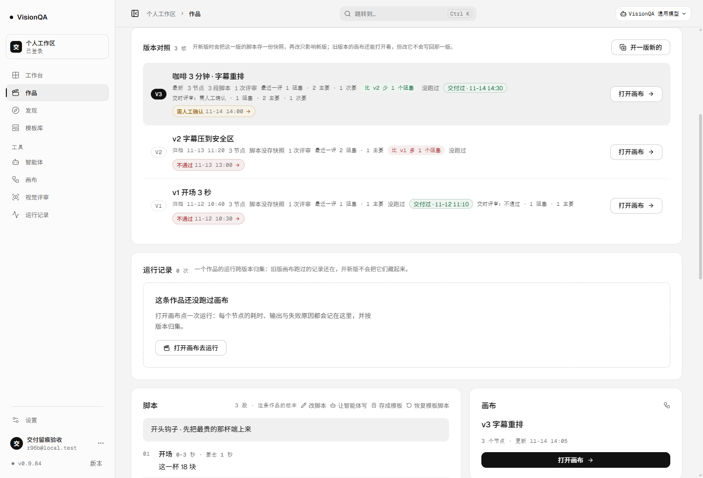

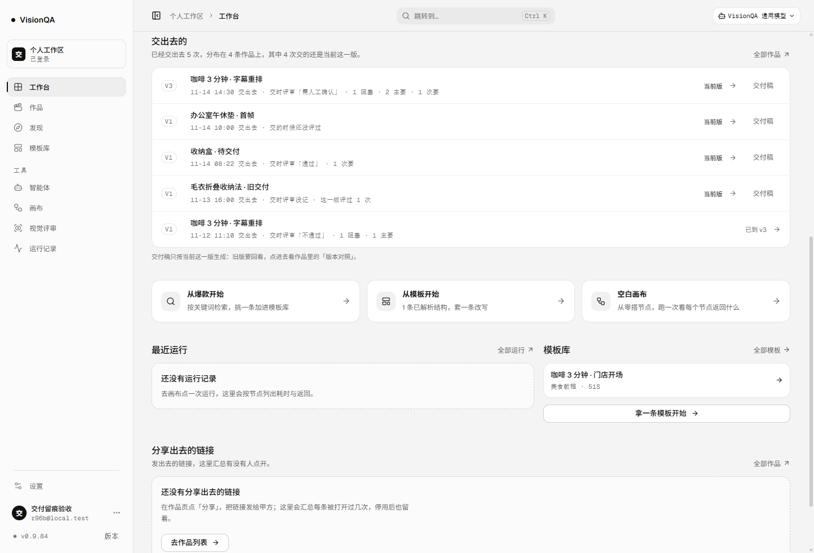

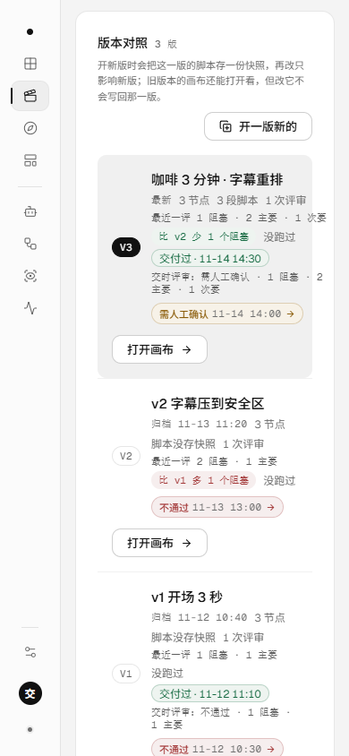

细节、被否掉的三条路与五个坑见 [交付时评审快照](docs/delivery-review-2026-11-14.md)。

## 一百五十四、交付之后的漂移：交时照写当初，后来变了就说（v0.9.86）

上一版把交时评审存成了快照，但「交付之后」发生了什么，页面上没有一个字：v3 交出去时是「需人工确认」，交完再评一次变成「不通过」，版本行与流水仍然写着交时那句，真正该看的变化只藏在旁边「最近一评」那一列里。这一版把两句并排写：交时照写当初，后面补一句后来变了什么，谁也不改写谁。

- **规则**：交时快照与这一版最近一评比结论、比前三档问题数（信息级不算问题）。结论变了写「之后又评成「不通过」」，结论没变、问题数变了写「之后又评过一次（2 阻塞）」；变差琥珀色、变好灰色。交时没评过（`review: null`）、升级前没记（没有 `review` 键）、结论认不出（坏盘）一律不开口——不编「变了」。
- **界面（三处，同一句）**：作品页版本行跟在交时评审后面；工作台「交出去的」每行跟在「交时评审「…」」后面，小节多一句「另有 3 次交出去之后这一版又被评成了别的结论」；交付稿的交付小节与逐版记录也带上（纸面用「阻断 / 重要 / 轻微」）。
- **接口**：`/api/deliveries` 每行多 `issues`（这一版最近一评的问题数），整份多 `drifted`（按交付记录数，不按作品数）。先发现的问题是接口读的那份计数（`reviewCountsByProject`）根本没有 `issues`——单元测试自己造的计数有，所以测试绿、接口空，一次性实例第一次跑就露了（`issues: null`）；补进同一个计数函数，并从接口那份函数直接断言。
- **同一版重新标记交付写新快照**，漂移自己消失；不需要额外的「清除」。客户端与服务端两份实现（页面 / 纸面用词不同）用同一组 9 条用例对照，防止一处说变了、一处说没变。
- **本地验收**（一次性实例 8907，五条作品 / 七条评审，零上游调用）：版本行「…交时评审：需人工确认 · 1 阻塞 · 2 主要 · 1 次要 · 之后又评成「不通过」」；流水五行三种漂移 + 两种比不了（交的时候还没评过 / 交时评审没记 · 这一版评过 1 次）；接口 `total 5 / drifted 3`、A 行 `issues` 是最近一评的 1 阻塞而 `review.verdict` 仍是 pass；真点「重新打开 → 标记交付」后漂移 **0** 条，提示「已标记交付：v1 · 11-14 08:38 · 交时评审 不通过 · 1 阻塞」；390 宽 `docSW 390`、版本行 `scrollWidth 240`、漂移段 125。
- **生产实测**（v0.9.86，入口 `index-BeK48REa.js`，快照 `20261114-004105-v0.9.86`）：四个 unit 全 active、journal 近 5 分钟无 warning、盘 72%；匿名 `/api/projects` 与 `/api/deliveries` 都是 **401**；bundle 五个标记各 1 次。用**部署后的代码**在生产机起一次性实例（8786、`/tmp/r97data`）**8 / 8 条断言通过**（含「停实例 → 盘上加一条不通过重评 → 再起」快照仍 pass、`drifted=1`，以及同一版重新交付后 `drifted=0`），跑完 `/tmp/r97*` 0 个。**没有真实上游调用，没扣积分。**
- **边界**：只回答「后来变了没有」，不替人决定要不要补一版；「之后又评过」是数据推出来的（快照是交付那一刻的最近一评，最近一评与它不同必是之后评的，盘上手改乱时可能误报）；交时没评过 / 升级前没记的永远看不出漂移；生产目前 **1 条作品、0 次交付**，线上仍未出现这一行，不为截图塞假数据。
- **回退**：`bash /opt/visionqa/ops/rollback.sh --to 2`（回到 v0.9.85 快照）。纯加法，老前端不读新字段，回退安全。

测试 755/755（+12 `test/delivery-drift.test.mjs`），oxlint 0 error / 15 warning，tsc 干净，密钥扫描 592 个文件 0 命中。CI **43535694409** success（验证（Node 22.12.0）/ 验证（Node 24）/ 安全扫描 三个 job 全绿），提交 `51c4760`。

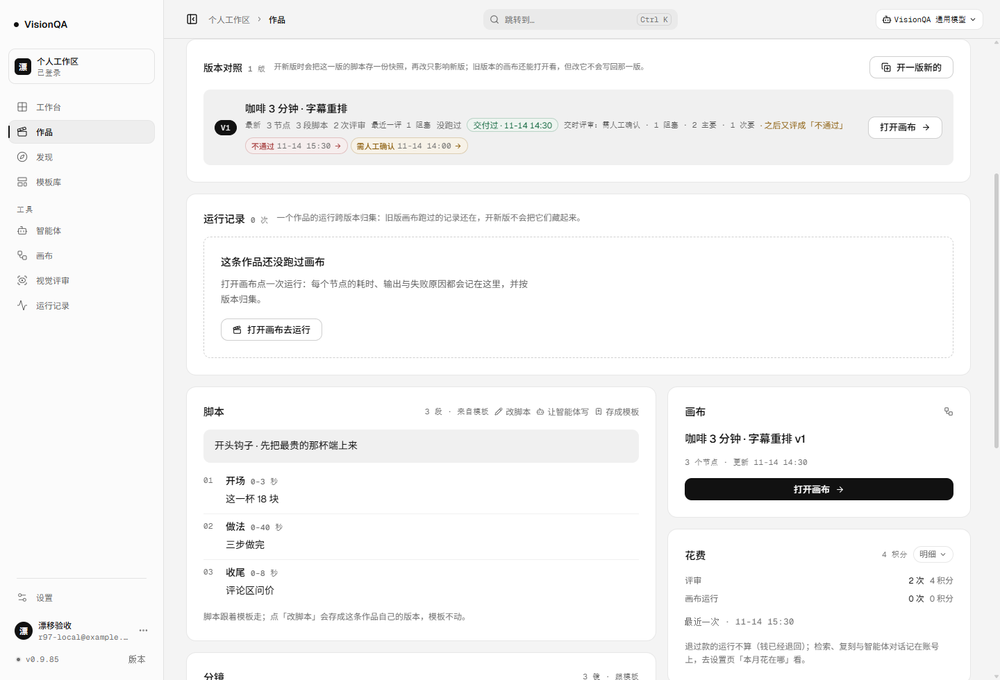

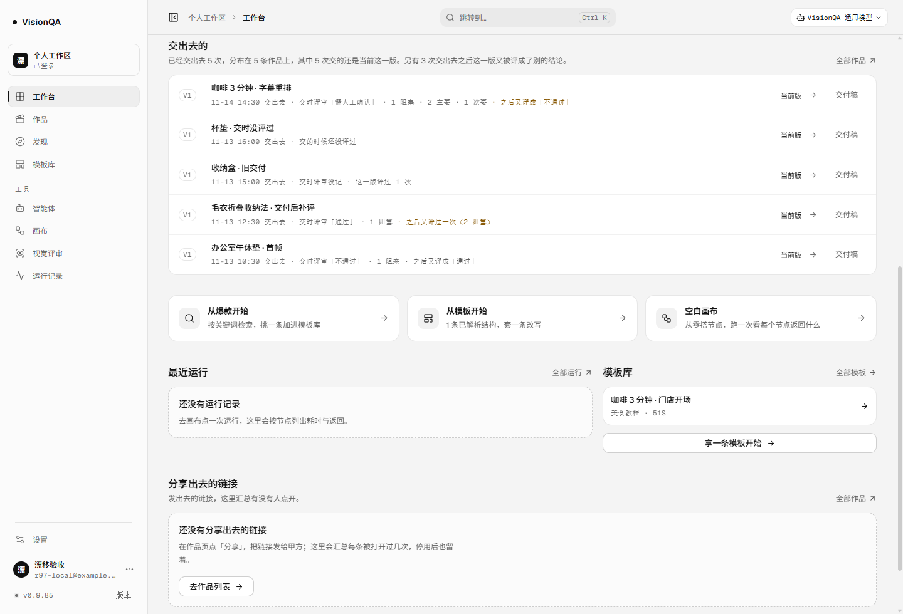

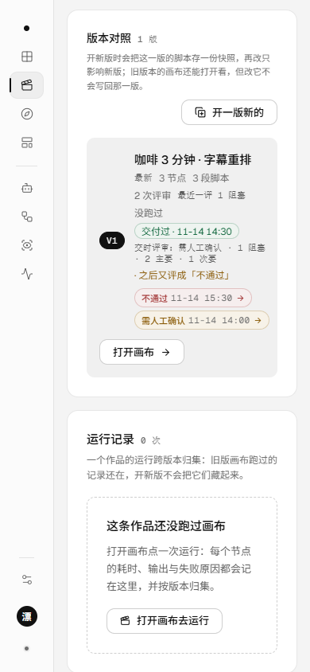

细节、规则边界与五个坑见 [交付之后的漂移](docs/delivery-drift-2026-11-14.md)。

## 一百五十五、传一张自己的图直接评：评审的第一个入口不再是「先建作品」（v0.9.87）

在这之前，「视觉评审」能评的画面只有两种来路：已经躺在数据目录里的图（模板首帧、画布帧），或者一个公网图片地址。作品页那句「把这一版要发的画面贴进来最准」一直没有入口能把图放进来——文案在邀请一个做不到的动作。而做视觉 QA 的人最自然的一步是「我有一张图，你帮我看看」，这一步不该要求先建作品、先在画布出图（出图还要花积分）。这一版补的是入口本身：评审那条链路一个字没改，认的还是 `media` 路径。

- **上传**：`POST /api/media/upload` 收原始字节（不是 JSON、也不是 multipart），按**文件头**认 jpg / png / webp，单张 ≤ 8 MB；落盘到 `uploads/<账号>/<时间戳>-<随机>.<ext>`。每个账号最多留 20 张、合计 160 MB，再传顶掉最旧的那张——没有清理入口时，无上限等于把磁盘交给上传的人。
- **读回**：`GET /media/uploads/<账号>/<文件>` 必须登录、只能读自己的（管理员可读全部），别人的路径回 **404**，连存在性都不告诉；响应带 `nosniff` 与 `private` 缓存。
- **归属闸**：`uploads/` 开头的图在评审入口要核账号，别人的图评不了（`404 MEDIA_FORBIDDEN`）；这道闸在扣费与并发名额**之前**，被拒的这一单不扣积分、不占名额。来源也分开记：`source.kind` 从「凡是 media 都记 template」改成 `upload` / `template`。
- **界面**：评审页「单独评一张画面」栏三种入口——拖进来、`Ctrl+V` 贴截图、点「选图」；传完直接选中，大小与类型在本机先拦一次，服务端再按文件头判一次。请求体新增 `readBinaryBody`，三道闸与 JSON 那条完全一样。
- **本地验收**（一次性实例 8908，假上游，**零积分消耗**）**18 / 18**：一张 140 KB 截图上传 200、读回**字节一致**、匿名 401、别人 404、改名的 html 415；用这张图真评出 `needs_review` + 3 条问题，记录里 `source.kind = upload`；390 宽 `docSW 390`。
- **生产**（v0.9.87，入口 `index-BNPTix0P.js`，快照 `20261114-010155-v0.9.87`）：四个 unit 全 active、journal 近 5 分钟无 warning、盘 72%；匿名 `/api/projects`、`/api/deliveries`、`POST /api/media/upload` 都是 **401**。生产机一次性实例（部署后代码，8930 / `/tmp/r98pdata`）**12 / 12**：含**第 13 次上传被限流**（`[200×10, 429, 429]`）与「重启后图还在、列表还在」；跑完 `/tmp/r98*` 0 个。
- **坑**：nginx 给 `/media/` 加了 7 天 public 缓存（模板帧需要），上传图会跟着被公开缓存——新增 `location ^~ /media/uploads/` 把缓存头交回应用，实测匿名 401 且只有 `no-store`；评审对照纸画不出上传图的框（纸只认模板帧），会如实印「画面不在帧图里」，框不画、编号照排；限流按 IP 算，「被 415 拒的那一次」也计数。
- **边界**：顶掉最旧的意味着旧评审的原图可能已经没了（评审页本来就写这个情况）；上传不扣积分、评审照扣；图不进分享页、不进交付包。另：`/media/frames` 目前仍可匿名读取（生产实测 200），这一轮没动它，单独一轮修。
- **回退**：`bash /opt/visionqa/ops/rollback.sh --to 2`（回到 v0.9.86）。纯加法，回退安全。

测试 766/766（+11 `test/upload-media.test.mjs`），oxlint 0 error / 15 warning，tsc 干净，密钥扫描 594 个文件 0 命中。CI **43537875581** success（三个 job 全绿），提交 `a717348`。

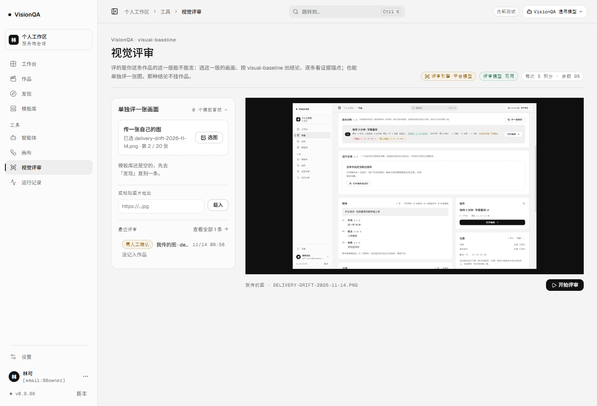

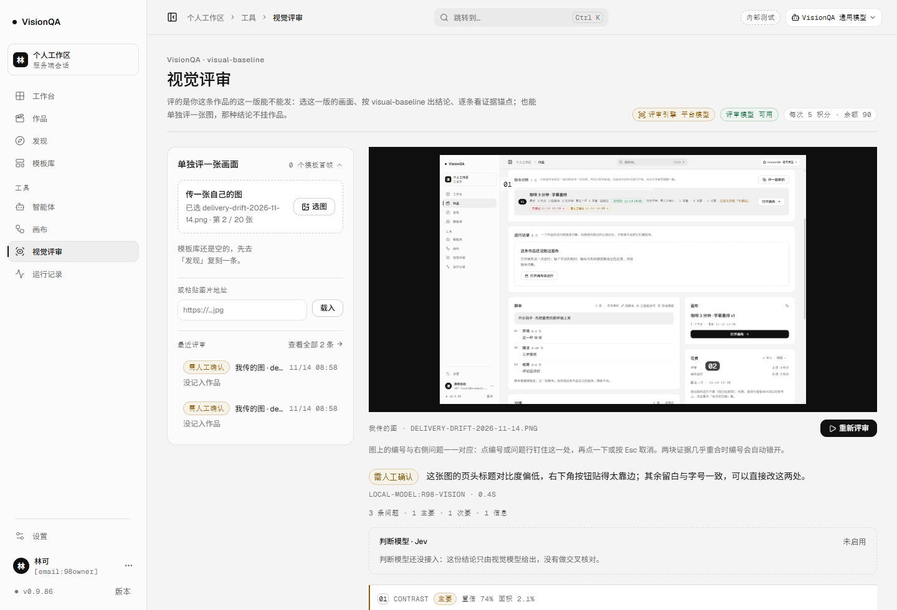

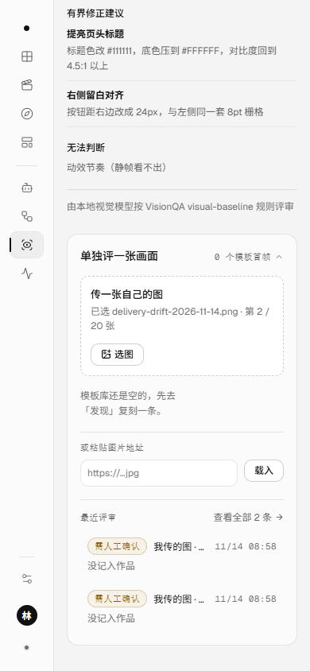

细节、六条坑与「发现但没做」的那一条见 [传一张自己的图直接评](docs/review-upload-2026-11-14.md)。

## 一百五十六、模板帧图不再匿名可读，静态目录越界一并补上（v0.9.88）

上一轮把上传图做成私有的（`uploads/<账号>/` + 归属闸）之后，顺手探了同一个媒体目录，发现还有两个不用登录就能拿东西的口子。这一版把两个都补上：模板帧图要登录、只认自己看得见的模板；静态托管拼出来的路径必须还在 `dist` 里。代码里三处注释早就写着「`/media/frames` 是要登录的」，实现里却没有那道门——这次让它成立。

- **帧图要登录**：`/media/frames/<模板 id>/<文件名>` 以前只校验路径形状，不看登录、也不看这条模板属于谁；模板 id 不是秘密（分享页 JSON 里就带着 `id`），拿到它就能把整条片子的抽帧一张张下走。现在生产必须登录（匿名 401），本地演示照常；登录后只认自己看得见的模板，别人的私有模板回 **404**，且与「模板不存在」是同一句回答。
- **只发图片**：这条路由只发 jpg / png / webp；frames 目录里的 txt、临时文件、模板删掉后留下的孤儿帧一律 404。缓存头从「公共 7 天」改成 `private, max-age=3600` + `nosniff`。
- **静态越界**：`path.join(distDir, pathname)` 会把 `/%2e%2e%2fpackage.json` 还原成 `/../package.json` 发出去——本地实测 `package.json` 200 / 1.8 KB、`.env` **200**。新增 `distFileFor`：先统一 `\` 与 `/`，`path.resolve` 归一化，拼完必须还在 dist 里，越界直接 404、不回 `index.html`。线上 nginx 本来就会对这类 URI 回 400，但应用不该靠外面那一层（直连端口、内网、换反代都会漏）。
- **nginx**：`location /media/` 给帧图加了 7 天 `public` 缓存；帧图现在跟登录态绑定，不能再挂公开缓存，新增 `location ^~ /media/frames/` 把缓存头的决定权交回应用（配置备份 `/root/visionqa.wavisionai.cn.conf.bak-r99`）。
- **顺带修的**：模板抽屉对老数据没有护栏——`analysis` 是空对象时 `.viralPoints.map` 抛 `TypeError`，整页兜底成「这个页面出错了」。数组补默认值（4 处），现在不白屏。
- **本地验收**（一次性实例 8909，假上游，**零真实调用、零积分**）**17 / 17**：匿名 401 且响应体没有图片字节；主人 200、66,526 B **字节一致**、`private` + `nosniff`；别人 404 与「不存在」同一句；txt 404；`/%2e%2e%2fpackage.json`、`%2e%2e%2f.env`、`%2e%2e%5cpackage.json` 全 404；产物 566,577 B 照常 200；分享页 token 帧图匿名 200、分享 JSON 里没有 `/media/frames`；登录后模板抽屉分镜表 8 镜 8 图 `naturalWidth` 全 > 0；390 宽 `docSW 390`。
- **生产**（v0.9.88，入口 `index-DQ7hlXVb.js`，快照 `20261114-011729-v0.9.88`）：`/api/version` 0.9.88；四个 unit 全 active、journal 近 5 分钟无 warning、盘 72%；匿名 `/media/frames/...` **401** 且只有 `Cache-Control: no-store`（没有被套上 7 天 public），`/media/uploads/...` 仍 401，`/%2e%2e%2fpackage.json` 400（nginx），首页与 `/assets/index-DQ7hlXVb.js` 200。生产机一次性实例（部署后代码，8931 / `/tmp/r99pdata`）**11 / 11**；跑完 `/tmp/r99*` 0 个。
- **坑**：`needsLogin` 只盖 `/api/*`，`/media/*` 每条都得自己挡；`canAccess(item, null)` 返回 true（本地演示的设计），匿名分支不能拿它当安全边界；`Network.clearBrowserCookies` 不清浏览器 HTTP 缓存，第一版用例「清 cookie 再取图」拿到 200 其实是命中了几分钟前的 private 缓存；Windows 上 `\` 也是分隔符，只挡 `..` 不挡 `..\package.json`。
- **边界**：看不见这条模板的人看不到帧图；分享链接照旧（token 是凭证，走 `/api/share/...`，不经过这条路由）；交付包里的帧图是打包时复制的本地文件；管理员仍可读全部。看过的帧图在同一浏览器会留一小时缓存（标准 HTTP 行为，URL 不外泄）。
- **回退**：`bash /opt/visionqa/ops/rollback.sh --to 2`（回到 v0.9.87）；nginx 用备份还原后 `nginx -s reload`。

测试 **777/777**（+11 `test/frame-auth.test.mjs`），oxlint 0 error / 15 warning，tsc 干净，构建通过，密钥扫描 599 文件 0 命中。代码提交 `f95a407`，CI **43539580704** success（三个 job 全绿）。

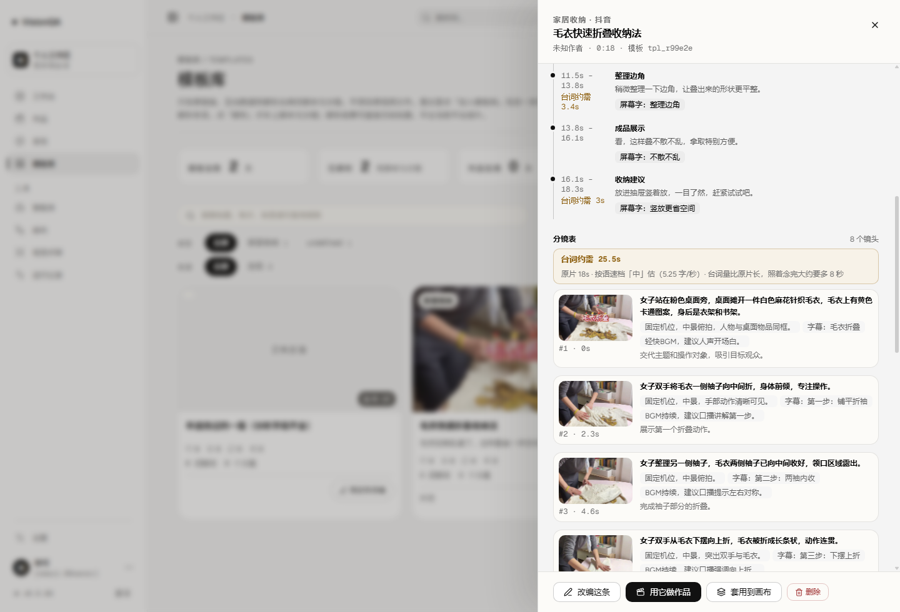

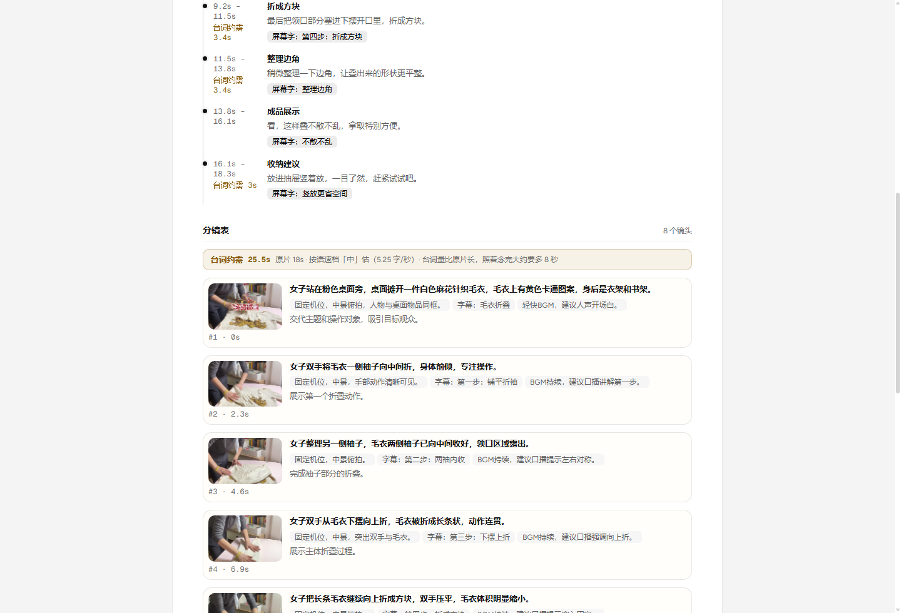

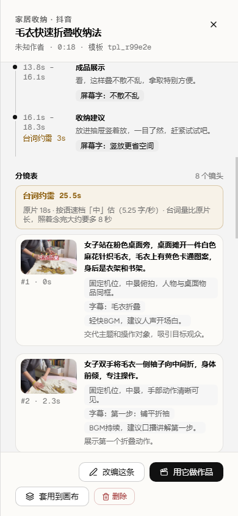

细节、六条坑与「发现但没做」见 [模板帧图不再匿名可读](docs/frame-gate-2026-11-14.md)。

## 一百五十七、退出登录 = 这台电脑不再留你的东西：图片必须重验，本机痕迹一起清（v0.9.89）

上一轮把帧图与上传图关进登录门之后，还剩一个一小时的口子：图片响应给的是 `private, max-age`。`private` 只挡中间层，浏览器在 `max-age` 内**一次请求都不发**——退出登录、换账号之后，同一台电脑照样能把看过的画面画出来，服务端那道 401 根本没机会跑。页面这边同理：会话清了，但智能体对话历史（用户真打的字）、上次打开的画布 id、检索词与筛选词还留在 `localStorage` / `sessionStorage` 里。这一版把两半一起收掉。

- **图片必须重验**：新增 `server/image-response.mjs`，帧图与上传图共用——`private, no-cache` + 强 ETag（大小 + 修改时间）。没变化回 **304**（不带 body、不带 `Content-Length`，几十字节），没权限回 401 / 404。**登录与归属判断在缓存比对之前**，所以缓存不能当登录的旁路。
- **认得出各种写法**：`If-None-Match` 支持精确值、`W/` 弱前缀（代理会改写）、列表与 `*`。
- **本机痕迹**：新增 `src/auth/local-residue.ts`（纯函数，Node 可测）。`signOut()` 清；`persistSession()` 发现上一份不是同一个人（**会话过期后直接登录另一个账号**，压根不点退出）也清一遍。清的是对话历史、画布 id、雷达检索词、三个列表的筛选词；`vq.model`、`vq.edition`、`vq_welcome_seen:<账号>` 留着——那是这台机器的设置，不是谁的资料。
- **设置页**加一行「退出登录会清掉什么」，把上面这条承诺写在用户看得到的地方。
- **本地验收**（一次性实例 8911 + 真 Chrome，假上游，**零真实调用、零积分**）**17 / 17**：主人 200 / 66,526 B 字节一致 / `private, no-cache` / ETag；带 ETag 再来 **304**；**匿名带 ETag = 401**（不是 304）；别人带 ETag = 404 且与「不存在」同句；弱 ETag 也 304；上传图 200 / 304 / 401 / 404 四态；分享页 token 帧图照常 200。浏览器里：登录后分镜表 8 镜 8 图全部渲染；刷新后仍是 8 / 8，**帧图响应 8 条全 304**；只清 cookie、不清缓存再取 = **401**（旧代码这里给 200）；直接打开帧图地址是 401 页面、DOM 里 0 张图；点「退出登录」后对话历史与画布 id 都不在、模型偏好还在、登录表单接住整页；390 宽 `docSW 390`。
- **生产**（v0.9.89，入口 `index-BjLykdCX.js`，快照 `20261114-013006-v0.9.89`）：用真实管理员会话穿过 nginx 打同一张帧图，部署前 `private, max-age=3600`（无 ETag）、部署后 `private, no-cache` + ETag `"8225-1a1ca614690"`，字节数一模一样（33,317 B）；带 ETag 再来 **304 / 0 B**；匿名带 ETag **401** 且只有 `no-store`。访问日志同一秒记下 304 / 401 / 401 三条。四个 unit active、journal 无 warning、盘 72%、首页与产物 200。生产机一次性实例（部署后代码，8931）**5 / 5**；生产 UI 真浏览器只读：分镜表 8 / 8，刷新后 8 / 8 且新响应里 **21 条 304**。跑完 `/tmp/r100*` 0 个。
- **坑**：`private` 只挡中间层、不挡浏览器；304 必须排在鉴权之后（顺序就是安全边界）；清 cookie 不清缓存——上一轮它是测试假象，这一轮它就是要修的问题；「会话清了」不等于「本机清了」（对话历史存在另一个模块自己的键里）；换账号不一定经过退出按钮；不要整库清 `localStorage`（`vq.edition` 是运维开关）；PowerShell 5.1 会把 `curl -H 'If-None-Match: "…"'` 改坏，带引号的探测值一律用脚本发。
- **边界**：本地演示匿名照常 200（只是多一次回源）；分享页 / 交付包 / 打印页走带 token 的地址，不受影响；管理员仍可读全部；分享页的 `public, max-age=600` 是故意的（停止分享后缓存不该比链接活得更久）。
- **回退**：`bash /opt/visionqa/ops/rollback.sh --to 2`（回到 v0.9.88）。这一轮没动 nginx。

测试 **795/795**（+18：`image-response` 5、`local-residue` 7、`frame-auth` +5、`upload-media` +1），oxlint 0 error / 15 warning，tsc 干净，构建通过，密钥扫描 603 文件 0 命中。代码提交 `14d345a`，CI **43540817649** 三个 job 全 success。

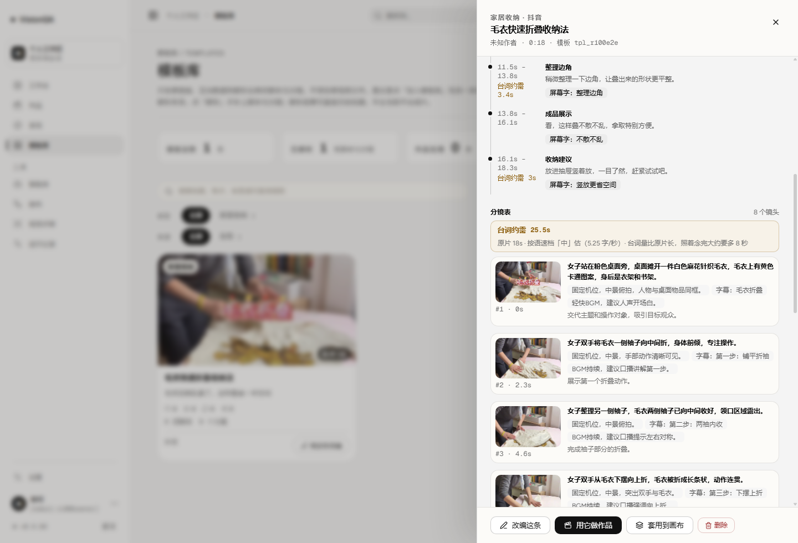

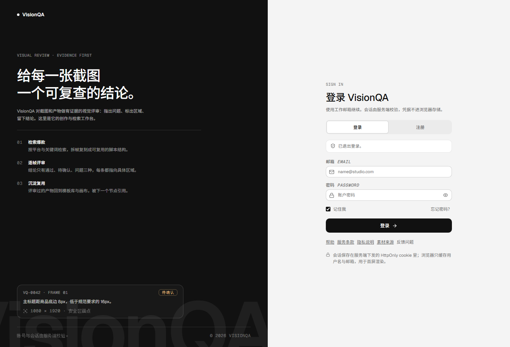

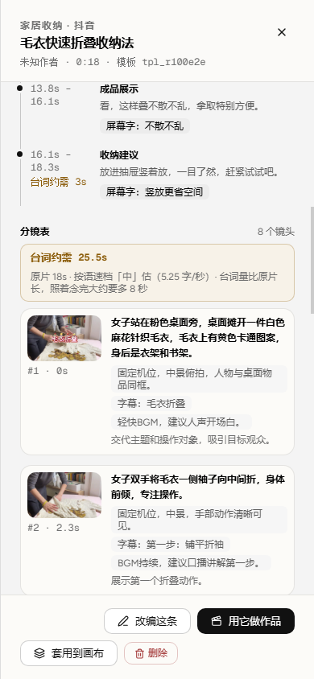

细节、七条坑与「发现但没做」见 [退出登录 = 这台电脑不再留你的东西](docs/logout-clears-2026-11-14.md)。

## 一百五十八、封面抓一次就够：缓存、两道闸门，抓不到也有话说（v0.9.90）

模板库一屏 40 张封面，以前每个请求各自去上游抓一次、整段读进内存（上限 8MB）。翻两次页就是 80 次上游请求，两个人同时翻，内存里十几份整图——这台机器 2 核 / 1.86GB，撞上这个慢的是所有人的页面，极端时直接 OOM。而已有的一切保护都绕过了它：它不扣积分、不进重活名额、也没有缓存。

- **三层，各管一件事**：新增 `server/cover-cache.mjs`（进程内 LRU：条目 64 / 字节 24MB / 10 分钟过期 / 「抓不到」负缓存 60 秒；按账号固定窗口限流；整机名额带排队与名额转交）与 `server/cover-proxy.mjs`（编排，`fetchImage` 可注入所以单测不碰网络）。响应多一个 `X-VQ-Cover: hit|miss|limited|busy|bad`。
- **命中不吃限流**：上限的语义是「一分钟去上游抓几次」，不是「一分钟看几次封面」——否则翻回上一页也会被拒。分享页的限流对象是**链接本身**（token），不是某个账号。
- **边读边数**：以前是 `arrayBuffer()` 之后再量大小，一张 500MB 的图会先被完整读进内存，那个 8MB 上限等于没写。现在先看 `Content-Length` 提前放弃，没有就以 8MB 为界边读边断。
- **抓不到也有话说**：新增 `src/components/CoverImage.tsx`，封面失败（含 429 / 503）时退回卡片自己的占位文案，不在网格里留破图。记的是「哪一张失败了」而不是一个布尔，换一条内容自然复位。
- **本地验收**（一次性实例 8911 + 真 Chrome，上游是本项目生产站的两张公开图片和一个 HTML 页面，**零付费调用**）**13 / 13**：匿名 401；首抓 miss 9,522 B → 再来 **hit 且字节一致，125ms → 2ms**；另一个账号也 hit；非图片 404 miss 27ms → **hit 2ms**；整机名额 1 时 3 张并行全 200（排队不 503）；同一账号第 4 次要抓 **429 + Retry-After 60** 且没碰上游；被限流后已缓存那张照常 200；分享页封面 200 miss 16,958 B → 200 hit；日志里有一行 `cover.refused`；浏览器里 5 张卡 4 张真封面、**破图 0**、一张「封面没抓到」；390 宽 `docSW 390`。
- **生产**（v0.9.90，入口 `index-BxV_lAUg.js`，快照 `20261114-014505-v0.9.90`）：同一张小红书封面，部署前两次 468ms / 245ms（各自回源、无 `X-VQ-Cover`），部署后 443ms 首抓、之后 **120ms hit**，字节数前后都是 **213,152 B**、sha `237a1caa0b1b5d67` 不变；生产机本机连打三次 **3.4 / 3.8 / 5.2ms** 全 hit，访问日志同一秒三条 2.6 / 5.3 / 4.4ms，失败那张 63.4ms → **1.9ms**。生产机一次性实例（部署后代码，8931）**8 / 8**。四个 unit active、盘 72%、入口与首页 200、`/tmp/r101*` 清完。
- **坑**：用 `unref()` 的计时器兑现的 Promise 会永远挂着（本机 Node 24 全绿、CI 的 Node 22 上三条名额用例失败，服务进程一直有活所以线上看不出来）；「读进内存再量大小」的上限等于没写；负缓存必须与正缓存分开（否则一张 404 挤掉一张真图，或把 404 存成空封面）；429 / 503 必须 `no-store` + `Retry-After`，被浏览器存住就变成「刷新也没用」；测试要能数「上游被调了几次」，所以抓取器是注入的。
- **边界**：分享页 / 交付包 / 打印页封面照旧可读；本地演示不受影响；`VQ_COVER_*=0` 可逐层关掉退回纯透传。
- **回退**：`bash /opt/visionqa/ops/rollback.sh --to 2`（回到 v0.9.89）。这一轮没动 nginx。

测试 **817/817**（+22：`cover-cache` 14、`cover-proxy` 8），oxlint 0 error / 15 warning，tsc 干净，构建通过，密钥扫描 608 文件 0 命中。代码提交 `d0ed534` + `466b4f8`，CI **43542336814** 三个 job 全 success（43542153270 在 Node 22 上失败，定位到 unref 后修掉）。

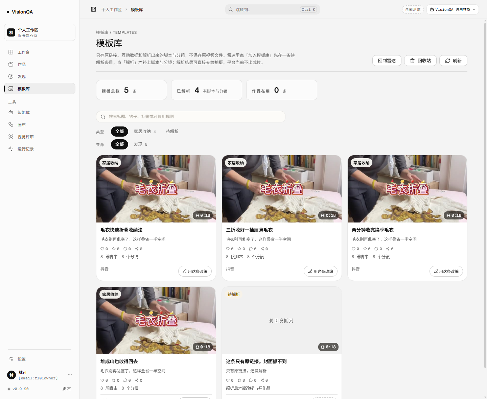

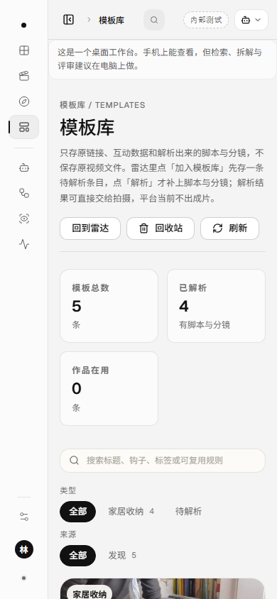

细节、七条坑与「发现但没做」见 [封面抓一次就够](docs/cover-cache-2026-11-14.md)。

## 一百五十九、nginx 站点配置只留一份：重跑部署不会再打回公共缓存（v0.9.92）

- **问题**：线上那份 vhost 是几个月里手改出来的——私有图 `^~` 覆盖、`/print/`、入口 `no-store`、
  `/assets/` immutable、整套安全头、真实对端 IP，**全都不在仓库脚本里**。上一版 `enable-https.sh`
  内联出来只有 38 行、3 个 location（`/api/`、`/media/`、`/`）。照 README 重跑一次部署，
  自己上传的图会多一条 `public, max-age=604800`，帧图丢私有覆盖，打印页掉回 SPA 的 `index.html`。
- **做法**：`deploy/production/nginx-app.conf` 成为唯一写着 location 的文件（8 个 location，含两条私有 `^~` 覆盖）；
  `nginx-http.conf` / `nginx-tls.conf` 只是薄外壳，`include` 应用段；`render-vhost.sh` 一处替换 8 个占位符，
  渲染后还有残留就报错退出；`install.sh` 按「证书在不在」选外壳（重跑不会把 HTTPS 换回 HTTP）、覆盖前备份；
  `enable-https.sh` 不再内联 vhost。新增 `scripts/check-nginx.mjs`，把规则钉在 `npm test` 里。
- **证据（生产机两个临时实例，8942 / 8943，不动线上 nginx，零付费调用）**：同一张私有图 70 B。
  旧脚本那份：`200` 且 `Cache-Control` **两条**（`private, no-cache` + `public, max-age=604800`）、
  安全头只有 `nosniff`、`/index.html` 完全没有缓存头、`/assets/*.js` 没有长缓存、`/print/nope` 返回的是
  SPA 的 `index.html`（ETag 与首页相同）。新模板那份：只有 `private, no-cache` + `ETag`、四个安全头齐全、
  `index.html` `no-store`、`/assets/` `immutable`、`/print/` 走应用自己的打印响应。两份 `nginx -t` 都过——
  旧的不是语法错，是**语义退化**。
- **第一次渲染到生产就撞了一次**：片段被写成 `.conf`，而 `conf.d/*.conf` 是在 http 层整段 include 的，
  `nginx -t` 直接报 `"location" directive is not allowed here`。因为先 `-t` 后 `reload`，
  **没有重载、线上零影响**；改名 `.app.inc` 后再过再重载。这条后缀规则现在由检查器钉着（配反向用例）。
- **幂等**：生产上把模板再渲染一遍到真实路径，外壳**逐字节一致**；应用段第一次差 4 行（0.9.92 新加的注释），
  第二次**逐字节一致**；`nginx -t` 通过 → `reload` → `/` 200 / 729 B、`/api/version` 0.9.92。
- **线上现状**：vhost 里是 `include /etc/nginx/conf.d/visionqa.wavisionai.cn.app.inc;`，应用段 8 个 location；
  `/media/uploads/<我>/<图>` 200 `private, no-cache` + `ETag` + 四个安全头，`/media/frames/*` 匿名 401 `no-store`，
  `/index.html` `no-store`，`/assets/index-ihWfisOn.js` `immutable`，四个 unit active，盘 72%。
- **坑**：`conf.d/*.conf` 是 http 层 include（片段必须换后缀）；`add_header` 不跨层合并（location 里写一条，
  server 段那些对它全失效——`/api/` 之所以齐全，就是因为它一条都不写）；`add_header` 不带 `always` 只管 2xx/3xx
  （所以别拿 401 的响应头证明私有图没被公开缓存）；nginx 与应用的 `Cache-Control` 会叠加成两条；
  `deploy.sh` 对 `deploy/` 是合并拷贝，仓库删掉的文件不会自动从服务器消失（这次手工清了
  `nginx-visionqa.conf`）；注释里写「不能内联 location」会被自己的规则误判，所以脚本类检查只看可执行行。
- **没做**：换机器仍要手工跑一次安装/HTTPS 脚本（没有 CI 到服务器的配置同步）；CI 里没有 nginx 二进制，
  检查器是静态规则，真 `nginx -t` 仍然只在机器上跑；`deploy/` 的合并语义没改。
- **回退**：应用 `bash /opt/visionqa/ops/rollback.sh --to 2`（v0.9.91）；vhost 把
  `visionqa.wavisionai.cn.conf.bak-20261114-100004` 拷回去再 `nginx -t` + reload。

测试 **835/835**（+18，其中 15 个是反向用例：删覆盖、加 `Cache-Control`、漏安全头、脚本再内联、
片段叫回 `.app.conf`……每条都必须让检查器报出具体那一句），生产机（Node 22.12.0）上直接跑
`node scripts/check-nginx.mjs` 也通过；oxlint 0 error / 15 warning，tsc 干净，构建通过，密钥扫描 613 文件 0。
提交 `58dcbec` + `9e18d79` + `bbb8a4a`，CI **43543534733**（v0.9.91）与 **43543946482**（v0.9.92）三个 job 全 success。

这一轮没有界面改动（部署配置与检查脚本），所以没有截图；可见的变化是线上响应头，上面那一节就是实测结果。
细节、八条坑与「发现但没做」见 [nginx 站点配置只留一份](docs/nginx-single-source-2026-11-14.md)。

## 一百六十、画布出图的排队位搬进共享目录：两个实例排同一条队（v0.9.93）

- **问题**：画布出图有两道闸——名额（整机 2 条，v0.9.78 起就是两个实例共用的租约）和排队位
  （最多 8 条在等）。名额是整机的，排队位却活在各进程的内存里：**「最多 8 条同时排」实际是每进程 8 条**，
  两个实例叠起来最多 16 条连接压在这台 2 核机子上；画布状态条上的「排队 4」只算当前实例，
  另一个实例的 4 条它看不见；空位一出现谁先醒谁拿走——8799 上排着的七张会被 8800 上后来的一张抢先。
- **做法**：新增 `server/wait-queue.mjs`，一条 waiter = 共享目录里的一个文件
  （`<票号哈希16>-<pid>-<入场时间36>.wait`，内容只有 kind / pid / 入场时间，**票号不落盘**）；
  与租约用**同一把跨进程锁**，登记时「数一下在等几条 + 写自己那一行」在同一段临界区里做完，
  所以 `maxWaiting` 是整机口径。`admitWaiting` 的顺序改成「**先登记、再试名额**」：
  只有整机队首才去试名额，其余让出去（记 `yielded`，不是拒绝），先来先得因此跨进程成立；
  pid 不在或 4 秒没心跳的 waiter 立刻清掉，头名死在半路不会把整条队堵住。
  报告把两层口径分开写：`waiting / queue / oldestWaitMs` 是整机（`scope: lease`），
  `entered / served / timedOut` 仍是本进程（`countsScope: process`）；目录用不了退回进程内并如实报 `process`。
- **本地两实例对照（真实 HTTP、假上游、零付费）**：旧代码那一臂是 `git archive HEAD` 出来的 v0.9.92 源码。
  同一刻两个实例各报「几条在等」——旧：A 3 / B 2（真实 5 条分两处排着，而 `maxWaiting` 只按 4 算），
  新：A 4 / B 4；10 次采样旧的不一致、新的逐次一致。第 6 张图旧代码 200（排 A 的第 3 位、最后真出了图），
  新代码 **503 `SERVER_BUSY` / `queueFull` / `queueWaiting: 4`**；上游调用旧 7 次、新 6 次，
  两者并发峰值都是 2——**被拒的那一条一次都没碰上游**。
- **生产只读（已上线）**：一个外部进程直接在机器上 import 部署后的模块、在共享目录里登记一条 waiter
  （心跳 20 秒）——8799 与 8800 **同时**报 `waiting 1`、`oldestWaitMs 1964 / 1983`、
  `mine { position 1, ahead 0 }`，名次来自共享目录；目录里那一刻只有一个文件，`grep r103-probe` 没有命中
  （票号只存哈希），进程退出后两个实例回到 `waiting 0`、目录空。全程没调上游、没占名额，
  `counts` 一直是 0，部署后的模块与本地 sha256 一致。
- **坑**：PowerShell 把 `git archive | tar -x` 的二进制流当文本（坏包，改 `-o` 落盘再解）；
  对照脚本的目录名和旧代码树撞了，开头的 `rm -rf` 把旧代码删了；旧代码树缺 `package.json` 起不来
  （`server/index.mjs` 要读版本号）；第一版只把「队首才许试名额」写进循环、`admitWaiting` 开头那次
  `admit` 仍能抢——本地 FIFO 用例当场抓到；只读快照不能抢锁（8 条在等就是 20+ 次/秒，会把闸门串行）；
  票号不能明文落盘（共享目录 0777）；心跳 4 秒过期 / 350 毫秒一次，写窄了会误清活着的 waiter；
  oxlint 连 `catch (error)` 未使用也算一条。
- **没做**：仍只跨进程、不跨机器（共享目录是本地 tmpfs，多机要外部协调者）；先来先得是「轮询 + 队首才许试」，
  不是令牌传递，排到之后仍可能多等一个 tick；排队时长没有 SLO 告警；封面抓取缓存（cover-cache）还是进程内两份；
  画布状态条那句「（整机）」本来就按 `queueScope` 渲染，这一版自动从「按进程算」变成「整机」，版式没动、不用重新截图。
- **回退**：`bash /opt/visionqa/ops/rollback.sh --to 2`（v0.9.92），无 schema、无配置改动；
  只想关排队位：`VQ_CANVAS_QUEUE_MS=0`（名额满就立刻拒）；连共享排队位一起退回进程内：`VQ_HEAVY_LEASE=0`。

测试 **842/842**（+7，其中三组用真子进程：跨进程可见性、整机 `maxWaiting`、先来先得）；
oxlint 0 error / 15 warning，tsc 干净，构建通过，密钥扫描 620 文件 0。
提交 `33b1280`，CI **43545363640** 三个 job 全 success；发布 `20261114-021746-20261114-r103-queue-shar`，
入口 `index-DCKJXvAr.js`（567,970 B），线上四个 unit active、盘 72%。

这一轮没有界面改动（队列的判定与可见数都在服务端），所以没有截图；可见的变化是画布状态条上
「最多 8 条同时排」从「按进程算」变成「整机」，上面那一节的两个实例读数就是实测结果。
细节、八条坑与「发现但没做」见 [画布出图的排队位进共享目录](docs/canvas-queue-cross-process-2026-11-14.md)。

## 一百六十一、封面缓存与两道闸门搬进共享目录：两个实例共用同一份（v0.9.94）

- **问题**：`/api/cover` 的三层（同一张只抓一次、账号每分钟限流、整机同时几张在上游）
  是 v0.9.90 写在进程里的。生产两个实例，于是缓存成了两份（128 张 / 48MB）、同一张封面各抓一次、
  **「整机 4 张在上游」实际 8 张**、一人每分钟 120 次实际 240 次——和 v0.9.78 的名额、
  v0.9.93 的排队位同一个毛病：口径写着「整机」，东西活在进程里。
- **做法**：新增 `server/cover-store.mjs`。一张封面 = 共享目录里的一个文件
  （`sha256(URL)` 前 32 位当名字，**URL 不落盘**；内容是一行头 + 图片字节，先写临时文件再 `rename`）；
  淘汰按 mtime 从旧到新，条目与字节上限都是整机口径。在途槽位 = `<pid>-<ts>-<seq>.slot` 文件
  （pid 死了立刻清、20 秒没心跳按泄漏清）；账号窗口 = 每账号一个 `.win` 文件。
  `heavy-lease.mjs` 抽出通用的 `withDirLock(dir, fn)`，租约 / 排队位 / 封面用同一招互相排斥；
  目录用不了整体退回进程内并如实报 `scope: process`。
  后台水位多一个 `cover` 段，网关新增只读 `GET /api/gateway/v1/covers`
  （带 `?key=<封面地址>` 时只回答「这一张在不在」，哈希对得上、地址不外发）。
- **本地两实例对照（真实 HTTP、假上游、零网络零额度）**：旧臂是 `git archive HEAD` 出来的 v0.9.93。
  同一张封面：旧 A `miss` + B `miss`（上游 **2 次**），新 A `miss` + B `hit`（上游 **1 次**）；
  6 张并发（每实例名额 2）：旧上游同时 **4 张**，新 **2 张**；
  一个账号每分钟 3 次、5 张分给两个实例：旧 **5 张全放行**，新前 3 张 200、后 2 张
  **429 `limited` / `Retry-After: 60`**，被拒的两张一次没碰上游。
- **生产只读（已上线）**：一个外部进程直接往共享目录里放/删一张封面（不经过接口写、不抓图、不花钱）——
  两个实例（pid 1473428 / 1473425）同一时刻报同一个 `dir / entries / bytes`，
  放进去之后 8799 与 8800 都 `present:true` 且 `expiresAt`、hash 完全相同，删掉后都回到 0。
  再用 `runuser -u visionqa` 写一张：对外实例是 visionqa、内部实例是 root，
  两边同样立刻看见——跨账号也是同一份。URL 不落盘、目录 0777、文件名只有哈希。
- **坑**：CI 抓到 v0.9.93 排队位的真 bug——同一毫秒连着登记两张票时名次退化成按哈希排
  （本进程内先来的排第二），本地十几次没撞上、CI 撞上了，改成进程内严格递增并补回归用例；
  对照脚本 `coverUrl(url, key)` 忘了拼 key，第三阶段整段 429（差点被当成产品行为）；
  PowerShell 会拆坏内联 `node -e`；oxlint 连未使用的常量与函数也算；跨账号命中时 visionqa
  改不了 root 写的文件的 mtime（`utimes` 吞掉，LRU 按写入时间近似）；命中是同步读盘
  （1MB ≈ 1ms，上限 8MB）；槽位心跳 5 秒 / 20 秒算泄漏，写窄误清、写宽白等。
- **没做**：仍只跨进程不跨机器；LRU 是近似（mtime，跨账号不挪）；命中同步读盘；
  匿名请求共用一个账号窗口（一个人刷会占掉所有匿名额度，按 IP 分桶没做）；
  封面没有命中率告警；在途槽位是 80ms 粒度的轮询，不是令牌传递。
  `flow_run` 排队位、多机计数、评审缩图一致性仍是上一轮的遗留。
- **回退**：`bash /opt/visionqa/ops/rollback.sh --to 2`（v0.9.93），无 schema、无配置改动；
  只想关共享：`VQ_COVER_SHARED=0`（报告里 `scope` 如实写 `process`）；
  换目录 `VQ_COVER_CACHE_DIR`；关单层 `VQ_COVER_CONCURRENCY=0` / `VQ_COVER_PER_MINUTE=0`。

测试 **864/864**（+22，其中两组用真子进程：跨进程写入、整机槽位与死进程清理），
oxlint 0 error / 15 warning，tsc 干净，构建通过，密钥扫描 624 文件 0。
提交 `5954647`、`6aa60cd`、`f0ef51f`；CI **43547224760** 三 job 全 success；
发布 `20261114-023731-r104-cover-shared`，入口 `index-CMwa6jS1.js`（567,970 B），
线上三个 unit active、盘 72%。

这一轮没有界面改动（缓存与闸门都在服务端），所以没有截图；用户能感觉到的变化是
模板库翻页时的图片更快出现、同一张封面不再重复从上游拉。
细节、八条坑与「发现但没做」见 [封面缓存与两道闸门进共享目录](docs/cover-cache-shared-2026-11-14.md)。

## 一百六十二、评审也能排队：名额满时进整机一条队（v0.9.95，2026-11-14）

评审是产品的主付费动作（默认 5 积分一次）。撞上整机的重活上限时，v0.9.79~v0.9.94 一律立刻 503
「服务器正忙」——用户只能自己再点一次；而画布出图从 v0.9.80 起就有排队位、v0.9.93 起还是整机一条队。
这一版把评审接进同一条队：**名额满时先排着（每条最多等 60 秒、最多 4 条同时排，整机口径），排到才扣积分、才调模型。**

- **服务端**：`config.credits.reviewQueue`（`VQ_REVIEW_QUEUE_MS` / `VQ_REVIEW_QUEUE_MAX`，写 0 退回立刻拒），
  `queueLimitsFor` 按类型取配置（画布 90 秒 / 8 条那条一个字没动，复刻 / 运行仍然立刻拒）；
  `POST /api/review` 从 `admit` 换成 `admitWaiting`（先登记再试名额），票号走 `X-VQ-Queue-Ticket`，
  排到时回 `queue { position, waitedMs }` 与 `X-VQ-Queue-Position` / `X-VQ-Queue-Waited-Ms`。
  新增只读 `GET /api/review/queue?ticket=` 与 `waterline.queueView`：整机的 waiting / oldestWaitMs + 我的名次；票号只进不出。
  排队相关的文案也按类型说：评审是「这次评审没有开始（没有扣积分）……先把这一版改一改」，不是「少发几张」。
- **界面**：排队期间画面右下角一枚胶囊「排队中 · 第 N 位 · 已等 Xs」，主按钮同时写「排队中」，
  排到后结论行补「排队 N 秒后开始」。间距只用 `var(--space-1/--space-2)`、圆角 `--radius-pill`、颜色只用 tokens。

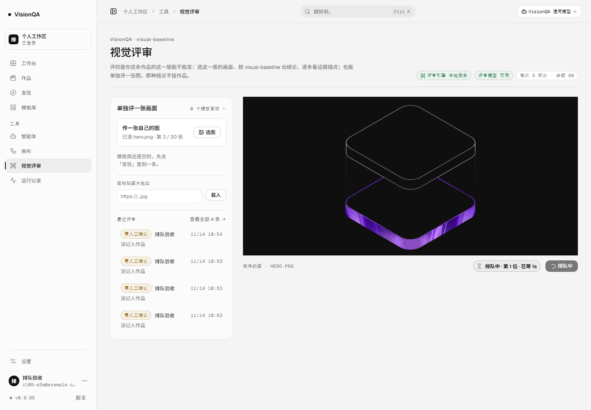

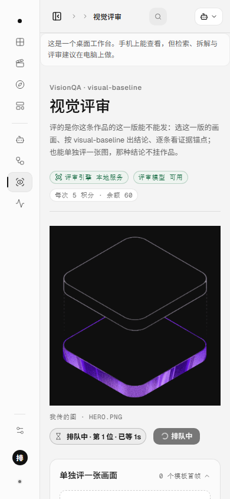

**本地两实例对照**（两个真进程 + 假评审上游，**零真实调用、零积分**）**12 / 12**：
A 发起评审 → `position 1 · ahead 0 · waiting 1 · scope lease`；B 从另一个进程查同一张票也是
`position 1 · waiting 1`；B 再发一条 → `position 2 · ahead 1`（A 查它也看到 2）。
排队期间**上游 0 次、余额不动**；放掉名额后 A 200（`waitedMs 931`、响应头 `X-VQ-Queue-Position: 1`）、
B 200（`position 2`、`waitedMs 878`）、上游 2 次、各扣 5；第三个实例排队上限 1.2 秒 →
**503**「这次评审没有开始（没有扣积分）」、上游与余额都不动。排队中关掉页面的那两次：
队里清零、余额与上游都没动（票退了、这单没开始）。

**生产只读**：发布 `20261114-030137-r105-review-queue`，两个实例都是 **0.9.95**，入口 `index-DT6Tdzrn.js`
（200 · **569,449 B**）；登录态请求 `GET /api/review/queue` 回
`waitMs 60000 · maxWaiting 4 · scope lease · waiting 0 · position null`（8800 的会话密钥与 8799 不同，
这份 cookie 在内部版上无效，所以那一格只有 8799 的实测；两个 unit 的 `WorkingDirectory` 都是 `/opt/visionqa`，
代码同一份）。线上四个模块与本地逐字节一致（`waterline c6125a81` / `routes/review 6ddffe2f` /
`invites d1d68b43` / `config cdaf77e1`），三个 unit active、盘 72%。

- **踩到的坑（如实记）**：① **`req.destroyed` 不是「人走了」**——请求体读完之后它必为 true，
  第一版拿它当判据，每单都在排队第一步退出、不写响应，客户端挂在 POST 上；单测的假 req 没有这个字段所以测不出来，
  是本地两实例验收**当场卡死**才发现的。改成只看响应侧（`watchClientGone`），aborted 时顺手 `res.destroy()`，
  并补了回归用例。② CI 撞出**邀请码 1/1024 的老 bug**：码体本身以 `VQ` 开头时，不带前缀的输入会被多剥一层判成非法码——
  顺手修掉并补成确定性用例。③ **差点覆盖同名测试**：`test/review-queue.test.mjs` 早就有（评审待办队列），
  新写的这套一开始用了同一个名字，把 12 条既有用例覆盖掉了（全量从 873 掉到 861 才发现）；已从 git 恢复，
  新文件叫 `test/review-admission-queue.test.mjs`，两个「queue」在文件头写清区别。
- **边界**：`flow_run` 还没有排队位（下一个候选，它走 NDJSON 流要多塞一种事件）；
  排队中没有「取消」按钮（关页面就退队，实测不扣费）；不估计还要等多久（前面可能排着画布出图，ETA 会编数字）；
  轮询 1.2 秒、一次只查自己那张票；队列与名额仍只在本机共享目录里，不跨机器。
- **回退**：`VQ_REVIEW_QUEUE_MS=0`（或 `VQ_REVIEW_QUEUE_MAX=0`）退回立刻 503，画布不受影响；
  整版 `bash /opt/visionqa/ops/rollback.sh --to 2`（v0.9.94），无 schema、无配置改动。

测试 **873/873**（+9 新文件、+1 条 `watchClientGone` 回归，另把 3 条「只有画布排队」的旧断言改成新口径），
oxlint 0 error / 15 warning，tsc 干净，构建通过，密钥扫描 629 文件 0。
提交 `140282c`、`d6e411a`；CI **43549303455** 三 job 全 success。
细节、六条坑与「发现但没做」见 [评审也能排队](docs/review-queue-2026-11-14.md)。

## 一百六十三、画布运行也能排队（v0.9.96，2026-11-14）

运行一条流程是这里最重的一件重活（默认 3 积分一次）：v0.9.79 ~ v0.9.95 撞上整机 3 条重活上限时立刻 503，
用户只能自己再点一次。这一版把它接进 v0.9.93 那条整机排队位（画布出图与评审已经在里面了）。

- **服务端**：`config.credits.runQueue`（`VQ_RUN_QUEUE_MS` / `VQ_RUN_QUEUE_MAX`，默认 60 秒 / 4 条，写 0 退回立刻拒）；
  `queueLimitsFor` 的 `flow_run` 从 0 改成读这一段；`POST /api/flows/:id/run` 从 `admit` 换成 `admitWaiting`——
  排到才占名额、才扣积分、才跑流程，排队期间不扣费、不跑、不碰上游；排到时响应头带
  `X-VQ-Queue-Position` / `X-VQ-Queue-Waited-Ms`，流里第一条是 `{"type":"run-queue","position":N,"waitedMs":M}`；
  新增只读 `GET /api/runs/queue?ticket=`（与评审同一个 `waterline.queueView`，票号只进不出）。
  排队文案按类型说：运行是「这次运行没有开始（没有扣积分）……等这条流程跑完再试」，不借用画布出图的「少发几张」。
- **界面**：顶栏胶囊「排队中 · 第 N 位 · 已等 Xs」+ 主按钮同刻写「排队中」；运行抽屉状态胶囊写 **QUEUED**，
  空状态写「正在排队 · 第 N 位 · 已等 X 秒（排到才开始跑，现在关掉页面不会扣费）」，排到后元信息补「排队 N 秒后开始」。
  间距只用 8px 级、圆角 `--radius-pill`、颜色只用 tokens，和画布出图那颗胶囊同一套做法。

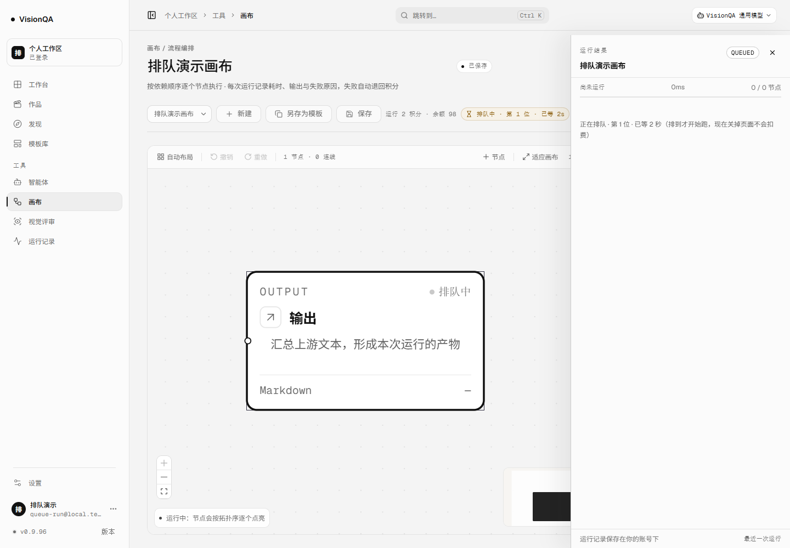

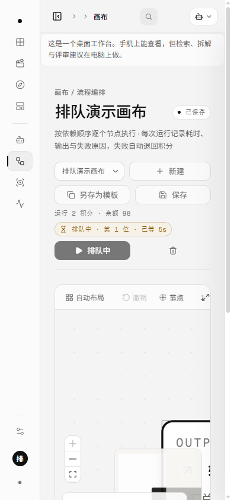

**本地实测**（真进程 + 共享租约目录里占满整机 3 条名额；画布只有一个 `output` 节点，**零上游调用**）：
空闲 `waitMs 60000 · maxWaiting 4 · scope lease · waiting 0`；发起运行 → `position 1 · ahead 0 · waiting 1`、
余额 100 没动；放掉名额 → 200（1776ms）、响应头 `X-VQ-Queue-Position: 1` / `X-VQ-Queue-Waited-Ms: 1760`、
流首条 `run-queue {position:1, waitedMs:1760}`，之后 `run-start → node-start → node-end → run-end`，
运行 `success`、`credits { cost: 2, balance: 98 }`——余额 100 → 98，只扣一次；
排队中 abort（等了 1.2 秒）→ 队里清零、余额不动、运行记录条数 1 → 1（占位记录被撤掉）。

**生产只读**：发布 `20261114-032136-20261114-112100-r106-run`，两个实例都是 **0.9.96**，入口 `index-BoDTNJr0.js`
（200 · **569,550 B**）；登录态 `GET /api/runs/queue` 回
`waitMs 60000 · maxWaiting 4 · scope lease · waiting 0 · position null`（8800 的会话密钥与 8799 不同，
这份 cookie 在内部版上无效，所以那一格只有 8799 的实测；两个 unit 的 `WorkingDirectory` 都是 `/opt/visionqa`）。
线上五个模块与本地逐字节一致（`waterline 856b9656` / `routes/flows 0dfa32cf` / `routes/review 8f1b043d` /
`config 403c6615` / `wait-queue 76c95733`），三个 unit active、盘 72%。

- **踩到的坑（如实记）**：① **等超时的拒绝会缺 status**（v0.9.95 就潜伏着）——`admitWaiting` 的 timeout 分支 spread 的 `last`
  可能停在「前面还有人，这轮让出去」那一支（只记 `ahead`、没有 status），调用方拿到的拒绝没有状态码；新用例一跑就露，
  已显式写 `status: 503` 与 `lease: null`。② **前端 `fromFlowNodes` 会丢弃已移除的节点类型**（如 review）：
  拿它造演示画布会显示「0 节点」，点运行直接提示「画布还没有节点」——排队根本没发生；演示数据要用仍在编的种类。
  ③ **同 hash 的 `Page.navigate` 不重新加载**：截图脚本第二次进同一页拿到的还是上一次的状态，先 `about:blank` 再进。
  ④ **运行抽屉会盖住顶栏右半**（1440 宽、抽屉打开时「排队中」按钮在抽屉下面），所以排队名次同时写进抽屉，
  截图也给抽屉开着的真实状态——用户等的时候眼睛本来就在抽屉里。⑤ 测试里放掉名额后要等头名真的排到（≤ 2 秒）再收尾，
  否则那条 waiter 会留在队里，把后面用例的名次全挤后一位。
- **边界**：排队中没有「取消」按钮（关页面就退队，实测不扣费）；不估计还要等多久；轮询 1.2 秒、一次只问自己那张票；
  票号绑账号、不绑标签页；运行记录在排队期间仍是 `running`（页面抽屉写 QUEUED，列表还没有独立的 queued 状态）；
  排到之后仍要过账号并发闸门（同一账号第 2 条运行 429，拦在扣费之前，钱不扣）；队列仍只跨进程不跨机器；
  评审缩图前后一致性仍缺一次真实评审授权。
- **回退**：`VQ_RUN_QUEUE_MS=0`（或 `VQ_RUN_QUEUE_MAX=0`）退回立刻 503，画布出图与评审不受影响；
  整版 `bash /opt/visionqa/ops/rollback.sh --to 2`（v0.9.95），无 schema、无配置改动。

测试 **882/882**（+9 条新文件，另把 3 条「运行不排队」的旧断言改成新口径），oxlint 0 error / 15 warning，
tsc 干净，构建入口 `index-BoDTNJr0.js`（569,550 B），密钥扫描 631 文件 0。提交 `62301f5`（代码、用例、截图；
本条 README 与设计记录在同一批文档改动里），CI **43550915156** 三 job 全 success。
细节、六条坑与「发现但没做」见 [画布运行也能排队](docs/run-queue-2026-11-14.md)。

## 一百六十四、排错队可以自己退出来（v0.9.97，2026-11-14）

画布出图（v0.9.80）、评审（v0.9.95）、运行（v0.9.96）三条队都只回答了「第几位、等了多久」，
没回答「我不想等了怎么办」——唯一的出口是关掉页面。名次又是整机口径（共享目录 + 同一把锁）：
一条没人要的等待还占着位置，后面的人就得多等一轮。这一版把出口做出来。

- **前端**：`runFlowStream` / `runReview` 各多一个 `signal`；画布页用 `runAbortRef` 管这条连接，
  `runQueuedRef` 记住「上一次问名次时还在不在排队」，取消之后据此把两句实话分开（退出排队 ≠ 中断一条已开跑的运行）；
  评审页 `queueAbortRef` 同一套，取消后给一条静默提示（`role=status`、中性色、没有「重试」），因为这不是失败。
  画布取消后节点退回「还没跑」，不当成一条失败标红。
- **入口**：只在「名次条还在」时渲染——排到之后条子收起、按钮跟着消失，不会把一条正在跑的运行/评审 abort 成「已取消」。
  运行给到顶栏胶囊与运行抽屉两处（1440 抽屉会盖住顶栏右半），评审给到名次条；胶囊里的取消是 8px 间距、
  整个胶囊高度都能点（24px），圆角跟着胶囊走，颜色只用 tokens；名次放不下时省略「已等 Xs」，取消按钮整块留着。
- **服务端**只动一处判据：`watchClientGone` 不再把「响应正常写完」当成「人走了」（见坑 ①）。

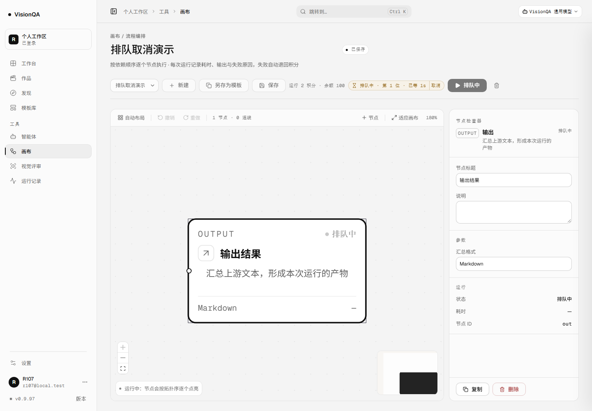

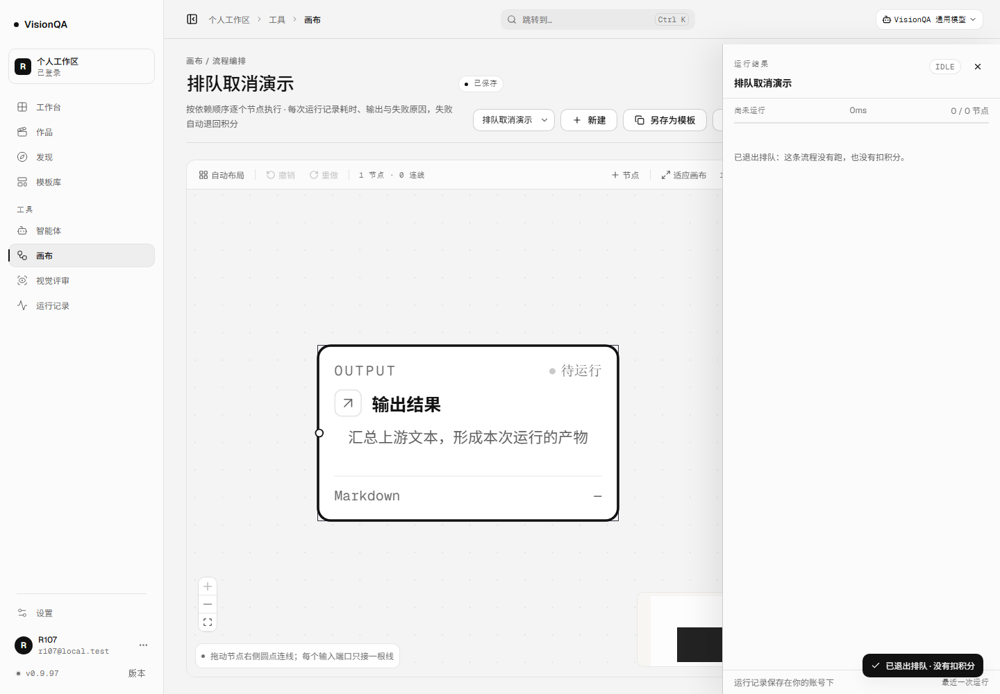

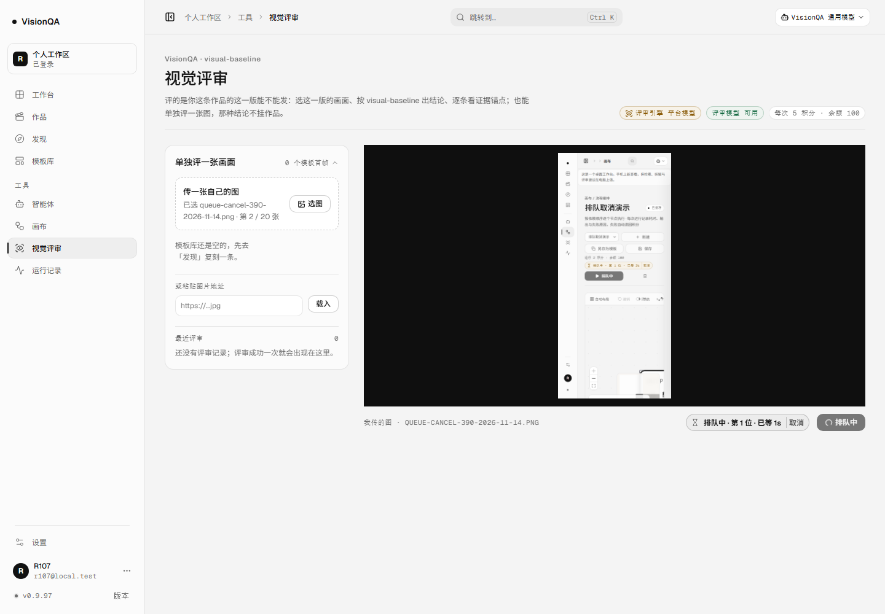

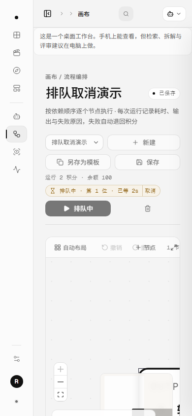

**本地实测**（真进程 8922 + 共享租约目录里占满整机 3 条名额 + 真 socket；画布只有一个 `output` 节点，
评审用一张本地截图，**零上游调用**）：curl 起一条运行、1.2 秒后自己挂断 → 排队中
`position 1 · ahead 0 · waiting 1 · waitedMs 1224`；挂断 0.9 秒后 `waiting 0 · position null`，
`entered 1 · served 0 · timedOut 0`（既没排到、也不是等超时），余额 **100** 没动、运行记录 `total 0`（占位记录撤掉）。
浏览器里点运行 → 胶囊「排队中 · 第 1 位 · 已等 1s / 取消」、抽屉 QUEUED +「取消排队」；点取消 → 抽屉
「已退出排队：这条流程没有跑，也没有扣积分。」、提示条「已退出排队 · 没有扣积分」、节点回「待运行」，
`balance 100 · waiting 0 · runs 0`。评审页传一张图 → 开始评审 → 取消：名次条收起、静默提示不扣模型也不扣积分，
`balance 100`（评审 5 积分一分没扣）· `waiting 0` · `reviews 0`。390 宽胶囊独占一行、不溢出，窄屏取消同样退干净。

**生产只读**：发布标签 `20261114-115500-r107-cancel`，两个实例都是 **0.9.97**，公网
`https://visionqa.wavisionai.cn/api/version` 0.9.97，入口 `index-DRgO9ONA.js`（200 · **570,432 B**，旧入口 404）；
登录态 `GET /api/runs/queue` 与 `/api/review/queue` 都回 `waitMs 60000 · maxWaiting 4 · scope lease · waiting 0`
（本机一次性会话读到后立刻销毁，销毁后同一份 cookie 访问 `/api/credits` 回 401）；
六个文件与本地逐字节一致（`waterline 4bd75a95` / `routes/flows 0dfa32cf` / `routes/review 8f1b043d` /
`config 403c6615` / `wait-queue 76c95733` / 入口 `986840ab`），两个 unit active、盘 72%。

- **踩到的坑（如实记）**：① **`watchClientGone` 把「响应正常写完」也当成「人走了」**（v0.9.95 起潜伏）——
  判据里带着 `res.writableEnded === true`，正常结束与客户端取消混成同一件事；它只在排队期间被调用所以一直没出事，
  新用例「正常写完再关不算走」当场抓到，判据收紧成 `gone || res.destroyed`。② CDP `Runtime.evaluate` +
  `returnByValue` 遇到 DOM 节点报 `Object reference chain is too long`：等元素的表达式忘了套 `Boolean(...)`。
  ③ evaluate 的字符串里不能引用 Node 变量（`session is not defined`），值要用 `JSON.stringify` 注进去。
  ④ 评审不是流式的，abort 一条已开跑只会让页面拿不到结论、服务端照跑照扣，所以入口只随名次条出现，
  文案按「上一次轮询还在不在排队」分两句。⑤ 运行抽屉在 1440 会盖住顶栏右半，取消入口在抽屉里也给一份。
  ⑥ 点取消到服务端真退队有 ≤ 一轮轮询（约 0.5 秒）的延迟：页面先回空闲，服务端下一轮 tick 才发现连接没了。
- **边界**：排到之后想停还没有（需要节点边界上的真中断协议）；不估还要等多久；运行记录排队期间仍写 `running`；
  票号绑账号不绑标签页；队列仍只跨进程不跨机器；评审页没有 toast，用静默提示条代替。
- **回退**：整版 `bash /opt/visionqa/ops/rollback.sh --to 2`（v0.9.96），无 schema、无配置改动；
  只退前端也可以（服务端只收紧了判据，老前端不受影响）。

测试 **888/888**（+6 条新文件），oxlint 0 error / 15 warning，`tsc -b` 干净，构建入口 `index-DRgO9ONA.js`（570,432 B），
密钥扫描 633 文件 0。提交 `5d99884`（代码、用例、六张截图），CI **43553499462** 三 job 全 success。
细节、六条坑与「发现但没做」见 [排错队可以自己退出来](docs/queue-cancel-2026-11-14.md)。

## 一百六十五、运行记录不再把「排队中 / 运行中」说成失败（v0.9.98，2026-11-14）

0.9.96 让运行能排队、0.9.97 让排错队的人能退出来。但运行记录这一页一直没跟上：记录一开始就写
`running`（哪怕还在队里），而页面把所有「不是成功」都画成红点 +「失败」并补一句「积分原路退回」。
于是排队那 60 秒里，一条**一分没扣、一步没跑**的等待，看起来像已经失败并退了钱；正在跑的那条也一样。
数据是对的，页面在撒谎。这一版让这一页说实话。

- **服务端**：`startFlowRun` 多一个 `queued` 选项，先落 `status: 'queued'` 与 `queuedAt`（页面据此算「排队 Ns」）；
  排到、扣完费（流式与 JSON 两条路径）立刻 `markRunStarted` 翻成 `running` 并记下开始时间与排队时长。
  为什么不等 `runFlow` 自己落盘：扣费已经发生，进程若在这两步之间被杀，启动恢复只能按记录状态判断——
  记录还写着 queued 就会被当「没花过钱」清掉，账就少了 2 积分。启动恢复对 queued 记录先按账本净额退一次
  （正常为 0）再撤掉，不留一条永远「排队中」的行；`abandonRun` 也认这个状态。
- **前端**：新的 `runStatusMeta` 一处定义「成功 / 运行中 / 排队中 / 已中断 / 失败」的颜色与说明，运行记录页的
  行与详情、工作台「最近运行」、后台审计三处都读它（后台的状态表补了 queued）。运行记录页只要本页还有
  running / queued 的行，就每 3 秒**安静刷新**一次——不整页重载、不把选中项跳回第一条、不闪「读取运行记录…」，
  跑完自动停。排队中的详情不再写「消耗 2 积分」，改「排到后扣 2 积分」。
- **本地实测**（真进程 8931 + 假上游 7 秒 + 共享租约目录占满整机 3 条名额，**零真实上游**）：排队时记录
  `status: queued`、页面「排队中 · 排队 2s · 排到后扣 2 积分」、余额 100 不动；排到后同一行变「运行中 · 已跑 0s」，
  详情里输入节点已经出现；同一张页面 9 秒后没有刷新，两行都变成「成功」、详情 7.0s 三节点齐全、余额 96。
  排队等到 60 秒上限 → 503「排队等了 60 秒还没轮到」、记录消失、余额不动；排队中重启服务 →
  重启前 1 条 queued + 2 条成功、重启后只剩 2 条成功、余额仍是 96、队里 waiting 0（恢复把没扣钱的单撤了）。
  390 宽 `scrollWidth 380`，行、详情、按钮都在画面内。

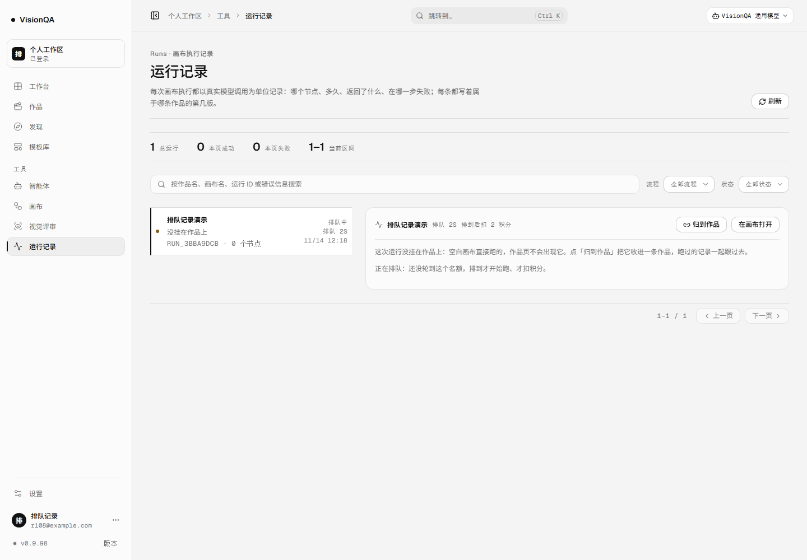

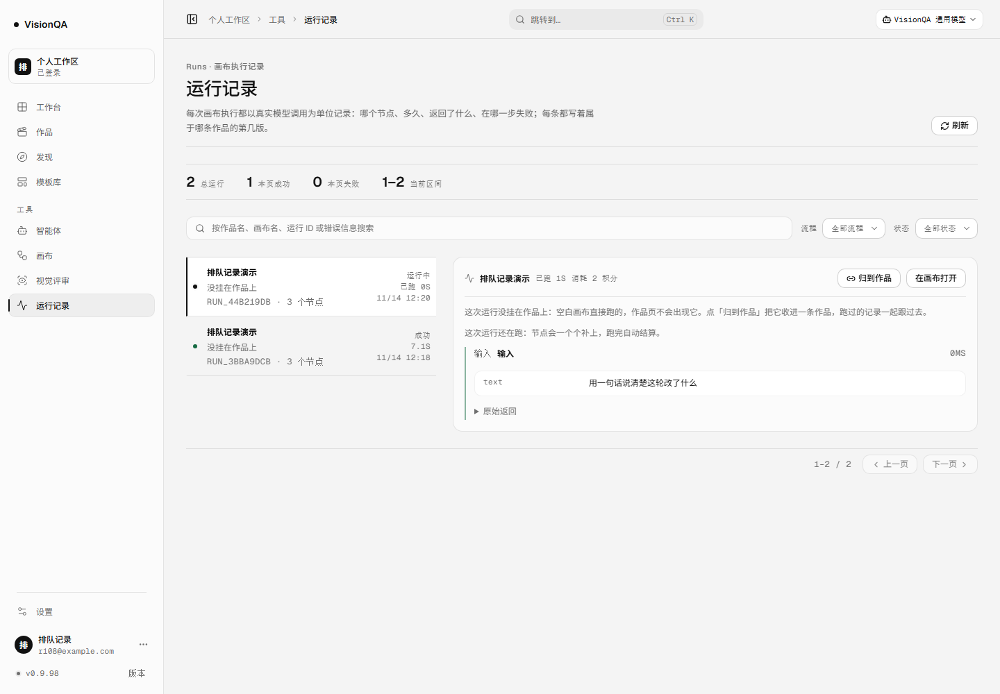

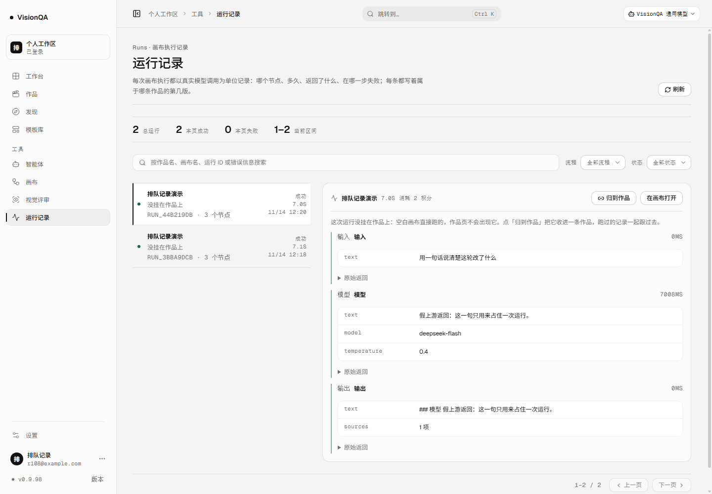

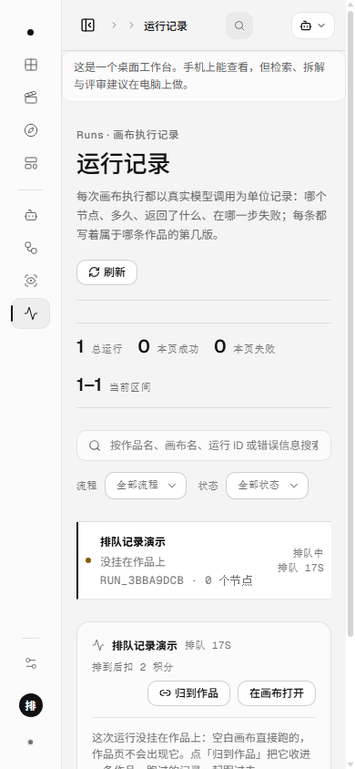

- **生产只读**：发布标签 `20261114-123000-r108-queued-record`，两个实例都 **0.9.98**，公网
  `https://visionqa.wavisionai.cn/api/version` 0.9.98，入口 `index-BSqJvpCr.js`（200 · **571,700 B**，旧入口 404）；
  登录态 `GET /api/runs/queue` 与 `/api/review/queue` 都回 `waitMs 60000 · maxWaiting 4 · scope lease · waiting 0`
  （本机一次性会话读到后立刻销毁：`POST /api/auth/logout` 204，同一份 cookie 再访问 `/api/credits` 回 401）；
  四个文件与本地逐字节一致（`flows.mjs 6f7caefa` / `routes/flows.mjs 81c82e48` / 入口 `7a9659bf` / 样式 `3ce4fed3`），
  两个 unit active、盘 72%，服务器 `/tmp` 已清。
- **踩到的坑（如实记）**：① 记录「queued 但钱已经扣了」的窗口——恢复唯一的判据是记录状态，所以
  `markRunStarted` 必须在扣费成功与执行之间，且要有极端时序的用例（已扣钱的排队单被恢复时先退款再撤）。
  ② `runFlow` 会用自己造的对象覆盖同一条记录，排队时长留不到终态记录里，别指望；排队时长以路由层推的
  queue 事件为准。③「非成功 = 失败」是这轮真正的坏味道：排队中、在跑、已中断三种「没跑完」语义完全不同，
  共用一个红点就会把「失败 + 已退款」变成假话。④ 轮询不能复用手动 `load()`：它会跳回第一条并闪 loading，
  要单独一个保住选中项的安静刷新。⑤ 排队单写「消耗 2 积分」也是假话——文案要跟状态走，不能只看
  `credits.cost`。⑥ 启动恢复按状态分流：queued 撤、running 标中断退款，两条都按账本净额退一次。
- **边界**：排到之后的真中断还没有（需要节点边界协议）；启动恢复分不清「另一个实例正在跑」——两个实例共享
  `DATA_DIR`，只重启其中一个会把另一个实例在跑的单标中断并退款（下一轮用实例心跳修）；终态记录里没有
  排队时长；不给 ETA；票号绑账号不绑标签页；队列仍只跨进程不跨机器；移动端仍是「这是一个桌面工作台」的提示。
- **回退**：整版 `bash /opt/visionqa/ops/rollback.sh --to 2`（v0.9.97），无 schema、无接口破坏
  （新增字段全部可选，老前端忽略；没有 queued 记录时行为与 0.9.97 一致）。

测试 **892/892**（+4 条新用例），oxlint 0 error / 15 warning，`tsc -b` 干净，构建入口 `index-BSqJvpCr.js`（571,700 B）、
样式 `index-cGfb30jh.css`（275,109 B），密钥扫描 635 文件 0。提交 `183338b`（代码、用例、四张截图），
CI **43556570789** 三 job 全 success。细节、六条坑与「发现但没做」见 [运行记录说真话](docs/run-queued-state-2026-11-14.md)。


## 一百六十六、实例心跳：谁在跑、重启会不会误伤，现在能看见（v0.9.99，2026-11-14）

上一轮把「两个生产实例共用 `DATA_DIR`，重启一个会收掉另一个在跑的单」写进了遗留清单。这一轮开工先核对前提：
`visionqa` 用 `/var/lib/visionqa`，`visionqa-internal` 用 `/var/lib/visionqa-internal`（`/etc/visionqa-internal.env`），
两边各有自己的 `runs.json`——**当前生产拓扑下不存在这条资损路径**，上一轮那句判断是错的，以这一轮实测为准。
但「多实例共目录」是将来灰度 / 多开一定会踩的问题，本地两个真进程共目录也把它跑出来了，所以这版仍然把
「实例是否活着」落进共享目录：启动恢复只收主人真的死了的单，后台也能直接看到谁在跑。

- **服务端**：`server/instances.mjs` 每个实例写一份心跳（`DATA_DIR/instances/<sha256(id) 前 16 位>.json`，
  `{id,pid,host,bootId,startedAt,beatAt}`），10 秒一拍、原子 rename、SIGTERM 时摘掉；实例身份默认
  `public:8799` / `internal:8800`（`VQ_INSTANCE_ID` 可覆盖），重启不换身份、不带主机名。启动顺序改成
  **先心跳、再恢复**：另一个实例恰好这时启动才看得见我们。启动 / 停机日志都带 `instance`。
- **判据不只看心跳时间**：心跳新 + 同机 pid 在 + 同一次开机（`boot_id`）才算活。只按时间判断的话，
  进程刚崩、马上重启时旧心跳还在 60 秒 TTL 里，一条已经没人执行的记录会被当成「别人在跑」永远挂着——
  这是这轮最需要写对的点。`dead / stale / restarted / bad` 一律照旧收；`ownerInstance === self` 也照旧收
  （自己重启时旧进程已经死了，不能因为它「看起来活着」就跳过）。
- **记录带执行实例**：占位记录与 `runFlow` 覆盖记录时都写 `ownerInstance`。`runFlow` 会用自己的对象覆盖
  同 id 占位记录，这里漏写就找不到主人（和上一轮 `queuedMs` 丢在同一个地方）。
- **后台**：运行审计顶部多了「执行实例」卡片（实例 / 状态 / 进程 / 最后心跳 / 启动，本实例有标记，
  心跳写失败会在卡片里直说），运行详情多一行「实例」；`GET /api/admin/instances` 是它的真实接口。
- **本地实测**（A 8931、B 8932 共用一份 `DATA_DIR`，假上游延迟 7 秒，**零真实上游**）：A 跑 `input → llm → output`
  时 `run_e9df336f` 为 `running`、`ownerInstance=public:8931`、余额 100；**A 还在跑时重启 B**，B 启动日志是
  `runs.recovered {"recovered":0,"refunded":0,"dropped":0,"skipped":1}`——看到 A 活着，没动它的单。A 跑完
  `success · 7054ms · 3 个节点`，余额 98、扣费 1 笔、退款 0 笔；两个心跳都 `alive`（pid 11308 / 18372）。
  对照用例把心跳改成过期或 pid 已死，同一条记录立刻 `recovered 1 / refunded 1`——旧代码无条件走的就是这条分支。

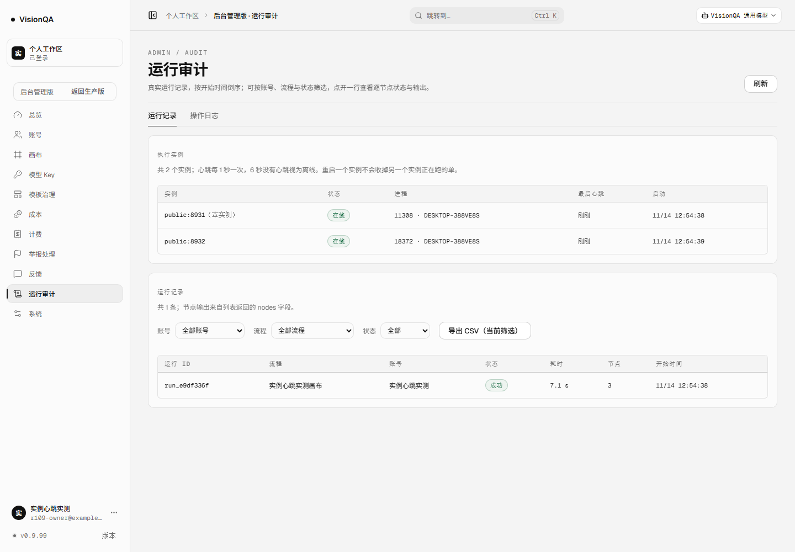

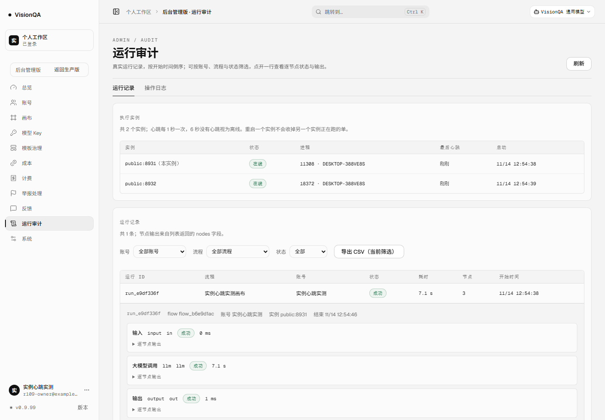

- **生产实测**：发布标签 `20261114-130500-r109-instance-heartbeat`，两个 unit active，8799 / 8800 都 **0.9.99**，
  公网 `/api/version` 0.9.99；心跳文件分别在两个数据目录里：`public:8799` pid 1477021、`internal:8800` pid 1477188；
  重启内网实例后公网 pid **不变**、`/api/health` uptime 94→98，内网 pid 换新并继续心跳；停机日志
  `{"t":"shutdown","signal":"SIGTERM",...,"instance":"internal:8800"}`；一次性会话读 `/api/admin/instances`
  得到 1 项 `public:8799 alive`，logout 204 后同一 cookie 回 401；四个服务端文件、入口与后台 chunk 与本地
  逐字节一致（`instances 4d1dd78e` / `flows 8e8bdce0` / `index 7495fabb` / `routes/admin bab85751` /
  `入口 00401a2d` / `后台 93551994`）；公网入口 `index-pf_kUpu9.js` 200 · **571,700 B**，旧入口 404；
  盘 72%，服务器 `/tmp` 已清。
- **诚实说明**：生产两个实例的 `DATA_DIR` 是分开的，没有一条「别的实例正在跑」的记录可供线上验证 skip；
  这条路径的证据来自本地双进程 + 7 条单测。生产这边验证的是心跳真的落盘、重启互不影响、后台看得见、
  文件与本地一致。
- **踩到的坑（如实记）**：① 前提也要验证——上一轮把「共享 DATA_DIR」当事实写进清单，这轮 `systemctl cat`
  才发现是两份独立目录；跨实例行为先看 unit 的 `EnvironmentFile`。② 心跳新 ≠ 活着，必须核对 pid（与
  boot id），否则崩溃后 60 秒内重启会让旧记录永远 running。③ 同 id 重启必须收自己的单，不能只看「主人活着」。
  ④ `runFlow` 覆盖占位记录时 `ownerInstance` 要写回。⑤ 两个用户写同一目录：目录 `0777`、chmod 失败要吞，
  心跳写失败只降级为后台可见错误，不能挡服务启动。⑥ 升级前的旧记录没有 `ownerInstance`，按旧规则收；
  两个 unit 几乎同时 SIGTERM，实际不会误伤。⑦ Windows 的 SIGTERM 是强杀、不跑优雅停机，本地靠 pid 判死，
  别把本地行为当生产行为。⑧ 跨机器共 `DATA_DIR` 不支持：id 用角色 + 端口，同 hostname/端口会撞。
- **边界**：挂死但进程还在的实例不会自动收尸（启动恢复只在启动时跑，没有周期巡检）；后台实例表只读，
  没有手动收尸按钮，内网 8800 只看得到自己；排到之后的真中断、`queuedMs` 入终态、ETA、票号绑账号、
  跨机器仍未做；实例心跳没有接 webhook 告警。
- **回退**：整版 `bash /opt/visionqa/ops/rollback.sh --to 2`（v0.9.98）。无 schema、无接口破坏：
  `ownerInstance` 与心跳文件都是新增的，老前端忽略；旧版本不读 `DATA_DIR/instances`。

测试 **899/899**（+7 条新用例），oxlint 0 error / 15 warning，`tsc -b` 干净，构建入口 `index-pf_kUpu9.js`（571,700 B）、
后台 chunk `AdminConsolePage-DH64Z1GT.js`（200,520 B）、样式 `index-cGfb30jh.css`（275,109 B），密钥扫描 637 文件 0。
提交 `926fe3f`（代码、用例、两张截图、0.9.99），CI **43559220282** 三 job 全 success。细节、八条坑与
「发现但没做」见 [实例心跳与启动恢复](docs/run-instance-heartbeat-2026-11-14.md)。


## 一百六十七、排队等了多久，跑完还查得到（v0.9.100，2026-11-14）

v0.9.96 起运行会排队，页面在等的时候写「排队 6s」；但一条运行跑完，记录上只剩节点耗时。
用户在外面等了 5.8 秒，详情写「6.5s」——等待凭空消失，后台按耗时排查「为什么慢」也看不到排队。
更具体的浪费：`markRunStarted()` 排到名额、扣完费时**已经算好了** `queuedMs`，可 `runFlow()`
会用自己造的对象覆盖同 id 的占位记录，终态对象里没有这两个字段——算完就丢（和上一轮
`ownerInstance` 是同一类坑）。这一轮把这条链路补完，并把等待放回三个界面。

- **终态接住占位字段**：`runFlow()` 构造运行对象前先按 `runId` 读一次占位记录，把 `queuedAt` /
  `queuedMs` 写回终态；成功、失败、流式、非流式都走同一条。`runSummary()` 也补上 `queuedMs`，
  作品页才不会单独丢。
- **前端一个口径**：`runSpentText()` 统一写「排队 5.8s · 运行 6.5s」；1 秒以内不提排队——那只是
  占位到扣费之间的 20–30ms，不是用户真在门口等，原始毫秒仍留在接口与 CSV 里。
- **后台运行审计**：表格新增「排队」列；顶部写「本页 N 条里几条排过队、平均等多久、最长多久」；
  CSV 新增「排队 ms」。只统计当前页 50 条，文案写「本页」，不冒充全量。
- **作品页**：一条作品的运行归集里多一段「排队 5.8 秒」，看这条作品跑过几次时不用猜。

| 本地实测（8931，假 LLM 延迟 6.5s，整机只留 1 条重活名额，零真实上游） | 读数 |
| --- | --- |
| 第一条 `run_01a6180e` | 排队 25ms（进门）· 运行 6538ms · 13:19:04.273 → 13:19:10.811 |
| 第二条 `run_cdb1f223` | **排队 5842ms** · 运行 6520ms · 13:19:05.151 开始等 → 13:19:10.994 才开跑 → 13:19:17.514 结束 |
| 先后关系 | 第一条结束早于第二条开跑；假上游只被调用 **2** 次，排队期间没有提前打模型 |
| 页面实测 | `排队 5.8s · 运行 6.5s`；后台「本页 2 条里 1 条排过队，平均等 5.8 s，最长 5.8 s」，另一行排队列 `—` |
| 390 宽 | `scrollWidth 390 = clientWidth 390`，行 / 详情 / 按钮都在画面内 |

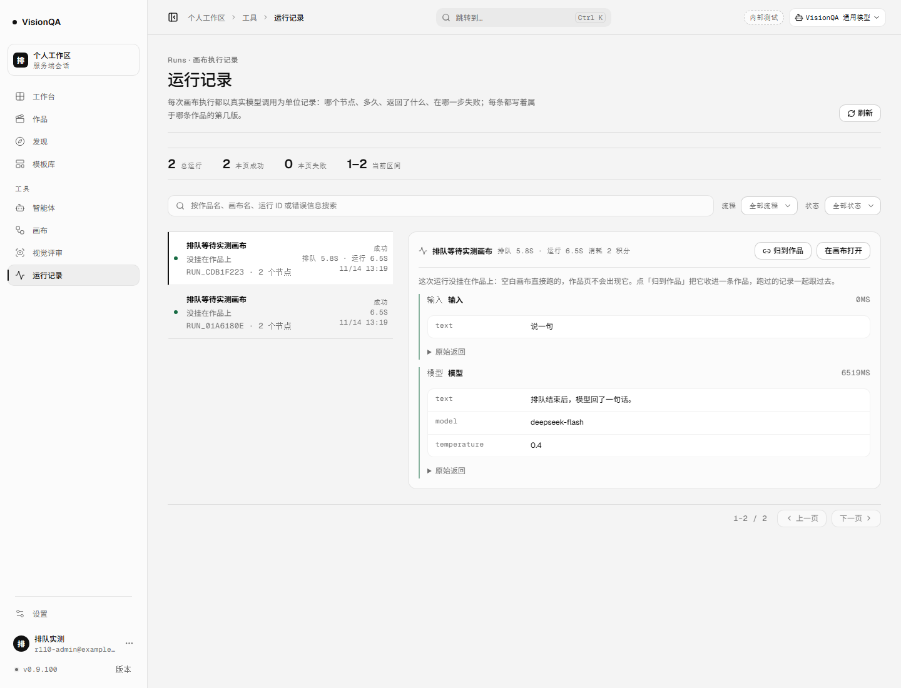

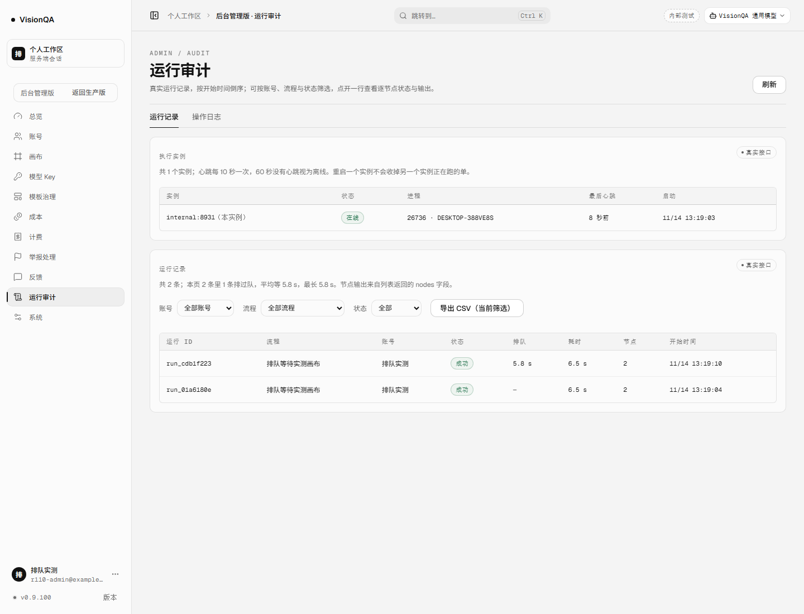

- **生产实测**：发布标签 `20261114-133000-r110-queue-wait`，两个 unit active，8799 / 8800 都 **0.9.100**，
  公网 `/api/version` 0.9.100；入口 `index-B01dXERS.js` 200 · **571,904 B**，旧 `index-pf_kUpu9.js` 404；
  后台 chunk `AdminConsolePage-Da6YCQ1K.js`（201,076 B）、样式 `index-cGfb30jh.css`（275,109 B）；
  `flows.mjs ec962b5c` / 入口 `882d577d` / 后台 `b592fbc2` / 样式 `3ce4fed3` 与本地一致；
  心跳 `public:8799` pid 1477771、`internal:8800` pid 1477769；盘 72%，`/tmp` 已清。
- **诚实说明**：生产这次没有真实运行（零授权上游），线上还没有一条「排过队」的新记录可展示；
  生产验证的是版本、入口、文件一致与两个实例健康。排队效果来自本地两个真进程 + 假上游，以及
  路由级用例。
- **踩到的坑（如实记）**：① `runFlow` 覆盖占位记录，`queuedMs` / `queuedAt` / `ownerInstance`
  都必须显式带走——先读占位记录再构造终态，治根。② 不能把 25ms 写成「排队 0.0s」，页面要设
  1 秒门槛，否则每条运行都像排过队。③ `runSummary()` 是单独的序列化边界，漏字段时接口和运行
  记录页都正常、只有作品页看不到，最难发现。④ 后台只加载 50 条，统计必须写「本页」；要全量
  得另做服务端聚合。⑤ `formatDuration(0)` 是「0 ms」不是「—」，表格要显式判断。⑥ 旧记录没有
  `queuedMs`，不能拿 `startedAt - createdAt` 反推（终态没存 `createdAt`），没有就只写运行耗时。
  ⑦ CSV 存原始毫秒、页面做 1 秒门槛，两边口径不同是故意的。⑧ 改完前端要重新 build 再截图。
- **边界**：不给 ETA（运行 / 出图 / 评审共用整机队但耗时差异大，估时就是编数字）；交付稿与 A4
  打印稿的运行表还只写耗时；评审 / 画布出图的等待没有进各自记录；历史记录不能回填；后台没有
  跨页或按时间段的排队趋势；排到之后的真中断、票号绑账号、跨机器仍未做；生产没有真实运行授权。
- **回退**：整版 `bash /opt/visionqa/ops/rollback.sh --to 1`（v0.9.99；`--to 2` 是 v0.9.98）。无 schema、无接口破坏：
  `queuedMs` 是新增可选字段，老前端忽略；`runFlow` 多读一次内存缓存，旧版本不受影响。

测试 **900/900**（+1 条新用例，原有排队路由用例增加断言），oxlint 0 error / 15 warning，`tsc -b` 干净，
构建入口 `index-B01dXERS.js`（571,904 B）、后台 chunk `AdminConsolePage-Da6YCQ1K.js`（201,076 B）、
样式 `index-cGfb30jh.css`（275,109 B），密钥扫描 640 文件 0。提交 `5a6d7bc`（代码、用例、三张截图、
0.9.100），CI **43561427189** 三 job 全 success。细节、八条坑与「发现但没做」见
[排队等了多久](docs/run-queue-wait-2026-11-14.md)。

## 一百六十八、跑到一半想停，这次真能停（v0.9.101，2026-11-14）

v0.9.97 只处理了「还在排队」的取消；排到名额、开始跑之后，用户关页面只是不再听响应，服务端照跑照扣。这一轮补上已经开跑之后的停止：画布顶栏在拿到 run id 后出现「停止运行 Ns」，点它通过 `POST /api/runs/:id/stop` 中止当前上游；文本模型、评审服务与隔离 worker 都接同一条 signal，外部 signal 与超时合并，中止时不再换 Key / 换模型继续烧钱。

停止的终态是 `interrupted + canceled`，不是失败；积分按**已经跑完的节点**结算：2 个节点、跑完 1 个、本次 2 积分，就留 1 退 1，`settled` 防止收尾时再全额退一次。页面抽屉写 STOPPED、「已退 1 积分 · 已跑部分 1 积分」，未跑完的节点回到「待运行」；运行记录与作品页把它叫「已停止」，花费只算留下的部分。页面被关掉 / 连接断开也走同一条停止逻辑。

本地 8931 + 假上游 8 秒：运行 1.4 秒后点停止，`run_b7feb926` 1.6s、1/2 节点、`kept=1 / refundedAmount=1 / settled=true`，余额 100 → 99，账本 `-2` 与 `+1` 同一 ref；390 宽无横向溢出。全仓 **902/902**（+2），lint 0 error，`tsc` 与 build 干净。细节、十一条坑与「发现但没做」见 [跑到一半想停](docs/run-stop-2026-11-14.md)。

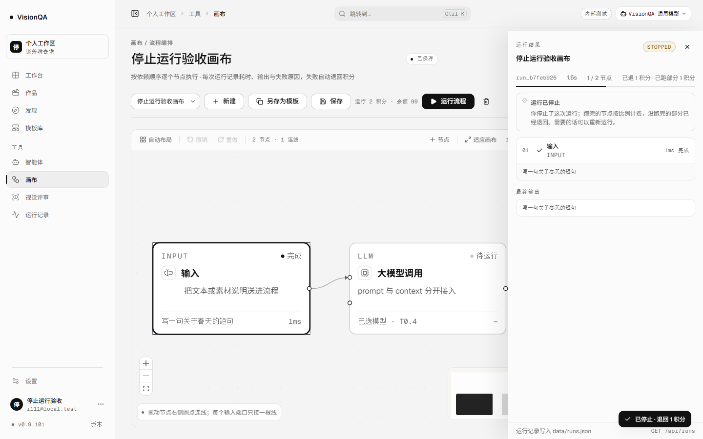

回退：`bash /opt/visionqa/ops/rollback.sh --to 1` → v0.9.100（`--to 2` 是 v0.9.99）。停止接口与终态字段都是新增，旧前端忽略。


## 一百六十九、停下来之后，接着跑没跑完的节点（v0.9.102，2026-11-14）

v0.9.101 能停，但停完只有「重新运行」——已经跑完、已经付过钱的节点会再调一次上游，用户再付一次整张画布的钱。这一轮把「接着跑」放进运行抽屉：请求体带 `resumeOf`，服务端只复用上次 success / unsupported 的节点，失败节点和它的下游重跑；条件分支、输出和上下文一起带回。画布用内容指纹（节点 id / 类型 / 配置 + 连线，不算位置）校验，改过提示词或连线就拒绝复用，只挪节点位置仍可续跑。

钱只补上次没付的那部分：主动停止按「原价 − kept」补；失败 / 重启已全额退，按剩下节点比例收。新运行有自己的 id、账本 ref 与 `billTotal / billFinished`，复用节点算「跑完」但不进计费分母，`settled` 继续防二次全额退。页面在 STOPPED / ERROR 且还有未跑节点时给出「还差 N 个节点」「继续运行 · N 积分」；复用节点标「复用 · 已跑过」，运行记录写「续跑自 run_x」。全部节点都有结果后才收到停止请求时，按成功收尾，不再出现跑完却 STOPPED 的记录。

本地 8931 + 假上游 8 秒：运行 1.4 秒后停止，`run_4cfe46e3` 1.6s、1/2 节点、`kept=1 / refundedAmount=1`，余额 100 → 99；续跑 `run_b6481434` 8.0s、success、`resumeOf=run_4cfe46e3`、`reusedNodes=1`、`billTotal=1`，余额 99 → 98；整个流程假上游只被调用 **2** 次，输入节点没有重复调用。390 宽 `scrollWidth 390 = clientWidth 390`。全仓 **904/904**（+2），lint 0 error / 15 warning，`tsc` 与 build 干净。

生产发布标签 `20261114-143300-r112-resume`：8799 / 8800 / 公网都 **0.9.102**，入口 `index-Dyt6TrgG.js` 200 · **573,264 B**，画布 `CanvasPage-B-J7bEYt.js` 234,055 B、后台 `AdminConsolePage-Imb_ZQK4.js` 201,075 B、样式 `index-C09qhU_5.css` 275,246 B；文件中与本地一致，两个实例心跳 pid 1479312 / 1479310，盘 72%。旧入口 URL 仍返回 200，但那是 729 B 的 SPA 兜底 HTML，不是旧 JS——上一版哈希已不在发布目录，旧标签页要刷新；前几轮把 200 当「保留旧资源」是误判。生产没有真实运行授权，线上没有真实续跑记录，功能证据来自本地真浏览器 + 假上游与路由用例。

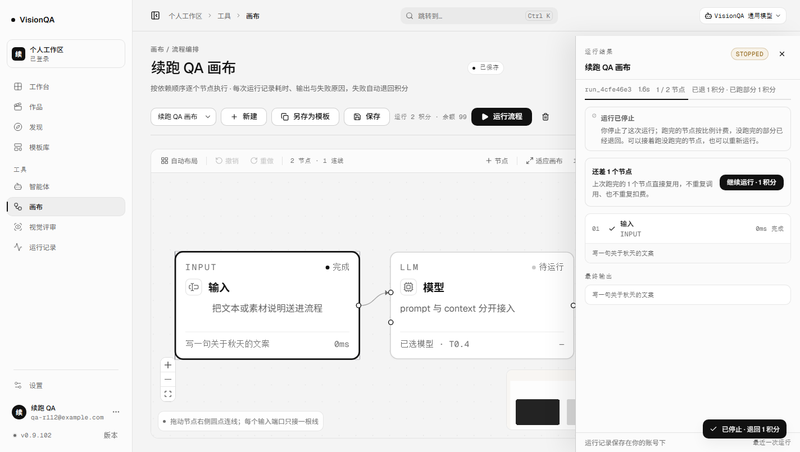

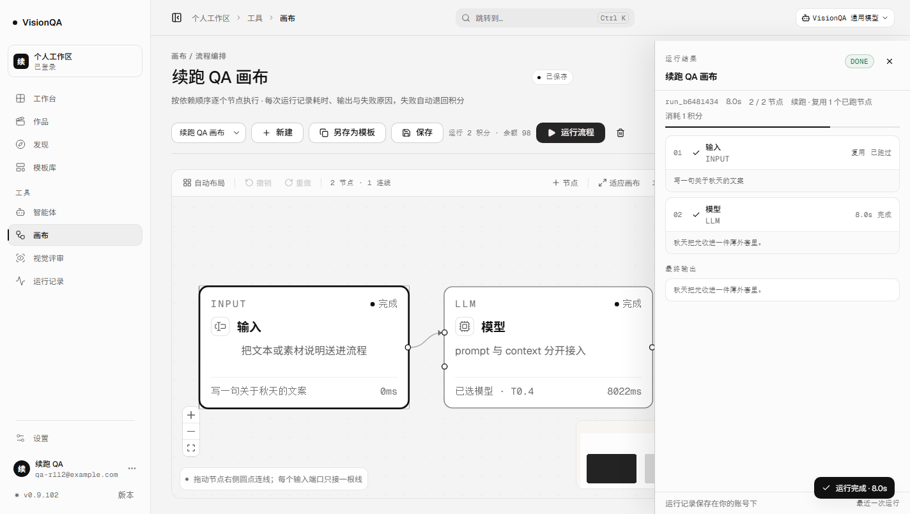

回退：`bash /opt/visionqa/ops/rollback.sh --to 1` → v0.9.101（`--to 2` 是 v0.9.100）。`resumeOf` 与几个新字段都是可选；老前端不传时走原来的整图运行。细节、十一条坑与「发现但没做」见 [停下来之后接着跑](docs/run-resume-2026-11-14.md)。

## 一百七十、画布改过之后，只重跑改过的节点（v0.9.103，2026-11-14）

v0.9.102 能「停下来接着跑」，但判断标准是整张画布：改一个字的提示词，整条续跑就被拒绝，前面已经跑完、已经付过钱的输入和模型节点跟着作废。这一轮把判断下放到每个节点：**只重跑自己改过的节点和它的下游，没改的上游继续复用**。

- **逐节点指纹**：`nodeRevisionsOf()` 按拓扑序，对每个节点哈希「自己的 id / 类型 / 配置 + 入线 source / sourceHandle / targetHandle + 所有上游节点的指纹」。改第二段 → 第二段和下游失效，输入与第一段仍可复用；只挪位置、改标题、改说明不算内容。
- **旧运行有回退**：v0.9.102 的记录没有 `nodeRevisions`，退回整图 `flowRevision`：画布没改整批复用，改了就没有可证明没变的节点。条件分支继续按上次 `branch` 恢复分支边。
- **预检只说真数**：新增只读 `GET /api/flows/:id/resume-plan?runId=run_x`，返回 `total / reused / rerun / stale / cost / resumable`；和真正续跑共用 `resumePlanFor()`，不扣费、不写记录。
- **页面**：停止后关抽屉去改画布，顶栏留「上次运行」入口；抽屉写「还差 3 个节点」「复用 2 个、改过 1 个和它的下游重跑」；没有可复用节点时给「从头运行」。预检等画布保存完成才发，保存失败时不会拿没落盘的画布去续跑。
- **钱与分母**：续跑价仍是「上次原价 − kept」；新运行 `billTotal = 当前画布节点数 − 本次复用数`，`billFinished` 只加这次真正执行的节点；停止结算继续用这两个数，`settled` 防二次全额退。

| 本地实测（8931 + 假上游 8963，每次 3 秒，零真实上游） | 读数 |
| --- | --- |
| 第一次运行 | 跑到第三段时停止；`run_7c68530f` · interrupted · canceled · 6.4s |
| 节点 / 结算 | 5 个节点 3/5 跑完；`cost=5 / kept=3 / refundedAmount=2 / settled=true`；余额 140 → 137 |
| 改画布 | 只改第二段提示词，其余不动；保存成功 |
| 预检 | `reused=2 / rerun=3 / stale=1 / cost=2 / resumable=true` |
| 续跑 | `run_6a8ee8d9` · success · 6.0s · `resumeOf=run_7c68530f` · `reusedNodes=2` |
| 计费 / 上游 | 本次 `cost=2 / billTotal=3 / billFinished=3`；余额 137 → 135；假上游总共 **5** 次，输入与第一段没有重复调用 |
| 390 宽 | `scrollWidth 380 = clientWidth 380`，预检卡片与按钮都在画面内 |

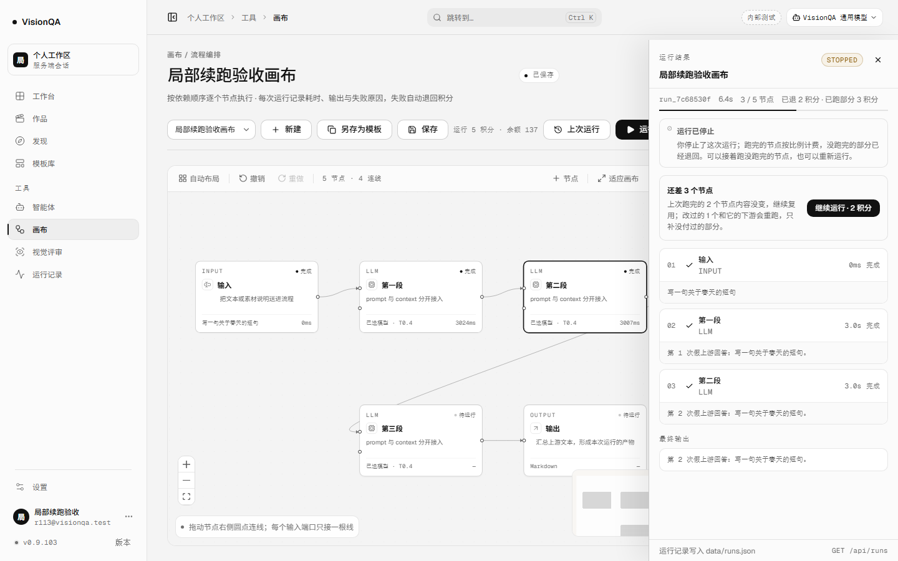

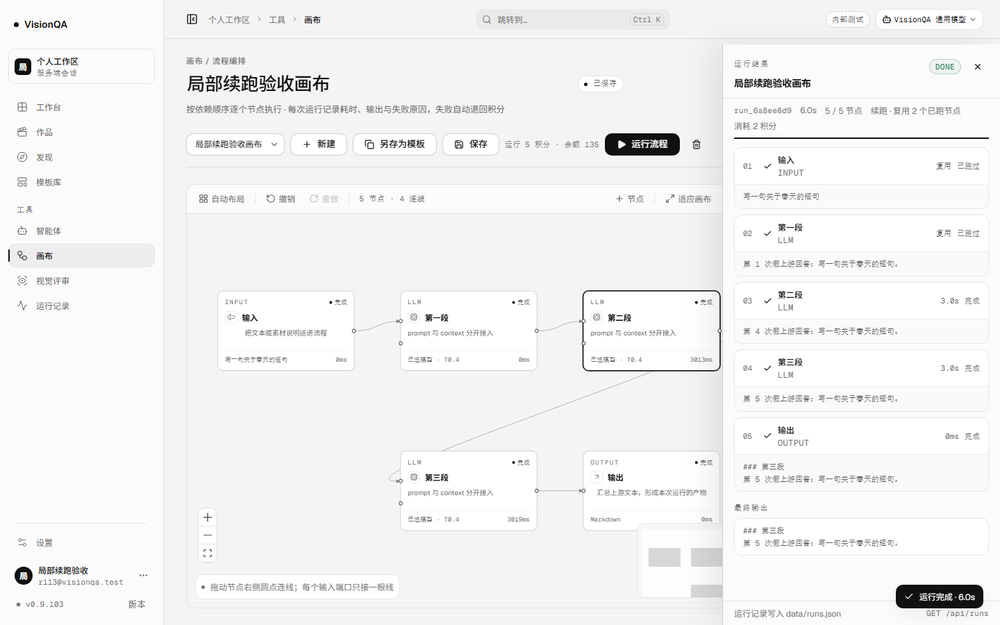

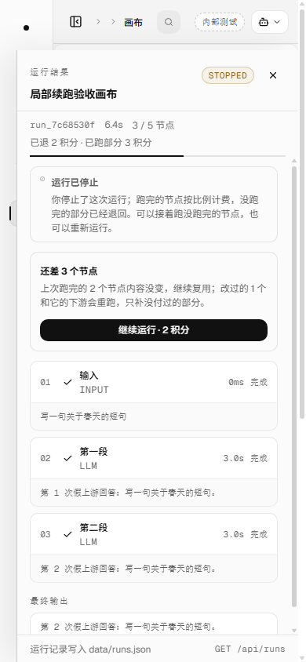

全仓 **905/905**（+1 条新用例，路由续跑用例增加预检断言），oxlint **0 error / 15 warning**，`tsc -b` 与 build 干净；入口 `index-DnGsbMLY.js`（573,349 B）、画布 `CanvasPage-Bmrdz7tp.js`（235,387 B）、后台 `AdminConsolePage-DvxwfNs4.js`（201,080 B）、样式 `index-C09qhU_5.css`（275,246 B）；密钥扫描 **646 文件 / 0 命中**。

回退：`bash /opt/visionqa/ops/rollback.sh --to 1` → v0.9.102（`--to 2` 是 v0.9.101）。新增的 `nodeRevisions`、`resume-plan`、`stale`、`resumePlanFor` 都是增量；旧前端不请求预检、不带 `resumeOf` 时仍走原来的整图运行。细节、十一条坑与「发现但没做」见 [画布改过之后，还能接着跑没改的节点](docs/run-resume-partial-2026-11-14.md)。

生产部署 `20261114-150500-r113-par`（发布脚本截断为 31 字符，完整意图 `20261114-150500-r113-partial-resume`；快照 `20261114-070231-20261114-150500-r113-par.tar.gz` 1,013,657 B）：四个 unit 全 active，8799 / 8800 / 公网都 **0.9.103**，`/api/health` ok（模板 26）；入口 `index-DnGsbMLY.js` 200 · **573,349 B**，画布 235,387 B、后台 201,080 B、样式 275,246 B、画布样式 25,578 B；服务端与前端哈希全部与本地一致（`flows 6b8d3ed9` / `routes f6236d72` / 入口 `2ca3ee64` / 画布 `21201ba6` / 后台 `b2137aac` / 样式 `574a59b5` / 画布样式 `d6430808`）；心跳 pid 1480032 / 1480031，盘 72%，近 15 分钟无 warning。本轮上传包与 stage 已清，`/tmp` 剩 351M 是其他项目 11 月 4–13 日的旧发布包，没有动。生产没有真实运行授权，线上没有真实续跑记录；功能证据来自本地真浏览器 + 假上游与路由用例。


## 一百七十一、关掉页面之后，从运行记录接着跑（v0.9.104，2026-11-14）

v0.9.103 解决了「画布改过之后只重跑改过的节点」，但继续跑的入口还只在画布页的内存里：停止后关掉抽屉去改画布，顶栏还有「上次运行」；**一刷新、一关标签页，这条入口就没了**。运行记录页能打开画布，却不能把某一条停止的运行放回抽屉，用户只能自己记住跑到第几个节点。

这一轮把「继续跑哪一条」写进地址：`#/canvas/<flowId>/resume/<runId>`。

- **运行记录页多一个出口**：已停止 / 失败的记录，详情里出现「继续运行」；点它回到画布，抽屉按这条记录打开，预检照旧写「还差 N 个节点」「复用 N 个、改过 N 个和下游重跑」。
- **地址能刷新**：刷新、前进后退、复制到同一账号的另一个浏览器，都会回到同一条运行和同一份预检。画布页不需要新增页面或数据表。
- **地址只点名，不承诺复用**：能复用几个节点仍由 `GET /api/flows/:id/resume-plan` 按当前画布现算；画布改到没有可复用节点时，抽屉照旧给「这次没有能原样复用的节点」和「从头运行」。
- **单条运行只读**：`GET /api/runs/:id` 按账号隔离，打开旧运行不扣费、不写记录；校验 run 属于当前画布，当前画布已删的节点清回待运行。
- **新运行开始后地址让位**：服务端发出 `run-start` 后，地址从 `/resume/<旧 runId>` 换回普通画布；之后再刷新，不会把上一条旧运行又盖回抽屉。

地址语法收在 `src/domain/canvas-run-link.ts`：拼装与解析同一处，缺 flowId / runId、多一段、画布项目地址都退回普通画布，坏链接不挡画布本身。路由的 `toHash`、`routeKey` 都带 `resumeRunId`，同一个 run 不重复压历史。

| 本地实测（8931 + 假上游 8971，每节点 1.6 秒，零真实上游） | 读数 |
| --- | --- |
| 第一次运行 | 跑到 3/5 时停止；`run_11efee74` · interrupted · canceled |
| 节点 / 结算 | `cost=5 / kept=3 / refundedAmount=2 / settled=true`；余额 100 → 97 |
| 运行记录页 | 详情出现「继续运行」；点后地址 `#/canvas/flow_3671fc37/resume/run_11efee74` |
| 抽屉 / 预检 | 自动打开；「还差 2 个节点」「继续运行 · 2 积分」；`reused=3 / rerun=2 / cost=2` |
| 刷新 | 地址不变；整页重载后抽屉重新打开，仍写「还差 2 个节点」 |
| 续跑 | `run_e5a2816e` · success · 3.2s · `resumeOf=run_11efee74` · `reusedNodes=3` |
| 计费 / 上游 | 本次 `cost=2 / billTotal=2 / billFinished=2`；余额 97 → 95；假上游总共 **5** 次 |
| 开始后续跑 | 地址回到 `#/canvas/flow_3671fc37`，不再挂旧 runId |
| 390 宽 | `scrollWidth 390 = clientWidth 390`，抽屉与预检按钮都在画面内 |

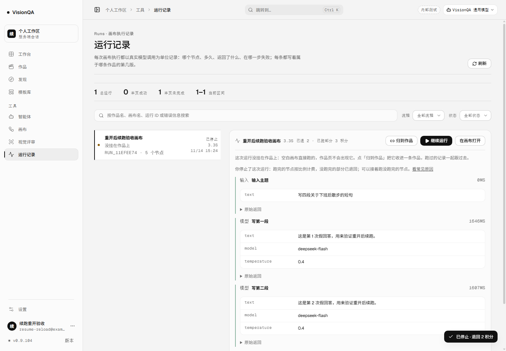


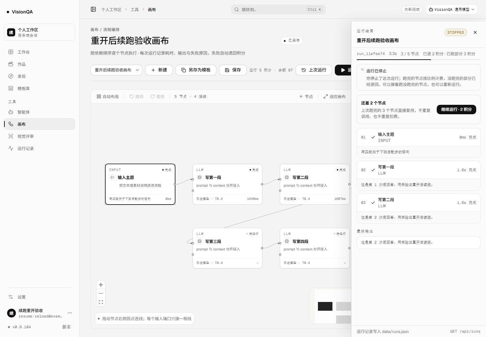

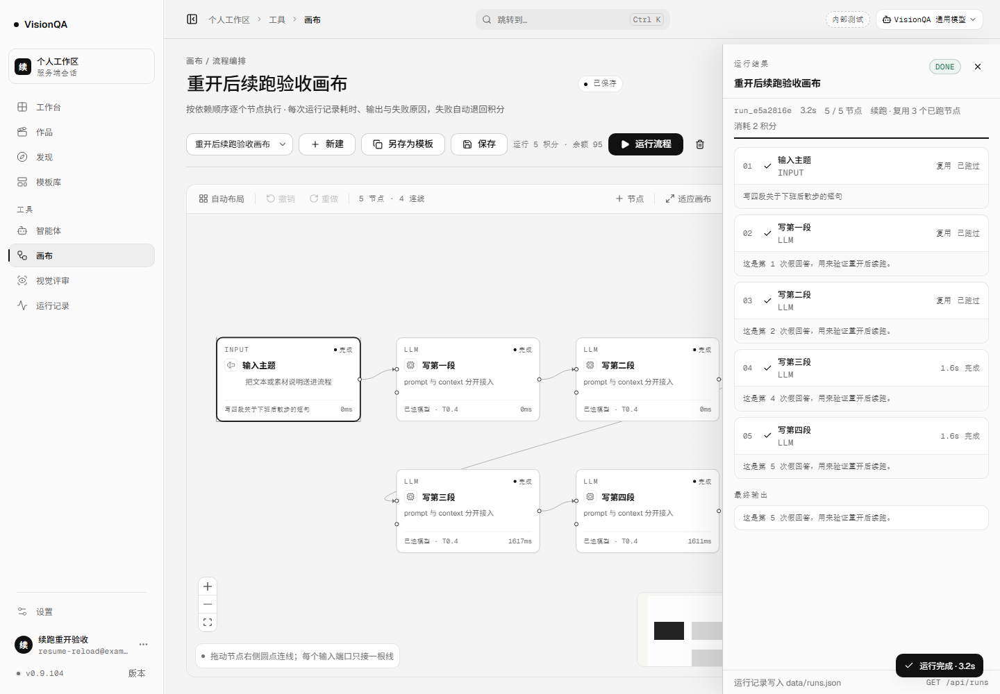

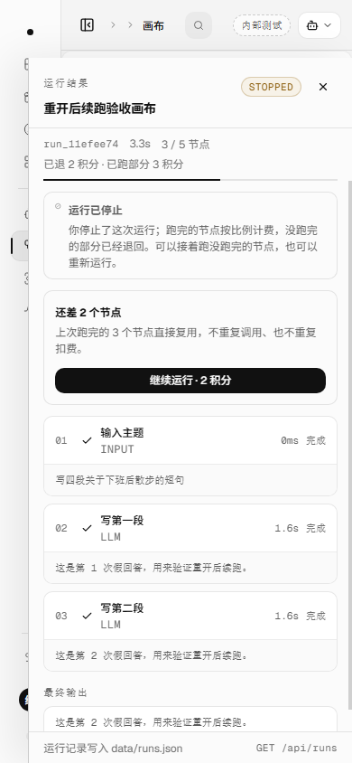

全仓 **907/907**（+2 条 `test/canvas-run-link.test.mjs`：地址拼装/解析/编码、缺段与多段回退），oxlint **0 error / 15 warning**（与上一轮同一批基线），`tsc -b` 与 build 干净；入口 `index-qDgCDllX.js`（574,416 B）、画布 `CanvasPage-BUmESs0z.js`（236,466 B）、后台 `AdminConsolePage-C6FfLg_I.js`（201,066 B）、样式 `index-C09qhU_5.css`（275,246 B）、画布样式 25,578 B；密钥扫描 **649 文件 / 0 命中**。

生产部署 `20261114-152800-r114-run`（发布脚本截断为 31 字符，完整意图 `20261114-152800-r114-runlink`；快照 `20261114-073101-20261114-152800-r114-run.tar.gz` 1,017,340 B）：四个 unit 全 active，8799 / 8800 / 公网都 **0.9.104**，`/api/health` ok（模板 26）；入口 200 · **574,416 B**、画布 236,466 B、后台 201,066 B、样式 275,246 B、画布样式 25,578 B；服务端与前端哈希全部与本地一致（`flows 6b8d3ed9` / `routes f6236d72` / 入口 `741295b5` / 画布 `c800691e` / 后台 `28ee5b92` / 样式 `574a59b5` / 画布样式 `d6430808`）；心跳 pid 1480699 / 1480698，盘 72%，`/tmp` 清回 351M，近 15 分钟没有业务 warning（只有 SQLite experimental 提示）。生产没有真实运行授权，线上没有真实「停止 → 重开 → 续跑」记录；功能证据来自本地真浏览器 + 假上游与地址语法用例。

回退：`bash /opt/visionqa/ops/rollback.sh --to 1` → v0.9.103（`--to 2` 是 v0.9.102）。新增的是路由一个可选段、一个纯函数、记录页一个按钮与画布一段只读加载；旧前端遇到新地址只丢掉 `/resume/...` 后打开画布，不会白屏。细节、十三条坑与「发现但没做」见 [关掉页面之后，从运行记录接着跑](docs/run-resume-from-runs-2026-11-14.md)。

## 一百七十二、运行记录页先算清，再点「继续运行」（v0.9.105，2026-11-14）

v0.9.104 把续跑入口写进了地址，但按钮仍按**记录里存着的** `resumable` 判断——那是上次收尾时的结论。画布改过之后，记录还写「3/5、还差 2 个」，当前画布却可能只剩 2 个能复用、甚至一个都不剩；用户点进画布，才发现预检说「没有能原样复用的节点」。这一轮在运行记录页本身补一次只读预检：选中一条可续的终态运行，页面请求 `resume-plan`，按当前画布写「复用几个 / 还差几个 / 其中几个改过 / 补多少积分」，按钮也直接带补多少；预检说不能续时收掉按钮并写清原因。

- **只预检选中的一条**：一页 12 条逐条问就是 12 个请求；只有 `current.status !== 'running' && current.status !== 'queued' && runResumeInfo(current).resumable` 才发。换一条再问，不预检整页。
- **三个状态**：核对中按钮禁用并写「核对中」；能续写「复用 3 个 · 还差 2 个 · 补 2 积分」；不能续转待确认色、写服务端原因、收掉「继续运行」。「在画布打开」始终保留。
- **只读**：`GET /api/flows/:id/resume-plan?runId=run_x` 与 v0.9.103 同一个接口；不扣费、不写记录、不调上游。补价为 0 时写「不再扣费」，不写「补 0 积分」。
- **失败不冒充**：预检失败写「这次没能核对」，保留记录估算与「重新核对」；真正运行时服务端还会再判一次。旧 plan 按 `runId` 隔离，不会短暂挂到新选中的行上。

| 本地实测（8943 + 假上游 8973，前三段 1.2 秒，零真实上游） | 读数 |
| --- | --- |
| 第一次运行 | 3/5 停止；`run_7a04afe4` · interrupted · canceled；余额 100 → 97；假上游 **3** 次 |
| 第一次预检 | `reused=3 / rerun=2 / stale=0 / cost=2`；页面「复用 3 个 · 还差 2 个 · 补 2 积分」 |
| 只改第三段 | `reused=2 / rerun=3 / stale=1 / cost=2`；页面「复用 2 个 · 还差 3 个（其中 1 个改过） · 补 2 积分」 |
| 再改输入 | `reused=0 / rerun=5 / stale=3 / resumable=false`；原因「画布改动后没有能原样复用的节点…」 |
| 按钮 / 扣费 | 不能续时「继续运行」消失；预检前后余额都是 97，没有写记录、没有调上游 |
| 浏览器预检请求 | 页面加载 / 两次刷新共 **4** 次 `resume-plan`；没有逐行预检 |
| 390 宽 | `scrollWidth 390 = clientWidth 390`，预检条与说明都在画面内 |

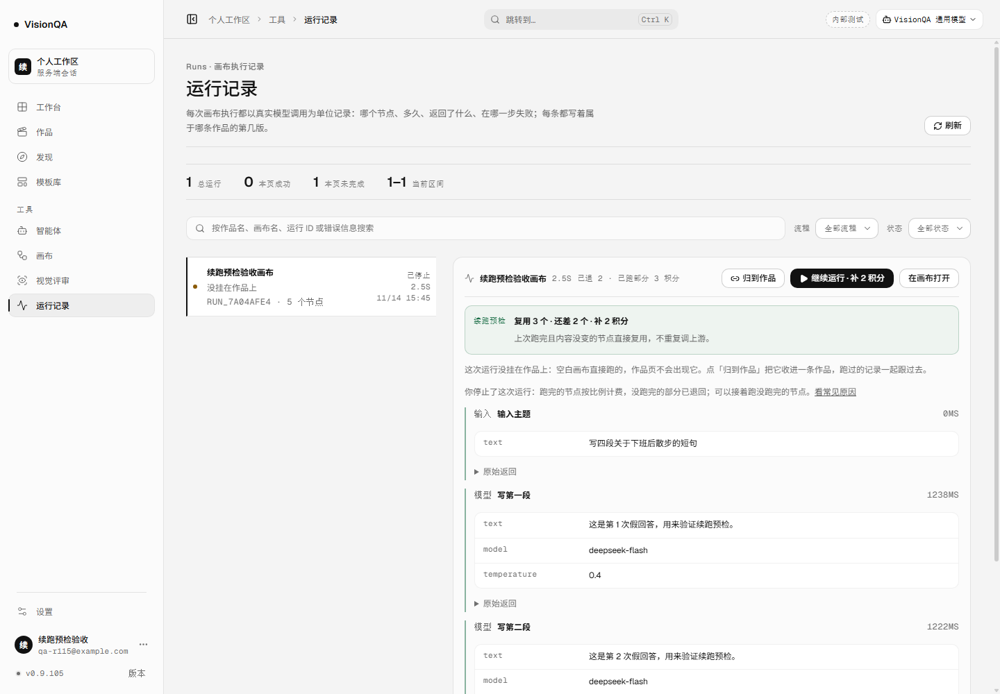


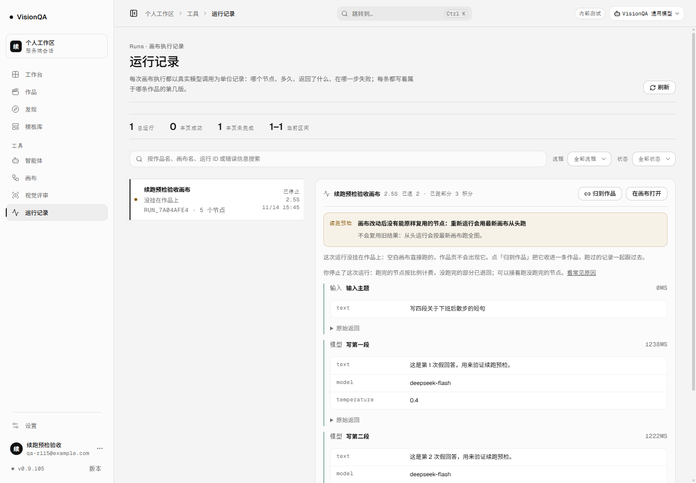

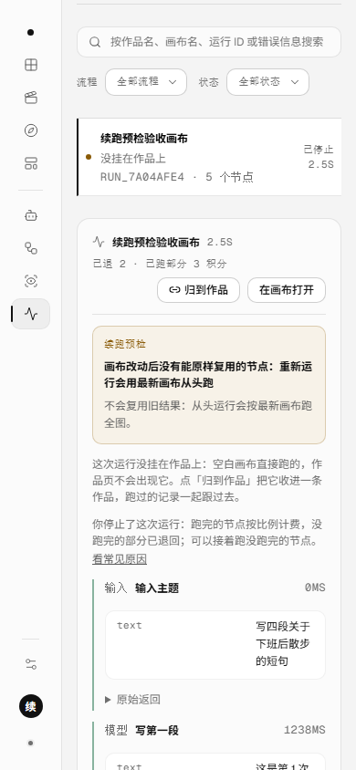

全仓 **912/912**（+5 条 `test/run-resume-plan-view.test.mjs`：能续 / 改过 / 补 0 / 不能续 / 还没拿到 plan），oxlint **0 error / 15 warning**（与上一轮同一批基线），`tsc -b` 与 build 干净；入口 `index-Cw9B36D9.js`（576,982 B）、画布 `CanvasPage-CQ0gMZ8M.js`（236,466 B）、后台 `AdminConsolePage-QZeYGMxf.js`（201,066 B）、样式 `index-txSBUiKZ.css`（276,220 B）、画布样式 25,578 B；密钥扫描 **649 文件 / 0 命中**。

生产部署 `20261114-155000-r115-pre`（发布脚本截断，完整意图 `20261114-155000-r115-preflight`；快照 `20261114-075549-20261114-155000-r115-pre.tar.gz` 1,019,473 B）：四个 unit 全 active，8799 / 8800 / 公网都 **0.9.105**，`/api/health` ok（模板 26，uptime 43s）；入口 200 · **576,982 B**、画布 236,466 B、后台 201,066 B、样式 276,220 B、画布样式 25,578 B；服务端与前端哈希全部与本地一致（`flows 6b8d3ed9` / `routes f6236d72` / 入口 `f61f07d4` / 画布 `d483fa39` / 后台 `4bcf09ef` / 样式 `c3755b30` / 画布样式 `d6430808`）；心跳 pid 1481317 / 1481316，盘 72%，`/tmp` 清回 351M，近 15 分钟没有业务 warning（只有 SQLite experimental 提示）。生产没有真实运行授权，线上没有真实停止 / 续跑 / 预检记录；功能证据来自本地真浏览器 + 假上游与 5 条文案用例。

回退：`bash /opt/visionqa/ops/rollback.sh --to 1` → v0.9.104（`--to 2` 是 v0.9.103）。这一轮只改运行记录页、一个文案纯函数和一段 CSS；没有新增接口、字段或 schema，旧前端不会请求 `resume-plan`，按钮照旧按 `resumable` 出现。细节、十三条坑与「发现但没做」见 [运行记录页先算清，再点「继续运行」](docs/run-resume-preflight-2026-11-14.md)。

## 一百七十三、回看这次运行，不动现在的画布（v0.9.106，2026-11-14）

v0.9.104 把续跑入口写进了地址，v0.9.105 又在运行记录页把「还能复用几个、补多少」先算清；但这两个入口都只服务**还能续跑的运行**。成功的运行没有续跑按钮，也就没有从记录回看画布的入口；「在画布打开」打开的是当前画布，不是这条运行。如果直接拿 `resume` 地址看一条运行，地址语义还会把「查看」和「继续执行」混在一起。

这一轮把「看」和「续」彻底分开：

```text
#/canvas/<flowId>/run/<runId>       只读查看这次运行
#/canvas/<flowId>/resume/<runId>    从这次运行继续跑
```

- **记录页两个出口**：终态运行详情同时出现「查看这次运行」；只有记录说可续、预检也允许时才出现「继续运行 · 补 N 积分」。点查看后地址是 `/run/<runId>`，不会进入续跑。
- **只读回放**：画布顶部写清运行 id、状态、开始时间、耗时、节点数与结算；节点位置与参数取当前画布，状态 / 耗时 / 输出取这条运行，条上明说查看不写回、不扣费。当前画布少了当时的节点时，额外写「N 个节点已不在当前画布」，抽屉仍能看到它们的结果。
- **所有编辑入口都关掉**：页头不显示运行 / 保存 / 新建 / 另存 / 删除 / 流程切换；画布不能拖、不能连、不能拖入、双击不弹面板；Ctrl+Z / Ctrl+Y / Delete 不改画布，Ctrl+S 只提示「只读查看中」；右侧检查器用 `fieldset disabled` 整组禁用；自动保存与 `saveNow()` 直接拒绝，续跑预检也不会在查看页发起。
- **地址闭合**：`src/domain/canvas-run-link.ts` 同时管 `run` / `resume` 两种地址；路由的 `viewRunId` 与 `resumeRunId` 分开，`toHash` / `routeKey` / `applyFlow` 都保留查看入口。App 的画布 key 带「查看 / 续跑 / 编辑」模式，进出查看时重挂一次，旧运行状态不会挂到编辑态上。

| 本地实测（8944 + 假上游 8974，前三段 1.2 秒，零真实上游） | 读数 |
| --- | --- |
| 第一次运行 | 3/5 停止；`run_d8786c6e` · interrupted · canceled；`cost=5 / kept=3 / refundedAmount=2 / settled=true` |
| 余额 / 上游 | 查看前后都是 **97**；假上游 **3** 次 |
| 地址 | 点「查看这次运行」→ `#/canvas/flow_7ab1b8bf/run/run_d8786c6e` |
| 只读条 | `历史运行 · 只读` / `已停止` / `3 / 5 节点` / `已退 2 · 已跑部分 3 积分` |
| 节点 / 抽屉 | `完成 / 完成 / 完成 / 待运行 / 待运行`；抽屉 STOPPED，逐节点输出仍是这次的结果 |
| 编辑入口 | 运行流程 / 保存 / 流程切换都不在；检查器 `disabled=true` |
| 只读请求 | 查看前 `resume-plan` 1 次，查看后仍 1 次；查看期间 `PATCH /api/flows` **0** 次，画布 updatedAt 前后一致 |
| 退出查看 | 地址回 `#/canvas/flow_7ab1b8bf`；运行、保存、流程切换都回来，只读条消失 |
| 390 宽 | 只读条与画布工具栏换行，`scrollWidth 390 = clientWidth 390` |

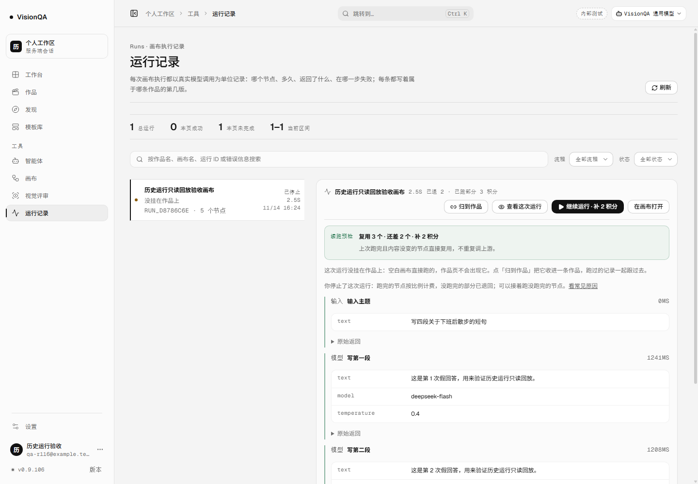

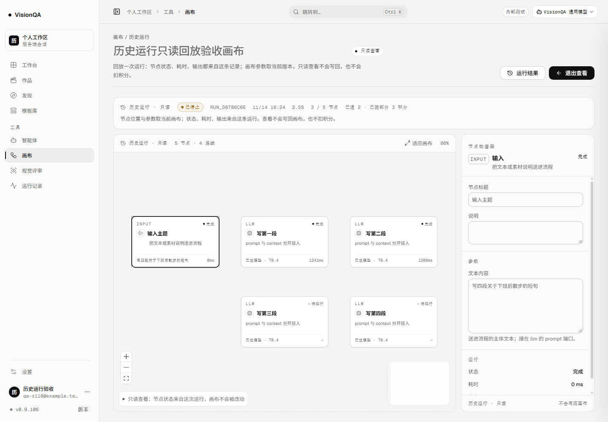

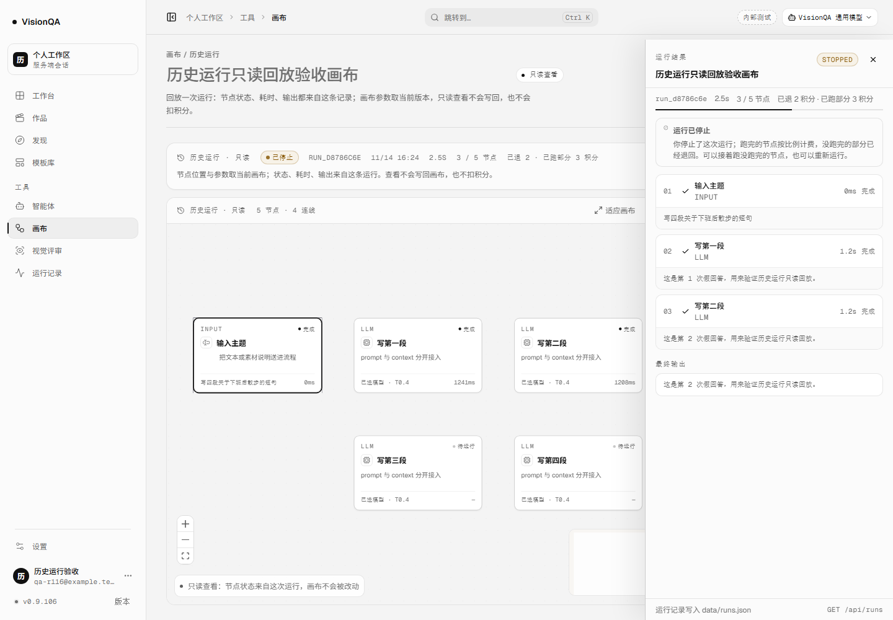

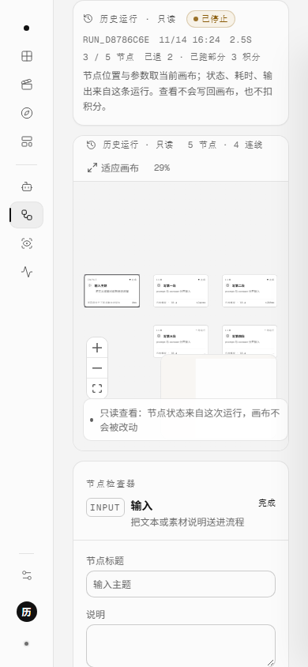

全仓 **913/913**（+1 条 `test/canvas-run-link.test.mjs` 查看地址 / 坏模式用例），oxlint **0 error / 15 warning**（与上一轮同一批基线），`tsc -b` 与 build 干净；入口 `index-BLZHxoce.js`（577,823 B）、画布 `CanvasPage-Dt0nFjJ-.js`（240,467 B）、后台 `AdminConsolePage-Dbp0Sf07.js`（201,072 B）、样式 `index-txSBUiKZ.css`（276,220 B）、画布样式 `CanvasPage-DWwXKjc4.css`（27,191 B）；密钥扫描 **652 文件 / 0 命中**。提交 `c1bf16c`，CI **43576215738** 三 job 全 success。

生产部署 `20261114-163500-r116-vie`（发布脚本截断，完整意图 `20261114-163500-r116-view`；快照 `20261114-083553-20261114-163500-r116-vie.tar.gz` 1,018,437 B）：四个 unit 全 active，8799 / 8800 / 公网都 **0.9.106**，`/api/health` ok（模板 26，uptime 46s）；入口 200 · **577,823 B**、画布 240,467 B、后台 201,072 B、样式 276,220 B、画布样式 27,191 B；服务端与前端哈希全部与本地一致（`flows 6b8d3ed9` / `routes f6236d72` / 入口 `e4f32c43` / 画布 `4b2e737c` / 后台 `b3876415` / 样式 `c3755b30` / 画布样式 `053f2024`）；公网入口 `index-BLZHxoce.js` 200 · 577,823 B；心跳 pid 1482139 / 1482135，盘 72%，`/tmp` 清回 351M，近 15 分钟没有业务 warning（只有 SQLite experimental 提示）。生产没有真实运行授权，线上没有真实「停止 → 查看 → 退出」记录；功能证据来自本地真浏览器 + 假上游。

回退：`bash /opt/visionqa/ops/rollback.sh --to 1` → v0.9.105（`--to 2` 是 v0.9.104）。这一轮只新增前端路由一段、记录页一个按钮、画布只读分支、检查器禁用态与样式；没有新增接口、字段或 schema。旧前端不认识 `/run/<runId>`，会把地址退回普通画布打开当前内容，不会白屏。细节、十三条坑与「发现但没做」见 [回看这次运行，不动现在的画布](docs/run-readonly-view-2026-11-14.md)。

## 一百七十四、回看的是当时那张画布（v0.9.107，2026-11-14）

v0.9.106 能让终态运行进 `#/canvas/<flowId>/run/<runId>` 只读回放了，但「回放」的只有节点结果：位置、标题、参数仍取当前画布。画布一改，回看就跟着现在的版本走；删掉一个节点，它只能从画布上消失。用户点「查看这次运行」时想看的，显然是**当时那张画布**，不是现在的。

这一轮在运行开始时把画布也留一份：

- **快照落在哪里**：`DATA_DIR/run-graphs/<runId>.json`，只留节点 `id / type / position / data` 与连线 `source / target / sourceHandle / targetHandle`；不塞进 `runs.json`，也不进运行列表。单条详情 `GET /api/runs/:id` 才带 `graph`，列表不背几十张画布的配置。
- **什么时候写**：`runFlow` 真正开始执行前写，对应这次实际执行的图；留档失败只写日志，运行照常。运行记录被 60 条窗口挤出去时，快照文件一起清掉。
- **页面怎么用**：有 `graph` 就替换成快照节点与连线，再贴这条运行的节点状态、耗时、输出；只读条写「历史运行 · 画布快照」，检查器写「历史运行 · 画布快照」。没有快照的旧运行仍贴当前画布，但明说「这条运行没有留下画布快照：位置与参数只能取当前画布」。
- **不拿现在冒充历史**：只读页隐藏当前作品条，标题改用运行记录里的 `flowName`；缺节点提示也分「快照里缺少」与「不在当前画布上」两种说法。
- **顺手修只读连线**：`onNodesChange` 放行 `dimensions`，手柄从 `display:none` 改成不可见但占位；否则 React Flow 算不出端点，4 条连线会缩成一个点。≤760px 收起小地图，390 下少一块遮挡。

| 本地实测（8944 + 假上游 8974，前三次 0.9 秒，零真实上游） | 读数 |
| --- | --- |
| 运行 | `flow_568d4edf` / `run_b249b090`；停在前三段；`cost=5 / kept=3 / refundedAmount=2 / settled=true` |
| 改画布 | PATCH 成 3 节点、位置挪到 500/520 一带、第一段标题改成「现在改过的第一段」、提示词改成「只写两段」 |
| 快照回看 | 画布 **5 节点 / 4 连线**，被删的第二段 / 第四段仍在；`n_input` 仍 `translate(80px, 120px)`，第一段仍是「写第一段」 |
| 节点状态 | 完成 3 / 待运行 2；抽屉 STOPPED；检查器旧温度 0.4、旧提示词「只写一段中文。」 |
| 只读请求 | `resume-plan` 前后都是 0；画布 PATCH **0**；服务端 `updatedAt` 不变；余额 100 → **97**，假上游 **3** 次 |
| 旧运行回退 | 删掉快照文件后重开同一条：3 节点、明写「没有留下画布快照」、报「1 个节点不在当前画布上」 |
| 390 宽 | 5 节点仍可读；小地图收起；`scrollWidth 390 = clientWidth 390` |

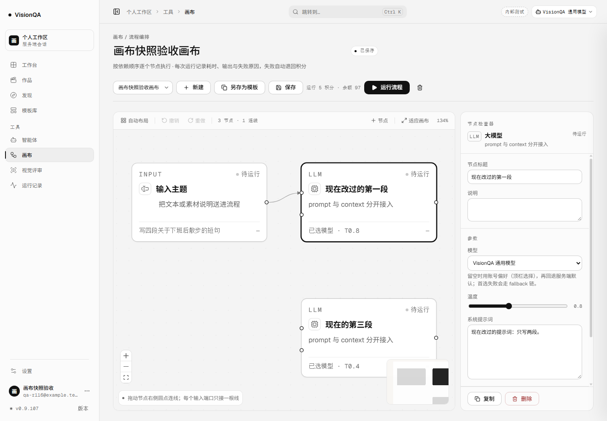

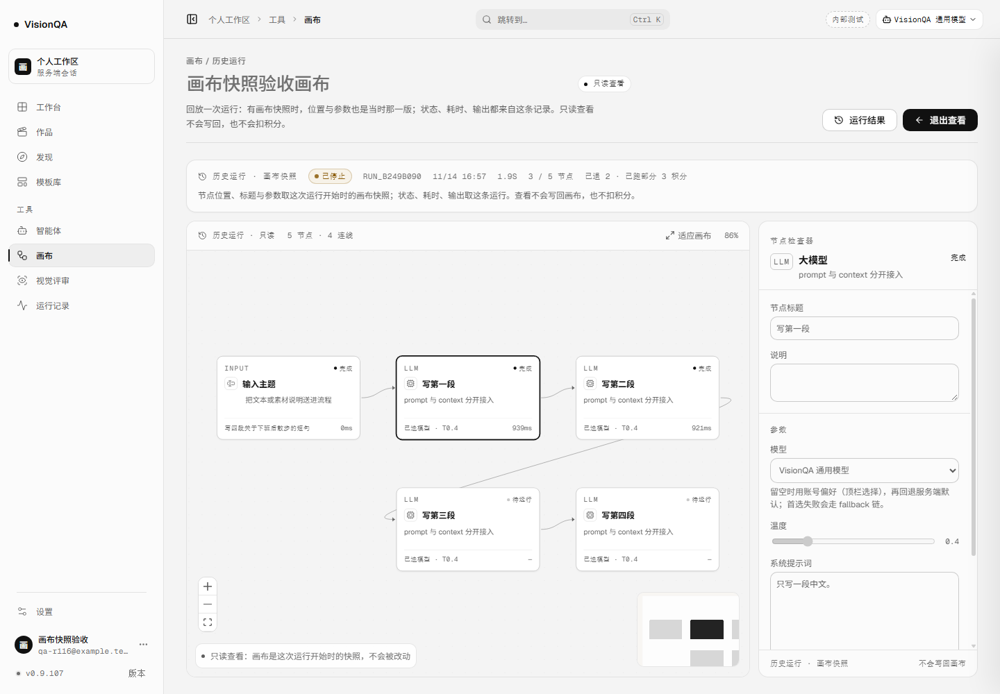

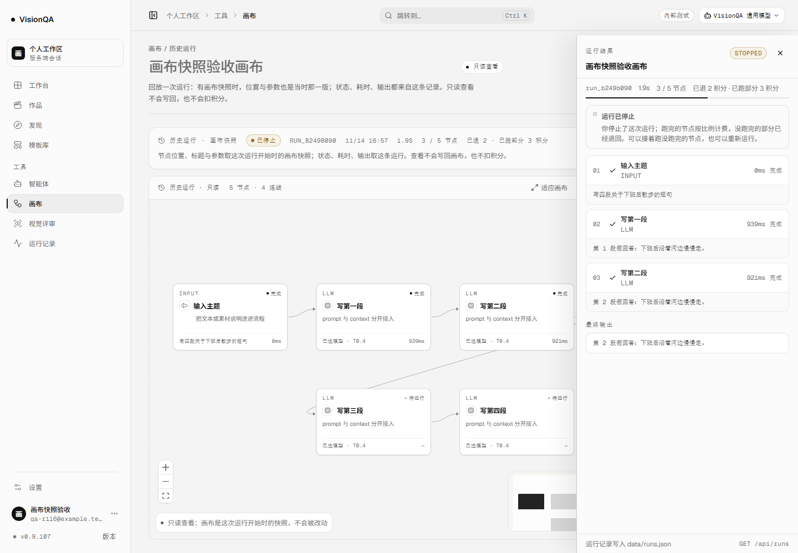

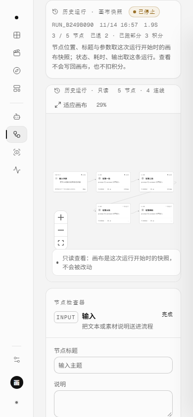

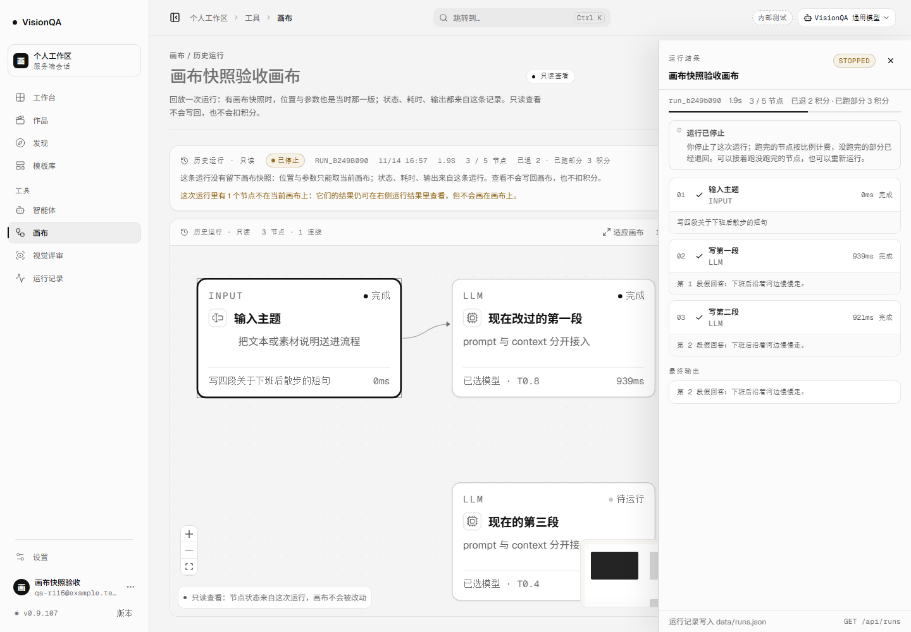

全仓 **914/914**（+1 条 `test/run-graph-snapshot.test.mjs`：落盘、改画布后不覆盖、详情带 / 列表不带、超 60 条清理），oxlint **0 error / 15 warning**（与上一轮同一批基线），`tsc -b` 与 build 干净；入口 `index-Dkt4pSfB.js`（577,823 B）、画布 `CanvasPage-DqrhIdgs.js`（241,454 B）、后台 `AdminConsolePage-DaQbZDim.js`（201,072 B）、样式 `index-txSBUiKZ.css`（276,220 B）、画布样式 `CanvasPage-wAMd1b8r.css`（27,253 B）。快照文件与运行记录同一份数据目录；生产发布与哈希见下一段。

生产部署 `20261114-170600-r117snap`（快照 `20261114-090939-20261114-170600-r117snap.tar.gz` **1,019,172 B**）：四个 unit 全 active，8799 / 8800 / 公网都 **0.9.107**，`/api/health` ok（模板 26，uptime 56s）；入口 200 · **577,823 B**、画布 241,454 B、后台 201,072 B、样式 276,220 B、画布样式 27,253 B；服务端与前端哈希全部与本地一致（`flows d2873833` / `routes e4a14ca7` / 入口 `32cfc2c5` / 画布 `f4a77b73` / 后台 `5a351536` / 样式 `c3755b30` / 画布样式 `630f7682`）；公网入口 `index-Dkt4pSfB.js` 200 · 577,823 B；心跳 pid 1482915 / 1482918，盘 72%，`/tmp` 357M，近 15 分钟只有 SQLite experimental 提示。生产 9 条运行、列表 5 条 **0 条带 graph**；详情 `run_6e780de3` 的 `graph` 字段不存在，旧记录仍走「取当前画布」；`/var/lib/visionqa/run-graphs` 还没有目录——生产没有真实运行授权，这一版没有在任何真实运行上开过快照。详情与十条坑见 [回看的是当时那张画布](docs/run-graph-snapshot-2026-11-14.md)。

回退：`bash /opt/visionqa/ops/rollback.sh --to 1` → v0.9.106（`--to 2` 是 v0.9.105）。这一版新增 `run-graphs` 目录与单条详情字段，不改已有 JSON schema；旧前端不认识 `graph`，会忽略并退回当前画布。细节、十条坑与「发现但没做」见 [回看的是当时那张画布](docs/run-graph-snapshot-2026-11-14.md)。

## 一百七十五、回看之后，知道画布改了什么（v0.9.108，2026-11-14）

v0.9.107 在运行开始时留下了画布快照，但入口只在「运行记录」页；从作品页看到某次运行，仍然只有「打开画布」一个去处。而且快照只能告诉你「当时长什么样」，不回答「现在这张画布和当时差在哪」——用户要自己一个一个对比，才知道继续跑会复用几个、重跑几个。

这一轮把快照接回作品主线，并把差异摊开：

- **作品页能直接回看**：运行记录行出现「查看运行」，进 `#/canvas/<flowId>/run/<runId>`，只读、不写画布、不扣费；画布被删的记录仍保留，但只写「画布已删除」。只在运行已结束（不是 running / queued）时出现。
- **差异按事实分开数**：`src/domain/run-diff.ts` 对照快照与进页面时的当前画布，分成参数（类型 / config）、位置、标题、新增、删除、连线六类。参数与位置分开，挪一下画布不会被写成「改了提示词」；删除项的标题取快照里的名字；节点删掉时两端连线也算减少。
- **只显示该显示的**：有快照才显示「与当前画布比」；一行摘要 + 两边节点数，点开才看节点名；没有任何改动写「一致」。没有快照的旧运行不显示差异行，不编「一致」，也不冒充当时的位置。
- **顺手把状态说真**：作品页以前把 `interrupted` 和 `error` 一起写「失败」、红点；现在服务重启打断写「已中断」、用户停止写「已停止」、只有真正的 `error` 才是失败红。

| 本地实测（8944 + 假上游 8974，前三次 0.9 秒，零真实上游） | 读数 |
| --- | --- |
| 建作品 / 画布 | `prj_8d4341ce` / `flow_a7e0d015` |
| 运行 | `run_96757648` 停在前三段；`cost=5 / kept=3 / refundedAmount=2 / settled=true` |
| 改画布 | 3 节点：全部挪位置；第一段改标题 + 温度 0.4→0.8 + 提示词；第三段改标题；删掉第二、第四段；连线 4→1 |
| 作品页 | 运行行「已停止 / 5 节点 / 已跑 3 积分 · 已退 2」；「查看运行」与「打开画布」两个入口 |
| 点「查看运行」 | `#/canvas/flow_a7e0d015/run/run_96757648`；快照 **5 节点 / 4 连线**；`n_input` 仍是 `translate(80px, 120px)` |
| 差异 | 摘要 `参数 1 · 位置 3 · 标题 2 · 删除 2 · 连线 -3`；`快照 5 · 当前 3 个节点`；明细列出「现在改过的第一段」「写第二段 · 写第四段」 |
| 只读请求 | `resume-plan` 前后 0；画布 PATCH **0**；余额 100→**97**；假上游 **3** 次；`runGets=1` |
| 检查器 | 仍显示快照里的「写第一段」；抽屉 STOPPED；没有运行 / 保存入口 |
| 无快照回退 | 删掉快照后重开：3 节点、明写「没有留下画布快照」、报「1 个节点不在当前画布上」，且**不显示差异行** |
| 390 宽 | 作品页与只读页 `scrollWidth 390 = clientWidth 390`；「查看运行」在画面内（y=301）；差异块 `right 353 <= 390`、`scrollW 248 = clientW 248` |

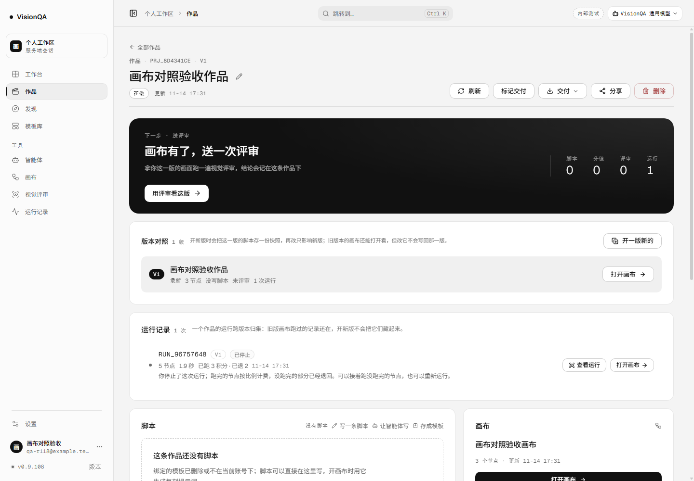

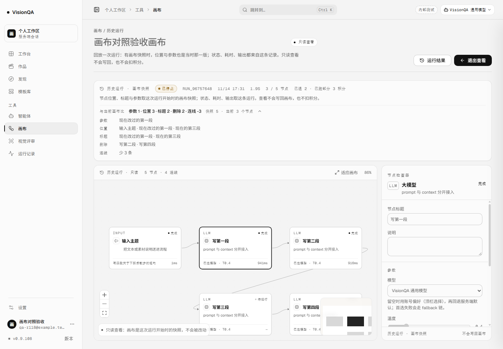

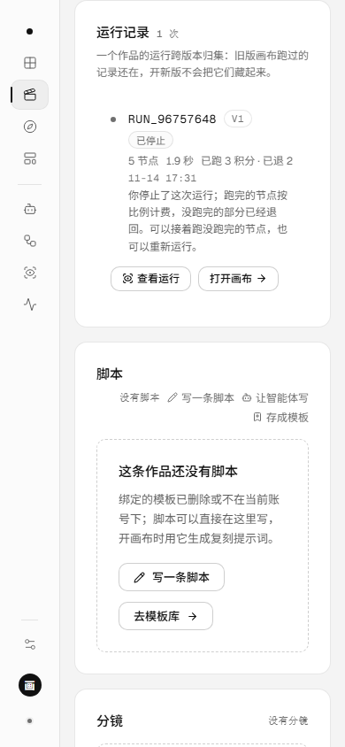

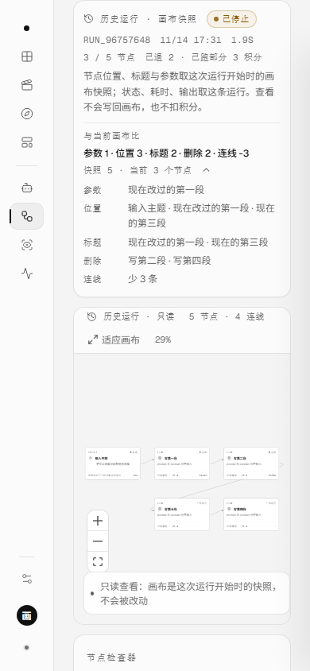

全仓 **920/920**（+6 条 `test/run-graph-diff.test.mjs`：一致 / 只挪位置 / 只改标题 / 改参数 / 新增删除与连线 / 缺快照返回 null），oxlint **0 error / 15 warning**（与上一轮同一批基线），`tsc -b` 与 build 干净；入口 `index-C6WQq3gB.js`（578,412 B）、画布 `CanvasPage-F1g913ZV.js`（244,824 B）、后台 `AdminConsolePage-BUGK5TNl.js`（201,072 B）、样式 `index-DUrELwUY.css`（276,467 B）、画布样式 `CanvasPage-C0ndc-Hj.css`（28,814 B）。

生产部署 `20261114-173500-r118diff`（快照 `20261114-093248-20261114-173500-r118diff.tar.gz` **1,021,390 B**）：四个 unit 全 active，8799 / 8800 / 公网都 **0.9.108**，`/api/health` ok（模板 26，uptime 39s）；入口 200 · 578,412 B、画布 244,824 B、后台 201,072 B、样式 276,467 B、画布样式 28,814 B；服务端与前端哈希全部与本地一致（`flows d2873833` / `routes e4a14ca7` / 入口 `b234c3c4` / 画布 `d44450ad` / 后台 `7dc5ca31` / 样式 `d86dc712` / 画布样式 `0dfbafd1`）；心跳 pid 1483511 / 1483509，盘 72%，`/tmp` 清理回 351M，日志只有 SQLite experimental 提示。生产 9 条运行、`runs.json` 里 0 条带 graph，`run-graphs` 还没有目录——没有真实运行授权，这一版没有在任何真实运行上开过快照；带差异的证据来自本地真浏览器 + 假上游。

提交 `90e98f9`；CI **43581259487** 三个 job 全 success；HEAD == origin/master，工作树干净。回退：`bash /opt/visionqa/ops/rollback.sh --to 1` → v0.9.107（`--to 2` 是 v0.9.106）。这一版不改服务端 JSON schema、不改运行记录字段；只加前端入口与对照。旧前端不认「查看运行」按钮，仍能打开运行记录页与画布。细节、六条坑与「发现但没做」见 [回看之后，知道画布改了什么](docs/run-graph-diff-2026-11-14.md)。

## 一百七十六、画布删了，运行记录还回得去（v0.9.109，2026-11-14）

v0.9.108 的作品页已经能点「查看运行」，但入口仍要求画布还在；画布一删，这条记录就只剩「画布已删除」。可从 v0.9.107 起，运行开始时写下的快照本来就在数据目录里，不依赖画布还在不在——历史不该跟着画布一起变成死路。

这一轮把最后一段补上：

- **作品页先问「有没有快照」**：作品详情对 `available=false` 的运行补 `hasSnapshot`（只 `stat` 文件，不读整张画布）；有快照的仍显示「查看运行」，画布还在的运行不多做这次 stat。
- **只读页用快照重建画布**：地址仍是 `#/canvas/<flowId>/run/<runId>`；`GET /api/flows/<id>` 拿不到时读 `GET /api/runs/:id`，用快照的节点、连线、`flowName`、`project` 拼一块只读画布。**绝不创建「未命名流程」**。
- **标题与说明说真话**：标题旁出现「画布已删除」胶囊；说明写「下面回放的是这次运行开始时留下的画布快照」。没有当前画布可对照，所以不显示 v0.9.108 的差异行，也不写「一致」。
- **退出不再回到不存在的画布**：有作品回作品页，没有回运行记录。
- **没有快照就停在门口**：写「这次运行没有画布可回看」，说明逐节点结果、耗时、扣费仍在运行记录里；按钮是「去运行记录」，不是「重新加载」。只读回看只加载一次，失败后不反复请求。
- **390 宽**：标题行换行，输入框占一整行，「只读查看」「画布已删除」两个标识落到下一行；作品页两个动作并排放在正文下方。

| 本地实测（8945 + 假上游 8975，3 节点，零真实上游） | 读数 |
| --- | --- |
| 建画布 / 作品 | `flow_b62c1343` / `prj_9af9e44d` |
| 运行 | `run_56058864` 成功、3 节点、约 1.0 秒、扣 5 积分；余额 100→95；假上游 2 次（输入节点不调模型） |
| 快照 | `run-graphs/run_56058864.json` 3 节点 / 2 连线；删画布后文件仍在 |
| 删画布 | `DELETE /api/flows/flow_b62c1343` 200；`/api/flows` 总数 0 |
| 作品详情 | `available=false`、`hasSnapshot=true`、`version=1`、`status=success` |
| 作品页 1440 | 「查看运行」可点、「画布已删除」禁用；`scrollWidth 1440 = clientWidth 1440` |
| 点「查看运行」 | 3 节点回放；标题「已删画布验收画布」；胶囊「画布已删除」；说明写「位置、标题与参数取这次运行开始时的快照」 |
| 差异 | 不显示「与当前画布比」（没有当前画布可对照） |
| 只读请求 | `resume-plan` 0；画布 PATCH 0；再次运行 POST 0；运行详情 GET 5 次；快照读后仍 3 节点 |
| 退出查看 | 回 `#/projects/prj_9af9e44d` |
| 390 宽 | 作品页与只读页 `scrollWidth 390 = clientWidth 390`；「查看运行」在 390×844 视口内；「画布已删除」right 256；标题行 `flex-wrap: wrap` |
| 无快照 | 删掉快照文件后重开：标题「这次运行没有画布可回看」，按钮「去运行记录」，没有新建画布 |

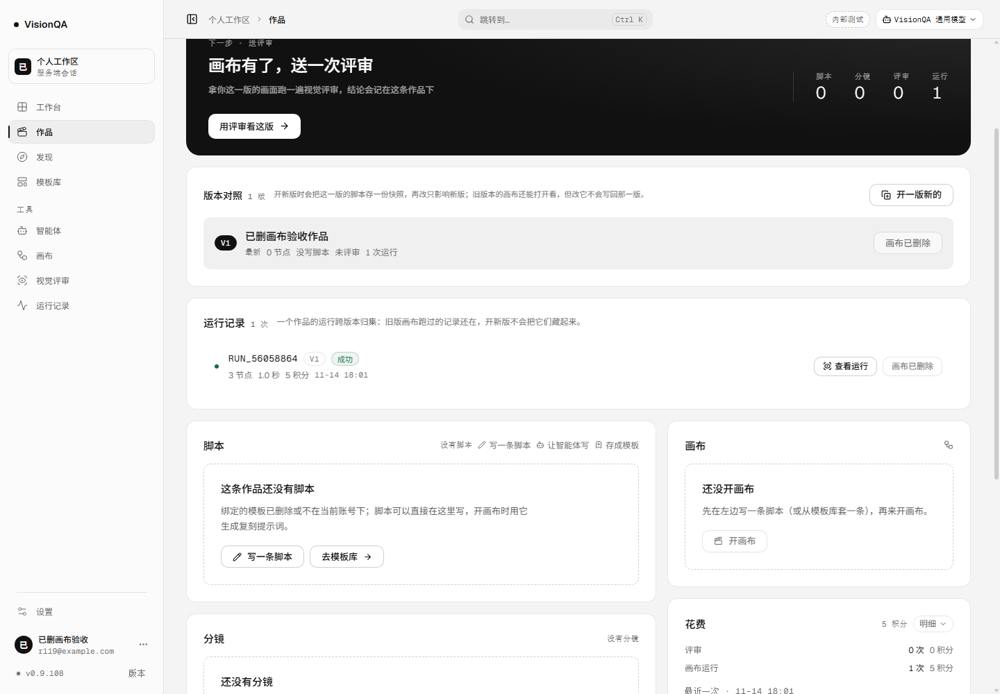

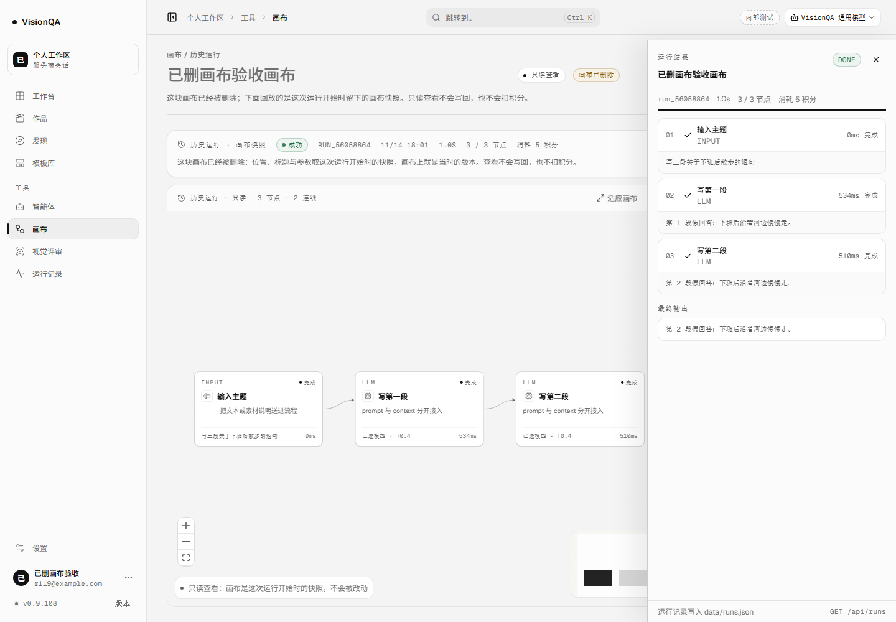

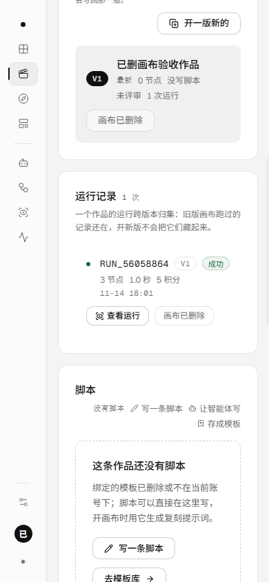

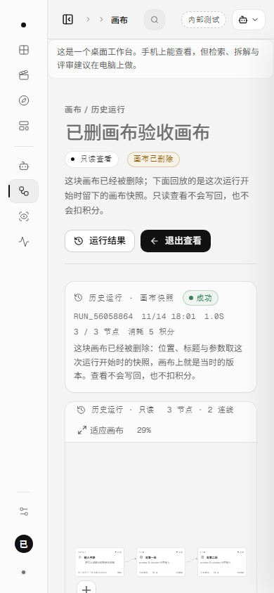

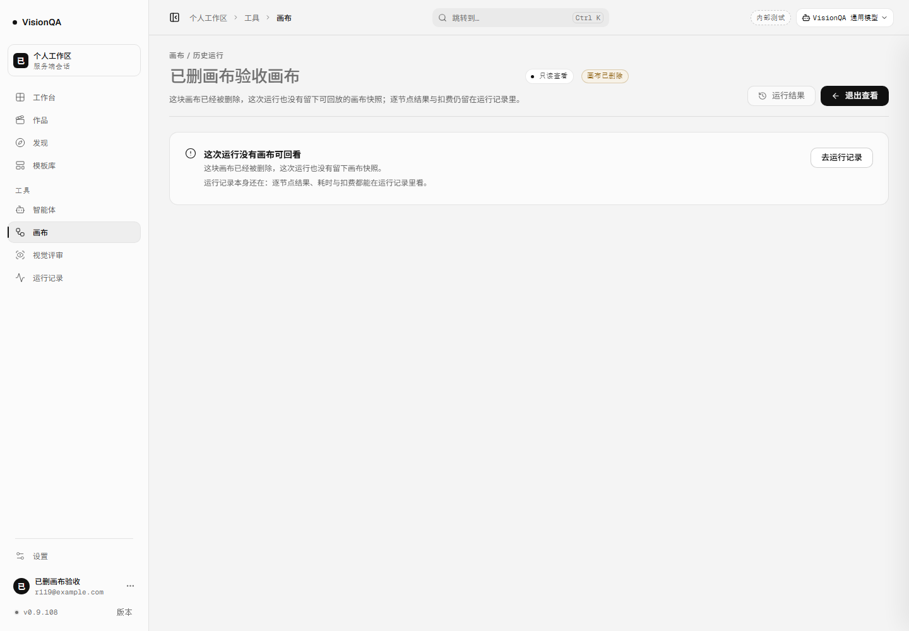

全仓 **920/920**（新增的是 `run-graph-snapshot.test.mjs` 里 4 条 `hasRunGraph` 断言，没有新增测试文件），oxlint **0 error / 15 warning**（与上一轮同一批基线），`tsc -b` 与 build 干净；入口 `index-D5C4jWoV.js`（578,588 B）、画布 `CanvasPage-DY7NoT7w.js`（246,686 B）、后台 `AdminConsolePage-D8AV2Xww.js`（201,072 B）、样式 `index-DUrELwUY.css`（276,467 B）、画布样式 `CanvasPage-BX48Ugxj.css`（28,926 B）。

生产部署 `20261114-180500-r119gone`（快照 `20261114-101009-20261114-180500-r119gone.tar.gz` **1,024,543 B**）：四个 unit 全 active，8799 / 8800 / 公网都 **0.9.109**，`/api/health` ok（模板 26，uptime 50s）；入口 200 · 578,588 B、画布 246,686 B、后台 201,072 B、样式 276,467 B、画布样式 28,926 B；服务端与前端哈希全部与本地一致（`flows d9aeba53` / `routes 321505a1` / 入口 `dc801b32` / 画布 `a7de183b` / 后台 `e066f5c9` / 样式 `d86dc712` / 画布样式 `b49e8586`）；心跳 pid 1484333 / 1484331，盘 72%，`/tmp` 357M 清理回 351M，日志只有 SQLite experimental 提示。生产 9 条运行、0 条带 graph，`run-graphs` 还没有目录——没有真实运行授权，这一版没有在任何真实运行上开过快照；带快照的证据来自本地真浏览器 + 假上游。

提交 `44c355f`；CI **43583729494** 三个 job 全 success；HEAD == origin/master，工作树干净。回退：`bash /opt/visionqa/ops/rollback.sh --to 1` → v0.9.108（`--to 2` 是 v0.9.107）。这一版不改已有 JSON schema：`hasSnapshot` 是作品详情现算的返回字段，不落盘；旧前端忽略它，只是画布已删除的运行仍不显示「查看运行」。细节、六条坑与「发现但没做」见 [画布删了，运行记录还回得去](docs/run-deleted-replay-2026-11-14.md)。

## 一百七十七、两条运行摆一起：哪里变了、慢在哪、多花了多少（v0.9.110，2026-11-14）

v0.9.103 的逐节点指纹、v0.9.107 的画布快照、v0.9.106 的只读回看，已经把单条运行说清楚了；但真要决定「这次能不能发、上次是不是更好」，还是得开两条记录人肉数节点、自己算耗时与积分。这一轮把「和上一条比」放进只读回看页。

- **只读对照接口**：`GET /api/runs/:id/compare` 默认找同一条画布更早的一条已结束运行，也可 `?with=<runId>` 点名。自对照 / 跨画布 400，要对照的那条还在跑 409；不写记录、不重跑、不扣费。
- **逐节点分开算**：新增、这次没有、状态变了、输出变了、输入或配置改了、耗时差各自计数；输出按完整内容算哈希，键顺序不同不算改动，首段只留 180 字用于辨认。
- **总差说三件事**：耗时差、实际扣费差、几个节点变了；失败退回的积分不重复算。
- **画布改过要说**：两次 `flowRevision` 不同就写「画布改过，按节点 id 对齐」；老运行没有指纹时写「无法判断」，不假装一致。
- **入口在只读页页头**：`#/canvas/<flowId>/run/<runId>` 的「对照上次」，弹窗打开时才读上一条；关闭不改变画布。
- **最早一条不硬凑**：不渲染对照表、不写「全部一致」，直接说再跑一次才能对照。
- **390 宽**：两张运行卡与三格总览各占一行，对照行拆成四段，弹窗占满可用宽度、正文内部滚动。

| 本地实测（8946 + 假上游 8976，3 节点，零真实上游） | 读数 |
| --- | --- |
| 画布 | `flow_19b8f646`（输入 → LLM → 输出） |
| 两次运行 | `run_100dead9` → 改输入 → `run_f95b7e89`；都 success，各扣 5 积分，余额 100→90 |
| 对照接口 | `previous=run_100dead9`；`outputChanged=3`、`revisionChanged=3`、`changed=3` |
| 总差 | 耗时 +87ms；扣费差额 0；3 / 3 个节点变了；两次画布指纹不同 |
| 1440 弹窗 | 960 宽，top 161 / bottom 839；页面无横向溢出；3 行节点，每行「输出变了」「输入或配置改了」 |
| 只读 | 画布 PATCH 0、再次运行 POST 0、`resume-plan` 0；`/compare` 只有 GET |
| 390 弹窗 | width 374、left 8 / right 382；行宽 338 ≤ 374；`scrollWidth 390 = clientWidth 390`；正文可滚 |
| 最早一条运行 | 不渲染对照表；写「这是这张画布上最早的一条运行…」；弹窗收窄到 620 |

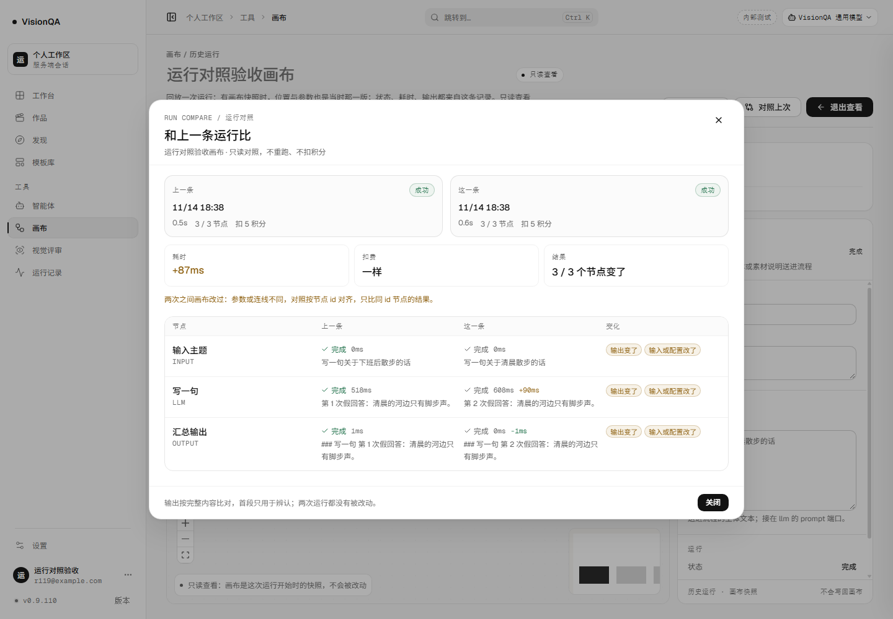

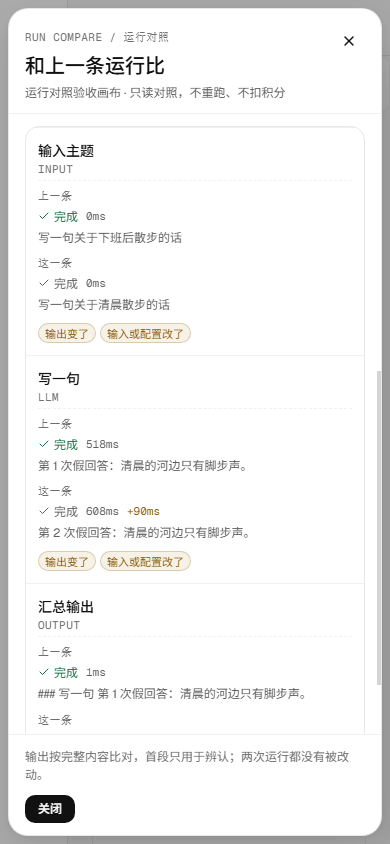

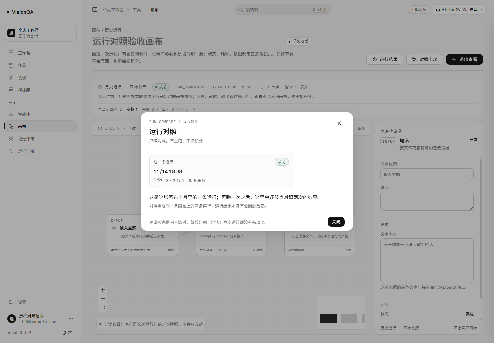

全仓 **923/923**（新增 `test/run-compare.test.mjs` 3 条：逐节点计数与预览上限 / 键顺序与缺指纹 / 接口默认上一条、跨画布与自对照拒绝），oxlint **0 error / 15 warning**，`tsc -b` 与 build 干净；入口 `index-CpIYLZc3.js`（578,697 B）、画布 `CanvasPage-B1zT0XY2.js`（255,612 B）、后台 `AdminConsolePage-DQYD2Hyl.js`（201,070 B）、样式 `index-DUrELwUY.css`（276,467 B）、画布样式 `CanvasPage-XWd0EAP7.css`（35,235 B）。

生产部署 `20261114-184409-r120compare`（快照 `20261114-104410-20261114-184409-r120comp.tar.gz` **1,022,994 B**；标签被发布工具截到 30 字符）：四个 unit 全 active，8799 / 8800 / 公网都 **0.9.110**，`/api/health` ok（模板 26，uptime 33s）；入口 200 · 578,697 B、画布 255,612 B、后台 201,070 B、主样式 276,467 B、画布样式 35,235 B；服务端与前端哈希全部与本地一致（`flows 3888c468` / `routes d9b9985c` / `compare de21671b` / 入口 `b8f606f9` / 画布 `cfa35fa0` / 后台 `9d2b13ad` / 样式 `d86dc712` / 画布样式 `15571c08`）；心跳 pid 1485090 / 1485088，盘 72%，`/tmp` 357M 清理回 351M，日志没有业务 error。生产 9 条运行、0 条带 graph，`run-graphs` 还没有目录——没有真实运行授权，这一版没有在真实运行上跑对照；对照证据来自本地真浏览器 + 假上游。

提交 `6f73029`；CI **43586404420** 三个 job 全 success；回退：`bash /opt/visionqa/ops/rollback.sh --to 1` → v0.9.109（`--to 2` 是 v0.9.108）。这一版不改已有 JSON schema：对照是现算的只读响应，不新增落盘字段；旧前端不请求 `/compare`，只读回看页照旧。细节、八条坑与「发现但没做」见 [两条运行摆一起](docs/run-compare-2026-11-14.md)。

## 一百七十八、自己挑两条运行来对照：最早那条也不再是死路（v0.9.111，2026-11-14）

v0.9.110 的对照只认更早的那一条：最早一条只能看到「没得对照」，想比较第一次和第三次也没有入口；在运行记录页选中某条后，仍要先「查看这次运行」再点「对照上次」。这一轮把对照对象交回给人。

- **候选随对照一起返回**：`GET /api/runs/:id/compare` 多带 `options`、`optionsTotal`、`optionsTruncated`；候选是同一条画布上除自己以外、已结束的运行，按开始时间倒序，最多列最近 20 条，正在跑 / 排队中的不列。
- **默认仍是上一条**：不传 `with` 时仍取更早的最近一条；最早那条没有更早的，就把之后的候选摆出来，不再直接判死。
- **「对照对象」选择器**：标题下一行，默认「自动：上一条已结束运行」，其余每项带时间、状态、耗时、实际扣费与运行 id 后 8 位；选中后带 `?with=` 重新取，表格与总差一起换。
- **方向说清楚**：既然可以挑更晚的一条，「上一条 / 这一条」就不准确了；卡片、表头、390 分段统一成「对照运行 / 当前运行」，页脚写「差值 = 当前 − 对照」。
- **运行记录页直接对照**：详情操作里多一个「对照」，地址仍留在 `#/runs`，关闭弹窗回到记录，不用先进只读回看。
- **样式单独一份**：弹窗被记录页引用后，若继续 import `canvas.css` 会把整份画布样式拖进主包；把 `rc-*` 拆到 `src/styles/run-compare.css`，主样式只多这一小份。

| 本地实测（8947 + 假上游 8977，3 节点，零真实上游） | 读数 |
| --- | --- |
| 画布 / 三次运行 | `flow_c3c9cf24`；`run_ea851875` → `run_1526da5f` → `run_f963ba23`，都 success |
| 余额 / 上游 | 100 → 85（三次各扣 5）；假上游共 3 次 |
| 默认对照 | 第三条对第二条：`outputChanged=3`、`revisionChanged=3`、`changed=3`、耗时 +119ms、扣费差 0 |
| 候选 | `optionsTotal=2`；顺序为第二条、第一条；不含当前这条 |
| 换一条 | 选第一条后耗时差 +220ms，选择器显示 `ea851875`；3 行仍完整 |
| 最早一条默认 | `comparable=false`；不渲染对照表；候选 2 条；弹窗 620 宽 |
| 最早一条挑之后 | 选第三条后表格出现、弹窗回到 960 宽；地址与画布不变 |
| 1440 | 弹窗 960 宽，top 134 / bottom 866；选择器 420 宽；下拉面板 440 宽、3 项；页面 `scrollWidth 1440 = clientWidth 1440` |
| 390 | 弹窗 374、left 8 / right 382；行宽 338；选择器 340；对照对象整行 372；`scrollWidth 390 = clientWidth 390`；正文内部滚动 |
| 运行记录入口 | 地址仍是 `#/runs`；弹窗 3 行；默认「自动：上一条已结束运行」 |
| 只读 | 对照请求 7 次全是 GET；画布 PATCH 0、再次运行 POST 0、`resume-plan` 0 |

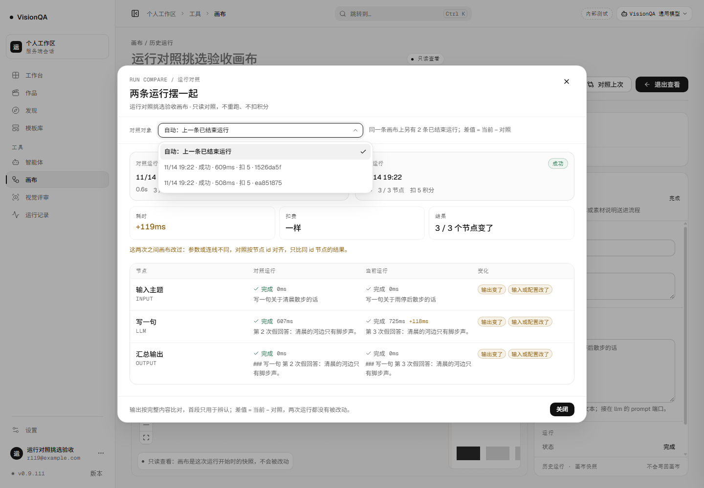

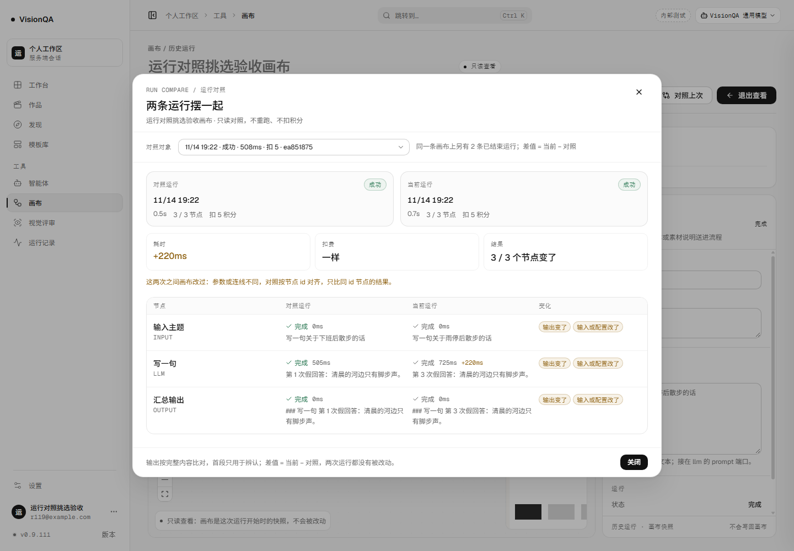

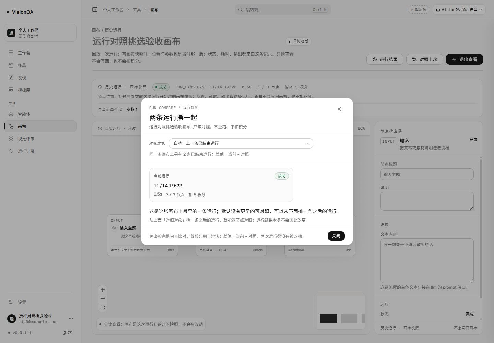

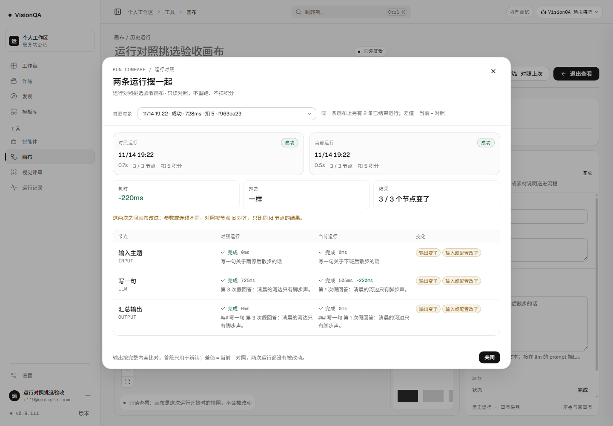

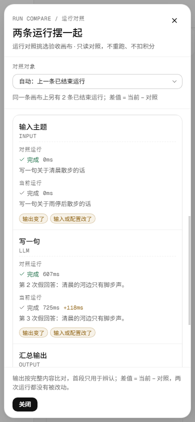

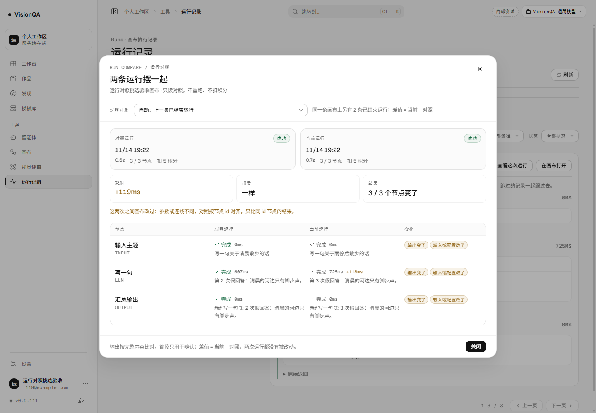

全仓 **923/923**（扩的是 `test/run-compare.test.mjs` 既有 3 条：候选不含自己、最早一条可点名之后一条、默认仍取更早），oxlint **0 error / 15 warning**，`tsc -b` 与 build 干净；入口 `index-B9hRxY4F.js`（594,053 B）、画布 `CanvasPage-DyotjRiD.js`（242,014 B）、后台 `AdminConsolePage-C93hWOCc.js`（201,077 B）、主样式 `index-CbVGPrEj.css`（283,574 B）、画布样式 `CanvasPage-BX48Ugxj.css`（28,926 B）。主样式比上一版多 7,107 B，是因为对照样式是记录页与画布页共用；画布样式少了 6,309 B，两份合计只多 798 B。

生产部署 `20261114-1938-r121pick`（快照 `20261114-113421-20261114-1938-r121pick.tar.gz` **1,030,155 B**）：四个 unit 全 active，8799 / 8800 / 公网都 **0.9.111**，`/api/health` ok（模板 26，部署后 uptime 132s）；入口 200 · 594,053 B、画布 242,014 B、后台 201,077 B、主样式 283,574 B、画布样式 28,926 B；服务端与前端哈希全部与本地一致（`flows fd83b1ab` / `routes d2c424c7` / `compare de21671b` / 入口 `371aece4` / 画布 `bfb07031` / 后台 `1bdab885` / 主样式 `1a8ed13f` / 画布样式 `b49e8586`）；心跳 pid 1486075 / 1486073，盘 72%，`/tmp` 清理回 351M，日志没有业务 error。生产 9 条运行、0 条带 graph，`run-graphs` 还没有目录；未登录请求 `/api/runs/<id>/compare` 返回 **401**（鉴权闸先于路由），线上文件哈希与本地一致，说明接口已随包上线。生产没有真实运行授权，这一版没有在真实运行上挑过对照；候选、换一条与最早一条挑之后一条的证据来自本地真浏览器 + 假上游。

提交 `5bc64d2`；CI **43590262778** 三个 job 全 success；回退：`bash /opt/visionqa/ops/rollback.sh --to 1` → v0.9.110（`--to 2` 是 v0.9.109）。这一版不改已有 JSON schema：`options` 是现算的只读响应，不新增落盘字段；旧前端不请求 `/compare`，只读回看页照旧。细节、八条坑与「发现但没做」见 [自己挑两条运行来对照](docs/run-compare-pick-2026-11-14.md)。

## 一百七十九、知道输出变了，还得看见改了哪几行（v0.9.112，2026-11-14）

v0.9.110 / v0.9.111 的对照能指出「哪个节点输出变了」，但后面只有两段各 180 字的预览：人知道它变了，却看不见那句话到底改成了什么。这一轮把差异接到节点上——**在对照表里点开「看改了哪几行」，就地看到改动前后的行，未变内容压成「N 行未变」**。仍然只读、不重跑、不扣费。

- **单独一条按需接口**：`GET /api/runs/:id/compare/diff?with=<对照运行>&node=<节点 id>`。只有展开的那个节点才请求，主对照仍不搬完整输出。
- **行级差异**：字符串或 `output.text` 按文本，其它对象按键排序后的 JSON 展开，再做 LCS；每边最多 2.4 万字符 / 1200 行，差异最多返 260 行，触发上限就写 `truncated: true`。
- **入口不常驻**：只有「输出变了」的节点出现「看改了哪几行」；点开在整行下方展开，再点收起。换对照对象时自动收起，晚到的旧请求按序号丢弃。
- **口径一致**：缺 `with` / `node`、自对照、跨画布 400；对照运行还在跑 / 排队 409；节点两边都不存在 404；未登录仍由鉴权闸返回 401。

| 本地实测（8951 + 假上游 8981，3 节点，零真实上游） | 读数 |
| --- | --- |
| 画布 / 三次运行 | `flow_ab79236a`；`run_598e3c41` → `run_9bf5e702` → `run_62d87725`，都 success |
| 余额 / 上游 | 100 → 85（三次各扣 5）；假上游共 3 次 |
| 差异接口 | 第三条对第二条：`+1 / -1`、`same: 2`、`lines: 4`、`outputKind: text`、`truncated: false` |
| 差异内容 | 删除 `第 2 次假回答…`，新增 `第 3 次假回答…`，前后两行上下文原样保留 |
| 1440 | 弹窗 960 宽、top 53 / bottom 947；差异面板 884 宽（left 278 / right 1162）；页面无横向溢出，弹窗正文不需要滚动 |
| 390 | 弹窗 374、left 8 / right 382；差异面板 314、left 38 / right 352；行宽 312；正文可滚动；`scrollWidth 390 = clientWidth 390` |
| 只读 | 对照 2 次、差异 2 次，全是 GET；画布 PATCH 0、再次运行 POST 0 |

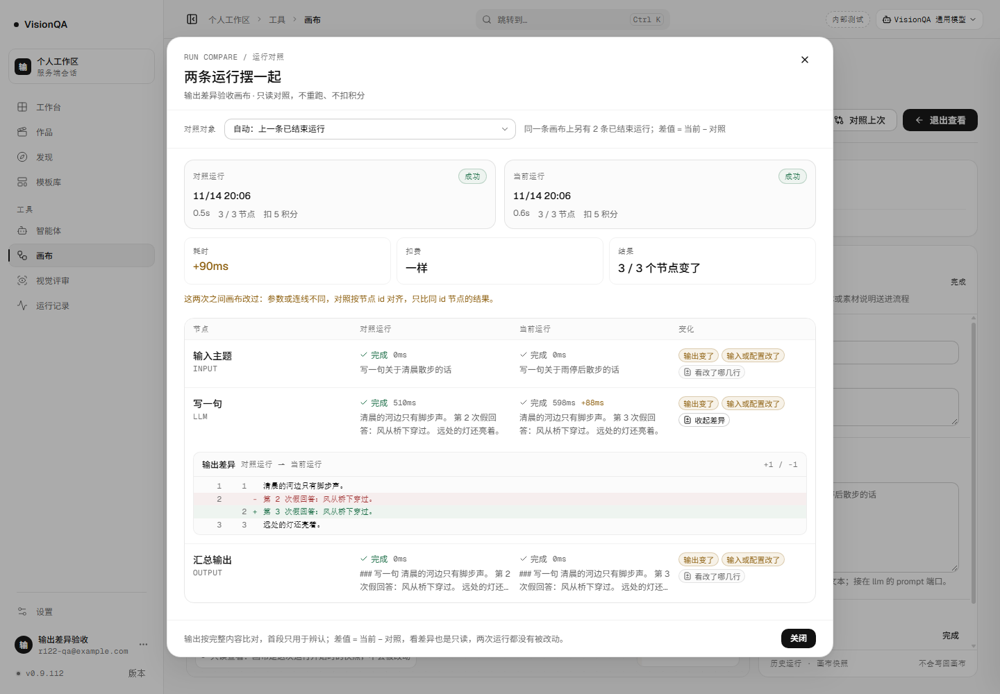

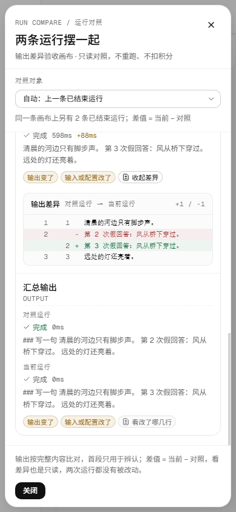

全仓 **924/924**（新增 1 条纯函数用例、扩 1 条接口用例），oxlint **0 error / 15 warning**（与上一轮同一批基线），`tsc -b` 与 build 干净；入口 `index-p7pTDTVG.js`（597,162 B）、画布 `CanvasPage-Bq-cXI16.js`（242,014 B）、后台 `AdminConsolePage-DB2or-RG.js`（201,077 B）、主样式 `index-yX8RGvWa.css`（286,057 B）、画布样式 `CanvasPage-BX48Ugxj.css`（28,926 B）。入口比 v0.9.111 多 3,109 B，样式多 2,483 B，没有新增第三方依赖。

回退：`bash /opt/visionqa/ops/rollback.sh --to 1` → **v0.9.111**（`--to 2` 是 v0.9.110）。这一版不改已有 JSON schema：差异是现算的只读响应，不新增落盘字段；旧前端不请求 `/compare/diff`，对照弹窗照旧。细节、八条坑与「发现但没做」见 [知道输出变了，还得看见改了哪几行](docs/run-output-diff-2026-11-14.md)。

